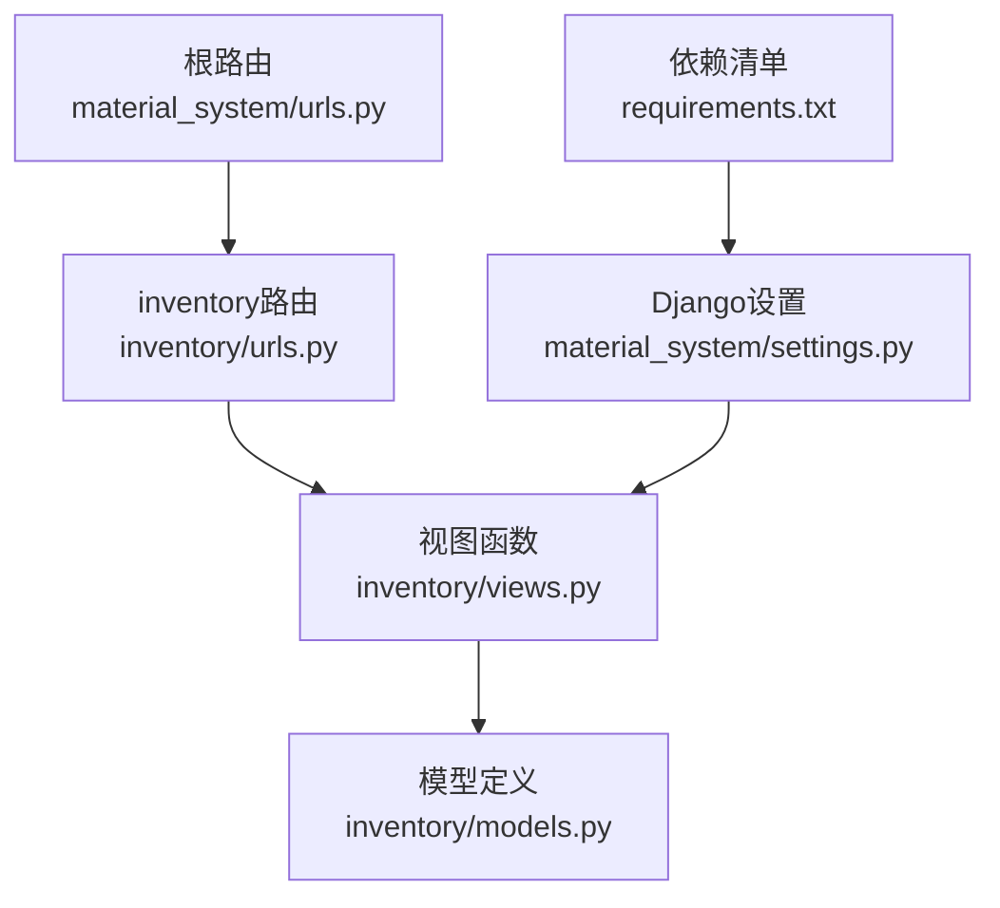
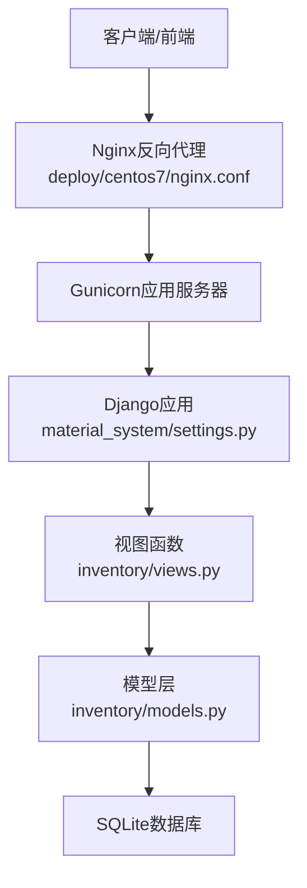
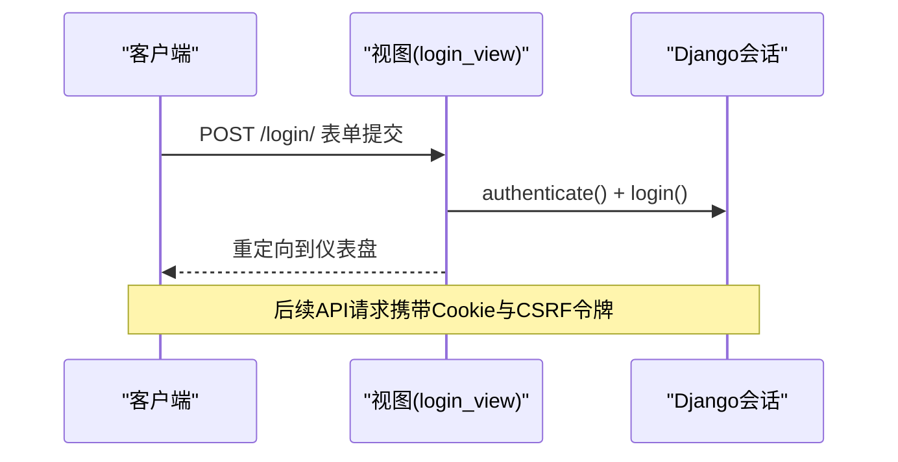
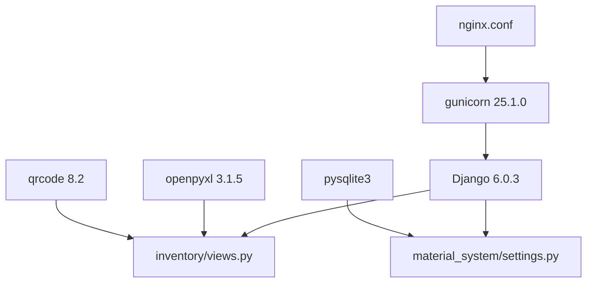

# API接口文档

<cite>
**本文档引用的文件**
- [material_system/urls.py](file://material_system/urls.py)
- [inventory/urls.py](file://inventory/urls.py)
- [inventory/views.py](file://inventory/views.py)
- [inventory/models.py](file://inventory/models.py)
- [material_system/settings.py](file://material_system/settings.py)
- [requirements.txt](file://requirements.txt)
- [deploy/centos7/README.md](file://deploy/centos7/README.md)
- [deploy/centos7/nginx.conf](file://deploy/centos7/nginx.conf)
- [deploy/centos7/monitor.sh](file://deploy/centos7/monitor.sh)
- [test_custom_categories.py](file://test_custom_categories.py)
- [inventory/tests.py](file://inventory/tests.py)
</cite>

## 目录
1. [简介](#简介)
2. [项目结构](#项目结构)
3. [核心组件](#核心组件)
4. [架构概览](#架构概览)
5. [详细组件分析](#详细组件分析)
6. [依赖分析](#依赖分析)
7. [性能考虑](#性能考虑)
8. [故障排查指南](#故障排查指南)
9. [结论](#结论)
10. [附录](#附录)

## 简介
本API接口文档面向材料管理系统，提供RESTful风格的接口规范，涵盖HTTP方法、URL模式、请求响应格式、JSON数据约定、认证与授权机制、错误处理策略、调用示例、版本控制与兼容性、性能与限制、以及测试与调试方法。系统基于Django框架构建，采用SQLite作为默认数据库，并通过Nginx + Gunicorn部署。

## 项目结构
系统采用Django应用结构，核心入口位于根路由，inventory应用负责业务API与页面渲染；前端模板与静态资源位于templates与static目录；部署相关配置位于deploy目录。

**图表来源**
- [material_system/urls.py:1-13](file://material_system/urls.py#L1-L13)
- [inventory/urls.py:1-80](file://inventory/urls.py#L1-L80)
- [inventory/views.py:1-800](file://inventory/views.py#L1-L800)
- [material_system/settings.py:1-210](file://material_system/settings.py#L1-L210)
- [requirements.txt:1-16](file://requirements.txt#L1-L16)

**章节来源**
- [material_system/urls.py:1-13](file://material_system/urls.py#L1-L13)
- [inventory/urls.py:1-80](file://inventory/urls.py#L1-L80)
- [material_system/settings.py:1-210](file://material_system/settings.py#L1-L210)

## 核心组件
- 路由系统：根路由include inventory路由，统一暴露业务API与页面。
- 视图层：提供登录/登出、仪表盘、项目/材料/供应商/采购计划/发货/入库管理、快速收货、报表与图表、导入导出、用户管理、系统设置等功能的API。
- 模型层：定义用户档案、项目、材料分类、材料、供应商、入库记录、采购计划、发货单、操作日志等实体及关系。
- 认证与权限：基于Django内置认证，结合用户角色（管理员、物资部、材料员、供应商）实现细粒度权限控制。
- JSON序列化：统一使用JsonResponse返回数据，Decimal与日期时间通过自定义序列化器转换。

**章节来源**
- [inventory/views.py:1-800](file://inventory/views.py#L1-L800)
- [inventory/models.py:1-328](file://inventory/models.py#L1-L328)

## 架构概览
系统采用前后端分离的API设计，前端通过Ajax或直接访问API获取数据；后端通过Django视图函数处理请求，返回JSON响应；静态资源与媒体文件通过Nginx提供服务。

**图表来源**
- [deploy/centos7/nginx.conf:40-87](file://deploy/centos7/nginx.conf#L40-L87)
- [material_system/settings.py:122-130](file://material_system/settings.py#L122-L130)
- [requirements.txt:6](file://requirements.txt#L6)

## 详细组件分析

### 认证与授权机制
- 认证方式：基于Django Session的表单登录，支持CSRF保护；API端点对未登录用户返回重定向或403/401。
- 授权规则：
  - 管理员(admin)：可访问所有管理功能。
  - 物资部(material_dept)：可管理入库与采购计划。
  - 材料员(clerk)：可管理入库与采购计划。
  - 供应商(supplier)：仅可管理自身发货单。
- CSRF：通过Cookie中的csrftoken头进行校验，AJAX请求需携带X-CSRFToken头。

**图表来源**
- [inventory/views.py:114-143](file://inventory/views.py#L114-L143)
- [material_system/settings.py:93-101](file://material_system/settings.py#L93-L101)

**章节来源**
- [inventory/views.py:34-64](file://inventory/views.py#L34-L64)
- [inventory/views.py:114-143](file://inventory/views.py#L114-L143)
- [material_system/settings.py:93-101](file://material_system/settings.py#L93-L101)

### JSON数据格式与约定
- 字段命名：采用小驼峰命名法；布尔值使用小写字符串表示。
- 数值类型：
  - Decimal类型（价格、数量、金额）统一序列化为float字符串。
  - 日期时间序列化为ISO 8601字符串。
- 响应结构：成功响应返回键值对对象；错误响应返回包含error字段的对象。
- 成功示例：{"success": true, ...}
- 错误示例：{"error": "错误信息"}

**章节来源**
- [inventory/views.py:105-111](file://inventory/views.py#L105-L111)

### 公开API端点一览

#### 1) 登录/登出
- 登录
  - 方法：POST
  - 路径：/login/
  - 参数：username, password
  - 响应：重定向到仪表盘；失败返回登录页并提示错误
- 登出
  - 方法：GET
  - 路径：/logout/
  - 响应：重定向到登录页

**章节来源**
- [inventory/urls.py:5-8](file://inventory/urls.py#L5-L8)
- [inventory/views.py:114-143](file://inventory/views.py#L114-L143)

#### 2) 仪表盘
- 方法：GET
- 路径：/
- 响应：仪表盘页面（非API）

**章节来源**
- [inventory/urls.py:9](file://inventory/urls.py#L9)

#### 3) 项目管理
- 列表与筛选
  - 方法：GET
  - 路径：/projects/, /projects/save/, /projects/<int:pk>/delete/
  - 响应：页面（非API）
- 详情API
  - 方法：GET
  - 路径：/api/projects/<int:pk>/
  - 响应：项目详情对象
  - 字段：id, code, name, manager, location, start_date, end_date, budget, status, remark

**章节来源**
- [inventory/urls.py:10-14](file://inventory/urls.py#L10-L14)
- [inventory/views.py:212-221](file://inventory/views.py#L212-L221)

#### 4) 材料分类
- 列表API
  - 方法：GET
  - 路径：/api/categories/
  - 响应：分类数组
  - 字段：id, code, name

**章节来源**
- [inventory/urls.py:15-16](file://inventory/urls.py#L15-L16)
- [inventory/views.py:225-229](file://inventory/views.py#L225-L229)

#### 5) 材料管理
- 列表与筛选
  - 方法：GET
  - 路径：/materials/, /materials/save/, /materials/<int:pk>/delete/
  - 响应：页面（非API）
- 详情API
  - 方法：GET
  - 路径：/api/materials/<int:pk>/
  - 响应：材料详情对象
  - 字段：id, code, name, category_id, spec, unit, standard_price, safety_stock, remark, current_stock, avg_cost

**章节来源**
- [inventory/urls.py:17-21](file://inventory/urls.py#L17-L21)
- [inventory/views.py:291-301](file://inventory/views.py#L291-L301)

#### 6) 供应商管理
- 列表与筛选
  - 方法：GET
  - 路径：/suppliers/, /suppliers/save/, /suppliers/<int:pk>/delete/
  - 响应：页面（非API）
- 详情API
  - 方法：GET
  - 路径：/api/suppliers/<int:pk>/
  - 响应：供应商详情对象
  - 字段：id, code, name, contact, phone, address, main_type, credit_rating, start_date, remark

**章节来源**
- [inventory/urls.py:22-26](file://inventory/urls.py#L22-L26)
- [inventory/views.py:355-363](file://inventory/views.py#L355-L363)

#### 7) 采购计划
- 列表与筛选
  - 方法：GET
  - 路径：/purchase-plans/, /purchase-plans/save/, /purchase-plans/<int:pk>/delete/
  - 响应：页面（非API）
- 详情API
  - 方法：GET
  - 路径：/api/purchase-plans/<int:pk>/
  - 响应：采购计划详情对象
  - 字段：id, no, project_id, material_id, quantity, unit_price, planned_date, status, remark

**章节来源**
- [inventory/urls.py:27-31](file://inventory/urls.py#L27-L31)
- [inventory/views.py:443-458](file://inventory/views.py#L443-L458)

#### 8) 发货管理
- 列表与筛选
  - 方法：GET
  - 路径：/deliveries/, /deliveries/create/, /deliveries/<int:pk>/, /deliveries/<int:pk>/confirm-ship/, /deliveries/<int:pk>/qrcode/
  - 响应：页面（非API）
- 详情API
  - 方法：GET
  - 路径：/api/deliveries/<int:pk>/
  - 响应：发货单详情对象
  - 字段：id, no, purchase_plan_id, actual_quantity, actual_unit_price, shipping_method, plate_number, tracking_no, status, remark

**章节来源**
- [inventory/urls.py:32-38](file://inventory/urls.py#L32-L38)
- [inventory/views.py:600-616](file://inventory/views.py#L600-L616)

#### 9) 快速收货
- 页面
  - 方法：GET
  - 路径：/quick-receive/
  - 响应：页面（非API）
- 根据发货单号获取发货信息
  - 方法：GET
  - 路径：/api/delivery-by-no/
  - 参数：no（发货单号）
  - 响应：发货单信息对象或错误
- 确认收货并创建入库记录
  - 方法：POST
  - 路径：/quick-receive/confirm/
  - 参数：delivery_id, receive_date, location, inspector, quality_status, remark
  - 响应：成功或错误

**章节来源**
- [inventory/urls.py:39-42](file://inventory/urls.py#L39-L42)
- [inventory/views.py:1742-1861](file://inventory/views.py#L1742-L1861)

#### 10) 入库管理
- 列表与筛选
  - 方法：GET
  - 路径：/inbound/, /inbound/save/, /inbound/<int:pk>/delete/
  - 响应：页面（非API）
- 详情API
  - 方法：GET
  - 路径：/api/inbound/<int:pk>/
  - 响应：入库记录详情对象
  - 字段：id, no, project_id, material_id, date, quantity, unit_price, total_amount, supplier_id, batch_no, inspector, quality_status, location, spec, unit, remark

**章节来源**
- [inventory/urls.py:43-47](file://inventory/urls.py#L43-L47)
- [inventory/views.py:694-707](file://inventory/views.py#L694-L707)

#### 11) 图表与年份列表
- 图表数据API
  - 方法：GET
  - 路径：/api/chart-data/
  - 参数：type（stock或inbound_monthly），date_from，date_to，year
  - 响应：图表数据对象
- 年份列表API
  - 方法：GET
  - 路径：/api/years-list/
  - 响应：包含年份数组的对象

**章节来源**
- [inventory/urls.py:61-62](file://inventory/urls.py#L61-L62)
- [inventory/views.py:1215-1286](file://inventory/views.py#L1215-L1286)

#### 12) 用户管理
- 列表与筛选
  - 方法：GET
  - 路径：/users/, /users/save/, /users/<int:pk>/delete/, /users/groups/, /users/permissions/
  - 响应：页面（非API）
- 详情API
  - 方法：GET
  - 路径：/api/users/<int:pk>/
  - 响应：用户详情对象
  - 字段：id, username, first_name, last_name, email, is_active, is_superuser, role, phone

**章节来源**
- [inventory/urls.py:67-73](file://inventory/urls.py#L67-L73)
- [inventory/views.py:905-919](file://inventory/views.py#L905-L919)

#### 13) 系统设置
- 页面
  - 方法：GET
  - 路径：/settings/, /settings/backup/, /settings/init-categories/, /settings/add-category/, /settings/delete-category/<int:pk>/
  - 响应：页面（非API）
- 备份数据API
  - 方法：GET
  - 路径：/settings/backup/
  - 响应：JSON文件下载

**章节来源**
- [inventory/urls.py:74-79](file://inventory/urls.py#L74-L79)
- [inventory/views.py:1288-1308](file://inventory/views.py#L1288-L1308)

#### 14) 批量导入与模板下载
- 导入端点
  - 方法：POST
  - 路径：/projects/import/, /materials/import/, /suppliers/import/, /inbound/import/
  - 参数：file（Excel文件）
  - 响应：页面（非API）
- 模板下载
  - 方法：GET
  - 路径：/import-template/<str:tpl_type>/
  - 参数：tpl_type（project/material/supplier/inbound）
  - 响应：Excel模板文件下载

**章节来源**
- [inventory/urls.py:48-53](file://inventory/urls.py#L48-L53)
- [inventory/views.py:1625-1672](file://inventory/views.py#L1625-L1672)

#### 15) 统计报表
- 页面
  - 方法：GET
  - 路径：/reports/, /reports/project-cost/, /reports/supplier-cost/, /reports/monthly/
  - 响应：页面（非API）
- 导出Excel
  - 方法：GET
  - 路径：/export/
  - 参数：type（inventory/inbound）
  - 响应：Excel文件下载

**章节来源**
- [inventory/urls.py:54-64](file://inventory/urls.py#L54-L64)
- [inventory/views.py:711-780](file://inventory/views.py#L711-L780)

#### 16) 操作日志
- 列表
  - 方法：GET
  - 路径：/logs/
  - 响应：页面（非API）

**章节来源**
- [inventory/urls.py:65-66](file://inventory/urls.py#L65-L66)

### API调用示例

#### curl示例
- 获取材料详情
  - curl -c cookies.txt -b cookies.txt "http://127.0.0.1:8000/api/materials/1/"
- 获取分类列表
  - curl -c cookies.txt -b cookies.txt "http://127.0.0.1:8000/api/categories/"

#### Python requests示例
- 登录并获取分类列表
  - 参考测试脚本：[test_custom_categories.py:15-43](file://test_custom_categories.py#L15-L43)

#### JavaScript fetch示例
- 获取图表数据
  - fetch('/api/chart-data/?type=inbound_monthly&year=2026').then(r => r.json()).then(console.log);

**章节来源**
- [test_custom_categories.py:15-43](file://test_custom_categories.py#L15-L43)
- [templates/inventory/charts.html:173-177](file://templates/inventory/charts.html#L173-L177)

### 错误处理机制
- HTTP状态码：
  - 200：成功
  - 302：未登录重定向
  - 400：参数错误或业务错误
  - 403：权限不足
  - 404：资源不存在
  - 405：方法不被允许
  - 500：服务器内部错误
- 错误响应格式：{"error": "错误信息"}
- 业务错误：如删除受限、发货状态不符等，API明确返回错误原因

**章节来源**
- [inventory/views.py:206](file://inventory/views.py#L206)
- [inventory/views.py:434-441](file://inventory/views.py#L434-L441)
- [inventory/views.py:686-692](file://inventory/views.py#L686-L692)
- [inventory/views.py:1744-1790](file://inventory/views.py#L1744-L1790)

### API版本控制与兼容性
- 版本策略：当前未实现显式API版本号（如/v1/），建议后续引入语义化版本并在URL中体现。
- 兼容性：保持现有端点不变，新增字段以向后兼容为主；数值字段统一为字符串以便前端处理。

**章节来源**
- [inventory/urls.py:1-80](file://inventory/urls.py#L1-L80)

## 依赖分析
- Django核心：提供路由、中间件、认证、模板与ORM。
- 第三方库：gunicorn（WSGI）、openpyxl（Excel）、qrcode（二维码）、pysqlite3（SQLite兼容性）。
- 部署：Nginx反向代理，Systemd服务管理，防火墙开放端口。

**图表来源**
- [requirements.txt:1-16](file://requirements.txt#L1-L16)
- [deploy/centos7/nginx.conf:40-87](file://deploy/centos7/nginx.conf#L40-L87)
- [material_system/settings.py:122-130](file://material_system/settings.py#L122-L130)

**章节来源**
- [requirements.txt:1-16](file://requirements.txt#L1-L16)
- [deploy/centos7/nginx.conf:40-87](file://deploy/centos7/nginx.conf#L40-L87)

## 性能考虑
- 数据库：默认SQLite，适合中小规模数据；高并发场景建议迁移到MySQL/PostgreSQL。
- 查询优化：视图中多处使用select_related减少N+1查询；聚合查询使用Sum/Count等原生SQL函数。
- 文件与媒体：媒体文件存储于本地磁盘，建议配合CDN与静态文件缓存。
- 服务端：Nginx + Gunicorn部署，可通过worker数量与进程数调优；健康检查端点/health/用于监控。

**章节来源**
- [inventory/views.py:149-157](file://inventory/views.py#L149-L157)
- [deploy/centos7/nginx.conf:54-59](file://deploy/centos7/nginx.conf#L54-L59)

## 故障排查指南
- 健康检查：访问/health/端点确认服务可用。
- 日志：查看Django与Nginx日志定位问题。
- 监控脚本：使用monitor.sh检查CPU与HTTP响应。
- 常见问题：
  - 403错误：检查CSRF Cookie与X-CSRFToken头。
  - 404错误：确认URL拼写与资源是否存在。
  - 500错误：查看Django日志与数据库连接。

**章节来源**
- [deploy/centos7/nginx.conf:54-59](file://deploy/centos7/nginx.conf#L54-L59)
- [deploy/centos7/monitor.sh:100-146](file://deploy/centos7/monitor.sh#L100-L146)
- [material_system/settings.py:148-203](file://material_system/settings.py#L148-L203)

## 结论
本API遵循RESTful设计原则，提供清晰的URL模式与一致的JSON响应格式；通过Django认证与角色权限实现细粒度访问控制；具备完善的错误处理与日志记录能力；部署方案成熟，适合中小型工程项目的材料出入库管理需求。建议后续引入API版本控制、速率限制与更严格的输入校验，以提升安全性与可维护性。

## 附录

### API端点对照表
- 登录/登出：/login/, /logout/
- 仪表盘：/
- 项目：/api/projects/<int:pk>/
- 材料分类：/api/categories/
- 材料：/api/materials/<int:pk>/
- 供应商：/api/suppliers/<int:pk>/
- 采购计划：/api/purchase-plans/<int:pk>/
- 发货：/api/deliveries/<int:pk>/
- 快速收货：/api/delivery-by-no/, /quick-receive/confirm/
- 入库：/api/inbound/<int:pk>/
- 图表：/api/chart-data/, /api/years-list/
- 用户：/api/users/<int:pk>/
- 系统设置：/settings/backup/
- 导入/导出：/projects/import/, /materials/import/, /suppliers/import/, /inbound/import/, /import-template/<str:tpl_type>/, /export/

**章节来源**
- [inventory/urls.py:1-80](file://inventory/urls.py#L1-L80)