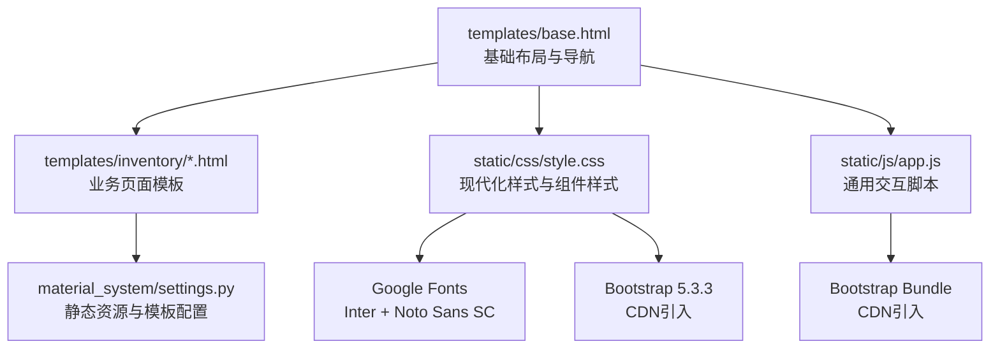
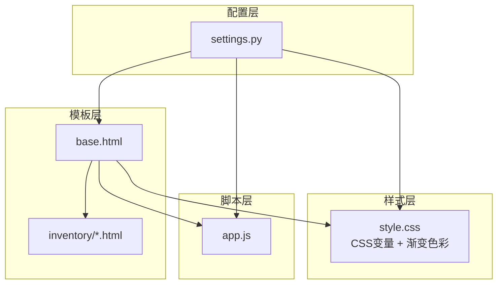
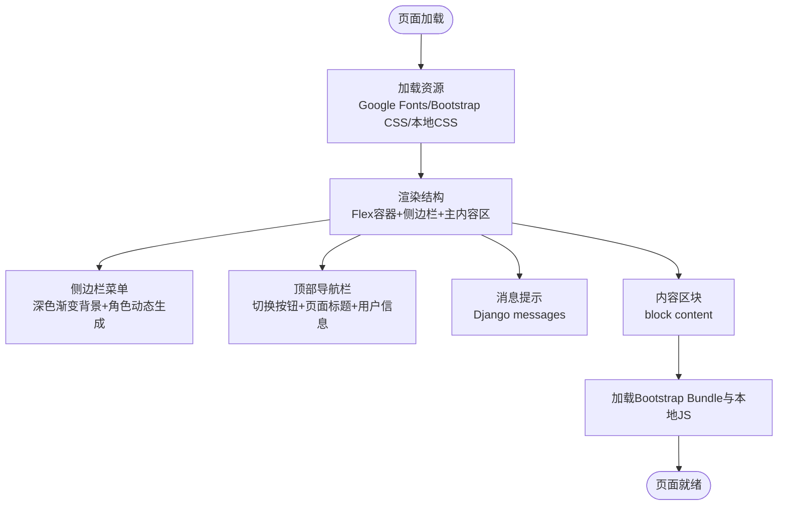
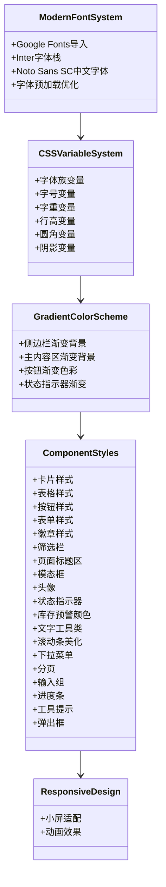
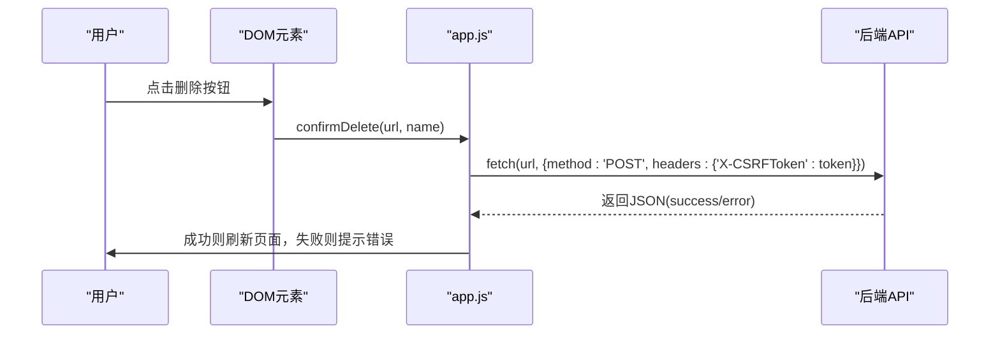
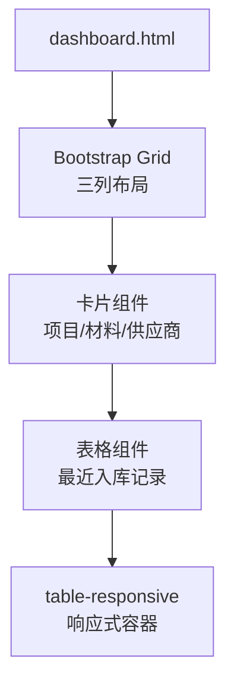
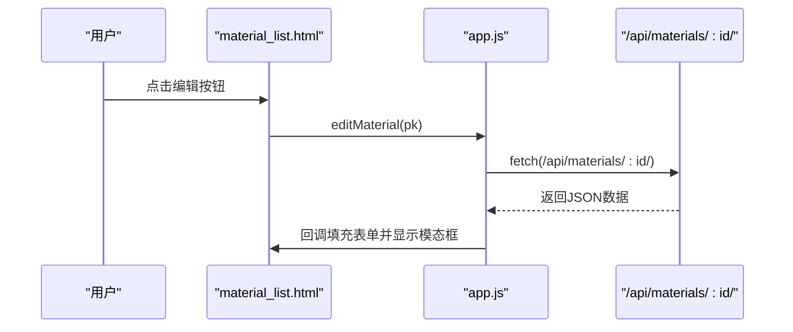
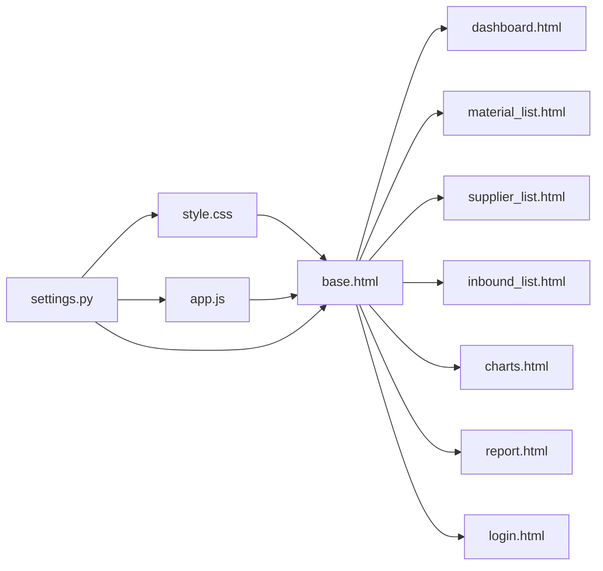

# 前端界面设计

<cite>
**本文引用的文件**
- [templates/base.html](file://templates/base.html)
- [static/css/style.css](file://static/css/style.css)
- [static/js/app.js](file://static/js/app.js)
- [templates/inventory/dashboard.html](file://templates/inventory/dashboard.html)
- [templates/inventory/material_list.html](file://templates/inventory/material_list.html)
- [templates/inventory/supplier_list.html](file://templates/inventory/supplier_list.html)
- [templates/inventory/inbound_list.html](file://templates/inventory/inbound_list.html)
- [templates/inventory/charts.html](file://templates/inventory/charts.html)
- [templates/inventory/report.html](file://templates/inventory/report.html)
- [templates/login.html](file://templates/login.html)
- [material_system/settings.py](file://material_system/settings.py)
</cite>

## 更新摘要
**变更内容**
- 完成前端界面现代化重构，包括CSS样式系统、字体栈、颜色方案等
- 引入Google Fonts字体系统，建立完整的CSS变量体系
- 采用渐变色彩方案，提升视觉层次感
- 增强响应式设计和移动端适配
- 优化组件样式和交互体验

## 目录
1. [简介](#简介)
2. [项目结构](#项目结构)
3. [核心组件](#核心组件)
4. [架构总览](#架构总览)
5. [详细组件分析](#详细组件分析)
6. [依赖分析](#依赖分析)
7. [性能考虑](#性能考虑)
8. [故障排查指南](#故障排查指南)
9. [结论](#结论)
10. [附录](#附录)

## 简介
本文件面向材料管理系统前端界面设计，围绕基于 Bootstrap 5.3.3 的现代化响应式架构，系统阐述模板继承与页面结构、CSS 样式体系与自定义规范、JavaScript 交互与 AJAX 请求、组件使用指南（导航菜单、数据表格、模态框等）、移动端适配与跨浏览器兼容性、前端性能优化策略以及主题与样式的扩展方法。文档同时提供可视化图示，帮助非技术读者快速理解整体设计思路与实现要点。

## 项目结构
前端采用 Django 模板系统与现代化静态资源组织：
- 模板层：templates/ 下的 base.html 提供全局布局与导航；各业务页面继承 base.html 并在 block 中注入内容。
- 样式层：static/css/style.css 定义全局样式、变量与组件样式，覆盖 Bootstrap 默认样式，采用现代化字体系统和渐变色彩方案。
- 脚本层：static/js/app.js 提供通用交互逻辑（侧边栏切换、CSRF、删除确认、详情加载、审批操作、货币格式化）。
- 配置层：material_system/settings.py 配置静态资源路径、模板目录、中间件与国际化等。

**图表来源**
- [templates/base.html:1-136](file://templates/base.html#L1-L136)
- [static/css/style.css:1-741](file://static/css/style.css#L1-L741)
- [static/js/app.js:1-82](file://static/js/app.js#L1-L82)
- [material_system/settings.py:105-118](file://material_system/settings.py#L105-L118)

**章节来源**
- [templates/base.html:1-136](file://templates/base.html#L1-L136)
- [material_system/settings.py:141-146](file://material_system/settings.py#L141-L146)

## 核心组件
- 基础模板与布局：base.html 使用 Bootstrap Flex 布局容器包裹侧边栏与主内容区，顶部导航栏包含侧边栏切换按钮、面包屑式页面标题与用户信息区，消息提示区域统一渲染 Django messages。
- 侧边栏导航：根据用户角色动态生成菜单项，支持折叠与激活态样式，使用 Bootstrap Icons 图标库，采用深色渐变背景。
- 页面内容区：通过 block 注入页面标题与内容，支持额外 CSS/JS 扩展位。
- 全局样式：style.css 定义 CSS 变量、现代化字体系统、渐变色彩方案、卡片、表格、按钮、表单、徽章、模态框、头像、状态指示器、库存预警颜色、响应式规则与动画等。
- 通用脚本：app.js 提供侧边栏切换、CSRF Cookie 读取、通用删除确认、详情加载到模态框、审批操作、货币格式化等。

**章节来源**
- [templates/base.html:17-130](file://templates/base.html#L17-L130)
- [static/css/style.css:4-741](file://static/css/style.css#L4-L741)
- [static/js/app.js:1-82](file://static/js/app.js#L1-L82)

## 架构总览
前端采用"模板继承 + 组件化样式 + 轻量脚本"的现代化架构：
- 模板继承：所有业务页面继承 base.html，复用头部、侧边栏、导航与消息提示，减少重复代码。
- 组件化样式：style.css 将 Bootstrap 类与自定义类结合，形成卡片、表格、按钮、表单、模态框等可复用组件，采用渐变色彩方案。
- 交互脚本：app.js 抽象出通用交互，业务页面在 extra_js 中按需补充局部逻辑。
- 资源加载：通过 CDN 引入 Bootstrap 5.3.3、Google Fonts 和图标库，本地静态资源由 Django 静态文件系统提供。

**图表来源**
- [templates/base.html:1-136](file://templates/base.html#L1-L136)
- [static/css/style.css:1-741](file://static/css/style.css#L1-L741)
- [static/js/app.js:1-82](file://static/js/app.js#L1-L82)
- [material_system/settings.py:105-118](file://material_system/settings.py#L105-L118)

## 详细组件分析

### 基础模板与页面结构（base.html）
- 结构组成：HTML 文档声明、meta viewport、Google Fonts 字体预加载、Bootstrap 5.3.3 与图标库引入、本地样式与额外 CSS 扩展位、Flex 布局容器、侧边栏、主内容区、顶部导航栏、消息提示、内容区块、Bootstrap Bundle 与本地脚本、额外 JS 扩展位。
- 侧边栏：固定宽度 240px，支持折叠动画；菜单项根据用户角色显示不同模块；激活态通过 active 类实现，采用深色渐变背景。
- 顶部导航栏：包含侧边栏切换按钮、页面标题块、用户头像与登出按钮。
- 消息提示：遍历 Django messages，渲染为 Bootstrap Alert。
- 内容区块：通过 block content 注入页面内容。

**图表来源**
- [templates/base.html:17-130](file://templates/base.html#L17-L130)

**章节来源**
- [templates/base.html:1-136](file://templates/base.html#L1-L136)

### CSS 样式系统与组织
- **现代化字体系统**：style.css 使用 Google Fonts 的 Inter 和 Noto Sans SC 字体栈，提供更好的中英文显示效果。
- **完整CSS变量体系**：定义字体族、字号、字重、行高、圆角与阴影等变量，形成一致的设计语言。
- **渐变色彩方案**：侧边栏使用深色渐变背景（#1a1f2e 到 #232838），主内容区使用浅色渐变背景（#f9fafb 到 #f3f4f6），提升视觉层次感。
- **基础样式**：重置与基础排版，确保全局字体与行高一致，采用抗锯齿和优化渲染。
- **组件样式**：卡片、仪表盘卡片、表格、按钮、表单、徽章、筛选栏、页面标题区、模态框、头像、状态指示器、库存预警颜色、文字工具类、滚动条美化、链接、下拉菜单、分页、输入组、进度条、工具提示、弹出框等。
- **响应式**：针对小屏设备（max-width: 768px）调整侧边栏、页面标题与导航栏布局。
- **动画**：卡片淡入动画，提升交互体验。

**图表来源**
- [static/css/style.css:1-741](file://static/css/style.css#L1-L741)

**章节来源**
- [static/css/style.css:1-741](file://static/css/style.css#L1-L741)

### JavaScript 交互功能
- 侧边栏切换：监听点击事件，切换 sidebar 的 collapsed 类，实现平滑折叠。
- CSRF 支持：从 Cookie 中读取 csrftoken，用于 AJAX 请求头。
- 通用删除确认：confirmDelete(url, name) 发送 POST 请求，成功后刷新页面。
- 详情加载到模态框：loadDetail(url, callback) 通过 fetch 获取 JSON 数据并回调填充表单。
- 审批操作：approveAction(url, action) 发送 POST 表单数据，包含 action 参数，成功后刷新。
- 货币格式化：formatCurrency(n) 使用本地化格式输出两位小数。

**图表来源**
- [static/js/app.js:27-44](file://static/js/app.js#L27-L44)

**章节来源**
- [static/js/app.js:1-82](file://static/js/app.js#L1-L82)

### 页面模板与组件使用指南

#### 仪表盘（dashboard.html）
- 继承 base.html，设置页面标题与内容区块。
- 使用 Bootstrap Grid（col-lg-*）布局三个卡片区域，分别展示项目、材料、供应商列表。
- 最近入库记录使用表格组件，支持响应式容器与悬停效果。
- 自定义内联样式实现滚动列表与滚动条美化。

**图表来源**
- [templates/inventory/dashboard.html:12-139](file://templates/inventory/dashboard.html#L12-L139)

**章节来源**
- [templates/inventory/dashboard.html:1-150](file://templates/inventory/dashboard.html#L1-L150)

#### 材料档案（material_list.html）
- 继承 base.html，设置页面标题与内容区块。
- 筛选栏使用 filter-bar 容器与表单控件，支持关键词与分类筛选。
- 表格组件展示材料数据，包含新增行（表单嵌入）、编辑与删除按钮。
- 模态框（materialModal）用于编辑材料，包含分类、单位、规格、单价、安全库存等字段。
- 批量导入模态框（importModal）支持 Excel 文件上传与导入说明。
- 在 extra_js 中定义 showImportModal 与 editMaterial 函数，调用 loadDetail 与 Bootstrap Modal。

**图表来源**
- [templates/inventory/material_list.html:88-125](file://templates/inventory/material_list.html#L88-L125)
- [static/js/app.js:46-55](file://static/js/app.js#L46-L55)

**章节来源**
- [templates/inventory/material_list.html:1-185](file://templates/inventory/material_list.html#L1-L185)
- [static/js/app.js:1-82](file://static/js/app.js#L1-L82)

#### 供应商档案（supplier_list.html）
- 继承 base.html，设置页面标题与内容区块。
- 表格组件展示供应商数据，包含新增行、编辑与删除按钮。
- 模态框（supplierModal）用于编辑供应商，包含联系人、电话、地址、主营类型、信用等级、合作开始日期等字段。
- 批量导入模态框（importModal）支持 Excel 文件上传与导入说明。
- 在 extra_js 中定义 showImportModal 与 editSupplier 函数，调用 loadDetail 与 Bootstrap Modal。

**章节来源**
- [templates/inventory/supplier_list.html:1-172](file://templates/inventory/supplier_list.html#L1-L172)

#### 入库管理（inbound_list.html）
- 继承 base.html，设置页面标题与内容区块。
- 筛选栏使用 filter-bar 容器与多选下拉，支持日期范围、项目、材料、供应商筛选。
- 表格组件展示入库记录，包含新增行（表单嵌入）、编辑与删除按钮。
- 模态框（inboundModal）用于编辑入库，包含项目、日期、材料、规格、单位、数量、单价、总金额、供应商、验收人、批次号、质量状态、项目地址、备注等字段。
- 批量导入模态框（importModal）支持 Excel 文件上传与导入说明。
- 在 extra_js 中定义多项辅助函数：onAddProjectChange、onAddMaterialChange、calcAddTotal、onMaterialChange、onProjectChange、calcTotal、editInbound、showImportModal 等，实现联动与计算。

**章节来源**
- [templates/inventory/inbound_list.html:1-242](file://templates/inventory/inbound_list.html#L1-L242)

#### 图表分析（charts.html）
- 继承 base.html，设置页面标题与内容区块。
- 使用 Bootstrap Grid 布局多个卡片，每个卡片包含图表容器与日期筛选控件。
- 在 extra_js 中引入 Chart.js，定义 loadChart 与 loadInboundChart 函数，通过 fetch 请求后端接口获取数据并渲染柱状图、饼图与折线图。
- 初始化时加载年份列表并延迟加载图表。

**章节来源**
- [templates/inventory/charts.html:1-245](file://templates/inventory/charts.html#L1-L245)

#### 统计报表（report.html）
- 继承 base.html，设置页面标题与内容区块。
- 使用 Bootstrap Grid 布局三个卡片，分别提供项目采购分析、供应商采购分析与月度统计的表单入口，提交到对应视图。

**章节来源**
- [templates/inventory/report.html:1-97](file://templates/inventory/report.html#L1-L97)

#### 登录页面（login.html）
- 独立页面，不继承 base.html，直接使用 Bootstrap 卡片与浮层输入控件，包含 CSRF 令牌与消息提示渲染。
- 采用深色渐变背景，提供现代化的登录体验。

**章节来源**
- [templates/login.html:1-48](file://templates/login.html#L1-L48)

## 依赖分析
- 模板依赖：所有 inventory 页面均继承 base.html，形成统一布局与导航。
- 样式依赖：所有页面共享 style.css，通过 Bootstrap 类与自定义类组合实现组件化样式，采用现代化字体系统和渐变色彩方案。
- 脚本依赖：所有页面共享 app.js，通过 extra_js 扩展局部逻辑。
- 静态资源配置：settings.py 指定模板目录与静态文件目录，确保模板与静态资源正确加载。

**图表来源**
- [templates/base.html:1-136](file://templates/base.html#L1-L136)
- [material_system/settings.py:105-118](file://material_system/settings.py#L105-L118)

**章节来源**
- [templates/base.html:1-136](file://templates/base.html#L1-L136)
- [material_system/settings.py:141-146](file://material_system/settings.py#L141-L146)

## 性能考虑
- **资源加载优化**
  - 使用 CDN 加载 Bootstrap 5.3.3、Google Fonts 和图标库，减少本地体积与网络延迟。
  - Google Fonts 字体预加载优化，提升首屏渲染速度。
  - 本地静态资源（style.css、app.js）由 Django 静态文件系统提供，建议在生产环境启用静态文件缓存与压缩。
- **交互性能**
  - 通用删除确认与详情加载采用 fetch + JSON，避免整页刷新，提升交互流畅度。
  - 表格与模态框使用 Bootstrap 原生组件，减少自定义复杂逻辑带来的性能开销。
- **响应式与移动端**
  - style.css 提供小屏适配规则，侧边栏在小屏下默认折叠，提升移动端可用性。
  - 表格使用 table-responsive 实现横向滚动，避免布局破坏。
- **跨浏览器兼容性**
  - 使用 Bootstrap 5.3.3 与现代浏览器特性，确保主流桌面与移动浏览器兼容。
  - CSS 变量在现代浏览器中得到良好支持，渐变色彩方案提供优雅降级。
  - 对于较老浏览器，建议在构建阶段添加必要的 polyfill（如 Promise、fetch 的 polyfill），并在部署前进行兼容性测试。

## 故障排查指南
- **CSRF 相关问题**
  - 确认页面已正确渲染 CSRF 令牌（Django 模板中的 ）。
  - 检查 app.js 中 getCookie('csrftoken') 是否能正确读取 Cookie。
  - 确认请求头包含 X-CSRFToken。
- **删除确认与 AJAX**
  - 检查 confirmDelete 调用的 URL 是否正确，返回的 JSON 是否包含 success 字段。
  - 若失败，检查控制台是否有网络错误或 CORS 问题。
- **模态框与详情加载**
  - 确认 loadDetail 的回调函数是否正确填充表单字段。
  - 检查 Bootstrap Modal 初始化是否正确（new bootstrap.Modal(...)）。
- **表单联动与计算**
  - 检查 HTML 中 data-* 属性是否正确传递给 JavaScript（如 onAddMaterialChange 中的 dataset）。
  - 确认 calcAddTotal/calcTotal 计算逻辑未出现 NaN 或负值。
- **图表渲染**
  - 确认 Chart.js 已正确引入，Canvas 容器存在且尺寸有效。
  - 检查后端接口返回的数据格式是否符合预期（labels/data）。
- **字体加载问题**
  - 检查 Google Fonts 是否能正常访问，网络连接是否稳定。
  - 确认字体预加载标签是否正确渲染。
- **渐变色彩显示异常**
  - 检查浏览器对 CSS 渐变属性的支持情况。
  - 确认 CSS 变量是否正确解析。

**章节来源**
- [static/js/app.js:13-24](file://static/js/app.js#L13-L24)
- [static/js/app.js:27-44](file://static/js/app.js#L27-L44)
- [static/js/app.js:46-55](file://static/js/app.js#L46-L55)
- [templates/inventory/inbound_list.html:190-242](file://templates/inventory/inbound_list.html#L190-L242)
- [templates/inventory/charts.html:89-245](file://templates/inventory/charts.html#L89-L245)

## 结论
该前端界面设计以 Bootstrap 5.3.3 为核心，结合 Django 模板继承与现代化样式，实现了统一的布局、清晰的组件化样式与轻量的交互脚本。通过引入 Google Fonts 字体系统、CSS 变量体系和渐变色彩方案，提升了视觉层次感和用户体验。侧边栏菜单、数据表格、模态框等组件采用现代化设计风格，满足材料管理系统的日常操作需求；通过响应式规则与小屏适配，保障了移动端可用性。建议在生产环境中进一步完善静态资源压缩、缓存策略与跨浏览器兼容性测试，以获得更佳的用户体验与性能表现。

## 附录

### 前端组件使用清单
- **导航菜单**
  - 侧边栏：使用 sidebar 与 sidebar-link 类，配合 active 类实现激活态，采用深色渐变背景。
  - 顶部导航栏：使用 navbar、navbar-text、用户头像与登出按钮。
- **数据表格**
  - 使用 table、table-hover、table-light 等类，结合 table-responsive 实现响应式。
  - 表单嵌入新增行：使用 d-contents 将表单元素作为表格行。
- **模态框**
  - 使用 modal、modal-content、modal-header、modal-body、modal-footer 类。
  - 通过 new bootstrap.Modal(...) 初始化与显示。
- **表单与输入**
  - 使用 form-control、form-select、form-label、form-check-* 类。
  - 输入组使用 input-group-text。
- **按钮与徽章**
  - 使用 btn、btn-*、btn-outline-*、badge、badge-* 类，采用渐变色彩方案。
- **卡片与布局**
  - 使用 card、card-header、card-body、stat-card、page-header、filter-bar 等类。
  - Bootstrap Grid（row、col-*）实现响应式布局。

**章节来源**
- [static/css/style.css:165-741](file://static/css/style.css#L165-L741)
- [templates/inventory/material_list.html:88-125](file://templates/inventory/material_list.html#L88-L125)
- [templates/inventory/inbound_list.html:98-149](file://templates/inventory/inbound_list.html#L98-L149)

### 自定义主题与样式扩展方法
- **CSS 变量扩展**：在 style.css 中新增或修改 CSS 变量，即可统一影响字体、字号、颜色、圆角与阴影等。
- **组件样式扩展**：在 style.css 中新增组件类（如新的卡片变体、表格行样式），保持与现有类命名规范一致。
- **响应式扩展**：在 @media 规则中增加新的断点与适配规则，确保在不同设备上的显示一致性。
- **主题色板**：通过修改渐变色与强调色变量，实现品牌色的统一与替换。
- **字体系统扩展**：在 @import 规则中添加新的字体源，更新字体栈变量以支持更多字体族。

**章节来源**
- [static/css/style.css:4-44](file://static/css/style.css#L4-L44)
- [static/css/style.css:569-592](file://static/css/style.css#L569-L592)
- [templates/base.html:8-11](file://templates/base.html#L8-L11)