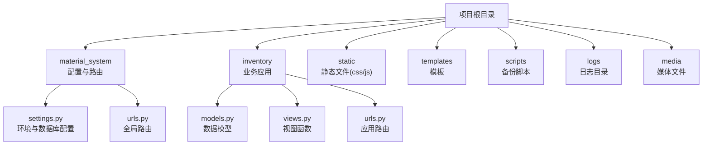
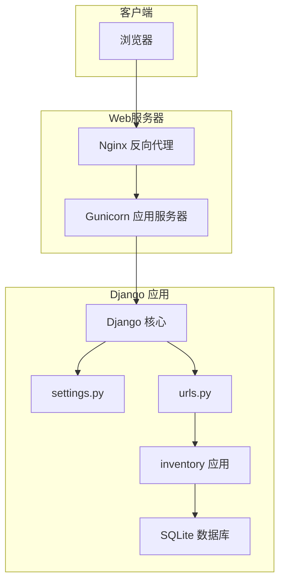
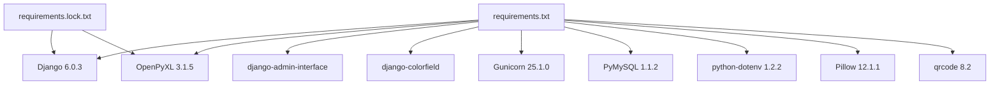

# 快速开始

<cite>
**本文引用的文件**
- [requirements.txt](file://requirements.txt)
- [requirements.lock.txt](file://requirements.lock.txt)
- [material_system/settings.py](file://material_system/settings.py)
- [material_system/urls.py](file://material_system/urls.py)
- [inventory/urls.py](file://inventory/urls.py)
- [manage.py](file://manage.py)
- [README.md](file://README.md)
- [deploy_ubuntu.sh](file://deploy_ubuntu.sh)
- [deploy_ubuntu_24.sh](file://deploy_ubuntu_24.sh)
- [deploy/centos7/README.md](file://deploy/centos7/README.md)
- [scripts/backup_db.sh](file://scripts/backup_db.sh)
- [create_admin.py](file://create_admin.py)
- [generate_test_data.py](file://generate_test_data.py)
</cite>

## 目录
1. [简介](#简介)
2. [项目结构](#项目结构)
3. [核心组件](#核心组件)
4. [架构概览](#架构概览)
5. [详细组件分析](#详细组件分析)
6. [依赖分析](#依赖分析)
7. [性能考虑](#性能考虑)
8. [故障排除指南](#故障排除指南)
9. [结论](#结论)
10. [附录](#附录)

## 简介
本指南面向首次接触材料管理系统的用户，帮助你在30分钟内完成环境准备、依赖安装、数据库初始化与首次运行。系统基于 Django 6.0.3 构建，使用 SQLite 作为默认数据库，并提供 Bootstrap 样式与 OpenPyXL 导入导出能力。你将学会如何在 Windows、Linux、macOS 上安装与运行，以及如何配置环境变量、静态文件与媒体文件。

## 项目结构
- 应用层：inventory 为核心业务应用，包含模型、视图、URL、模板与迁移文件。
- 配置层：material_system 下包含 settings.py、urls.py、wsgi.py、asgi.py。
- 工具与脚本：提供一键部署脚本、数据库备份脚本、创建管理员脚本与测试数据生成脚本。
- 依赖管理：requirements.txt 与 requirements.lock.txt 管理 Python 依赖版本。

**图表来源**
- [material_system/settings.py:63-210](file://material_system/settings.py#L63-L210)
- [material_system/urls.py:1-13](file://material_system/urls.py#L1-L13)
- [inventory/urls.py:1-80](file://inventory/urls.py#L1-L80)

**章节来源**
- [README.md:89-113](file://README.md#L89-L113)

## 核心组件
- Django 配置与数据库
  - settings.py 提供 SQLite 默认配置、静态文件与媒体文件路径、日志配置、国际化与时区设置、登录重定向等。
  - DATABASES 默认使用 SQLite，支持通过环境变量切换引擎与数据库文件路径。
- 路由与入口
  - material_system/urls.py 将 /admin/ 映射到管理后台，其余请求交由 inventory/urls.py 处理。
  - manage.py 作为 Django 命令入口，设置 DJANGO_SETTINGS_MODULE 并执行命令行任务。
- 业务应用 inventory
  - 提供项目管理、材料管理、供应商管理、采购计划、发货管理、入库管理、报表与图表、Excel 导出、操作日志、用户管理与系统设置等功能路由。

**章节来源**
- [material_system/settings.py:122-146](file://material_system/settings.py#L122-L146)
- [material_system/urls.py:6-12](file://material_system/urls.py#L6-L12)
- [inventory/urls.py:1-80](file://inventory/urls.py#L1-L80)
- [manage.py:7-18](file://manage.py#L7-L18)

## 架构概览
系统采用 Django MVC 架构，前端模板与静态资源通过 Django 模板系统渲染，静态文件与媒体文件分别指向 static 与 media 目录。开发时 DEBUG 为 True，生产部署可切换至 production_settings 或通过 .env 控制。

**图表来源**
- [deploy_ubuntu_24.sh:101-156](file://deploy_ubuntu_24.sh#L101-L156)
- [material_system/settings.py:122-146](file://material_system/settings.py#L122-L146)
- [material_system/urls.py:1-13](file://material_system/urls.py#L1-L13)

## 详细组件分析

### 环境准备与依赖安装
- Python 与 pip
  - 推荐使用 Python 3.10+，确保 pip 可用。
- 虚拟环境
  - 建议在项目根目录创建并激活虚拟环境，避免污染系统 Python 环境。
- 依赖安装
  - 使用 requirements.txt 安装依赖，其中包含 Django 6.0.3、OpenPyXL、Bootstrap 相关组件与其它必要包。
  - 若需锁定版本，可参考 requirements.lock.txt。

**章节来源**
- [README.md:30-54](file://README.md#L30-L54)
- [requirements.txt:1-16](file://requirements.txt#L1-L16)
- [requirements.lock.txt:1-13](file://requirements.lock.txt#L1-L13)

### 数据库初始化与迁移
- SQLite 数据库
  - settings.py 默认使用 SQLite，数据库文件位于项目根目录（默认 db.sqlite3），可通过环境变量调整。
- 迁移命令
  - 执行数据库迁移以创建初始表结构。
  - 收集静态文件以支持静态资源访问。

**章节来源**
- [material_system/settings.py:122-130](file://material_system/settings.py#L122-L130)
- [README.md:62-66](file://README.md#L62-L66)

### 系统配置参数
- 环境变量
  - SECRET_KEY：用于 Django 安全密钥，生产环境务必修改。
  - DEBUG：开发时为 True，生产环境建议改为 False。
  - ALLOWED_HOSTS：生产环境需设置为实际域名或 IP。
  - LANGUAGE_CODE、TIME_ZONE：国际化与时区设置。
- 静态文件与媒体文件
  - STATIC_URL、STATIC_ROOT、STATICFILES_DIRS：静态文件路径与收集目录。
  - MEDIA_URL、MEDIA_ROOT：媒体文件上传路径。
- 日志配置
  - logs 目录自动创建，支持轮转日志文件。

**章节来源**
- [material_system/settings.py:69-203](file://material_system/settings.py#L69-L203)

### 首次运行指导
- 创建超级用户
  - 使用 createsuperuser 命令创建管理员账户，或使用 create_admin.py 脚本。
- 启动开发服务器
  - 使用 runserver 启动开发服务器，默认访问地址为 http://127.0.0.1:8000。
- 生成测试数据（可选）
  - 使用 generate_test_data.py 脚本快速填充测试数据，便于体验系统功能。

**章节来源**
- [README.md:62-72](file://README.md#L62-L72)
- [create_admin.py:16-45](file://create_admin.py#L16-L45)
- [generate_test_data.py:18-181](file://generate_test_data.py#L18-L181)

### 不同操作系统安装步骤

#### Windows
- 安装 Python 3.10+ 与 pip
- 在项目目录创建虚拟环境并激活
- 安装依赖：pip install -r requirements.txt
- 配置环境变量：复制 .env.example 为 .env 并修改 SECRET_KEY
- 初始化数据库：python manage.py migrate
- 创建超级用户：python manage.py createsuperuser
- 启动开发服务器：python manage.py runserver

**章节来源**
- [README.md:37-72](file://README.md#L37-L72)

#### Linux（Ubuntu 24.04 推荐）
- 使用提供的部署脚本一键安装：sudo bash deploy_ubuntu_24.sh
- 脚本会自动创建虚拟环境、安装依赖、初始化数据库、收集静态文件、创建管理员账号并配置 Gunicorn 与 Nginx
- 访问 http://服务器IP

**章节来源**
- [deploy_ubuntu_24.sh:1-179](file://deploy_ubuntu_24.sh#L1-L179)

#### macOS
- 安装 Python 3.10+ 与 pip
- 在项目目录创建虚拟环境并激活
- 安装依赖：pip install -r requirements.txt
- 配置环境变量：复制 .env.example 为 .env 并修改 SECRET_KEY
- 初始化数据库：python manage.py migrate
- 创建超级用户：python manage.py createsuperuser
- 启动开发服务器：python manage.py runserver

**章节来源**
- [README.md:37-72](file://README.md#L37-L72)

### 生产部署（Ubuntu 20.04/22.04/24.04）
- Ubuntu 24.04（推荐）
  - 以 root 权限运行脚本：sudo bash deploy_ubuntu_24.sh
  - 脚本会生成 .env、初始化数据库、收集静态文件、创建管理员账号、配置 Gunicorn 与 Nginx
- Ubuntu 20.04/22.04
  - 以 root 权限运行脚本：sudo bash deploy_ubuntu.sh
  - 包含生产环境配置、安全加固与服务管理

**章节来源**
- [README.md:74-87](file://README.md#L74-L87)
- [deploy_ubuntu_24.sh:74-121](file://deploy_ubuntu_24.sh#L74-L121)
- [deploy_ubuntu.sh:74-128](file://deploy_ubuntu.sh#L74-L128)

### CentOS 7（传统部署）
- 系统准备：安装 Python 3.8+、gcc、sqlite-devel 等依赖
- 部署用户：创建专用用户 django 并切换
- 安装依赖：pip3 install --user -r requirements.txt
- 安装 pysqlite3 解决 SQLite 版本兼容性问题
- 初始化数据库：python3 manage.py migrate
- 创建管理员：通过 manage.py shell 创建超级用户
- 启动方式：Gunicorn + Systemd + Nginx 反向代理

**章节来源**
- [deploy/centos7/README.md:11-65](file://deploy/centos7/README.md#L11-L65)

## 依赖分析
- 关键依赖
  - Django 6.0.3：Web 框架核心
  - Bootstrap 相关：admin-interface、colorfield 提供管理界面样式
  - OpenPyXL 3.1.5：Excel 导入导出
  - Gunicorn 25.1.0：生产 WSGI 服务器
  - PyMySQL 1.1.2：MySQL 驱动（可选）
  - python-dotenv 1.2.2：环境变量加载
  - Pillow 12.1.1：图片处理
  - qrcode 8.2：二维码生成
- 依赖锁定
  - requirements.lock.txt 用于锁定版本，便于生产一致性

**图表来源**
- [requirements.txt:1-16](file://requirements.txt#L1-L16)
- [requirements.lock.txt:1-13](file://requirements.lock.txt#L1-L13)

**章节来源**
- [requirements.txt:1-16](file://requirements.txt#L1-L16)
- [requirements.lock.txt:1-13](file://requirements.lock.txt#L1-L13)

## 性能考虑
- SQLite 适配高版本库
  - settings.py 对 SQLite 进行补丁以提升参数上限与兼容性，若系统 SQLite 版本较低，建议安装 pysqlite3。
- 静态文件与媒体文件
  - 开发时 DEBUG=True，静态文件由 Django 提供；生产环境需收集静态文件并由 Nginx 提供。
- 日志轮转
  - 日志按大小轮转，避免日志文件过大影响性能。

**章节来源**
- [material_system/settings.py:14-61](file://material_system/settings.py#L14-L61)
- [material_system/settings.py:148-203](file://material_system/settings.py#L148-L203)

## 故障排除指南
- 依赖安装失败
  - 确认 Python 3.10+ 且 pip 可用；在虚拟环境中安装；网络稳定。
- SQLite 版本过低
  - settings.py 已尝试使用 pysqlite3 替代内置库；若仍报错，安装 pysqlite3。
- 端口被占用
  - 默认开发服务器端口为 8000；如冲突，请更换端口或释放端口。
- 静态文件 404
  - 确认已执行 collectstatic；生产环境由 Nginx 提供静态文件。
- 数据库迁移失败
  - 检查数据库文件权限与路径；确保 SQLite 可写。
- 管理员账号问题
  - 使用 createsuperuser 或 create_admin.py 创建管理员；确认密码一致。
- 备份与恢复
  - 使用 scripts/backup_db.sh 进行数据库备份；默认保留 30 天。

**章节来源**
- [material_system/settings.py:14-61](file://material_system/settings.py#L14-L61)
- [README.md:115-124](file://README.md#L115-L124)
- [scripts/backup_db.sh:22-56](file://scripts/backup_db.sh#L22-L56)

## 结论
通过本快速开始指南，你可以在 Windows、Linux、macOS 上完成环境准备、依赖安装、数据库初始化与首次运行。生产部署可选择 Ubuntu 24.04 的一键脚本，或 CentOS 7 的传统部署方式。遇到问题时，可依据故障排除指南定位并解决。建议在生产环境修改 SECRET_KEY、关闭 DEBUG、限制 ALLOWED_HOSTS，并定期备份数据库。

## 附录

### 常用命令速查
- 创建虚拟环境与激活
  - python -m venv venv
  - source venv/bin/activate（Linux/macOS）或 venv\Scripts\activate（Windows）
- 安装依赖
  - pip install -r requirements.txt
- 初始化数据库
  - python manage.py migrate
- 创建管理员
  - python manage.py createsuperuser
  - 或使用 create_admin.py
- 收集静态文件（生产）
  - python manage.py collectstatic --noinput
- 启动开发服务器
  - python manage.py runserver
- 一键部署（Ubuntu 24.04）
  - sudo bash deploy_ubuntu_24.sh
- 数据库备份
  - ./scripts/backup_db.sh

**章节来源**
- [README.md:37-72](file://README.md#L37-L72)
- [deploy_ubuntu_24.sh:89-99](file://deploy_ubuntu_24.sh#L89-L99)
- [scripts/backup_db.sh:28-52](file://scripts/backup_db.sh#L28-L52)