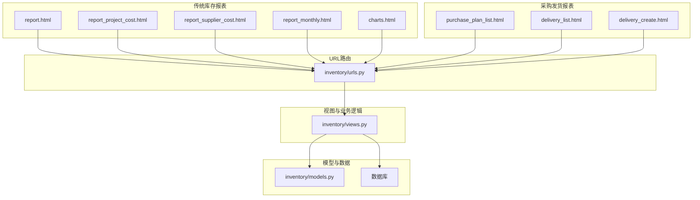
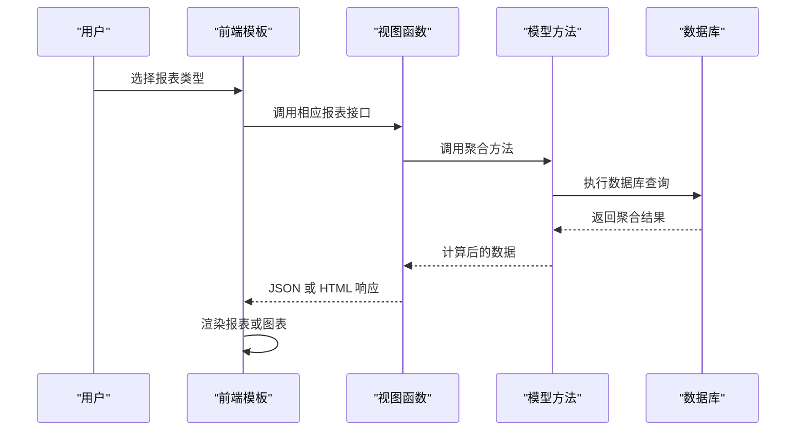
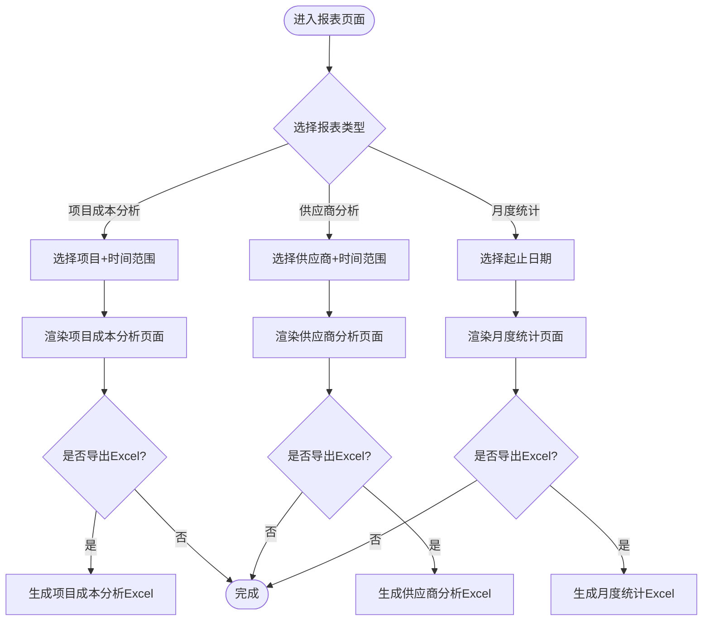
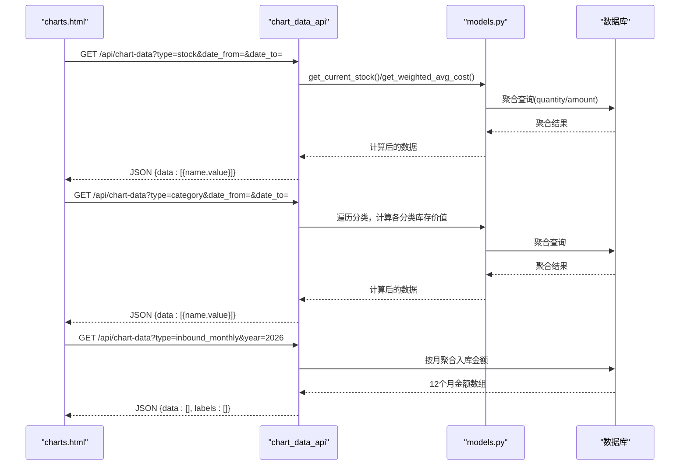
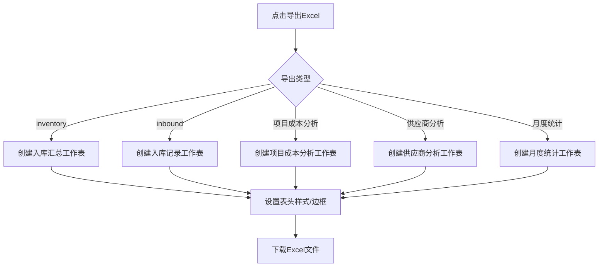
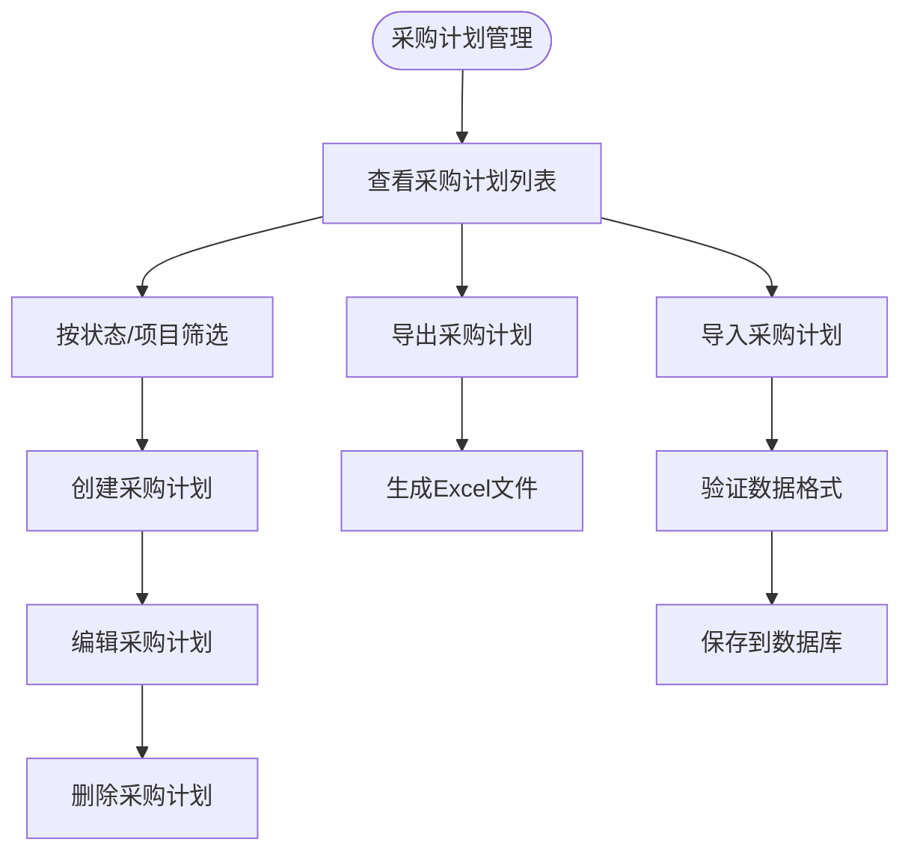
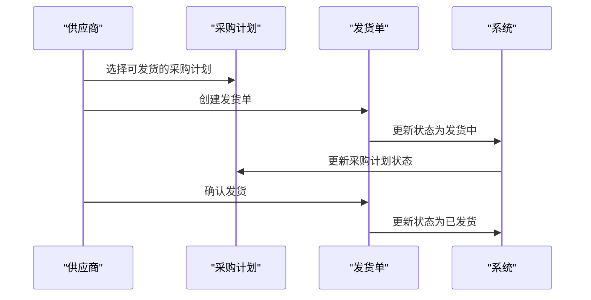
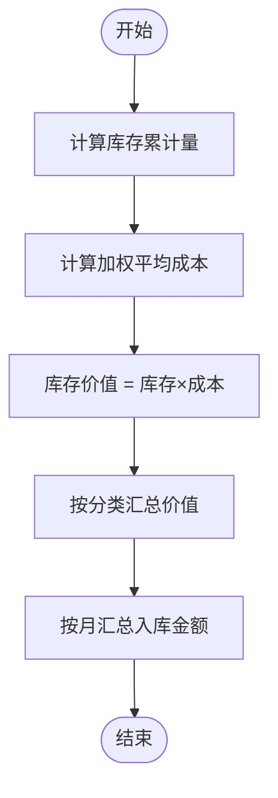
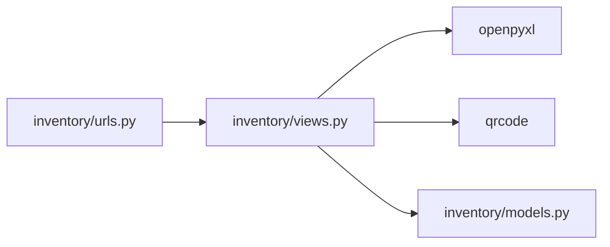
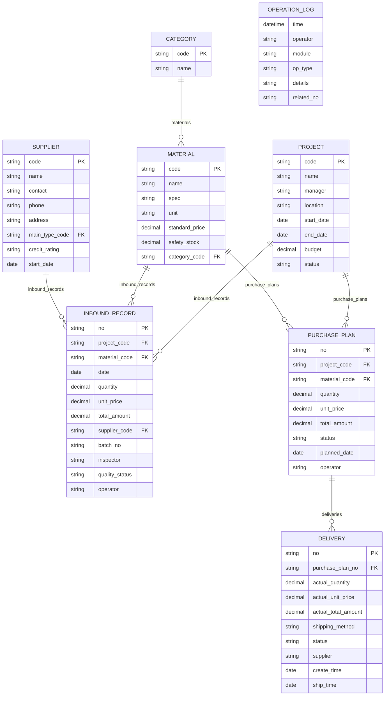

# 报表与数据分析

<cite>
**本文引用的文件**
- [inventory/views.py](file://inventory/views.py)
- [inventory/models.py](file://inventory/models.py)
- [inventory/urls.py](file://inventory/urls.py)
- [templates/inventory/report.html](file://templates/inventory/report.html)
- [templates/inventory/report_project_cost.html](file://templates/inventory/report_project_cost.html)
- [templates/inventory/report_supplier_cost.html](file://templates/inventory/report_supplier_cost.html)
- [templates/inventory/report_monthly.html](file://templates/inventory/report_monthly.html)
- [templates/inventory/charts.html](file://templates/inventory/charts.html)
- [requirements.txt](file://requirements.txt)
- [material_system/settings.py](file://material_system/settings.py)
- [inventory/migrations/0001_initial.py](file://inventory/migrations/0001_initial.py)
</cite>

## 更新摘要
**变更内容**
- 更新报表系统架构以反映同时保留的传统库存报表和新的采购计划/发货跟踪报表
- 强调系统当前仍包含完整的库存管理功能，而非完全移除
- 更新报表功能分类，明确区分库存报表和采购发货报表
- 调整架构图以体现混合报表系统设计

## 目录
1. [简介](#简介)
2. [项目结构](#项目结构)
3. [核心组件](#核心组件)
4. [架构总览](#架构总览)
5. [详细组件分析](#详细组件分析)
6. [依赖分析](#依赖分析)
7. [性能考虑](#性能考虑)
8. [故障排查指南](#故障排查指南)
9. [结论](#结论)
10. [附录](#附录)

## 简介
本章节概述材料管理系统的报表与数据分析能力，涵盖实时数据统计（库存状态、采购进度、财务数据）、图表可视化（柱状图、饼图、折线图）、Excel 数据导出（OpenPyXL 集成与格式化）、报表定制（筛选条件、时间范围、数据维度）、数据聚合算法与计算逻辑、性能优化策略（缓存与批量处理），以及自定义报表开发指导与数据隐私安全保护。

**重要说明**：系统当前同时保留了传统的库存报表功能和新的采购计划/发货跟踪报表功能，形成混合报表系统架构。

## 项目结构
报表与数据分析相关的核心文件组织如下：
- 视图层：inventory/views.py 提供报表页面、图表接口、Excel 导出与数据聚合逻辑
- 模型层：inventory/models.py 定义库存、采购、供应商、项目等实体及聚合方法
- URL 映射：inventory/urls.py 将报表与图表路由映射到对应视图
- 模板层：templates/inventory 下的 HTML 模板负责报表页面与图表页面渲染
- 依赖声明：requirements.txt 包含 openpyxl、qrcode 等报表与导出所需库
- 运行时配置：material_system/settings.py 提供日志、静态资源、媒体路径等运行参数

**图表来源**
- [inventory/urls.py:1-84](file://inventory/urls.py#L1-L84)
- [inventory/views.py:1275-1599](file://inventory/views.py#L1275-L1599)
- [inventory/models.py:1-361](file://inventory/models.py#L1-L361)

**章节来源**
- [inventory/urls.py:1-84](file://inventory/urls.py#L1-L84)
- [requirements.txt:1-16](file://requirements.txt#L1-L16)
- [material_system/settings.py:141-147](file://material_system/settings.py#L141-L147)

## 核心组件
### 传统库存报表组件
- **报表页面与筛选**
  - 报表首页：提供项目采购分析、供应商采购分析、月度统计入口与筛选条件
  - 项目采购分析：按项目聚合材料用量与成本，支持导出 Excel
  - 供应商采购分析：按供应商聚合采购明细，支持导出 Excel
  - 月度统计：按自然月汇总入库金额，支持导出 Excel
- **图表分析**
  - 库存价值 TOP10（柱状图）
  - 分类库存分布（饼图）
  - 月度入库趋势（折线图）
  - 年份下拉与动态刷新
- **Excel 导出**
  - 入库汇总、入库记录、项目成本分析、供应商分析、月度统计等多场景导出
  - 使用 openpyxl 创建工作簿、设置表头样式、边框与填充

### 采购发货报表组件
- **采购计划报表**
  - 采购计划列表：显示所有采购计划的状态、数量、金额、执行进度
  - 采购计划导出：批量导出采购计划数据
  - 采购计划导入：支持 Excel 批量导入采购计划
- **发货跟踪报表**
  - 发货单列表：显示发货状态、数量、金额、送货方式
  - 发货单导出：批量导出发货单数据
  - 发货单创建：供应商创建发货单并更新采购计划状态
- **快速收货报表**
  - 快速收货界面：扫描发货单号快速确认收货
  - 最近发货单追踪：显示最近的发货记录

**章节来源**
- [templates/inventory/report.html:1-97](file://templates/inventory/report.html#L1-L97)
- [templates/inventory/report_project_cost.html:1-58](file://templates/inventory/report_project_cost.html#L1-L58)
- [templates/inventory/report_supplier_cost.html:1-83](file://templates/inventory/report_supplier_cost.html#L1-L83)
- [templates/inventory/report_monthly.html:1-27](file://templates/inventory/report_monthly.html#L1-L27)
- [templates/inventory/charts.html:1-245](file://templates/inventory/charts.html#L1-L245)
- [inventory/views.py:1275-1599](file://inventory/views.py#L1275-L1599)
- [inventory/models.py:239-310](file://inventory/models.py#L239-L310)

## 架构总览
报表与数据分析采用"混合架构"，同时支持传统库存报表和采购发货报表两大功能模块：
- **传统库存报表模块**：基于入库记录的库存统计分析
- **采购发货报表模块**：基于采购计划和发货单的供应链跟踪
- **共享组件**：Excel 导出、图表渲染、数据聚合算法

**图表来源**
- [templates/inventory/charts.html:90-245](file://templates/inventory/charts.html#L90-L245)
- [inventory/views.py:1275-1599](file://inventory/views.py#L1275-L1599)
- [inventory/models.py:117-178](file://inventory/models.py#L117-L178)

**章节来源**
- [inventory/views.py:1275-1599](file://inventory/views.py#L1275-L1599)
- [templates/inventory/charts.html:1-245](file://templates/inventory/charts.html#L1-L245)

## 详细组件分析

### 传统库存报表组件
#### 报表页面与筛选
- **报表首页（report.html）**
  - 提供项目、供应商、时间范围筛选入口，分别跳转到项目成本分析、供应商分析、月度统计
- **项目采购分析（report_project_cost）**
  - 支持项目筛选、时间范围筛选；可导出 Excel，包含分类、材料、规格、单位、数量、金额、占比
- **供应商采购分析（report_supplier_cost）**
  - 支持供应商筛选、时间范围筛选；可导出 Excel，包含项目、材料、规格、单位、数量、单价、总金额、日期
- **月度统计（report_monthly）**
  - 支持时间范围筛选；按自然月汇总入库金额，可导出 Excel

**图表来源**
- [templates/inventory/report.html:23-91](file://templates/inventory/report.html#L23-L91)
- [templates/inventory/report_project_cost.html:9-23](file://templates/inventory/report_project_cost.html#L9-L23)
- [templates/inventory/report_supplier_cost.html:13-28](file://templates/inventory/report_supplier_cost.html#L13-L28)
- [templates/inventory/report_monthly.html:10-25](file://templates/inventory/report_monthly.html#L10-L25)

**章节来源**
- [templates/inventory/report.html:1-97](file://templates/inventory/report.html#L1-L97)
- [templates/inventory/report_project_cost.html:1-58](file://templates/inventory/report_project_cost.html#L1-L58)
- [templates/inventory/report_supplier_cost.html:1-83](file://templates/inventory/report_supplier_cost.html#L1-L83)
- [templates/inventory/report_monthly.html:1-27](file://templates/inventory/report_monthly.html#L1-L27)

#### 图表分析组件
- **页面（charts.html）**
  - 提供库存价值 TOP10、分类库存分布、月度入库趋势三类图表
  - 支持日期范围筛选与年份选择器，点击"刷新"触发重新加载
- **后端接口（chart_data_api）**
  - stock：按材料库存价值排序取前 10
  - category：按分类汇总库存价值
  - inbound_monthly：按自然年汇总月度入库金额
- **年份列表（get_years_list）**
  - 动态获取入库记录最小/最大年份，填充年份选择器

**图表来源**
- [templates/inventory/charts.html:90-245](file://templates/inventory/charts.html#L90-L245)
- [inventory/views.py:1527-1599](file://inventory/views.py#L1527-L1599)
- [inventory/models.py:117-178](file://inventory/models.py#L117-L178)

**章节来源**
- [templates/inventory/charts.html:1-245](file://templates/inventory/charts.html#L1-L245)
- [inventory/views.py:1527-1599](file://inventory/views.py#L1527-L1599)
- [inventory/models.py:117-178](file://inventory/models.py#L117-L178)

#### Excel 导出组件
- **入库汇总（export_excel）**
  - 输出材料编号、名称、分类、规格、单位、累计入库量、安全库存、入库均价、入库总值
- **入库记录（export_excel）**
  - 输出入库单号、日期、项目、材料、规格、数量、单价、总金额、供应商、验收人
- **报表导出（项目成本分析、供应商分析、月度统计）**
  - 在报表页面点击"导出Excel"按钮触发，生成对应工作簿并下载

**图表来源**
- [inventory/views.py:1019-1087](file://inventory/views.py#L1019-L1087)
- [inventory/views.py:1283-1368](file://inventory/views.py#L1283-L1368)
- [inventory/views.py:1371-1449](file://inventory/views.py#L1371-L1449)
- [inventory/views.py:1452-1519](file://inventory/views.py#L1452-L1519)

**章节来源**
- [inventory/views.py:1019-1087](file://inventory/views.py#L1019-L1087)
- [inventory/views.py:1283-1368](file://inventory/views.py#L1283-L1368)
- [inventory/views.py:1371-1449](file://inventory/views.py#L1371-L1449)
- [inventory/views.py:1452-1519](file://inventory/views.py#L1452-L1519)

### 采购发货报表组件

#### 采购计划报表
- **采购计划列表（purchase_plan_list）**
  - 显示所有采购计划的状态、数量、金额、执行进度
  - 支持按状态、项目、关键词筛选
- **采购计划导出（export_purchase_plans）**
  - 批量导出采购计划数据，包含计划编号、项目、材料、数量、单价、金额、状态等
- **采购计划导入（import_purchase_plans）**
  - 支持 Excel 批量导入采购计划，自动验证数据完整性

**图表来源**
- [inventory/views.py:380-453](file://inventory/views.py#L380-L453)
- [inventory/views.py:457-530](file://inventory/views.py#L457-L530)
- [inventory/views.py:534-666](file://inventory/views.py#L534-L666)

**章节来源**
- [inventory/views.py:380-453](file://inventory/views.py#L380-L453)
- [inventory/views.py:457-530](file://inventory/views.py#L457-L530)
- [inventory/views.py:534-666](file://inventory/views.py#L534-L666)

#### 发货跟踪报表
- **发货单列表（delivery_list）**
  - 显示发货状态、数量、金额、送货方式
  - 供应商只能查看自己的发货单
- **发货单创建（delivery_create）**
  - 供应商创建发货单并更新采购计划状态
- **发货单导出（export_deliveries）**
  - 批量导出发货单数据，包含发货单号、采购计划号、项目、材料、数量、金额、状态等

**图表来源**
- [inventory/views.py:699-865](file://inventory/views.py#L699-L865)
- [inventory/views.py:806-865](file://inventory/views.py#L806-L865)
- [inventory/views.py:723-804](file://inventory/views.py#L723-L804)

**章节来源**
- [inventory/views.py:699-865](file://inventory/views.py#L699-L865)
- [inventory/views.py:806-865](file://inventory/views.py#L806-L865)
- [inventory/views.py:723-804](file://inventory/views.py#L723-L804)

#### 快速收货报表
- **快速收货界面（quick_receive）**
  - 扫描发货单号快速确认收货
  - 显示最近发货单列表
- **发货单确认（quick_receive_confirm）**
  - 确认收货并更新发货状态

**章节来源**
- [templates/inventory/quick_receive.html:1-58](file://templates/inventory/quick_receive.html#L1-L58)
- [inventory/views.py:42-45](file://inventory/views.py#L42-L45)

### 数据聚合算法与计算逻辑
- **库存累计量**
  - 方法：Material.get_current_stock(project_id, start_date, end_date)
  - 算法：基于 InboundRecord 的 quantity 聚合，支持按项目与时间范围过滤
- **加权平均成本**
  - 方法：Material.get_weighted_avg_cost(start_date, end_date)
  - 算法：total_amount / total_quantity；若总量为 0，回退到最近一次入库单价
- **分类库存价值**
  - 算法：遍历分类下所有材料，计算 stock × avg_cost，求和得到分类价值
- **月度入库金额**
  - 算法：按自然年逐月聚合 InboundRecord.total_amount

**图表来源**
- [inventory/models.py:117-178](file://inventory/models.py#L117-L178)
- [inventory/views.py:1545-1584](file://inventory/views.py#L1545-L1584)

**章节来源**
- [inventory/models.py:117-178](file://inventory/models.py#L117-L178)
- [inventory/views.py:1545-1584](file://inventory/views.py#L1545-L1584)

### 报表定制功能使用指南
- **时间范围筛选**
  - 支持在报表页面输入起止日期，后端按日期范围过滤 InboundRecord
- **数据维度选择**
  - 项目成本分析：按材料维度聚合；供应商分析：按项目维度聚合
- **筛选条件**
  - 项目/供应商/材料/批次等维度可在相应页面进行筛选
- **导出与格式化**
  - Excel 导出自动设置表头样式、边框与填充，便于阅读与打印

**章节来源**
- [templates/inventory/report.html:23-91](file://templates/inventory/report.html#L23-L91)
- [templates/inventory/report_project_cost.html:9-23](file://templates/inventory/report_project_cost.html#L9-L23)
- [templates/inventory/report_supplier_cost.html:13-28](file://templates/inventory/report_supplier_cost.html#L13-L28)
- [inventory/views.py:1283-1368](file://inventory/views.py#L1283-L1368)
- [inventory/views.py:1371-1449](file://inventory/views.py#L1371-L1449)
- [inventory/views.py:1452-1519](file://inventory/views.py#L1452-L1519)

### 自定义报表开发指导
- **新增报表页面**
  - 在 templates/inventory 下创建新的 HTML 模板，定义筛选表单与表格结构
- **新增视图函数**
  - 在 inventory/views.py 中添加新的函数，解析 GET 参数，调用模型聚合方法，渲染模板或返回 JSON
- **新增 URL 路由**
  - 在 inventory/urls.py 中注册新路由，映射到视图函数
- **新增导出功能**
  - 在视图中增加 export 参数分支，使用 openpyxl 生成工作簿并返回 HttpResponse
- **示例参考**
  - 项目成本分析、供应商分析、月度统计均提供了完整的筛选、聚合与导出实现

**章节来源**
- [inventory/urls.py:58-84](file://inventory/urls.py#L58-L84)
- [inventory/views.py:1275-1368](file://inventory/views.py#L1275-L1368)
- [inventory/views.py:1371-1449](file://inventory/views.py#L1371-L1449)
- [inventory/views.py:1452-1519](file://inventory/views.py#L1452-L1519)

## 依赖分析
- **外部库**
  - openpyxl：用于 Excel 工作簿创建与单元格样式设置
  - qrcode：用于发货单二维码生成
- **内部模块**
  - inventory.models：提供库存、成本、分类等聚合方法
  - inventory.views：提供报表页面、图表接口、Excel 导出与数据聚合逻辑
  - inventory.urls：路由映射

**图表来源**
- [requirements.txt:7-13](file://requirements.txt#L7-L13)
- [inventory/views.py:1023-1024](file://inventory/views.py#L1023-L1024)
- [inventory/views.py:840-841](file://inventory/views.py#L840-L841)

**章节来源**
- [requirements.txt:1-16](file://requirements.txt#L1-L16)
- [inventory/views.py:1023-1024](file://inventory/views.py#L1023-L1024)
- [inventory/views.py:840-841](file://inventory/views.py#L840-L841)

## 性能考虑
- **数据库查询优化**
  - 使用 select_related 预加载外键关联，减少 N+1 查询
  - 使用聚合函数 Sum/Count/Max/Min 直接在数据库侧完成计算
- **前端渲染优化**
  - 图表页面通过 AJAX 拉取数据，避免整页刷新
  - 年份选择器动态加载，减少初始渲染压力
- **缓存与批量处理**
  - 当前未实现专用缓存；建议对高频报表（如库存价值 TOP10）引入 Redis 缓存，设置合理过期时间
  - 对大体量导出任务（如全量入库记录）采用异步任务队列（Celery）后台生成文件并通知用户下载
- **SQLite 版本兼容**
  - settings.py 中对 SQLite 版本与查询参数上限做了兼容处理，确保大数据量场景下的稳定性

**章节来源**
- [material_system/settings.py:14-62](file://material_system/settings.py#L14-L62)
- [inventory/views.py:1527-1599](file://inventory/views.py#L1527-L1599)
- [inventory/models.py:117-178](file://inventory/models.py#L117-L178)

## 故障排查指南
- **Excel 导出异常**
  - 确认 openpyxl 已安装且版本兼容
  - 检查视图中工作簿创建与响应头设置是否正确
- **图表数据为空**
  - 检查时间范围是否合理，确认数据库中是否存在对应时间段的数据
  - 确认 chart_data_api 的日期解析与聚合逻辑
- **权限问题**
  - 报表与图表页面均要求登录；部分导出需管理员权限
- **采购计划导入失败**
  - 检查 Excel 文件格式是否符合模板要求
  - 确认项目和材料是否存在且匹配
- **发货单创建异常**
  - 检查采购计划状态是否允许发货
  - 确认供应商权限和发货数量是否正确

**章节来源**
- [requirements.txt:7-13](file://requirements.txt#L7-L13)
- [material_system/settings.py:149-203](file://material_system/settings.py#L149-L203)
- [inventory/views.py:1527-1599](file://inventory/views.py#L1527-L1599)
- [inventory/views.py:534-666](file://inventory/views.py#L534-L666)
- [inventory/views.py:806-865](file://inventory/views.py#L806-L865)

## 结论
本系统通过模板驱动的报表页面、灵活的筛选与导出机制、以及基于模型的高效聚合方法，实现了库存、采购与财务数据的动态统计与可视化展示。系统当前同时支持传统库存报表和新的采购发货报表两大功能模块，满足不同层次的运营与决策支持需求。建议后续引入缓存与异步导出以进一步提升性能与用户体验。

## 附录
- **数据模型概览（关键字段）**
  - Project：项目编号、名称、负责人、地点、预算、状态
  - Material：材料编号、名称、分类、规格、单位、标准单价、安全库存
  - Supplier：供应商编号、名称、联系人、电话、地址、主营类型、信用等级
  - InboundRecord：入库单号、项目、材料、日期、数量、单价、总金额、供应商、批次号、验收人、质量状态、操作员
  - PurchasePlan：计划编号、项目、材料、数量、单价、预计金额、状态、计划日期、操作员
  - Delivery：发货单号、采购计划、实际数量、实际单价、实际金额、送货方式、状态、供应商、创建时间、发货时间
  - OperationLog：操作时间、操作员、模块、操作类型、详情、关联单号

**图表来源**
- [inventory/migrations/0001_initial.py:48-196](file://inventory/migrations/0001_initial.py#L48-L196)
- [inventory/models.py:51-361](file://inventory/models.py#L51-L361)