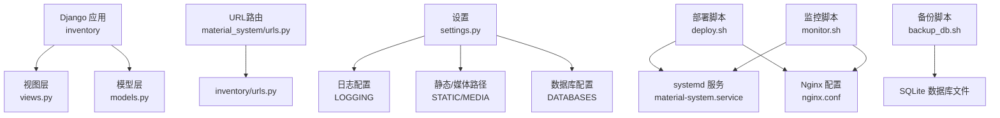
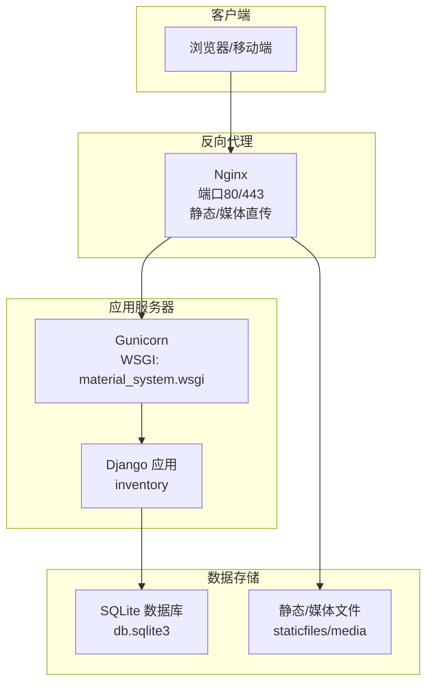
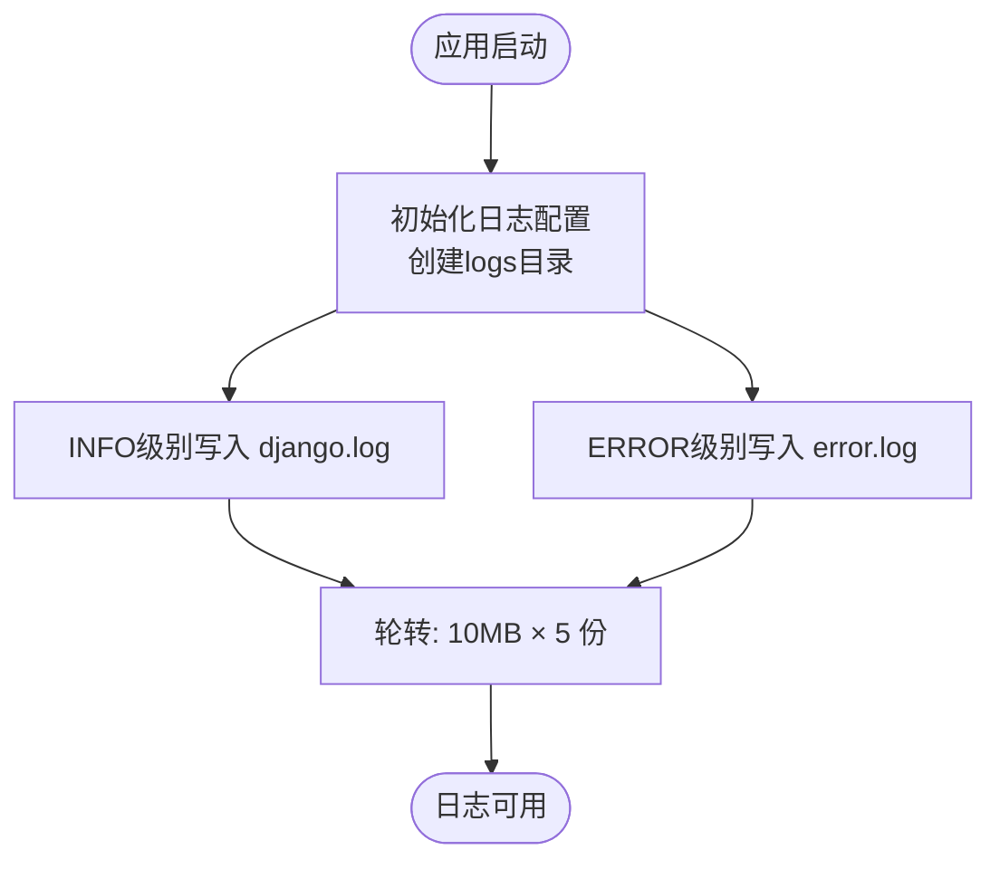
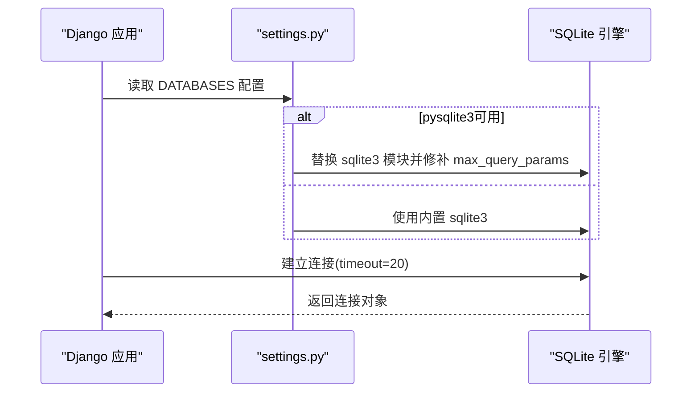
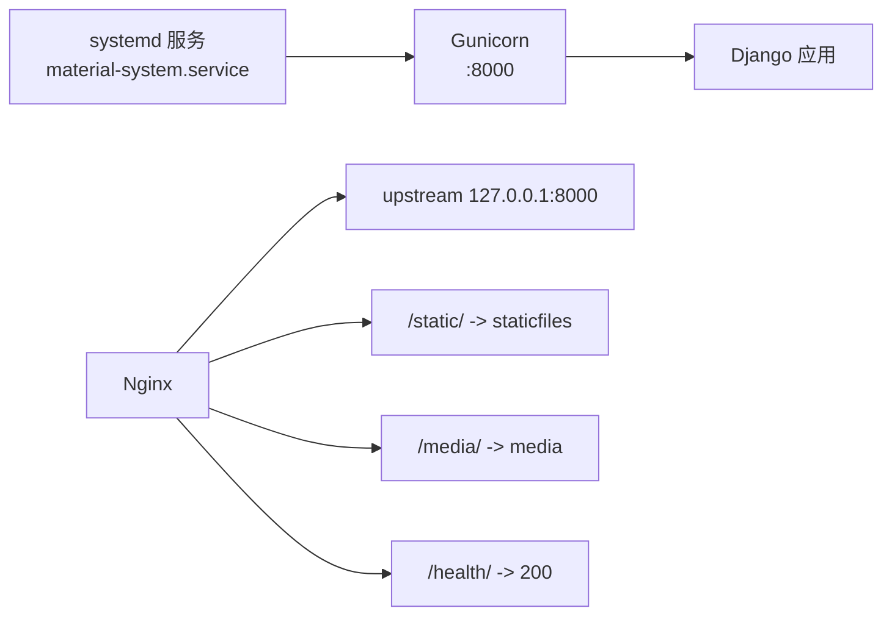
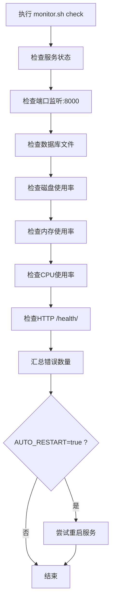
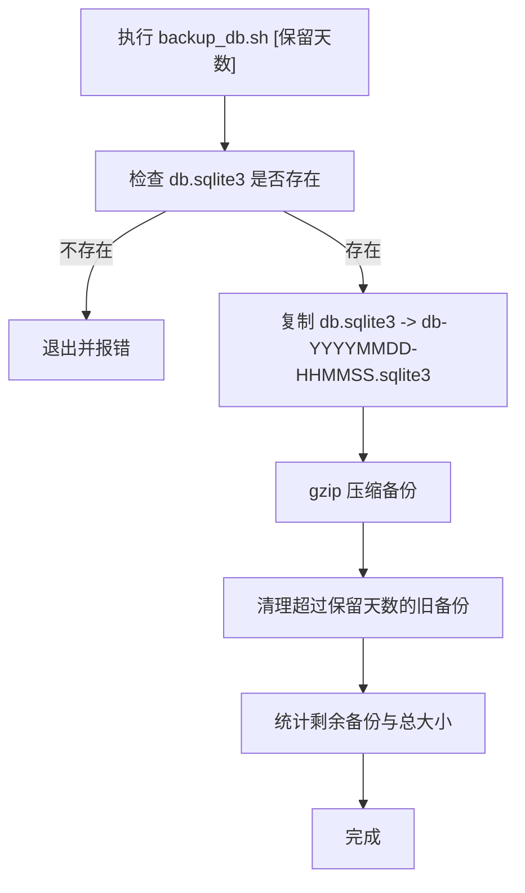
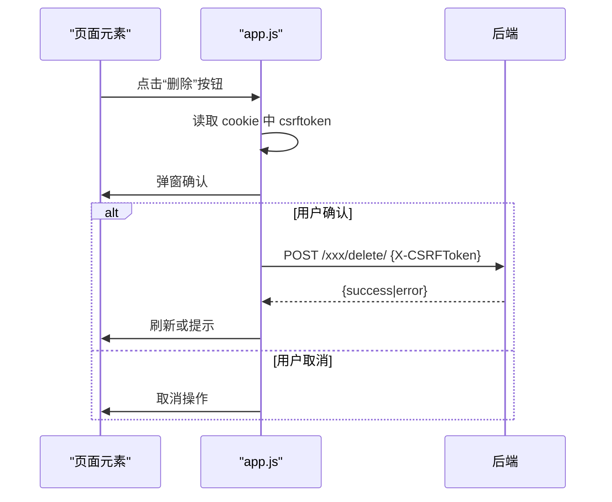
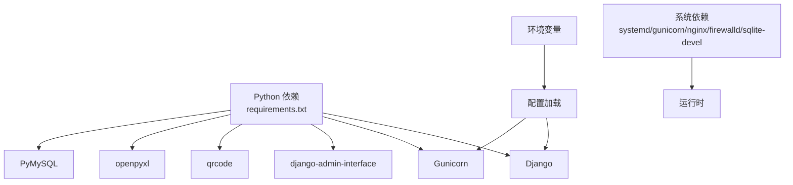

# 故障排除与常见问题

<cite>
**本文引用的文件**
- [settings.py](file://material_system/settings.py)
- [urls.py](file://material_system/urls.py)
- [urls.py](file://inventory/urls.py)
- [models.py](file://inventory/models.py)
- [views.py](file://inventory/views.py)
- [manage.py](file://manage.py)
- [requirements.txt](file://requirements.txt)
- [deploy.sh](file://deploy/centos7/deploy.sh)
- [material-system.service](file://deploy/centos7/material-system.service)
- [nginx.conf](file://deploy/centos7/nginx.conf)
- [monitor.sh](file://deploy/centos7/monitor.sh)
- [backup_db.sh](file://scripts/backup_db.sh)
- [app.js](file://static/js/app.js)
</cite>

## 目录
1. [简介](#简介)
2. [项目结构](#项目结构)
3. [核心组件](#核心组件)
4. [架构总览](#架构总览)
5. [详细组件分析](#详细组件分析)
6. [依赖分析](#依赖分析)
7. [性能考虑](#性能考虑)
8. [故障排除指南](#故障排除指南)
9. [结论](#结论)
10. [附录](#附录)

## 简介
本文件面向材料管理系统运维与开发人员，提供系统运行期常见问题的诊断与修复方案，覆盖安装部署、配置错误、数据库连接、日志分析、性能优化、监控预警、安全防护、备份恢复、升级迁移以及问题反馈流程。内容基于仓库现有实现进行归纳总结，并给出可操作的排查步骤与最佳实践。

## 项目结构
系统采用Django单体应用，前端模板与静态资源位于templates与static目录，业务逻辑集中在inventory应用，核心入口在material_system/settings.py与urls.py中配置。

**图表来源**
- [settings.py:122-130](file://material_system/settings.py#L122-L130)
- [urls.py:1-13](file://material_system/urls.py#L1-L13)
- [urls.py:1-80](file://inventory/urls.py#L1-L80)
- [deploy.sh:94-118](file://deploy/centos7/deploy.sh#L94-L118)
- [material-system.service:1-26](file://deploy/centos7/material-system.service#L1-L26)
- [nginx.conf:1-87](file://deploy/centos7/nginx.conf#L1-L87)
- [monitor.sh:149-173](file://deploy/centos7/monitor.sh#L149-L173)

**章节来源**
- [settings.py:63-146](file://material_system/settings.py#L63-L146)
- [urls.py:1-13](file://material_system/urls.py#L1-L13)
- [urls.py:1-80](file://inventory/urls.py#L1-L80)

## 核心组件
- 设置与日志：集中于settings.py，包含SQLite数据库配置、静态/媒体路径、日志轮转、国际化与时区、登录重定向等。
- 路由与入口：material_system/urls.py聚合admin与inventory子应用；inventory/urls.py定义业务路由。
- 模型与业务：inventory/models.py定义用户档案、项目、材料、供应商、入库记录、采购计划、发货单、操作日志等。
- 视图与权限：inventory/views.py实现登录登出、仪表盘、各类增删改查、导出、权限装饰器与通用工具函数。
- 部署与监控：deploy.sh负责安装依赖、迁移、收集静态文件、配置systemd与Nginx；monitor.sh提供健康检查与告警；backup_db.sh提供数据库备份与清理。
- 前端交互：static/js/app.js提供CSRF令牌获取与通用删除确认等。

**章节来源**
- [settings.py:122-210](file://material_system/settings.py#L122-L210)
- [urls.py:1-13](file://material_system/urls.py#L1-L13)
- [urls.py:1-80](file://inventory/urls.py#L1-L80)
- [models.py:1-328](file://inventory/models.py#L1-L328)
- [views.py:1-800](file://inventory/views.py#L1-L800)
- [deploy.sh:66-92](file://deploy/centos7/deploy.sh#L66-L92)
- [monitor.sh:1-232](file://deploy/centos7/monitor.sh#L1-L232)
- [backup_db.sh:1-57](file://scripts/backup_db.sh#L1-L57)
- [app.js:1-41](file://static/js/app.js#L1-L41)

## 架构总览
系统采用Django+Gunicorn+Nginx的经典生产架构，SQLite作为默认数据库，支持通过环境变量切换为MySQL/PgSQL。日志按级别分文件轮转，静态与媒体文件由Nginx直接提供。

**图表来源**
- [material-system.service:13-13](file://deploy/centos7/material-system.service#L13-L13)
- [nginx.conf:4-52](file://deploy/centos7/nginx.conf#L4-L52)
- [settings.py:122-130](file://material_system/settings.py#L122-L130)

## 详细组件分析

### 组件A：日志与错误追踪
- 日志配置：INFO级别写入django.log，ERROR级别写入error.log，均采用轮转（单文件10MB，保留5个备份），编码UTF-8。
- 日志格式：包含级别、时间、模块、进程、线程与消息；简单格式仅含级别与时间。
- 日志目录：自动创建logs目录，确保写入权限。
- 应用日志：inventory应用日志单独配置，便于按模块定位问题。
- 根日志：root logger统一采集。

**图表来源**
- [settings.py:148-203](file://material_system/settings.py#L148-L203)

**章节来源**
- [settings.py:148-203](file://material_system/settings.py#L148-L203)

### 组件B：数据库连接与SQLite补丁
- 默认使用SQLite，路径基于BASE_DIR与DB_NAME环境变量；超时20秒。
- 若系统内置SQLite版本过低或pysqlite3可用，会动态替换sqlite3模块并修补max_query_params属性，解决参数上限问题。
- 建议生产环境切换为MySQL/PgSQL，避免并发与事务限制。

**图表来源**
- [settings.py:14-61](file://material_system/settings.py#L14-L61)
- [settings.py:122-130](file://material_system/settings.py#L122-L130)

**章节来源**
- [settings.py:14-61](file://material_system/settings.py#L14-L61)
- [settings.py:122-130](file://material_system/settings.py#L122-L130)

### 组件C：部署与服务管理
- 部署脚本deploy.sh：
  - 安装系统依赖（python3、pip、gcc、sqlite-devel、nginx、firewalld）
  - 创建部署用户，安装Python依赖（含gunicorn、pysqlite3）
  - 执行数据库迁移、创建超级用户、收集静态文件、创建媒体目录
  - 配置systemd服务与Nginx，开放HTTP/HTTPS与应用端口，启动服务
- systemd服务material-system.service：
  - 使用gunicorn绑定0.0.0.0:8000，3个工作进程，超时120秒，keep-alive 5秒
  - 重启策略always，保护系统与家目录，限定读写路径
- Nginx配置nginx.conf：
  - upstream指向127.0.0.1:8000
  - 静态文件与媒体文件分别映射到staticfiles与media目录，设置缓存头
  - 健康检查端点/health/返回200
  - 安全头：X-Frame-Options、X-XSS-Protection、X-Content-Type-Options、Referrer-Policy、Content-Security-Policy

**图表来源**
- [material-system.service:13-13](file://deploy/centos7/material-system.service#L13-L13)
- [nginx.conf:4-65](file://deploy/centos7/nginx.conf#L4-L65)

**章节来源**
- [deploy.sh:36-132](file://deploy/centos7/deploy.sh#L36-L132)
- [material-system.service:1-26](file://deploy/centos7/material-system.service#L1-L26)
- [nginx.conf:1-87](file://deploy/centos7/nginx.conf#L1-L87)

### 组件D：监控与预警
- monitor.sh提供以下检查：
  - 服务状态、端口监听（8000）、数据库文件存在且非空、磁盘使用率、内存使用率、CPU使用率、HTTP健康检查
  - 可选自动重启（AUTO_RESTART=true）
  - 告警通过日志记录（可扩展邮件通知）
- 建议结合定时任务定期执行monitor.sh check，或集成到统一监控平台。

**图表来源**
- [monitor.sh:149-173](file://deploy/centos7/monitor.sh#L149-L173)

**章节来源**
- [monitor.sh:1-232](file://deploy/centos7/monitor.sh#L1-L232)

### 组件E：备份与恢复
- backup_db.sh：
  - 备份目标：db.sqlite3
  - 备份命名：db-YYYYMMDD-HHMMSS.sqlite3，随后压缩为.gz
  - 清理策略：保留retention天数内的备份（默认30天）
  - 输出统计：当前备份数量与总大小
- 恢复建议：停止服务后，将备份解压覆盖db.sqlite3，再启动服务；注意权限与路径一致。

**图表来源**
- [backup_db.sh:22-52](file://scripts/backup_db.sh#L22-L52)

**章节来源**
- [backup_db.sh:1-57](file://scripts/backup_db.sh#L1-L57)

### 组件F：前端交互与CSRF
- app.js提供：
  - 侧边栏切换
  - CSRF令牌获取（从cookie读取）
  - 通用删除确认（POST + JSON + X-CSRFToken）

**图表来源**
- [app.js:13-41](file://static/js/app.js#L13-L41)

**章节来源**
- [app.js:1-41](file://static/js/app.js#L1-L41)

## 依赖分析
- Python依赖：Django、gunicorn、django-admin-interface、qrcode、openpyxl、PyMySQL等。
- 运行时依赖：systemd、gunicorn、nginx、firewalld、sqlite3/pysqlite3。
- 环境变量：DEBUG、ALLOWED_HOSTS、SECRET_KEY、DB_ENGINE、DB_NAME、LANGUAGE_CODE、TIME_ZONE等。

**图表来源**
- [requirements.txt:1-16](file://requirements.txt#L1-L16)
- [deploy.sh:42-44](file://deploy/centos7/deploy.sh#L42-L44)
- [settings.py:69-72](file://material_system/settings.py#L69-L72)

**章节来源**
- [requirements.txt:1-16](file://requirements.txt#L1-L16)
- [settings.py:69-72](file://material_system/settings.py#L69-L72)

## 性能考虑
- 数据库查询优化
  - 视图中广泛使用select_related减少N+1查询，例如仪表盘、列表页对项目、材料、供应商、操作员的预取。
  - 模型方法中使用aggregate进行聚合计算，避免在Python层循环求和。
- 缓存策略
  - 当前未见显式缓存配置；可在settings.py中引入Redis/Memcached缓存后端，针对热点页面与报表数据做缓存。
- 静态文件处理
  - Nginx对/static/与/media/设置长缓存头，提升静态资源加载速度。
- 并发与超时
  - gunicorn工作进程数与超时已在systemd服务中配置；可根据CPU核数与请求峰值调整。
- 日志级别
  - 生产环境建议保持INFO级别，避免过多DEBUG日志影响性能。

**章节来源**
- [views.py:149-158](file://inventory/views.py#L149-L158)
- [views.py:234-236](file://inventory/views.py#L234-L236)
- [views.py:651-681](file://inventory/views.py#L651-L681)
- [nginx.conf:19-31](file://deploy/centos7/nginx.conf#L19-L31)
- [material-system.service:13-13](file://deploy/centos7/material-system.service#L13-L13)

## 故障排除指南

### 安装与部署问题
- 症状：部署脚本报错找不到python3或pip
  - 排查：确认CentOS 7已启用epel源，安装python3、python3-pip、gcc、make等依赖
  - 参考：[deploy.sh:42-44](file://deploy/centos7/deploy.sh#L42-L44)
- 症状：pip安装失败或权限问题
  - 排查：使用--user选项安装，确保~/.local/bin在PATH中
  - 参考：[deploy.sh:68-71](file://deploy/centos7/deploy.sh#L68-L71)
- 症状：数据库迁移失败
  - 排查：检查数据库文件权限、路径与可用空间；确认manage.py与settings模块正确
  - 参考：[deploy.sh:78-79](file://deploy/centos7/deploy.sh#L78-L79)，[manage.py:1-23](file://manage.py#L1-L23)

**章节来源**
- [deploy.sh:42-71](file://deploy/centos7/deploy.sh#L42-L71)
- [manage.py:1-23](file://manage.py#L1-L23)

### 配置错误
- 症状：访问出现跨域或CSRF错误
  - 排查：确认ALLOWED_HOSTS包含访问域名；前端需携带X-CSRFToken
  - 参考：[settings.py:71-72](file://material_system/settings.py#L71-L72)，[app.js:13-25](file://static/js/app.js#L13-L25)
- 症状：静态文件404
  - 排查：确认collectstatic已完成，Nginx映射路径正确
  - 参考：[deploy.sh:85-87](file://deploy/centos7/deploy.sh#L85-L87)，[nginx.conf:19-24](file://deploy/centos7/nginx.conf#L19-L24)
- 症状：媒体文件无法上传/访问
  - 排查：确认MEDIA_ROOT存在且Nginx对/media/有读权限
  - 参考：[settings.py:145-146](file://material_system/settings.py#L145-L146)，[nginx.conf:26-31](file://deploy/centos7/nginx.conf#L26-L31)

**章节来源**
- [settings.py:71-72](file://material_system/settings.py#L71-L72)
- [app.js:13-25](file://static/js/app.js#L13-L25)
- [deploy.sh:85-87](file://deploy/centos7/deploy.sh#L85-L87)
- [nginx.conf:19-31](file://deploy/centos7/nginx.conf#L19-L31)

### 数据库连接失败
- 症状：OperationalError或DatabaseIsLocked
  - 排查：确认SQLite文件存在且可写；若使用pysqlite3，确保替换成功；检查max_query_params补丁
  - 参考：[settings.py:14-61](file://material_system/settings.py#L14-L61)，[settings.py:122-130](file://material_system/settings.py#L122-L130)
- 症状：迁移时报错
  - 排查：先执行migrate，再collectstatic；检查数据库文件权限
  - 参考：[deploy.sh:78-87](file://deploy/centos7/deploy.sh#L78-L87)

**章节来源**
- [settings.py:14-61](file://material_system/settings.py#L14-L61)
- [settings.py:122-130](file://material_system/settings.py#L122-L130)
- [deploy.sh:78-87](file://deploy/centos7/deploy.sh#L78-L87)

### 日志分析技巧
- 日志位置：logs/django.log（INFO）、logs/error.log（ERROR）
- 日志格式解读：级别、时间、模块、进程ID、线程ID、消息；ERROR日志用于定位异常
- 常见问题定位：
  - 认证失败：查看inventory应用日志与Django认证日志
  - 权限拒绝：检查admin_required装饰器与用户角色
  - 导出/导入异常：查看Excel导出与导入相关日志
- 建议：生产环境开启ERROR级别告警，结合monitor.sh自动重启策略

**章节来源**
- [settings.py:148-203](file://material_system/settings.py#L148-L203)
- [views.py:114-143](file://inventory/views.py#L114-L143)
- [views.py:711-780](file://inventory/views.py#L711-L780)

### 性能问题识别与优化
- 识别：
  - 页面加载慢：检查N+1查询、缺少select_related、大表格未分页
  - 导出耗时：检查聚合计算与Excel写入性能
- 优化：
  - 使用select_related与prefetch_related
  - 对大数据量列表增加分页与筛选
  - 将复杂报表放入后台任务或缓存
  - 调整gunicorn工作进程数与超时

**章节来源**
- [views.py:149-158](file://inventory/views.py#L149-L158)
- [views.py:234-236](file://inventory/views.py#L234-L236)
- [views.py:651-681](file://inventory/views.py#L651-L681)
- [views.py:711-780](file://inventory/views.py#L711-L780)
- [material-system.service:13-13](file://deploy/centos7/material-system.service#L13-L13)

### 安全问题与防护
- SQL注入防护：系统使用Django ORM，避免原生SQL拼接；如需原生SQL，使用参数化查询
- XSS防护：Nginx已设置X-XSS-Protection与Content-Security-Policy；模板渲染需避免直接输出未经转义的数据
- CSRF防护：前端通过app.js获取csrftoken并附加到POST请求头
- 权限控制：admin_required与can_manage_*装饰器限制敏感操作
- 最佳实践：生产环境关闭DEBUG，设置严格的ALLOWED_HOSTS与安全中间件

**章节来源**
- [app.js:13-25](file://static/js/app.js#L13-L25)
- [views.py:55-64](file://inventory/views.py#L55-L64)
- [views.py:43-53](file://inventory/views.py#L43-L53)
- [nginx.conf:12-17](file://deploy/centos7/nginx.conf#L12-L17)
- [settings.py:93-101](file://material_system/settings.py#L93-L101)

### 备份与恢复
- 备份：
  - 执行脚本：./scripts/backup_db.sh [保留天数]
  - 默认保留30天；备份文件db-YYYYMMDD-HHMMSS.sqlite3.gz
- 恢复：
  - 停止服务
  - 将备份解压覆盖db.sqlite3
  - 启动服务，验证/health/与登录
- 注意事项：确保备份目录与数据库文件权限一致；恢复前做好二次备份

**章节来源**
- [backup_db.sh:1-57](file://scripts/backup_db.sh#L1-L57)

### 升级与迁移
- 升级步骤：
  - 备份数据库与静态文件
  - 更新requirements.txt并安装新依赖
  - 执行数据库迁移
  - 收集静态文件
  - 重启服务
- 常见问题：
  - 迁移失败：检查数据库权限与可用空间
  - 静态文件缺失：确认collectstatic执行成功
  - 版本冲突：锁定关键包版本，避免自动升级破坏兼容性

**章节来源**
- [deploy.sh:68-87](file://deploy/centos7/deploy.sh#L68-L87)
- [requirements.txt:1-16](file://requirements.txt#L1-L16)

### 问题反馈与报告流程
- 日志收集：使用journalctl与tail查看服务与Nginx日志
- 健康检查：访问/health/端点确认应用存活
- 告警机制：monitor.sh支持自动重启与日志告警，可扩展邮件通知
- 报告要素：时间、URL、错误栈、日志片段、复现步骤、环境信息（Django版本、Python版本、数据库类型）

**章节来源**
- [monitor.sh:116-129](file://deploy/centos7/monitor.sh#L116-L129)
- [material-system.service:13-13](file://deploy/centos7/material-system.service#L13-L13)

## 结论
本系统在部署、日志、监控与备份方面具备较为完善的自动化能力。建议在生产环境中进一步完善缓存、数据库连接池、安全扫描与告警通知机制，并持续优化查询与导出性能，以满足更高的可靠性与用户体验要求。

## 附录
- 关键路径速查
  - 设置与日志：[settings.py:148-203](file://material_system/settings.py#L148-L203)
  - 路由入口：[urls.py:1-13](file://material_system/urls.py#L1-L13)，[urls.py:1-80](file://inventory/urls.py#L1-L80)
  - 数据库配置：[settings.py:122-130](file://material_system/settings.py#L122-L130)
  - 部署与服务：[deploy.sh:94-118](file://deploy/centos7/deploy.sh#L94-L118)，[material-system.service:1-26](file://deploy/centos7/material-system.service#L1-L26)，[nginx.conf:1-87](file://deploy/centos7/nginx.conf#L1-L87)
  - 监控与告警：[monitor.sh:1-232](file://deploy/centos7/monitor.sh#L1-L232)
  - 备份脚本：[backup_db.sh:1-57](file://scripts/backup_db.sh#L1-L57)
  - 前端CSRF：[app.js:13-25](file://static/js/app.js#L13-L25)