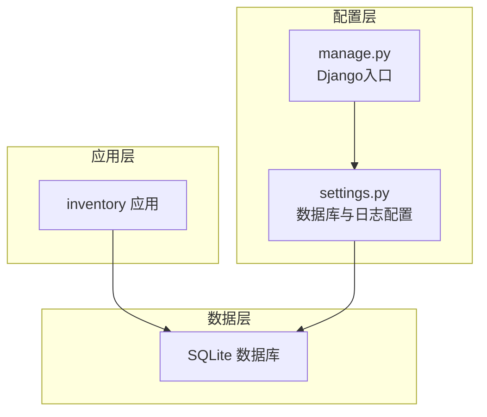
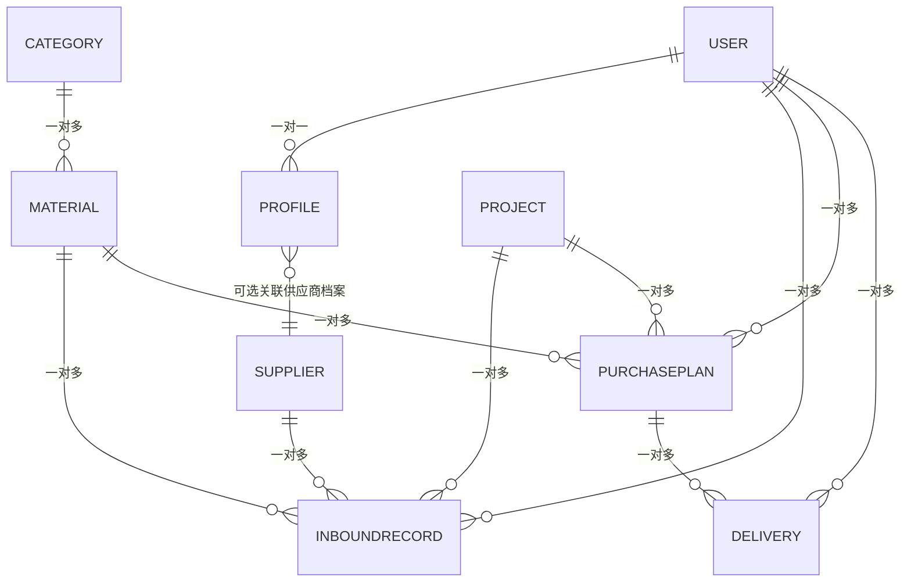
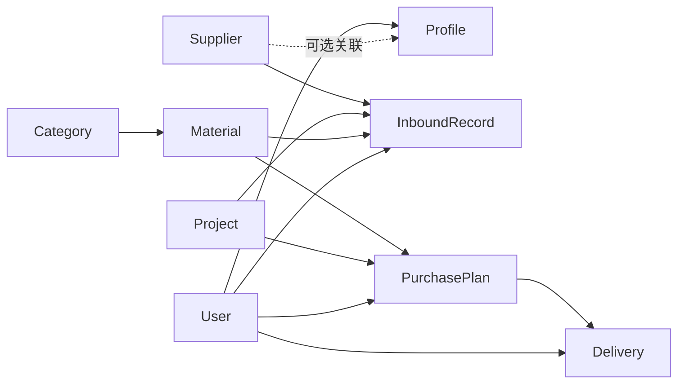

# 实体关系图

<cite>
**本文引用的文件**
- [inventory/models.py](file://inventory/models.py)
- [inventory/migrations/0001_initial.py](file://inventory/migrations/0001_initial.py)
- [inventory/migrations/0002_delete_purchaseplan.py](file://inventory/migrations/0002_delete_purchaseplan.py)
- [inventory/migrations/0003_alter_supplier_main_type.py](file://inventory/migrations/0003_alter_supplier_main_type.py)
- [inventory/migrations/0004_fix_supplier_main_type_data.py](file://inventory/migrations/0004_fix_supplier_main_type_data.py)
- [inventory/migrations/0005_delete_outboundrecord.py](file://inventory/migrations/0005_delete_outboundrecord.py)
- [inventory/migrations/0006_alter_inboundrecord_location_purchaseplan.py](file://inventory/migrations/0006_alter_inboundrecord_location_purchaseplan.py)
- [inventory/migrations/0007_alter_profile_role.py](file://inventory/migrations/0007_alter_profile_role.py)
- [inventory/migrations/0008_delivery.py](file://inventory/migrations/0008_delivery.py)
- [inventory/migrations/0009_inboundrecord_spec_alter_inboundrecord_location.py](file://inventory/migrations/0009_inboundrecord_spec_alter_inboundrecord_location.py)
- [inventory/migrations/0010_profile_supplier_info.py](file://inventory/migrations/0010_profile_supplier_info.py)
- [material_system/settings.py](file://material_system/settings.py)
- [manage.py](file://manage.py)
</cite>

## 目录
1. [简介](#简介)
2. [项目结构](#项目结构)
3. [核心组件](#核心组件)
4. [架构总览](#架构总览)
5. [详细组件分析](#详细组件分析)
6. [依赖分析](#依赖分析)
7. [性能考量](#性能考量)
8. [故障排查指南](#故障排查指南)
9. [结论](#结论)
10. [附录：数据库表结构与字段清单](#附录数据库表结构与字段清单)

## 简介
本文件面向材料管理系统，提供完整的实体关系图（ER）与数据库表结构设计说明。系统围绕9个核心模型构建，涵盖项目、材料、供应商、入库、采购计划、发货单、用户扩展信息、操作日志等。文档将：
- 绘制清晰的实体关系图，标注一对一、一对多、多对多关系及外键约束
- 逐表给出主键、外键、字段类型、长度、是否可空、默认值、注释
- 解释索引策略与完整性约束（唯一性、非空、检查）
- 总结数据库规范化设计（1NF、2NF、3NF）的满足情况
- 提供版本演进历史与迁移策略说明

## 项目结构
系统采用Django应用“inventory”组织业务模型与迁移；数据库默认使用SQLite，可通过环境变量切换。



图表来源
- [material_system/settings.py:122-130](file://material_system/settings.py#L122-L130)
- [manage.py:7-18](file://manage.py#L7-L18)

章节来源
- [material_system/settings.py:122-130](file://material_system/settings.py#L122-L130)
- [manage.py:7-18](file://manage.py#L7-L18)

## 核心组件
- 用户与扩展信息：User 与 Profile（一对一）
- 业务主数据：Category（分类）、Material（材料）、Supplier（供应商）、Project（项目）
- 业务单据与流水：InboundRecord（入库记录）、PurchasePlan（采购计划）、Delivery（发货单）
- 运行审计：OperationLog（操作日志）

章节来源
- [inventory/models.py:7-328](file://inventory/models.py#L7-L328)

## 架构总览
下图展示9个核心模型之间的关系，包含一对一、一对多与外键约束。



图表来源
- [inventory/models.py:15](file://inventory/models.py#L15)
- [inventory/models.py:101](file://inventory/models.py#L101)
- [inventory/models.py:188](file://inventory/models.py#L188)
- [inventory/models.py:210](file://inventory/models.py#L210)
- [inventory/models.py:248](file://inventory/models.py#L248)
- [inventory/models.py:285](file://inventory/models.py#L285)
- [inventory/models.py:222](file://inventory/models.py#L222)
- [inventory/models.py:256](file://inventory/models.py#L256)
- [inventory/models.py:294](file://inventory/models.py#L294)
- [inventory/models.py:18](file://inventory/models.py#L18)

## 详细组件分析

### 用户与扩展信息（Profile-User）
- 关系：一对一（OneToOne）
- 外键：Profile.user → User（级联删除）
- 可选扩展：Profile.supplier_info → Supplier（SET NULL）

```mermaid
classDiagram
class User {
+id
}
class Profile {
+id
+role
+phone
+supplier_info_id
}
class Supplier {
+id
+name
}
User ||--o{ Profile : "一对一"
Supplier ||--o{ Profile : "可选关联"
```

图表来源
- [inventory/models.py:15](file://inventory/models.py#L15)
- [inventory/models.py:18](file://inventory/models.py#L18)

章节来源
- [inventory/models.py:7-49](file://inventory/models.py#L7-L49)

### 工程项目（Project）
- 描述：工程项目的编号、名称、负责人、地点、预算、状态等
- 主键：id
- 约束：code 唯一

章节来源
- [inventory/models.py:51-72](file://inventory/models.py#L51-L72)

### 材料分类（Category）
- 描述：材料分类编号与名称
- 主键：id
- 约束：code 唯一

章节来源
- [inventory/models.py:78-90](file://inventory/models.py#L78-L90)

### 材料档案（Material）
- 描述：材料编号、名称、分类、规格、单位、标准价、安全库存等
- 主键：id
- 外键：category → Category（PROTECT）
- 约束：code 唯一

章节来源
- [inventory/models.py:92-116](file://inventory/models.py#L92-L116)

### 供应商（Supplier）
- 描述：供应商编号、名称、联系人、电话、地址、主营类型、信用等级、合作开始日期等
- 主键：id
- 外键：main_type → Category（SET NULL）
- 约束：code 唯一

章节来源
- [inventory/models.py:180-201](file://inventory/models.py#L180-L201)

### 入库记录（InboundRecord）
- 描述：入库单号、项目、材料、日期、数量、单价、总金额、供应商、批次号、验收人、质量状态、项目地址、规格、操作员、操作时间、备注
- 主键：id
- 外键：project → Project、material → Material、supplier → Supplier、operator → User（均PROTECT）
- 约束：no 唯一；quantity/unit_price/total_amount/amount 使用Decimal；location/spec 字段在后续迁移中调整

章节来源
- [inventory/models.py:206-233](file://inventory/models.py#L206-L233)

### 采购计划（PurchasePlan）
- 描述：计划编号、项目、材料、采购数量、预计单价、预计金额、状态、计划采购日期、备注、操作员、创建/更新时间
- 主键：id
- 外键：project → Project、material → Material、operator → User（PROTECT）
- 约束：no 唯一；amount/price 使用Decimal；状态枚举

章节来源
- [inventory/models.py:239-271](file://inventory/models.py#L239-L271)

### 发货单（Delivery）
- 描述：发货单号、采购计划、实际数量、实际单价、实际金额、送货方式、车牌号、运单号、二维码、状态、供应商、创建/发货时间、备注
- 主键：id
- 外键：purchase_plan → PurchasePlan（PROTECT）、supplier → User（PROTECT）
- 约束：no 唯一；amount/price 使用Decimal；状态枚举

章节来源
- [inventory/models.py:273-310](file://inventory/models.py#L273-L310)

### 操作日志（OperationLog）
- 描述：操作时间、操作员、模块、操作类型、详情、关联单号
- 主键：id
- 约束：op_type 枚举

章节来源
- [inventory/models.py:312-328](file://inventory/models.py#L312-L328)

## 依赖分析
- 模型间依赖链路清晰，主要通过外键约束实现一对多关系
- Profile 与 User 的一对一关系确保用户扩展信息的独立维护
- Supplier 的主营类型从文本迁移到 Category 外键，提升数据一致性



图表来源
- [inventory/models.py:15](file://inventory/models.py#L15)
- [inventory/models.py:101](file://inventory/models.py#L101)
- [inventory/models.py:188](file://inventory/models.py#L188)
- [inventory/models.py:210](file://inventory/models.py#L210)
- [inventory/models.py:248](file://inventory/models.py#L248)
- [inventory/models.py:285](file://inventory/models.py#L285)
- [inventory/models.py:222](file://inventory/models.py#L222)
- [inventory/models.py:256](file://inventory/models.py#L256)
- [inventory/models.py:294](file://inventory/models.py#L294)
- [inventory/models.py:18](file://inventory/models.py#L18)

## 性能考量
- 数值精度：所有金额与数量统一使用Decimal，避免浮点误差
- 索引建议：
  - 主键自动建立索引（BigAutoField）
  - 外键字段建议建立索引（如 project_id、material_id、supplier_id、operator_id）
  - 高频查询字段（如 code、no、status、date）建立复合索引优化排序与过滤
- 查询优化：聚合统计（如求和、平均）通过数据库层面完成，减少Python侧计算

## 故障排查指南
- 数据库版本兼容性：系统针对SQLite版本问题做了兼容处理，若遇到查询参数上限问题，可参考设置中的补丁逻辑
- 日志配置：应用日志与错误日志分别落盘，便于定位问题
- 迁移执行：如出现外键约束冲突，需先执行数据迁移脚本（如将文本主营类型转换为Category外键）

章节来源
- [material_system/settings.py:14-62](file://material_system/settings.py#L14-L62)
- [material_system/settings.py:149-203](file://material_system/settings.py#L149-L203)

## 结论
该系统通过清晰的ER设计与严格的外键约束，实现了材料管理的核心业务闭环。模型遵循规范化设计，字段类型与约束明确，配合迁移机制保障了历史数据的平滑演进。建议在生产环境中为高频查询字段补充索引，并结合业务场景持续优化查询路径与缓存策略。

## 附录：数据库表结构与字段清单

### 表：Category（材料分类）
- 字段
  - id：主键（BigAutoField）
  - code：字符串（唯一）
  - name：字符串
  - remark：文本（可空）
- 约束
  - 唯一性：code
- 索引
  - 主键索引（自动生成）
  - 唯一索引：code

章节来源
- [inventory/models.py:78-90](file://inventory/models.py#L78-L90)
- [inventory/migrations/0001_initial.py:18-29](file://inventory/migrations/0001_initial.py#L18-L29)

### 表：Project（工程项目）
- 字段
  - id：主键（BigAutoField）
  - code：字符串（唯一）
  - name：字符串
  - manager：字符串（可空）
  - location：字符串（可空）
  - start_date：日期（可空）
  - end_date：日期（可空）
  - budget：十进制数（小数位2）
  - status：枚举（默认active）
  - remark：文本（可空）
  - created_at：时间戳（自动添加）
- 约束
  - 唯一性：code
- 索引
  - 主键索引
  - 唯一索引：code

章节来源
- [inventory/models.py:51-72](file://inventory/models.py#L51-L72)
- [inventory/migrations/0001_initial.py:48-67](file://inventory/migrations/0001_initial.py#L48-L67)

### 表：Material（材料档案）
- 字段
  - id：主键（BigAutoField）
  - code：字符串（唯一）
  - name：字符串
  - category_id：外键 → Category（PROTECT）
  - spec：字符串（可空）
  - unit：枚举
  - standard_price：十进制数（小数位2，默认0）
  - safety_stock：十进制数（小数位2，默认0）
  - remark：文本（可空）
  - created_at：时间戳（自动添加）
- 约束
  - 唯一性：code
  - 外键：category_id → Category（PROTECT）
- 索引
  - 主键索引
  - 唯一索引：code
  - 外键索引：category_id

章节来源
- [inventory/models.py:92-116](file://inventory/models.py#L92-L116)
- [inventory/migrations/0001_initial.py:89-108](file://inventory/migrations/0001_initial.py#L89-L108)

### 表：Supplier（供应商）
- 字段
  - id：主键（BigAutoField）
  - code：字符串（唯一）
  - name：字符串
  - contact：字符串（可空）
  - phone：字符串（可空）
  - address：字符串（可空）
  - main_type_id：外键 → Category（SET NULL）
  - credit_rating：枚举（默认good）
  - start_date：日期（可空）
  - remark：文本（可空）
  - created_at：时间戳（自动添加）
- 约束
  - 唯一性：code
  - 外键：main_type_id → Category（SET NULL）
- 索引
  - 主键索引
  - 唯一索引：code
  - 外键索引：main_type_id

章节来源
- [inventory/models.py:180-201](file://inventory/models.py#L180-L201)
- [inventory/migrations/0001_initial.py:69-88](file://inventory/migrations/0001_initial.py#L69-L88)
- [inventory/migrations/0003_alter_supplier_main_type.py:14-18](file://inventory/migrations/0003_alter_supplier_main_type.py#L14-L18)

### 表：InboundRecord（入库记录）
- 字段
  - id：主键（BigAutoField）
  - no：字符串（唯一）
  - project_id：外键 → Project（PROTECT）
  - material_id：外键 → Material（PROTECT）
  - date：日期
  - quantity：十进制数（小数位2）
  - unit_price：十进制数（小数位2）
  - total_amount：十进制数（小数位2）
  - supplier_id：外键 → Supplier（PROTECT）
  - batch_no：字符串（可空）
  - inspector：字符串（可空）
  - quality_status：枚举（默认qualified）
  - location：字符串（可空）
  - spec：字符串（可空）
  - operator_id：外键 → User（PROTECT）
  - operate_time：时间戳（自动添加）
  - remark：文本（可空）
- 约束
  - 唯一性：no
  - 外键：project_id → Project、material_id → Material、supplier_id → Supplier、operator_id → User（均PROTECT）
- 索引
  - 主键索引
  - 唯一索引：no
  - 外键索引：project_id、material_id、supplier_id、operator_id

章节来源
- [inventory/models.py:206-233](file://inventory/models.py#L206-L233)
- [inventory/migrations/0001_initial.py:172-196](file://inventory/migrations/0001_initial.py#L172-L196)
- [inventory/migrations/0009_inboundrecord_spec_alter_inboundrecord_location.py:13-24](file://inventory/migrations/0009_inboundrecord_spec_alter_inboundrecord_location.py#L13-L24)

### 表：PurchasePlan（采购计划）
- 字段
  - id：主键（BigAutoField）
  - no：字符串（唯一）
  - project_id：外键 → Project（PROTECT）
  - material_id：外键 → Material（PROTECT）
  - quantity：十进制数（小数位2）
  - unit_price：十进制数（小数位2，默认0）
  - total_amount：十进制数（小数位2，默认0）
  - status：枚举（默认pending）
  - planned_date：日期（可空）
  - remark：文本（可空）
  - operator_id：外键 → User（PROTECT）
  - create_time：时间戳（自动添加）
  - update_time：时间戳（自动添加）
- 约束
  - 唯一性：no
  - 外键：project_id → Project、material_id → Material、operator_id → User（PROTECT）
- 索引
  - 主键索引
  - 唯一索引：no
  - 外键索引：project_id、material_id、operator_id

章节来源
- [inventory/models.py:239-271](file://inventory/models.py#L239-L271)
- [inventory/migrations/0006_alter_inboundrecord_location_purchaseplan.py:22-44](file://inventory/migrations/0006_alter_inboundrecord_location_purchaseplan.py#L22-L44)

### 表：Delivery（发货单）
- 字段
  - id：主键（BigAutoField）
  - no：字符串（唯一）
  - purchase_plan_id：外键 → PurchasePlan（PROTECT）
  - actual_quantity：十进制数（小数位2）
  - actual_unit_price：十进制数（小数位2）
  - actual_total_amount：十进制数（小数位2，默认0）
  - shipping_method：枚举（默认special）
  - plate_number：字符串（可空）
  - tracking_no：字符串（可空）
  - qr_code：图片（可空）
  - status：枚举（默认pending）
  - supplier_id：外键 → User（PROTECT）
  - create_time：时间戳（自动添加）
  - ship_time：时间戳（可空）
  - remark：文本（可空）
- 约束
  - 唯一性：no
  - 外键：purchase_plan_id → PurchasePlan、supplier_id → User（PROTECT）
- 索引
  - 主键索引
  - 唯一索引：no
  - 外键索引：purchase_plan_id、supplier_id

章节来源
- [inventory/models.py:273-310](file://inventory/models.py#L273-L310)
- [inventory/migrations/0008_delivery.py:17-42](file://inventory/migrations/0008_delivery.py#L17-L42)

### 表：Profile（用户扩展信息）
- 字段
  - id：主键（BigAutoField）
  - role：枚举（默认clerk）
  - phone：字符串（可空）
  - user_id：外键 → User（CASCADE）
  - supplier_info_id：外键 → Supplier（SET NULL）
- 约束
  - 外键：user_id → User（CASCADE）、supplier_info_id → Supplier（SET NULL）
- 索引
  - 主键索引
  - 外键索引：user_id、supplier_info_id

章节来源
- [inventory/models.py:7-49](file://inventory/models.py#L7-L49)
- [inventory/migrations/0001_initial.py:110-121](file://inventory/migrations/0001_initial.py#L110-L121)
- [inventory/migrations/0007_alter_profile_role.py:13-17](file://inventory/migrations/0007_alter_profile_role.py#L13-L17)
- [inventory/migrations/0010_profile_supplier_info.py:14-19](file://inventory/migrations/0010_profile_supplier_info.py#L14-L19)

### 表：OperationLog（操作日志）
- 字段
  - id：主键（BigAutoField）
  - time：时间戳（自动添加）
  - operator：字符串
  - module：字符串
  - op_type：枚举
  - details：文本
  - related_no：字符串（可空）
- 约束
  - 无显式唯一性约束
- 索引
  - 主键索引
  - 排序索引：time（由ordering定义）

章节来源
- [inventory/models.py:312-328](file://inventory/models.py#L312-L328)
- [inventory/migrations/0001_initial.py:31-46](file://inventory/migrations/0001_initial.py#L31-L46)

## 数据库版本演进历史与迁移策略

- 初始版本（0001_initial）
  - 创建 Category、Project、Supplier、Material、Profile、OutboundRecord、PurchasePlan、InboundRecord、OperationLog
  - OutboundRecord 于后续版本被删除
- 删除 OutboundRecord（0005_delete_outboundrecord）
  - 业务调整：移除出库记录模型
- 供应商主营类型外键化（0003/0004）
  - 将 Supplier.main_type 从文本改为 Category 外键，并迁移历史数据
- 出入库模型字段演进（0006/0009）
  - InboundRecord：location 改为项目地址、新增 spec 字段
  - 重新创建 PurchasePlan 并引入 operator 外键
- 角色与供应商关联增强（0007/0010）
  - Profile.role 新增枚举项，新增 supplier_info 外键用于供应商用户关联
- 发货单模型（0008）
  - 新增 Delivery 模型，支持实际发货数量、单价、金额与二维码

章节来源
- [inventory/migrations/0001_initial.py:16-197](file://inventory/migrations/0001_initial.py#L16-L197)
- [inventory/migrations/0002_delete_purchaseplan.py:12-16](file://inventory/migrations/0002_delete_purchaseplan.py#L12-L16)
- [inventory/migrations/0003_alter_supplier_main_type.py:14-18](file://inventory/migrations/0003_alter_supplier_main_type.py#L14-L18)
- [inventory/migrations/0004_fix_supplier_main_type_data.py:6-51](file://inventory/migrations/0004_fix_supplier_main_type_data.py#L6-L51)
- [inventory/migrations/0005_delete_outboundrecord.py:12-16](file://inventory/migrations/0005_delete_outboundrecord.py#L12-L16)
- [inventory/migrations/0006_alter_inboundrecord_location_purchaseplan.py:17-45](file://inventory/migrations/0006_alter_inboundrecord_location_purchaseplan.py#L17-L45)
- [inventory/migrations/0007_alter_profile_role.py:13-17](file://inventory/migrations/0007_alter_profile_role.py#L13-L17)
- [inventory/migrations/0008_delivery.py:16-42](file://inventory/migrations/0008_delivery.py#L16-L42)
- [inventory/migrations/0009_inboundrecord_spec_alter_inboundrecord_location.py:12-24](file://inventory/migrations/0009_inboundrecord_spec_alter_inboundrecord_location.py#L12-L24)
- [inventory/migrations/0010_profile_supplier_info.py:13-19](file://inventory/migrations/0010_profile_supplier_info.py#L13-L19)