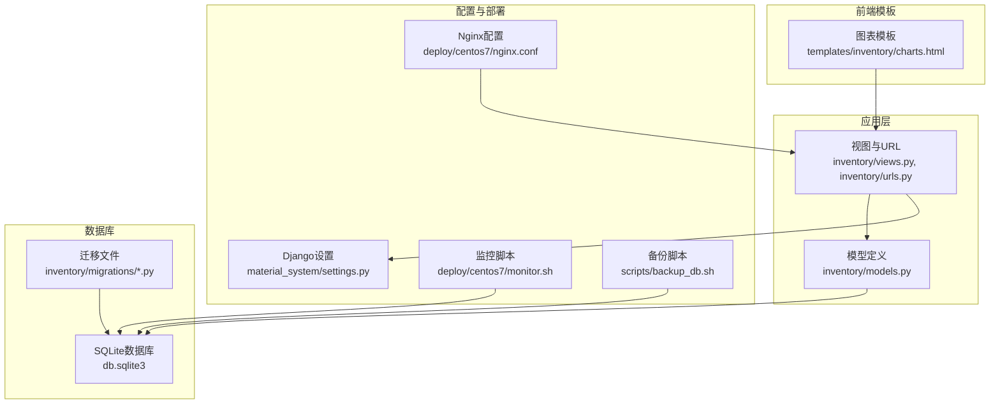
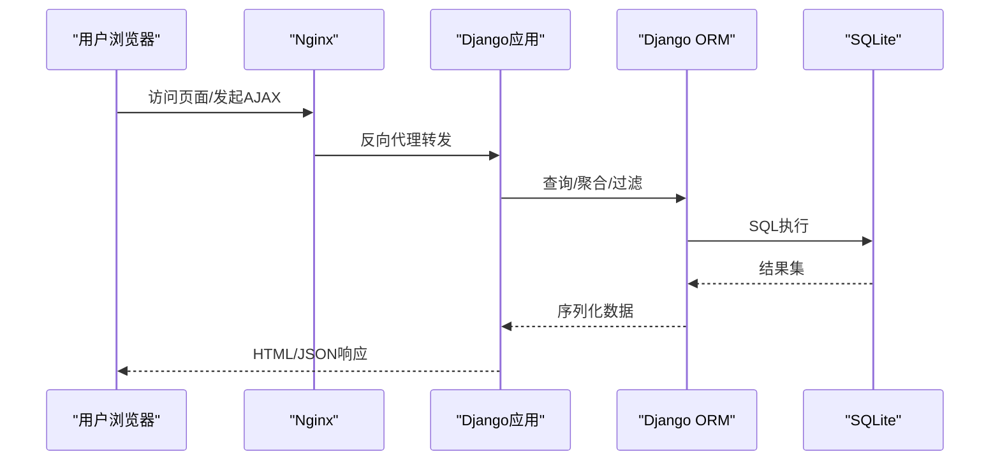
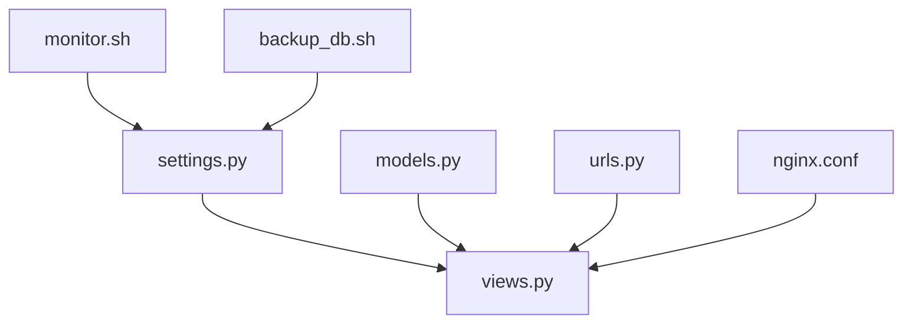

# 性能优化策略

<cite>
**本文引用的文件**
- [settings.py](file://material_system/settings.py)
- [models.py](file://inventory/models.py)
- [views.py](file://inventory/views.py)
- [urls.py](file://inventory/urls.py)
- [0001_initial.py](file://inventory/migrations/0001_initial.py)
- [backup_db.sh](file://scripts/backup_db.sh)
- [monitor.sh](file://deploy/centos7/monitor.sh)
- [nginx.conf](file://deploy/centos7/nginx.conf)
- [charts.html](file://templates/inventory/charts.html)
- [generate_test_data.py](file://generate_test_data.py)
</cite>

## 目录
1. [简介](#简介)
2. [项目结构](#项目结构)
3. [核心组件](#核心组件)
4. [架构概览](#架构概览)
5. [详细组件分析](#详细组件分析)
6. [依赖分析](#依赖分析)
7. [性能考量](#性能考量)
8. [故障排查指南](#故障排查指南)
9. [结论](#结论)
10. [附录](#附录)

## 简介
本文件面向材料管理系统的数据库与应用层性能优化，结合现有代码库现状，提出索引设计策略、查询优化技术、数据访问模式优化、分页与排序优化、连接池与事务管理建议、慢查询分析与监控方法、数据归档与备份恢复策略，并给出可落地的SQL优化案例与性能测试思路。系统当前采用Django+SQLite方案，部署于CentOS环境并通过Nginx反向代理，具备基础的日志与监控能力。

## 项目结构
系统采用Django应用“inventory”承载业务模型与视图，数据库配置位于settings中，迁移文件定义了初始表结构；部署侧通过Nginx与监控脚本保障运行稳定性。

**图表来源**
- [settings.py:122-130](file://material_system/settings.py#L122-L130)
- [models.py:1-328](file://inventory/models.py#L1-L328)
- [views.py:1-120](file://inventory/views.py#L1-L120)
- [urls.py:1-80](file://inventory/urls.py#L1-L80)
- [0001_initial.py:1-198](file://inventory/migrations/0001_initial.py#L1-L198)
- [nginx.conf:1-43](file://deploy/centos7/nginx.conf#L1-L43)
- [monitor.sh:1-232](file://deploy/centos7/monitor.sh#L1-L232)
- [backup_db.sh:1-57](file://scripts/backup_db.sh#L1-L57)
- [charts.html:120-177](file://templates/inventory/charts.html#L120-L177)

**章节来源**
- [settings.py:122-130](file://material_system/settings.py#L122-L130)
- [models.py:1-328](file://inventory/models.py#L1-L328)
- [views.py:1-120](file://inventory/views.py#L1-L120)
- [urls.py:1-80](file://inventory/urls.py#L1-L80)
- [0001_initial.py:1-198](file://inventory/migrations/0001_initial.py#L1-L198)
- [nginx.conf:1-43](file://deploy/centos7/nginx.conf#L1-L43)
- [monitor.sh:1-232](file://deploy/centos7/monitor.sh#L1-L232)
- [backup_db.sh:1-57](file://scripts/backup_db.sh#L1-L57)
- [charts.html:120-177](file://templates/inventory/charts.html#L120-L177)

## 核心组件
- 数据库与ORM配置：默认使用SQLite，支持通过环境变量切换引擎与数据库路径；内置SQLite版本兼容性修复逻辑，提升参数绑定上限。
- 模型层：包含项目、材料、供应商、入库记录、采购计划、发货单、操作日志等核心实体，多数字段具备选择项与默认值，便于快速查询与展示。
- 视图层：提供列表、筛选、导出、图表、报表等功能，广泛使用select_related减少N+1查询；部分聚合计算在模型方法中实现，便于复用。
- 部署与监控：Nginx负责静态资源与反向代理；监控脚本检查服务、端口、数据库、磁盘、内存、CPU与HTTP响应；备份脚本提供定时备份与清理。

**章节来源**
- [settings.py:122-130](file://material_system/settings.py#L122-L130)
- [models.py:51-328](file://inventory/models.py#L51-L328)
- [views.py:147-158](file://inventory/views.py#L147-L158)
- [monitor.sh:32-129](file://deploy/centos7/monitor.sh#L32-L129)
- [backup_db.sh:1-57](file://scripts/backup_db.sh#L1-L57)

## 架构概览
系统采用前后端分离的Web架构，前端模板渲染与AJAX请求并存，图表数据通过API接口加载；数据库为本地SQLite文件，通过Django ORM访问。

**图表来源**
- [nginx.conf:33-43](file://deploy/centos7/nginx.conf#L33-L43)
- [views.py:147-158](file://inventory/views.py#L147-L158)
- [models.py:117-142](file://inventory/models.py#L117-L142)

## 详细组件分析

### 数据库索引设计策略
- 主键索引：Django默认为每个模型生成自增主键，无需额外索引；确保主键字段唯一且不可空。
- 外键索引：外键字段通常需要索引以加速JOIN与约束检查。建议为以下字段建立索引：
  - InboundRecord.project/material/supplier/operator
  - PurchasePlan.project/material/operator
  - Delivery.purchase_plan/supplier
  - Material.category
  - Supplier.main_type
  - Project.code/status
  - Category.code
- 复合索引：针对高频组合查询建立复合索引，例如：
  - InboundRecord.date + project_id
  - InboundRecord.material_id + date
  - PurchasePlan.status + create_time
  - Delivery.status + create_time
- 全文索引：SQLite不支持原生全文索引，可通过虚拟表FTS5或应用侧检索策略（如模糊匹配、前缀匹配）替代；对于搜索场景，建议在code/name/spec等字段上建立索引并配合LIKE/前缀匹配。

**章节来源**
- [models.py:100-224](file://inventory/models.py#L100-L224)
- [models.py:248-309](file://inventory/models.py#L248-L309)
- [0001_initial.py:172-196](file://inventory/migrations/0001_initial.py#L172-L196)

### 查询性能优化技术
- WHERE条件优化
  - 使用精确匹配字段（如unique code）替代模糊匹配，必要时使用前缀匹配。
  - 对日期范围查询，优先使用边界明确的日期字段（如date），避免在WHERE中对列进行函数运算。
- JOIN操作优化
  - 视图中广泛使用select_related减少N+1查询，建议保持该实践；对多层关联可考虑prefetch_related。
  - 对于大表JOIN，确保连接字段具备索引。
- 子查询优化
  - 将子查询改写为JOIN或EXISTS，避免在WHERE中使用不可索引的表达式。
  - 对聚合结果缓存到模型属性或视图上下文，减少重复计算。

**章节来源**
- [views.py:147-158](file://inventory/views.py#L147-L158)
- [views.py:367-398](file://inventory/views.py#L367-L398)
- [views.py:619-649](file://inventory/views.py#L619-L649)

### 数据访问模式优化
- 常用查询缓存策略
  - 对于不变或低频变更的数据（如分类、单位、状态枚举），可在视图层缓存查询结果，减少数据库压力。
  - 对于报表类聚合查询（按项目/供应商/日期统计），可引入Redis缓存热点数据，设置合理TTL。
- 批量操作实现
  - 导入/批量插入：使用bulk_create（注意不触发save信号与auto_now_add/auto_now）。
  - 批量更新：使用bulk_update，避免逐条save。
  - 批量删除：使用filter().delete()，避免循环删除。

**章节来源**
- [views.py:709-780](file://inventory/views.py#L709-L780)
- [generate_test_data.py:115-170](file://generate_test_data.py#L115-L170)

### 大数据量场景下的分页与排序优化
- 分页优化
  - 使用order_by + limit/offset，确保排序字段具备索引；对超大偏移量场景，建议使用基于游标的分页（基于最后一条记录的主键）。
  - 列表页默认限制每页数量，避免一次性返回过多数据。
- 排序优化
  - 对高频排序字段（如create_time/date）建立索引；避免在ORDER BY中对列进行函数运算。
  - 对多字段排序，优先使用复合索引覆盖常见排序组合。

**章节来源**
- [views.py:147-158](file://inventory/views.py#L147-L158)
- [views.py:619-649](file://inventory/views.py#L619-L649)

### 数据库连接池与事务管理策略
- 连接池
  - SQLite默认无连接池，建议在生产环境迁移到PostgreSQL/MySQL并启用连接池（如pgBouncer/ProxySQL）。
  - 若坚持使用SQLite，可通过Django的数据库连接参数控制超时与并发，但需谨慎评估并发场景。
- 事务管理
  - 对批量写入与跨表一致性操作使用事务包裹，失败回滚。
  - 避免长事务占用锁，及时提交或分段提交。

**章节来源**
- [settings.py:122-130](file://material_system/settings.py#L122-L130)

### 慢查询分析与性能监控
- 慢查询分析
  - 开启Django SQL日志，定位慢查询语句；结合EXPLAIN/EXPLAIN QUERY PLAN分析执行计划。
  - 对聚合与复杂JOIN查询，拆分为多个简单查询或引入物化视图/中间表。
- 性能监控
  - 监控脚本定期检查服务状态、端口监听、数据库文件、磁盘/内存/CPU使用与HTTP响应。
  - Nginx配置设置合理的超时与缓存头，减轻后端压力。

**章节来源**
- [monitor.sh:32-129](file://deploy/centos7/monitor.sh#L32-L129)
- [nginx.conf:19-43](file://deploy/centos7/nginx.conf#L19-L43)

### 数据归档与清理策略
- 归档策略
  - 将历史数据（如入库记录）按时间分区或移动到归档表/库，保留最近N年的活跃数据在主表。
  - 归档后保留必要的索引以支撑必要查询（如按项目/材料统计）。
- 清理策略
  - 定期清理无效/过期数据（如已删除项目的关联记录），避免碎片化。
  - 对大字段（如备注）可考虑压缩存储或外部化。

**章节来源**
- [models.py:206-224](file://inventory/models.py#L206-L224)
- [models.py:239-270](file://inventory/models.py#L239-L270)

### 数据库备份与恢复的性能考虑
- 备份策略
  - 使用文件级复制（cp）进行备份，避免锁表影响；备份完成后可选择压缩。
  - 设置保留周期（如30天），定期清理旧备份，控制存储占用。
- 恢复策略
  - 恢复前先验证备份文件完整性；在低峰时段执行恢复，避免影响线上服务。
  - 恢复后进行健康检查与关键查询验证。

**章节来源**
- [backup_db.sh:1-57](file://scripts/backup_db.sh#L1-L57)

### SQL查询优化案例与性能测试
- 案例1：按项目统计采购成本
  - 优化前：在视图中对大量记录进行循环聚合，导致O(n)开销。
  - 优化后：使用聚合函数一次性计算，减少Python层循环。
  - 参考路径：[report_project_cost:970-1056](file://inventory/views.py#L970-L1056)
- 案例2：图表数据按材料/分类聚合
  - 优化前：逐条遍历材料/分类计算库存价值。
  - 优化后：使用聚合查询与切片限制返回数量，降低前端渲染压力。
  - 参考路径：[chart_data_api:1223-1254](file://inventory/views.py#L1223-L1254)
- 案例3：批量导入测试数据
  - 使用批量创建减少往返次数，提高导入效率。
  - 参考路径：[generate_test_data:115-170](file://generate_test_data.py#L115-L170)

**章节来源**
- [views.py:970-1056](file://inventory/views.py#L970-L1056)
- [views.py:1223-1254](file://inventory/views.py#L1223-L1254)
- [generate_test_data.py:115-170](file://generate_test_data.py#L115-L170)

## 依赖分析
系统主要依赖关系如下：

**图表来源**
- [settings.py:122-130](file://material_system/settings.py#L122-L130)
- [models.py:1-328](file://inventory/models.py#L1-L328)
- [views.py:1-120](file://inventory/views.py#L1-L120)
- [urls.py:1-80](file://inventory/urls.py#L1-L80)
- [nginx.conf:1-43](file://deploy/centos7/nginx.conf#L1-L43)
- [monitor.sh:1-232](file://deploy/centos7/monitor.sh#L1-L232)
- [backup_db.sh:1-57](file://scripts/backup_db.sh#L1-L57)

**章节来源**
- [settings.py:122-130](file://material_system/settings.py#L122-L130)
- [models.py:1-328](file://inventory/models.py#L1-L328)
- [views.py:1-120](file://inventory/views.py#L1-L120)
- [urls.py:1-80](file://inventory/urls.py#L1-L80)
- [nginx.conf:1-43](file://deploy/centos7/nginx.conf#L1-L43)
- [monitor.sh:1-232](file://deploy/centos7/monitor.sh#L1-L232)
- [backup_db.sh:1-57](file://scripts/backup_db.sh#L1-L57)

## 性能考量
- 索引覆盖率：确保高频查询字段（如code、date、外键）具备索引；复合索引覆盖常见WHERE与ORDER BY组合。
- 查询简化：尽量使用ORM聚合与原生SQL优化热点查询；避免在WHERE中对列做函数运算。
- 缓存与分页：对报表与图表数据引入缓存；对列表页使用游标分页降低偏移量带来的性能损耗。
- 连接与事务：在SQLite环境下谨慎并发；生产环境建议迁移到支持连接池的数据库并合理设置事务隔离级别。
- 监控与备份：持续监控资源使用与数据库健康；定期备份并验证恢复流程。

## 故障排查指南
- 数据库文件异常
  - 检查数据库文件是否存在且非空；若损坏，使用备份恢复。
  - 参考路径：[monitor.sh:57-67](file://deploy/centos7/monitor.sh#L57-L67)
- 磁盘空间不足
  - 监控磁盘使用率，清理旧备份与临时文件。
  - 参考路径：[monitor.sh:70-82](file://deploy/centos7/monitor.sh#L70-L82)
- 服务无响应
  - 检查端口监听与HTTP响应；必要时重启服务。
  - 参考路径：[monitor.sh:116-129](file://deploy/centos7/monitor.sh#L116-L129)
- 备份失败或过大
  - 检查备份脚本执行日志与保留策略；调整压缩与清理周期。
  - 参考路径：[backup_db.sh:32-56](file://scripts/backup_db.sh#L32-L56)

**章节来源**
- [monitor.sh:57-67](file://deploy/centos7/monitor.sh#L57-L67)
- [monitor.sh:70-82](file://deploy/centos7/monitor.sh#L70-L82)
- [monitor.sh:116-129](file://deploy/centos7/monitor.sh#L116-L129)
- [backup_db.sh:32-56](file://scripts/backup_db.sh#L32-L56)

## 结论
本优化策略围绕索引设计、查询优化、访问模式、分页排序、连接池与事务、监控与备份等方面展开，结合系统当前Django+SQLite架构与部署现状，提出可落地的改进措施。建议优先实施索引补全、查询简化与缓存引入，逐步过渡到更合适的数据库与连接池方案，以满足未来业务增长的性能需求。

## 附录
- 关键模型字段与索引建议
  - Project: code, status
  - Material: code, category
  - Supplier: code, main_type
  - InboundRecord: project, material, supplier, operator, date
  - PurchasePlan: project, material, operator, status, create_time
  - Delivery: purchase_plan, supplier, status, create_time
- 关键视图与查询路径
  - [dashboard:147-158](file://inventory/views.py#L147-L158)
  - [inbound_list:619-649](file://inventory/views.py#L619-L649)
  - [report_project_cost:970-1056](file://inventory/views.py#L970-L1056)
  - [chart_data_api:1223-1254](file://inventory/views.py#L1223-L1254)