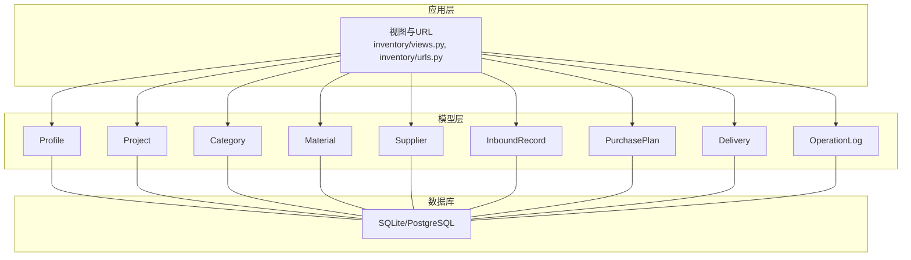
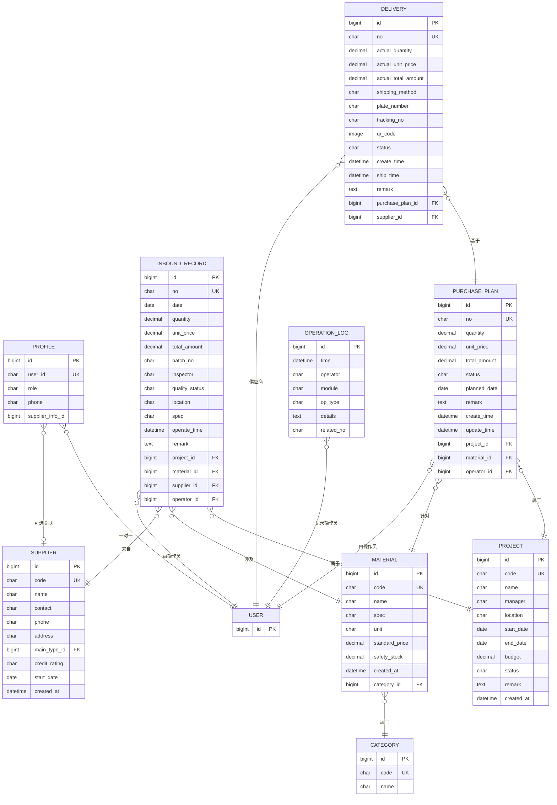
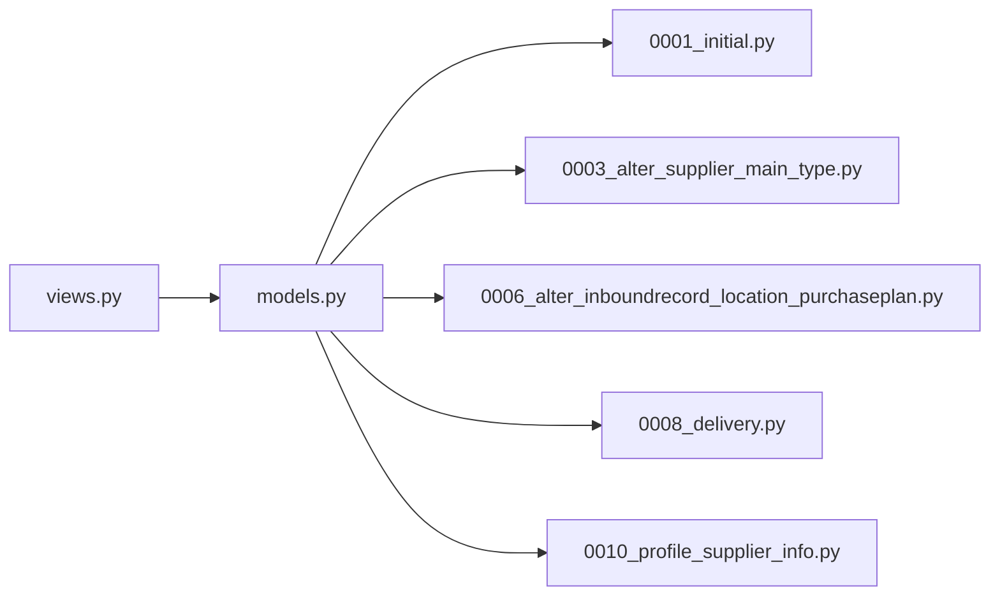

# 数据库设计

<cite>
**本文引用的文件**
- [models.py](file://inventory/models.py)
- [0001_initial.py](file://inventory/migrations/0001_initial.py)
- [0003_alter_supplier_main_type.py](file://inventory/migrations/0003_alter_supplier_main_type.py)
- [0006_alter_inboundrecord_location_purchaseplan.py](file://inventory/migrations/0006_alter_inboundrecord_location_purchaseplan.py)
- [0008_delivery.py](file://inventory/migrations/0008_delivery.py)
- [0010_profile_supplier_info.py](file://inventory/migrations/0010_profile_supplier_info.py)
- [settings.py](file://material_system/settings.py)
- [views.py](file://inventory/views.py)
- [urls.py](file://inventory/urls.py)
- [generate_test_data.py](file://generate_test_data.py)
</cite>

## 目录
1. [简介](#简介)
2. [项目结构](#项目结构)
3. [核心组件](#核心组件)
4. [架构总览](#架构总览)
5. [详细组件分析](#详细组件分析)
6. [依赖分析](#依赖分析)
7. [性能考量](#性能考量)
8. [故障排查指南](#故障排查指南)
9. [结论](#结论)
10. [附录](#附录)

## 简介
本文件为“材料管理系统”的数据库设计文档，聚焦于9个核心数据模型：Profile、Project、Material、Supplier、InboundRecord、PurchasePlan、Delivery、OperationLog，并补充一个未在当前模型中出现但与业务密切相关的 Category（材料分类）。文档涵盖实体关系、字段定义、约束、索引策略、数据验证与业务规则、数据访问模式、性能与安全、以及数据生命周期管理。

## 项目结构
系统采用Django框架，数据库默认使用SQLite（可通过环境变量切换），所有模型位于 inventory 应用下，迁移文件记录了演进过程。前端模板与视图负责数据访问与业务流程编排。

**图表来源**
- [views.py:21-24](file://inventory/views.py#L21-L24)
- [models.py:7-328](file://inventory/models.py#L7-L328)

**章节来源**
- [settings.py:122-130](file://material_system/settings.py#L122-L130)
- [urls.py:1-80](file://inventory/urls.py#L1-L80)

## 核心组件
本节概述9个核心模型的职责与关键字段，便于快速建立整体认知。

- Profile：用户扩展信息，支持角色（管理员、物资部、材料员、供应商），一对一关联Django内置User，可关联Supplier。
- Project：工程项目，包含项目编号、名称、负责人、地点、工期、预算、状态、备注及创建时间。
- Category：材料分类，用于Material的分组。
- Material：材料档案，包含编号、名称、分类、规格、单位、标准单价、安全库存、备注与创建时间；提供库存统计与加权平均成本计算。
- Supplier：供应商，包含编号、名称、联系人、电话、地址、主营材料类型（Category）、信用等级、合作开始日期、备注与创建时间；提供采购总额统计。
- InboundRecord：入库记录，包含入库单号、所属项目、材料、入库日期、数量、单价、总金额、供应商、批次号、验收人、质量状态、项目地址、规格、操作员、操作时间、备注；保存时自动计算总金额。
- PurchasePlan：采购计划，包含计划编号、所属项目、材料、采购数量、预计单价、预计金额、状态、计划采购日期、备注、操作员、创建/更新时间；保存时自动计算预计金额。
- Delivery：发货单，包含发货单号、关联采购计划、实际发货数量/单价/金额、送货方式、车牌号、运单号、二维码、状态、供应商（User）、创建/发货时间、备注；保存时自动计算实际金额。
- OperationLog：操作日志，记录操作时间、操作员、模块、操作类型、详情与关联单号。

**章节来源**
- [models.py:7-328](file://inventory/models.py#L7-L328)

## 架构总览
下图展示9个核心模型之间的实体关系，标注主键、外键与关系基数。

**图表来源**
- [models.py:7-328](file://inventory/models.py#L7-L328)
- [0001_initial.py:17-196](file://inventory/migrations/0001_initial.py#L17-L196)
- [0006_alter_inboundrecord_location_purchaseplan.py:22-44](file://inventory/migrations/0006_alter_inboundrecord_location_purchaseplan.py#L22-L44)
- [0008_delivery.py:17-41](file://inventory/migrations/0008_delivery.py#L17-L41)
- [0010_profile_supplier_info.py:14-18](file://inventory/migrations/0010_profile_supplier_info.py#L14-L18)

## 详细组件分析

### Profile（用户扩展）
- 角色枚举：admin、material_dept、clerk、supplier
- 一对一关联Django User，related_name为profile
- 可选关联Supplier，related_name为user_profiles
- 属性方法：display_name、is_admin、is_material_dept、is_clerk、is_supplier

**章节来源**
- [models.py:7-49](file://inventory/models.py#L7-L49)
- [0010_profile_supplier_info.py:14-18](file://inventory/migrations/0010_profile_supplier_info.py#L14-L18)

### Project（工程项目）
- 唯一标识：code
- 状态枚举：active、completed、paused
- 计算属性：get_total_inbound_amount（聚合入库总金额）

**章节来源**
- [models.py:51-75](file://inventory/models.py#L51-L75)

### Category（材料分类）
- 唯一标识：code
- 与Material一对多关系（Material.category）

**章节来源**
- [models.py:78-89](file://inventory/models.py#L78-L89)

### Material（材料档案）
- 唯一标识：code
- 单位枚举：吨、千克、立方米、平方米、米、根、个、套、箱、袋、卷、块、张、件
- 关键方法：
  - get_current_stock：按项目/日期范围统计入库总量
  - get_weighted_avg_cost：按项目/日期范围计算加权平均单价
  - get_stock_status：基于安全库存的状态判定
- 外键：category（PROTECT）

**章节来源**
- [models.py:92-178](file://inventory/models.py#L92-L178)

### Supplier（供应商）
- 唯一标识：code
- 信用等级枚举：excellent、good、average
- 外键：main_type（Category，SET_NULL）
- 方法：get_total_purchase（聚合入库总金额）

**章节来源**
- [models.py:180-204](file://inventory/models.py#L180-L204)
- [0003_alter_supplier_main_type.py:14-18](file://inventory/migrations/0003_alter_supplier_main_type.py#L14-L18)

### InboundRecord（入库记录）
- 唯一标识：no
- 质量状态枚举：qualified、unqualified
- 外键：project、material、supplier、operator（User）
- 重要逻辑：保存时自动计算 total_amount = quantity × unit_price
- 排序：按 date、operate_time 降序

**章节来源**
- [models.py:206-237](file://inventory/models.py#L206-L237)
- [0001_initial.py:172-196](file://inventory/migrations/0001_initial.py#L172-L196)

### PurchasePlan（采购计划）
- 唯一标识：no
- 状态枚举：pending、approved、shipping、received
- 外键：project、material、operator（User）
- 重要逻辑：保存时自动计算 total_amount = quantity × unit_price
- 排序：按 create_time 降序

**章节来源**
- [models.py:239-271](file://inventory/models.py#L239-L271)
- [0006_alter_inboundrecord_location_purchaseplan.py:22-44](file://inventory/migrations/0006_alter_inboundrecord_location_purchaseplan.py#L22-L44)

### Delivery（发货单）
- 唯一标识：no
- 送货方式枚举：special、logistics
- 状态枚举：pending、shipped、received
- 外键：purchase_plan（PurchasePlan）、supplier（User）
- 重要逻辑：保存时自动计算 actual_total_amount = actual_quantity × actual_unit_price
- 排序：按 create_time 降序

**章节来源**
- [models.py:273-310](file://inventory/models.py#L273-L310)
- [0008_delivery.py:17-41](file://inventory/migrations/0008_delivery.py#L17-L41)

### OperationLog（操作日志）
- 记录操作时间、操作员、模块、操作类型、详情与关联单号
- 排序：按 time 降序

**章节来源**
- [models.py:312-328](file://inventory/models.py#L312-L328)

## 依赖分析
- 外键约束策略
  - PROTECT：Material、Supplier、Project、User 对 InboundRecord/PurchasePlan/Delivery 的引用均使用 PROTECT，防止级联删除导致数据不一致。
  - SET_NULL：Supplier.main_type、Profile.supplier_info 使用 SET_NULL，避免硬编码文本类型。
  - CASCADE：Profile.user 使用 CASCADE，保证用户删除时同步删除Profile。
- 迁移演进
  - 初始版本包含 Category、OperationLog、Project、Supplier、Material、Profile、OutboundRecord、PurchasePlan、InboundRecord。
  - 后续删除 OutboundRecord，新增 PurchasePlan、Delivery，并调整 Supplier.main_type 类型与 Profile.supplier_info 字段。
- 视图与模型交互
  - 视图广泛使用 select_related 优化查询，减少N+1问题。
  - 权限装饰器与can_manage_*辅助函数控制数据访问边界。

**图表来源**
- [views.py:21-24](file://inventory/views.py#L21-L24)
- [models.py:7-328](file://inventory/models.py#L7-L328)
- [0001_initial.py:1-198](file://inventory/migrations/0001_initial.py#L1-L198)
- [0003_alter_supplier_main_type.py:1-20](file://inventory/migrations/0003_alter_supplier_main_type.py#L1-L20)
- [0006_alter_inboundrecord_location_purchaseplan.py:1-46](file://inventory/migrations/0006_alter_inboundrecord_location_purchaseplan.py#L1-L46)
- [0008_delivery.py:1-43](file://inventory/migrations/0008_delivery.py#L1-L43)
- [0010_profile_supplier_info.py:1-20](file://inventory/migrations/0010_profile_supplier_info.py#L1-L20)

**章节来源**
- [views.py:147-158](file://inventory/views.py#L147-L158)
- [views.py:367-398](file://inventory/views.py#L367-L398)
- [views.py:460-493](file://inventory/views.py#L460-L493)
- [views.py:618-649](file://inventory/views.py#L618-L649)

## 性能考量
- 查询优化
  - 使用 select_related 减少JOIN与查询次数，例如仪表盘、入库列表、材料列表等。
  - 聚合查询：Material.get_current_stock、get_weighted_avg_cost、Supplier.get_total_purchase 使用聚合函数。
- 排序与索引
  - 默认排序字段：Project.created_at、Material.code、InboundRecord.date/operate_time、PurchasePlan.create_time、Delivery.create_time、OperationLog.time。
  - 建议索引（建议）：在高频过滤字段上建立索引，如 Project.code、Material.code、Supplier.code、InboundRecord.no、PurchasePlan.no、Delivery.no、OperationLog.module/op_type。
- 数据库引擎
  - 默认SQLite，可通过环境变量切换至PostgreSQL；SQLite在大数据量场景下需关注查询参数限制与并发写入性能。
- 缓存与导出
  - Excel导出使用OpenPyXL，建议对大表导出进行分页或异步处理。

**章节来源**
- [settings.py:122-130](file://material_system/settings.py#L122-L130)
- [views.py:147-158](file://inventory/views.py#L147-L158)
- [views.py:618-649](file://inventory/views.py#L618-L649)
- [views.py:709-780](file://inventory/views.py#L709-L780)

## 故障排查指南
- 权限相关
  - 管理员/物资部/材料员权限：can_manage_inventory、can_manage_purchase_plan、admin_required。
  - 供应商权限：is_supplier、can_manage_delivery。
- 删除保护
  - 项目/材料/供应商删除前检查是否存在关联记录，若存在则拒绝删除。
- 操作审计
  - 所有增删改均通过 log_operation 记录到 OperationLog，便于追踪。
- 数据一致性
  - InboundRecord/PurchasePlan/Delivery 在保存时自动计算金额字段，避免手工录入误差。

**章节来源**
- [views.py:34-64](file://inventory/views.py#L34-L64)
- [views.py:201-210](file://inventory/views.py#L201-L210)
- [views.py:280-289](file://inventory/views.py#L280-L289)
- [views.py:344-353](file://inventory/views.py#L344-L353)
- [views.py:683-692](file://inventory/views.py#L683-L692)
- [models.py:234-236](file://inventory/models.py#L234-L236)
- [models.py:268-270](file://inventory/models.py#L268-L270)
- [models.py:307-309](file://inventory/models.py#L307-L309)

## 结论
本数据库设计围绕“入库—采购—发货—库存—报表”主线，通过清晰的实体关系与严格的外键约束保障数据完整性。配合视图层的权限控制与日志审计，形成可追溯、可维护的业务闭环。建议在生产环境中引入索引优化、分页导出与数据库引擎升级，以提升性能与稳定性。

## 附录

### 字段定义与约束清单
- Profile
  - user：OneToOne(User, CASCADE)，related_name='profile'
  - role：CharField(choices=角色枚举)
  - phone：CharField(max_length=20)
  - supplier_info：ForeignKey(Supplier, SET_NULL, related_name='user_profiles')
- Project
  - code：CharField(unique=True)
  - status：CharField(choices=状态枚举)
  - budget：DecimalField(default=0)
- Material
  - code：CharField(unique=True)
  - unit：CharField(choices=单位枚举)
  - standard_price：DecimalField(default=0)
  - safety_stock：DecimalField(default=0)
  - category：ForeignKey(Category, PROTECT)
- Supplier
  - code：CharField(unique=True)
  - credit_rating：CharField(choices=信用等级枚举)
  - main_type：ForeignKey(Category, SET_NULL)
- InboundRecord
  - no：CharField(unique=True)
  - quality_status：CharField(choices=质量状态枚举)
  - project/material/supplier/operator：ForeignKey(PROTECT)
  - total_amount：DecimalField（保存时自动计算）
- PurchasePlan
  - no：CharField(unique=True)
  - status：CharField(choices=状态枚举)
  - project/material/operator：ForeignKey(PROTECT)
  - total_amount：DecimalField（保存时自动计算）
- Delivery
  - no：CharField(unique=True)
  - shipping_method/status：枚举
  - purchase_plan/supplier：ForeignKey(PROTECT)
  - actual_total_amount：DecimalField（保存时自动计算）
- OperationLog
  - time：DateTimeField(auto_now_add=True)
  - op_type：CharField(choices=操作类型枚举)

**章节来源**
- [models.py:7-328](file://inventory/models.py#L7-L328)
- [0001_initial.py:17-196](file://inventory/migrations/0001_initial.py#L17-L196)
- [0003_alter_supplier_main_type.py:14-18](file://inventory/migrations/0003_alter_supplier_main_type.py#L14-L18)
- [0006_alter_inboundrecord_location_purchaseplan.py:22-44](file://inventory/migrations/0006_alter_inboundrecord_location_purchaseplan.py#L22-L44)
- [0008_delivery.py:17-41](file://inventory/migrations/0008_delivery.py#L17-L41)
- [0010_profile_supplier_info.py:14-18](file://inventory/migrations/0010_profile_supplier_info.py#L14-L18)

### 数据验证与业务规则
- 金额计算自动化：入库单、采购计划、发货单在保存时自动计算总金额。
- 库存与成本：Material提供加权平均成本与库存状态判断。
- 删除保护：项目/材料/供应商删除前检查是否存在关联记录。
- 权限控制：不同角色对资源的增删改查权限不同，视图层统一校验。

**章节来源**
- [models.py:234-236](file://inventory/models.py#L234-L236)
- [models.py:268-270](file://inventory/models.py#L268-L270)
- [models.py:307-309](file://inventory/models.py#L307-L309)
- [models.py:169-178](file://inventory/models.py#L169-L178)
- [views.py:201-210](file://inventory/views.py#L201-L210)
- [views.py:280-289](file://inventory/views.py#L280-L289)
- [views.py:344-353](file://inventory/views.py#L344-L353)

### 数据访问模式
- 列表页：使用 select_related 优化关联查询，支持筛选与排序。
- 详情API：返回JSON，供前端动态渲染。
- 导出：Excel导出入库汇总与入库明细，支持批量下载。
- 权限装饰器：admin_required、login_required、can_manage_inventory 等。

**章节来源**
- [views.py:147-158](file://inventory/views.py#L147-L158)
- [views.py:367-398](file://inventory/views.py#L367-L398)
- [views.py:618-649](file://inventory/views.py#L618-L649)
- [views.py:709-780](file://inventory/views.py#L709-L780)

### 数据生命周期管理
- 创建：generate_no 生成唯一编号，log_operation 记录创建事件。
- 更新：视图保存时更新 update_time（PurchasePlan），或自动计算金额字段。
- 删除：受 PROTECT 约束保护，删除前需检查关联记录。
- 归档：系统未提供显式归档策略，建议在生产环境引入软删除或历史表机制。

**章节来源**
- [views.py:66-104](file://inventory/views.py#L66-L104)
- [models.py:268-270](file://inventory/models.py#L268-L270)
- [models.py:307-309](file://inventory/models.py#L307-L309)
- [views.py:201-210](file://inventory/views.py#L201-L210)
- [views.py:280-289](file://inventory/views.py#L280-L289)
- [views.py:344-353](file://inventory/views.py#L344-L353)

### 数据安全与访问控制
- 认证：Django内置认证，登录/登出视图。
- 权限：角色驱动的权限装饰器与辅助函数，确保最小权限原则。
- 审计：OperationLog记录所有关键操作，便于审计与追溯。
- 配置：DATABASES默认SQLite，可通过环境变量切换数据库；静态/媒体路径配置明确。

**章节来源**
- [views.py:114-143](file://inventory/views.py#L114-L143)
- [views.py:34-64](file://inventory/views.py#L34-L64)
- [models.py:312-328](file://inventory/models.py#L312-L328)
- [settings.py:122-130](file://material_system/settings.py#L122-L130)
- [settings.py:148-203](file://material_system/settings.py#L148-L203)

### Schema 示例与样本数据
- Schema示例：迁移文件展示了各模型的字段、约束与索引策略。
- 样本数据：generate_test_data 脚本生成项目、材料分类、材料、供应商与入库记录，便于本地调试与演示。

**章节来源**
- [0001_initial.py:17-196](file://inventory/migrations/0001_initial.py#L17-L196)
- [generate_test_data.py:18-181](file://generate_test_data.py#L18-L181)