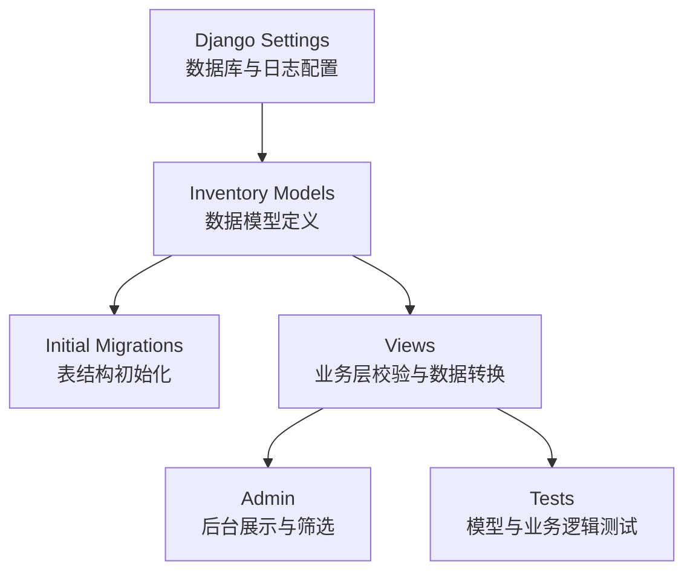
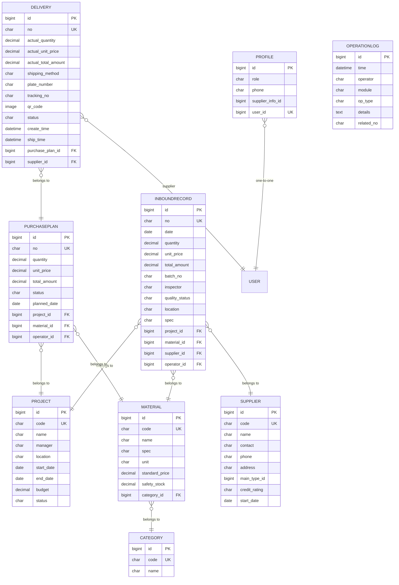
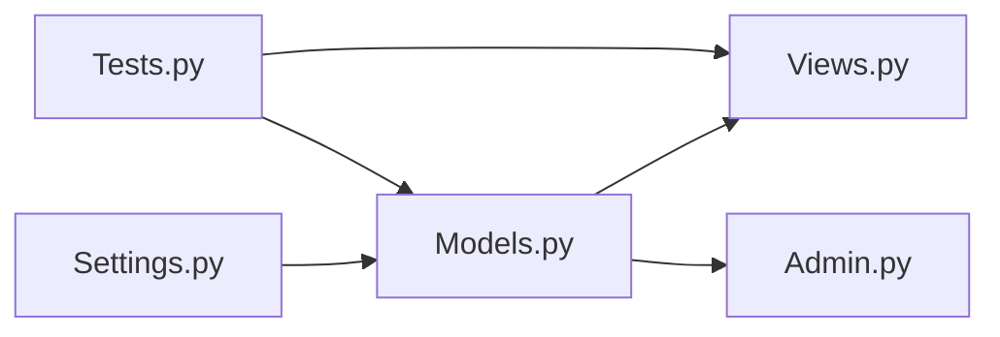
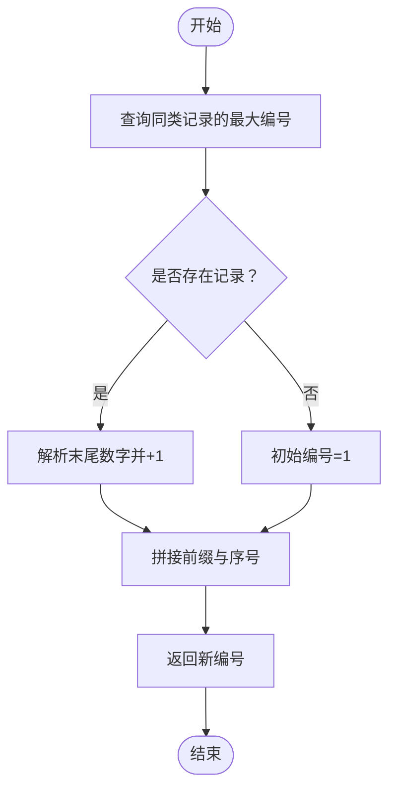

# 数据验证规则

<cite>
**本文引用的文件**
- [inventory/models.py](file://inventory/models.py)
- [inventory/migrations/0001_initial.py](file://inventory/migrations/0001_initial.py)
- [inventory/migrations/0008_delivery.py](file://inventory/migrations/0008_delivery.py)
- [inventory/migrations/0007_alter_profile_role.py](file://inventory/migrations/0007_alter_profile_role.py)
- [inventory/migrations/0009_inboundrecord_spec_alter_inboundrecord_location.py](file://inventory/migrations/0009_inboundrecord_spec_alter_inboundrecord_location.py)
- [inventory/views.py](file://inventory/views.py)
- [inventory/admin.py](file://inventory/admin.py)
- [material_system/settings.py](file://material_system/settings.py)
- [inventory/tests.py](file://inventory/tests.py)
</cite>

## 目录
1. [引言](#引言)
2. [项目结构](#项目结构)
3. [核心组件](#核心组件)
4. [架构总览](#架构总览)
5. [详细组件分析](#详细组件分析)
6. [依赖分析](#依赖分析)
7. [性能考虑](#性能考虑)
8. [故障排查指南](#故障排查指南)
9. [结论](#结论)
10. [附录](#附录)

## 引言
本文件面向材料管理系统的数据库设计与数据验证规则，聚焦于各模型字段的验证规则与业务约束，涵盖：
- 数字类型精度与范围（Decimal 的 max_digits 与 decimal_places）
- 字符类型长度与必填规则
- 日期时间字段范围与格式
- 外键有效性与级联行为
- 唯一性约束（项目编号、材料编号、供应商编号等）
- 枚举类型取值范围
- 自定义验证器与业务逻辑中的校验
- 数据迁移中的验证策略与回滚机制
- 最佳实践与常见错误处理

## 项目结构
系统采用 Django 应用 inventory，核心数据模型位于 models.py，初始迁移文件定义了基础表结构；views.py 中包含大量业务层校验与数据转换逻辑；admin.py 定义了后台展示与筛选；settings.py 提供数据库与日志配置；tests.py 提供模型与业务逻辑的测试覆盖。

图表来源
- [material_system/settings.py:122-130](file://material_system/settings.py#L122-L130)
- [inventory/models.py:7-328](file://inventory/models.py#L7-L328)
- [inventory/migrations/0001_initial.py:1-198](file://inventory/migrations/0001_initial.py#L1-L198)
- [inventory/views.py:1-800](file://inventory/views.py#L1-L800)
- [inventory/admin.py:1-54](file://inventory/admin.py#L1-L54)
- [inventory/tests.py:1-304](file://inventory/tests.py#L1-L304)

章节来源
- [material_system/settings.py:122-130](file://material_system/settings.py#L122-L130)
- [inventory/models.py:7-328](file://inventory/models.py#L7-L328)
- [inventory/migrations/0001_initial.py:1-198](file://inventory/migrations/0001_initial.py#L1-L198)
- [inventory/views.py:1-800](file://inventory/views.py#L1-L800)
- [inventory/admin.py:1-54](file://inventory/admin.py#L1-L54)
- [inventory/tests.py:1-304](file://inventory/tests.py#L1-L304)

## 核心组件
- 用户扩展 Profile：角色枚举、一对一关联用户、可选供应商档案
- 工程项目 Project：编号唯一、状态枚举、预算 Decimal、日期范围
- 材料分类 Category：编号唯一
- 材料档案 Material：编号唯一、单位枚举、单价与安全库存 Decimal
- 供应商 Supplier：编号唯一、信用等级枚举、可选主营类型
- 入库记录 InboundRecord：单号唯一、数量/单价/金额 Decimal、质量状态枚举、项目地址与规格字段
- 采购计划 PurchasePlan：单号唯一、数量/单价/金额 Decimal、状态枚举
- 发货单 Delivery：单号唯一、数量/单价/金额 Decimal、送货方式与状态枚举、二维码字段
- 操作日志 OperationLog：类型枚举

章节来源
- [inventory/models.py:7-328](file://inventory/models.py#L7-L328)

## 架构总览
下图展示了数据模型之间的关系与验证约束的落地点（模型层与业务层）。

图表来源
- [inventory/models.py:7-328](file://inventory/models.py#L7-L328)
- [inventory/migrations/0001_initial.py:1-198](file://inventory/migrations/0001_initial.py#L1-L198)
- [inventory/migrations/0008_delivery.py:1-43](file://inventory/migrations/0008_delivery.py#L1-L43)

## 详细组件分析

### 数字类型精度与范围（Decimal）
- 项目预算：max_digits=14, decimal_places=2
- 材料单价/安全库存：max_digits=12, decimal_places=2
- 入库数量/单价/金额：max_digits=12/14, decimal_places=2
- 采购计划数量/单价/金额：max_digits=12/14, decimal_places=2
- 发货单数量/单价/金额：max_digits=12/14, decimal_places=2
- 业务层计算：views 中多处对 Decimal 进行乘法与聚合，确保精度与边界控制

最佳实践
- 输入时统一使用 Decimal 类型，避免浮点误差
- 聚合查询（Sum）返回值需与模型定义一致，注意空值处理
- 金额字段建议在前端与后端均做格式化与校验

章节来源
- [inventory/models.py:60-106](file://inventory/models.py#L60-L106)
- [inventory/models.py:213-215](file://inventory/models.py#L213-L215)
- [inventory/models.py:250-252](file://inventory/models.py#L250-L252)
- [inventory/models.py:286-288](file://inventory/models.py#L286-L288)
- [inventory/views.py:660-681](file://inventory/views.py#L660-L681)
- [inventory/views.py:400-427](file://inventory/views.py#L400-L427)
- [inventory/views.py:496-544](file://inventory/views.py#L496-L544)

### 字符类型字段长度与必填规则
- 编号类字段（项目/材料/供应商/入库单/采购计划/发货单）：max_length=20~30，且数据库层设置 unique=True
- 名称类字段：项目名称 200、材料名称 200、供应商名称 200、规格型号 100/200、地址 300、联系人 50、电话 20、备注 text
- 枚举字段：角色、状态、质量状态、信用等级、送货方式、操作类型等，choices 限定取值
- 业务层必填：入库单的项目地址与规格字段在 views 中被强制要求填写

最佳实践
- 前端表单应与模型字段长度保持一致，避免截断
- 对必填字段在提交前进行非空校验
- 枚举字段统一使用 choices，避免非法值进入数据库

章节来源
- [inventory/models.py:54-62](file://inventory/models.py#L54-L62)
- [inventory/models.py:99-107](file://inventory/models.py#L99-L107)
- [inventory/models.py:183-192](file://inventory/models.py#L183-L192)
- [inventory/models.py:209-224](file://inventory/models.py#L209-L224)
- [inventory/models.py:247-258](file://inventory/models.py#L247-L258)
- [inventory/models.py:284-297](file://inventory/models.py#L284-L297)
- [inventory/migrations/0001_initial.py:49-61](file://inventory/migrations/0001_initial.py#L49-L61)
- [inventory/migrations/0001_initial.py:90-102](file://inventory/migrations/0001_initial.py#L90-L102)
- [inventory/migrations/0001_initial.py:68-82](file://inventory/migrations/0001_initial.py#L68-L82)
- [inventory/migrations/0008_delivery.py:17-41](file://inventory/migrations/0008_delivery.py#L17-L41)
- [inventory/views.py:673-676](file://inventory/views.py#L673-L676)

### 日期时间字段范围与格式
- 日期字段：项目开工/竣工日期、入库日期、计划采购日期、发货时间、创建/更新时间等
- 时间字段：自动填充 created_at/auto_now_add、operate_time/auto_now_add、create_time、ship_time
- 业务层：views 中对日期字符串进行解析与校验，确保格式正确；导出时将日期序列化为 ISO 格式

最佳实践
- 前端统一使用 YYYY-MM-DD 格式
- 后端统一使用 Python date/datetime 类型，避免字符串拼接错误
- 导出接口统一序列化为 ISO 格式字符串

章节来源
- [inventory/models.py:58-63](file://inventory/models.py#L58-L63)
- [inventory/models.py:212-223](file://inventory/models.py#L212-L223)
- [inventory/models.py:254-258](file://inventory/models.py#L254-L258)
- [inventory/models.py:295-296](file://inventory/models.py#L295-L296)
- [inventory/views.py:666-667](file://inventory/views.py#L666-L667)
- [inventory/views.py:108-110](file://inventory/views.py#L108-L110)

### 外键有效性与级联行为
- PROTECT 级联：项目/材料/供应商/用户等被引用时禁止删除，防止数据不一致
- CASCADE 级联：Profile.user 使用 CASCADE，删除用户同时删除档案
- SET_NULL 级联：供应商主营类型可为空，删除分类不影响供应商记录
- 关系链：入库记录关联项目/材料/供应商/操作员；采购计划关联项目/材料/操作员；发货单关联采购计划/供应商

最佳实践
- 删除前先检查是否存在关联记录，必要时引导用户清理
- 对外键字段在业务层进行存在性校验，避免非法 ID

章节来源
- [inventory/models.py:15-18](file://inventory/models.py#L15-L18)
- [inventory/models.py:210-212](file://inventory/models.py#L210-L212)
- [inventory/models.py:248-249](file://inventory/models.py#L248-L249)
- [inventory/models.py:285-286](file://inventory/models.py#L285-L286)
- [inventory/migrations/0001_initial.py:101-101](file://inventory/migrations/0001_initial.py#L101-L101)

### 唯一性约束
- 项目编号、材料编号、供应商编号、入库单号、采购计划单号、发货单号在模型层设置 unique=True
- 用户档案的 user 字段设置 unique=True（OneToOne）
- 唯一性在数据库层由 unique 约束保障，业务层也应进行冲突检测

最佳实践
- 新增/编辑时先查询是否存在相同编号，避免违反唯一约束
- 唯一编号生成策略：views 中的 generate_code/generate_no 会基于现有最大值递增

章节来源
- [inventory/models.py:54-54](file://inventory/models.py#L54-L54)
- [inventory/models.py:99-99](file://inventory/models.py#L99-L99)
- [inventory/models.py:183-183](file://inventory/models.py#L183-L183)
- [inventory/models.py:209-209](file://inventory/models.py#L209-L209)
- [inventory/models.py:247-247](file://inventory/models.py#L247-L247)
- [inventory/models.py:284-284](file://inventory/models.py#L284-L284)
- [inventory/views.py:66-103](file://inventory/views.py#L66-L103)

### 枚举类型字段取值范围验证
- 角色：admin/material_dept/clerk/supplier
- 项目状态：active/completed/paused
- 材料单位：多种常用单位
- 信用等级：excellent/good/average
- 质量状态：qualified/unqualified
- 送货方式：special/logistics
- 发货状态：pending/shipped/received
- 操作类型：create/update/delete/export/login/other

最佳实践
- 表单与 API 接口严格使用 choices 中的合法值
- 前端下拉框与后端 choices 保持一致

章节来源
- [inventory/models.py:9-14](file://inventory/models.py#L9-L14)
- [inventory/models.py:53-61](file://inventory/models.py#L53-L61)
- [inventory/models.py:94-98](file://inventory/models.py#L94-L98)
- [inventory/models.py:182-189](file://inventory/models.py#L182-L189)
- [inventory/models.py:208-219](file://inventory/models.py#L208-L219)
- [inventory/models.py:275-283](file://inventory/models.py#L275-L283)
- [inventory/models.py:314-319](file://inventory/models.py#L314-L319)
- [inventory/migrations/0007_alter_profile_role.py:13-17](file://inventory/migrations/0007_alter_profile_role.py#L13-L17)

### 自定义验证器与业务逻辑中的校验
- 金额计算：入库记录与采购计划在 save 中自动计算 total_amount=quantity×unit_price
- 唯一编号生成：generate_code/generate_no 基于现有最大值递增，避免冲突
- 权限控制：can_manage_inventory/can_manage_purchase_plan 等装饰器与辅助函数
- 存在性校验：删除前检查是否存在关联记录（项目/材料/供应商的入库记录）

最佳实践
- 在 save 方法中进行计算与校验，确保一致性
- 对外键 ID 进行存在性校验，避免非法引用
- 对业务状态流转进行合法性检查（如发货状态变更）

章节来源
- [inventory/models.py:234-236](file://inventory/models.py#L234-L236)
- [inventory/models.py:268-270](file://inventory/models.py#L268-L270)
- [inventory/views.py:66-103](file://inventory/views.py#L66-L103)
- [inventory/views.py:205-209](file://inventory/views.py#L205-L209)
- [inventory/views.py:284-289](file://inventory/views.py#L284-L289)
- [inventory/views.py:347-353](file://inventory/views.py#L347-L353)

### 数据迁移过程中的验证策略与回滚机制
- 初始迁移：0001_initial.py 定义了所有基础表结构与字段约束
- 后续迁移：0008_delivery.py 添加发货单表；0007_alter_profile_role.py 修改角色枚举；0009_inboundrecord_spec_alter_inboundrecord_location.py 添加字段与修改字段长度
- 回滚策略：Django 迁移支持逆向执行（migrate <migration_name>），但涉及数据丢失或结构变更时需谨慎；建议在生产环境先备份数据库再执行

最佳实践
- 对重要迁移先在测试环境验证
- 大规模字段变更（如长度调整）需评估影响范围
- 使用事务包裹复杂迁移，失败时回滚

章节来源
- [inventory/migrations/0001_initial.py:1-198](file://inventory/migrations/0001_initial.py#L1-L198)
- [inventory/migrations/0008_delivery.py:1-43](file://inventory/migrations/0008_delivery.py#L1-L43)
- [inventory/migrations/0007_alter_profile_role.py:1-19](file://inventory/migrations/0007_alter_profile_role.py#L1-L19)
- [inventory/migrations/0009_inboundrecord_spec_alter_inboundrecord_location.py:1-25](file://inventory/migrations/0009_inboundrecord_spec_alter_inboundrecord_location.py#L1-L25)

## 依赖分析
- 模型层依赖：views 通过模型类进行 CRUD、聚合与计算
- 管理层依赖：admin.py 展示与筛选字段来自 models.py
- 配置依赖：settings.py 决定数据库引擎与日志输出

图表来源
- [inventory/models.py:7-328](file://inventory/models.py#L7-L328)
- [inventory/views.py:1-800](file://inventory/views.py#L1-L800)
- [inventory/admin.py:1-54](file://inventory/admin.py#L1-L54)
- [material_system/settings.py:122-130](file://material_system/settings.py#L122-L130)
- [inventory/tests.py:1-304](file://inventory/tests.py#L1-L304)

章节来源
- [inventory/models.py:7-328](file://inventory/models.py#L7-L328)
- [inventory/views.py:1-800](file://inventory/views.py#L1-L800)
- [inventory/admin.py:1-54](file://inventory/admin.py#L1-L54)
- [material_system/settings.py:122-130](file://material_system/settings.py#L122-L130)
- [inventory/tests.py:1-304](file://inventory/tests.py#L1-L304)

## 性能考虑
- Decimal 计算：聚合查询与乘法运算较多，建议在批量导入时分批处理，避免长时间锁表
- 唯一性冲突：生成编号时先查询最大值，建议在高并发场景下使用数据库层面的原子性操作或序列
- 查询优化：admin.py 中使用 select_related 减少 N+1 查询；views 中对复杂筛选使用 Q 与索引字段

## 故障排查指南
- 唯一性冲突：当出现违反唯一约束的错误时，检查编号生成逻辑与去重策略
- 外键不存在：删除/更新时提示外键约束错误，检查关联对象是否存在
- 金额异常：Decimal 乘法结果与预期不符，检查 decimal_places 与上下文精度
- 日期格式：前端传入日期字符串导致解析失败，统一使用 YYYY-MM-DD 并在后端校验

章节来源
- [inventory/tests.py:34-41](file://inventory/tests.py#L34-L41)
- [inventory/views.py:666-667](file://inventory/views.py#L666-L667)
- [inventory/views.py:673-676](file://inventory/views.py#L673-L676)

## 结论
本系统在模型层与业务层共同实现了完善的验证规则：通过 Decimal 精度控制、唯一性约束、枚举取值限制、外键级联策略以及业务层的计算与校验，确保了数据的一致性与完整性。配合迁移机制与测试覆盖，系统具备良好的可维护性与扩展性。

## 附录
- 唯一编号生成流程（概念示意）
