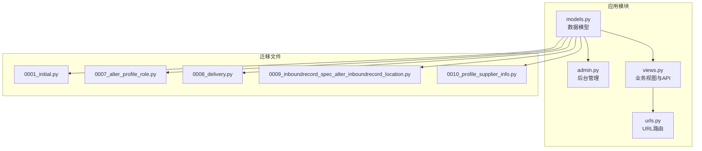
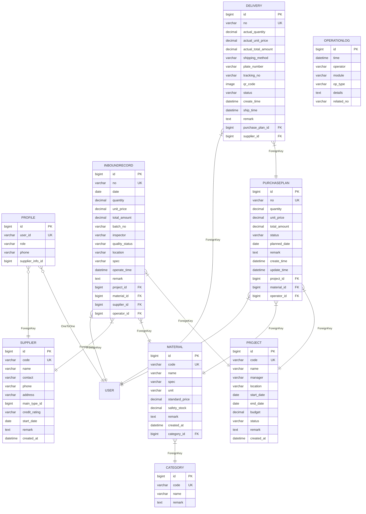
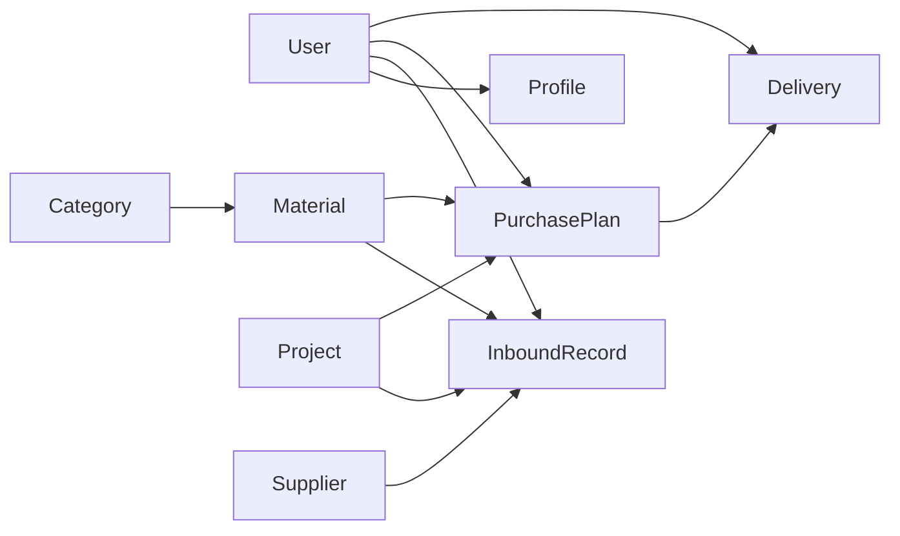

# 核心数据模型

<cite>
**本文引用的文件**
- [models.py](file://inventory/models.py)
- [admin.py](file://inventory/admin.py)
- [views.py](file://inventory/views.py)
- [urls.py](file://inventory/urls.py)
- [0001_initial.py](file://inventory/migrations/0001_initial.py)
- [0007_alter_profile_role.py](file://inventory/migrations/0007_alter_profile_role.py)
- [0008_delivery.py](file://inventory/migrations/0008_delivery.py)
- [0009_inboundrecord_spec_alter_inboundrecord_location.py](file://inventory/migrations/0009_inboundrecord_spec_alter_inboundrecord_location.py)
- [0010_profile_supplier_info.py](file://inventory/migrations/0010_profile_supplier_info.py)
- [tests.py](file://inventory/tests.py)
</cite>

## 目录
1. [引言](#引言)
2. [项目结构](#项目结构)
3. [核心组件](#核心组件)
4. [架构总览](#架构总览)
5. [详细组件分析](#详细组件分析)
6. [依赖分析](#依赖分析)
7. [性能考虑](#性能考虑)
8. [故障排查指南](#故障排查指南)
9. [结论](#结论)
10. [附录](#附录)

## 引言
本文件面向材料管理系统的9个核心数据模型，提供完整的数据库设计文档。内容涵盖字段定义、数据类型、约束条件、业务含义、主键与外键设计、级联策略、模型间关联关系（一对一、一对多、多对多）、字段验证规则与默认值、元数据配置（verbose_name、排序规则等）、以及序列化与API输出格式说明。目标是帮助开发者与运维人员快速理解并正确使用这些模型。

## 项目结构
- 数据模型集中于 inventory/models.py，采用Django ORM定义。
- 后台管理界面由 inventory/admin.py 配置，展示字段、过滤器与搜索。
- 视图层负责业务逻辑与API响应，统一以JSON输出关键数据。
- URL路由定义于 inventory/urls.py，映射到各功能视图。
- 迁移文件 inventory/migrations/* 记录了模型演进历史，确保数据库结构与代码一致。

**图表来源**
- [models.py:1-328](file://inventory/models.py#L1-L328)
- [admin.py:1-54](file://inventory/admin.py#L1-L54)
- [views.py:1-800](file://inventory/views.py#L1-L800)
- [urls.py:1-80](file://inventory/urls.py#L1-L80)
- [0001_initial.py:1-198](file://inventory/migrations/0001_initial.py#L1-L198)
- [0007_alter_profile_role.py:1-19](file://inventory/migrations/0007_alter_profile_role.py#L1-L19)
- [0008_delivery.py:1-43](file://inventory/migrations/0008_delivery.py#L1-L43)
- [0009_inboundrecord_spec_alter_inboundrecord_location.py:1-25](file://inventory/migrations/0009_inboundrecord_spec_alter_inboundrecord_location.py#L1-L25)
- [0010_profile_supplier_info.py:1-20](file://inventory/migrations/0010_profile_supplier_info.py#L1-L20)

**章节来源**
- [models.py:1-328](file://inventory/models.py#L1-L328)
- [admin.py:1-54](file://inventory/admin.py#L1-L54)
- [views.py:1-800](file://inventory/views.py#L1-L800)
- [urls.py:1-80](file://inventory/urls.py#L1-L80)

## 核心组件
本节概述9个核心模型的职责与关键特性，便于快速定位与查阅。

- Profile 用户扩展信息模型：扩展Django内置User，支持角色与供应商档案关联。
- Project 工程项目模型：记录工程项目的编号、状态、预算等信息。
- Material 材料档案模型：记录材料的编号、规格、单位、标准价、安全库存等。
- Supplier 供应商模型：记录供应商的编号、联系人、信用等级、主营类型等。
- Category 材料分类模型：材料的分类编号与名称。
- InboundRecord 入库记录模型：记录每次入库的数量、单价、总金额、质量状态等。
- PurchasePlan 采购计划模型：记录采购计划的编号、数量、单价、状态等。
- Delivery 发货单模型：记录发货单号、实际数量、实际单价、状态、送货方式等。
- OperationLog 操作日志模型：记录系统操作的时间、模块、类型、详情与关联单号。

**章节来源**
- [models.py:7-328](file://inventory/models.py#L7-L328)

## 架构总览
下图展示了9个核心模型之间的实体关系，标注了主键、外键与级联策略，帮助理解数据流向与约束关系。

**图表来源**
- [models.py:7-328](file://inventory/models.py#L7-L328)
- [0001_initial.py:1-198](file://inventory/migrations/0001_initial.py#L1-L198)
- [0008_delivery.py:1-43](file://inventory/migrations/0008_delivery.py#L1-L43)
- [0009_inboundrecord_spec_alter_inboundrecord_location.py:1-25](file://inventory/migrations/0009_inboundrecord_spec_alter_inboundrecord_location.py#L1-L25)
- [0010_profile_supplier_info.py:1-20](file://inventory/migrations/0010_profile_supplier_info.py#L1-L20)

## 详细组件分析

### Profile 用户扩展信息模型
- 字段与类型
  - user: OneToOneField(User, on_delete=CASCADE, related_name='profile')
  - role: CharField(choices=ROLE_CHOICES, default='clerk')
  - phone: CharField(max_length=20, blank=True)
  - supplier_info: ForeignKey(Supplier, on_delete=SET_NULL, null=True, blank=True, related_name='user_profiles')
- 约束与默认值
  - OneToOne 关联，删除用户时级联删除Profile
  - 角色默认为 'clerk'；供应商档案可为空
- 业务含义
  - 将用户与角色、电话、供应商档案关联，支持供应商身份识别与显示名策略
- 元数据
  - verbose_name='用户资料'
- 序列化与API
  - 后台管理展示 user、role、phone、supplier_info
  - 通过 autocomplete_fields 支持供应商档案选择

**章节来源**
- [models.py:7-49](file://inventory/models.py#L7-L49)
- [admin.py:10-16](file://inventory/admin.py#L10-L16)
- [0007_alter_profile_role.py:13-18](file://inventory/migrations/0007_alter_profile_role.py#L13-L18)
- [0010_profile_supplier_info.py:14-19](file://inventory/migrations/0010_profile_supplier_info.py#L14-L19)

### Project 工程项目模型
- 字段与类型
  - code: CharField(unique=True)
  - name: CharField(max_length=200)
  - manager/location/start_date/end_date/budget/status/remark/created_at
- 约束与默认值
  - 编号唯一；状态默认 'active'
- 业务含义
  - 记录工程项目的编号、名称、负责人、地点、工期、预算、状态与备注
- 元数据
  - verbose_name='工程项目'；排序 ['-created_at']
- 序列化与API
  - 列表页展示 code/name/manager/status/budget/created_at
  - API返回项目详情（含预算、状态等）

**章节来源**
- [models.py:51-72](file://inventory/models.py#L51-L72)
- [admin.py:17-22](file://inventory/admin.py#L17-L22)
- [views.py:213-222](file://inventory/views.py#L213-L222)

### Material 材料档案模型
- 字段与类型
  - code: CharField(unique=True)
  - name/spec/unit/standard_price/safety_stock/remark/created_at
  - category: ForeignKey(Category, on_delete=PROTECT, related_name='materials')
- 约束与默认值
  - 编号唯一；单位为枚举；标准价与安全库存默认0
- 业务含义
  - 记录材料的编号、名称、规格、单位、标准价、安全库存与分类
- 元数据
  - verbose_name='材料档案'；排序 ['code']
- 序列化与API
  - 列表页展示 code/name/category/spec/unit/standard_price/safety_stock
  - API返回材料详情及当前库存、加权平均成本

**章节来源**
- [models.py:92-116](file://inventory/models.py#L92-L116)
- [admin.py:27-32](file://inventory/admin.py#L27-L32)
- [views.py:292-301](file://inventory/views.py#L292-L301)

### Supplier 供应商模型
- 字段与类型
  - code: CharField(unique=True)
  - name/contact/phone/address/main_type/credit_rating/start_date/remark/created_at
  - main_type: ForeignKey(Category, on_delete=SET_NULL, null=True, blank=True, related_name='suppliers')
- 约束与默认值
  - 编号唯一；信用等级默认 'good'
- 业务含义
  - 记录供应商的基本信息、主营材料类型与信用等级
- 元数据
  - verbose_name='供应商'；排序 ['code']
- 序列化与API
  - 列表页展示 code/name/contact/phone/credit_rating
  - API返回供应商详情（含主营类型ID）

**章节来源**
- [models.py:180-204](file://inventory/models.py#L180-L204)
- [admin.py:33-37](file://inventory/admin.py#L33-L37)
- [views.py:355-363](file://inventory/views.py#L355-L363)

### Category 材料分类模型
- 字段与类型
  - code: CharField(unique=True)
  - name: CharField(max_length=100)
  - remark: TextField(blank=True)
- 约束与默认值
  - 编号唯一
- 业务含义
  - 材料的分类编号与名称
- 元数据
  - verbose_name='材料分类'
- 序列化与API
  - API返回分类列表（code/name）

**章节来源**
- [models.py:78-90](file://inventory/models.py#L78-L90)
- [admin.py:23-26](file://inventory/admin.py#L23-L26)
- [views.py:226-229](file://inventory/views.py#L226-L229)

### InboundRecord 入库记录模型
- 字段与类型
  - no: CharField(unique=True)
  - project/material/supplier/operator/date/quantity/unit_price/total_amount/batch_no/inspector/quality_status/location/spec/operate_time/remark
- 约束与默认值
  - 单号唯一；质量状态默认 'qualified'
  - total_amount 在 save 中按 quantity × unit_price 计算并持久化
- 业务含义
  - 记录每次入库的项目归属、材料、供应商、数量、单价、总金额、质量状态、项目地址与规格等
- 元数据
  - verbose_name='入库记录'；排序 ['-date', '-operate_time']
- 序列化与API
  - 列表页展示 no/date/project/material/quantity/unit_price/total_amount/supplier
  - API返回入库记录详情（含单位、规格等）

**章节来源**
- [models.py:206-237](file://inventory/models.py#L206-L237)
- [admin.py:38-43](file://inventory/admin.py#L38-L43)
- [views.py:694-707](file://inventory/views.py#L694-L707)
- [0009_inboundrecord_spec_alter_inboundrecord_location.py:13-24](file://inventory/migrations/0009_inboundrecord_spec_alter_inboundrecord_location.py#L13-L24)

### PurchasePlan 采购计划模型
- 字段与类型
  - no: CharField(unique=True)
  - project/material/operator/quantity/unit_price/total_amount/status/planned_date/remark/create_time/update_time
- 约束与默认值
  - 单号唯一；状态默认 'pending'；total_amount 在 save 中按 quantity × unit_price 计算
- 业务含义
  - 记录采购计划的编号、数量、单价、状态与计划日期
- 元数据
  - verbose_name='采购计划'；排序 ['-create_time']
- 序列化与API
  - 列表页展示 no/project/material/quantity/total_amount/status/planned_date
  - API返回采购计划详情（含数量、单价、状态等）

**章节来源**
- [models.py:239-271](file://inventory/models.py#L239-L271)
- [admin.py:44-49](file://inventory/admin.py#L44-L49)
- [views.py:443-458](file://inventory/views.py#L443-L458)

### Delivery 发货单模型
- 字段与类型
  - no: CharField(unique=True)
  - purchase_plan/supplier/actual_quantity/actual_unit_price/actual_total_amount/shipping_method/plate_number/tracking_no/qr_code/status/create_time/ship_time/remark
- 约束与默认值
  - 单号唯一；状态默认 'pending'；实际金额在 save 中计算
  - qr_code 为 ImageField，上传路径包含年月
- 业务含义
  - 记录发货单号、实际数量、实际单价、送货方式、状态与二维码等
- 元数据
  - verbose_name='发货单'；排序 ['-create_time']
- 序列化与API
  - 列表页展示 no/purchase_plan/actual_quantity/actual_unit_price/status
  - API返回发货单详情（含送货方式、车牌号、运单号等）

**章节来源**
- [models.py:273-310](file://inventory/models.py#L273-L310)
- [admin.py:1-54](file://inventory/admin.py#L1-L54)
- [views.py:600-616](file://inventory/views.py#L600-L616)
- [0008_delivery.py:17-42](file://inventory/migrations/0008_delivery.py#L17-L42)

### OperationLog 操作日志模型
- 字段与类型
  - time: DateTimeField(auto_now_add=True)
  - operator/module/op_type/details/related_no
- 约束与默认值
  - 时间自动记录；op_type 为枚举类型
- 业务含义
  - 记录系统操作的时间、模块、类型、详情与关联单号
- 元数据
  - verbose_name='操作日志'；排序 ['-time']
- 序列化与API
  - 列表页展示 time/operator/module/op_type/details
  - 日志写入统一通过工具函数 log_operation

**章节来源**
- [models.py:312-328](file://inventory/models.py#L312-L328)
- [admin.py:50-54](file://inventory/admin.py#L50-L54)
- [views.py:28-33](file://inventory/views.py#L28-L33)

## 依赖分析
- 外键与级联策略
  - Profile.user: CASCADE（删除用户即删除Profile）
  - Profile.supplier_info: SET_NULL（供应商档案删除不影响用户）
  - Material.category: PROTECT（分类被引用时禁止删除）
  - InboundRecord.project/material/supplier/operator: PROTECT（引用对象删除受保护）
  - PurchasePlan.project/material/operator: PROTECT（同上）
  - Delivery.purchase_plan/supplier: PROTECT（同上）
- 关系类型
  - Profile 与 User: 一对一
  - Profile 与 Supplier: 多对一
  - Material 与 Category: 多对一
  - InboundRecord 与 Project/Material/Supplier/User: 多对一
  - PurchasePlan 与 Project/Material/User: 多对一
  - Delivery 与 PurchasePlan/User: 多对一
- 迁移演进
  - 0001_initial：初始模型创建
  - 0007_alter_profile_role：角色枚举扩展
  - 0008_delivery：新增 Delivery 模型
  - 0009_inboundrecord：新增 spec 字段、调整 location 字段
  - 0010_profile：新增 supplier_info 外键

**图表来源**
- [models.py:7-328](file://inventory/models.py#L7-L328)
- [0001_initial.py:1-198](file://inventory/migrations/0001_initial.py#L1-L198)
- [0008_delivery.py:1-43](file://inventory/migrations/0008_delivery.py#L1-L43)
- [0009_inboundrecord_spec_alter_inboundrecord_location.py:1-25](file://inventory/migrations/0009_inboundrecord_spec_alter_inboundrecord_location.py#L1-L25)
- [0010_profile_supplier_info.py:1-20](file://inventory/migrations/0010_profile_supplier_info.py#L1-L20)

**章节来源**
- [models.py:7-328](file://inventory/models.py#L7-L328)
- [0001_initial.py:1-198](file://inventory/migrations/0001_initial.py#L1-L198)
- [0007_alter_profile_role.py:1-19](file://inventory/migrations/0007_alter_profile_role.py#L1-L19)
- [0008_delivery.py:1-43](file://inventory/migrations/0008_delivery.py#L1-L43)
- [0009_inboundrecord_spec_alter_inboundrecord_location.py:1-25](file://inventory/migrations/0009_inboundrecord_spec_alter_inboundrecord_location.py#L1-L25)
- [0010_profile_supplier_info.py:1-20](file://inventory/migrations/0010_profile_supplier_info.py#L1-L20)

## 性能考虑
- 查询优化
  - 视图中广泛使用 select_related 降低N+1查询（如入库列表、材料列表、供应商列表等）
  - 使用聚合查询（Sum、Count）减少Python侧计算开销
- 字段索引
  - 唯一性字段（code、no）具备数据库层面的唯一约束，利于高效检索
- 序列化
  - Decimal 类型通过自定义序列化器转换为浮点数，避免前端处理不便
- 业务计算
  - 材料库存与加权平均成本在模型方法中聚合计算，建议结合缓存策略或定期统计任务

[本节为通用指导，无需特定文件来源]

## 故障排查指南
- 删除受限
  - 分类/项目/材料/供应商删除前需检查是否存在关联记录，否则返回错误
- 权限控制
  - 入库与发货管理对用户角色有限制，非授权用户访问将被拒绝
- 数据一致性
  - InboundRecord/PurchasePlan/Delivery 的金额字段在 save 中自动计算，确保数据一致性
- 日志审计
  - 所有关键操作均写入 OperationLog，便于追踪问题

**章节来源**
- [views.py:205-210](file://inventory/views.py#L205-L210)
- [views.py:284-289](file://inventory/views.py#L284-L289)
- [views.py:348-353](file://inventory/views.py#L348-L353)
- [views.py:677-681](file://inventory/views.py#L677-L681)
- [views.py:421-427](file://inventory/views.py#L421-L427)
- [views.py:521-526](file://inventory/views.py#L521-L526)
- [views.py:28-33](file://inventory/views.py#L28-L33)

## 结论
本文档系统梳理了材料管理系统的9个核心数据模型，明确了字段定义、约束条件、业务含义、主外键关系与级联策略，并结合迁移文件与视图层API输出格式，提供了可操作的设计与使用指南。遵循本文档可有效保障数据完整性、业务一致性与系统可维护性。

[本节为总结性内容，无需特定文件来源]

## 附录

### 字段验证规则与默认值清单
- Profile
  - role 默认 'clerk'；supplier_info 可空
- Project
  - status 默认 'active'
- Material
  - unit 为枚举；standard_price/safety_stock 默认0
- Supplier
  - credit_rating 默认 'good'
- InboundRecord
  - quality_status 默认 'qualified'；total_amount 自动计算
- PurchasePlan
  - status 默认 'pending'；total_amount 自动计算
- Delivery
  - status 默认 'pending'；actual_total_amount 自动计算
- OperationLog
  - time 自动记录

**章节来源**
- [models.py:7-328](file://inventory/models.py#L7-L328)
- [0007_alter_profile_role.py:13-18](file://inventory/migrations/0007_alter_profile_role.py#L13-L18)
- [0009_inboundrecord_spec_alter_inboundrecord_location.py:13-24](file://inventory/migrations/0009_inboundrecord_spec_alter_inboundrecord_location.py#L13-L24)

### API 输出格式示例（概要）
- 项目详情 API：返回 code/name/manager/location/start_date/end_date/budget/status/remark
- 材料详情 API：返回 code/name/category_id/spec/unit/standard_price/safety_stock/current_stock/avg_cost
- 供应商详情 API：返回 code/name/contact/phone/address/main_type/credit_rating/start_date/remark
- 采购计划详情 API：返回 no/project_id/material_id/quantity/unit_price/planned_date/status/remark
- 发货单详情 API：返回 no/purchase_plan_id/actual_quantity/actual_unit_price/shipping_method/plate_number/tracking_no/status/remark

**章节来源**
- [views.py:213-222](file://inventory/views.py#L213-L222)
- [views.py:292-301](file://inventory/views.py#L292-L301)
- [views.py:355-363](file://inventory/views.py#L355-L363)
- [views.py:444-458](file://inventory/views.py#L444-L458)
- [views.py:600-616](file://inventory/views.py#L600-L616)