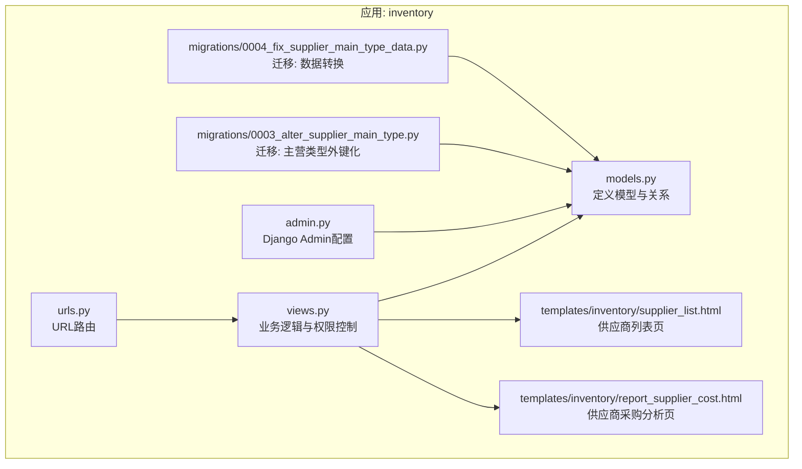
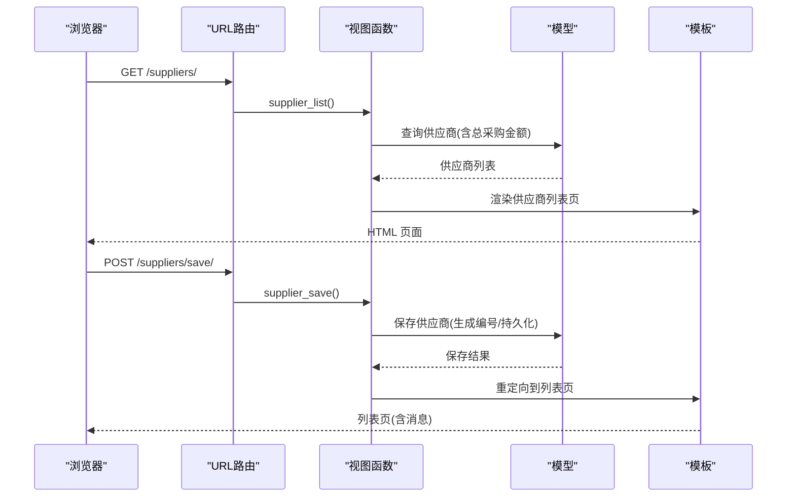
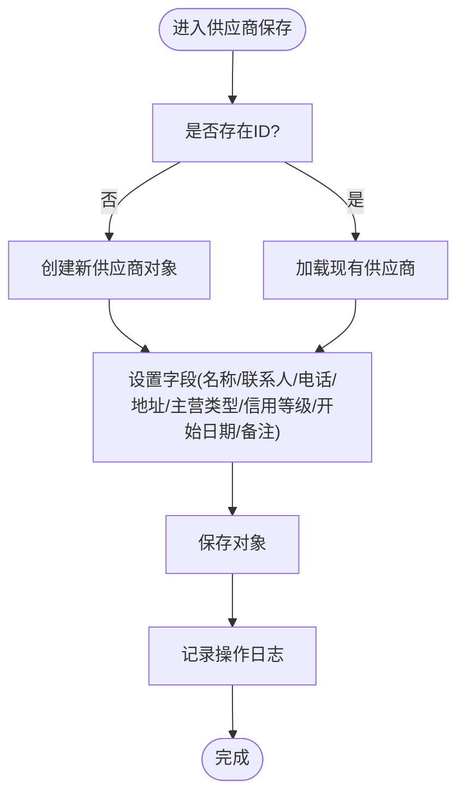
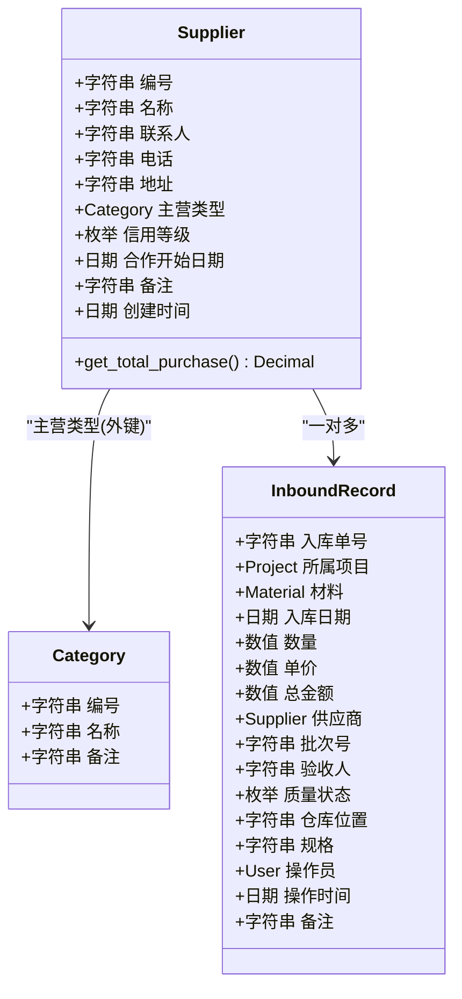
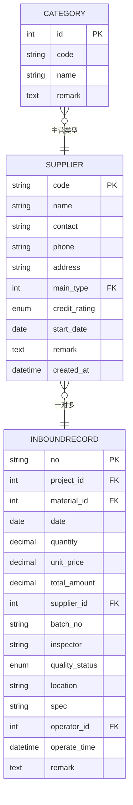
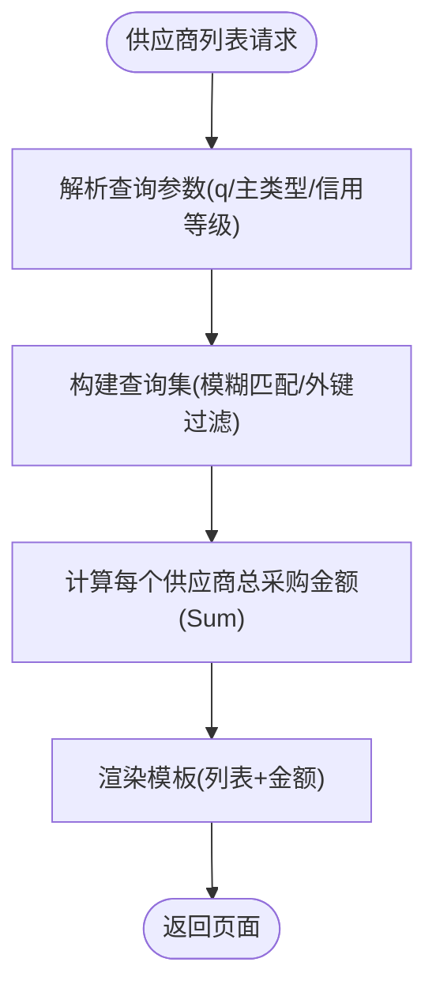
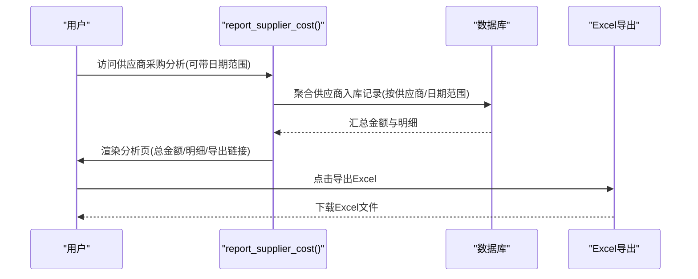
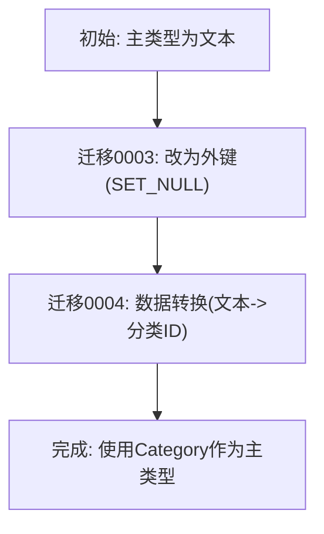
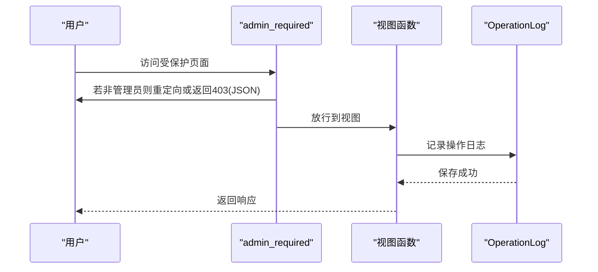
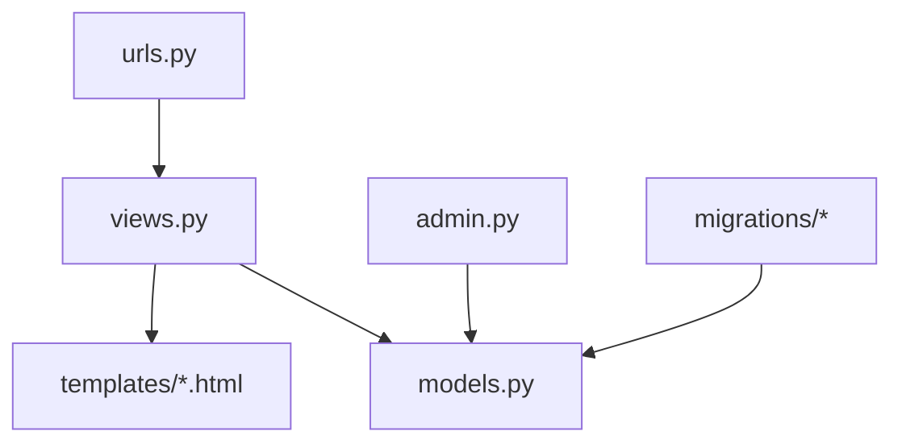

# 供应商管理模块

<cite>
**本文档引用的文件**
- [models.py](file://inventory/models.py)
- [views.py](file://inventory/views.py)
- [admin.py](file://inventory/admin.py)
- [urls.py](file://inventory/urls.py)
- [supplier_list.html](file://templates/inventory/supplier_list.html)
- [report_supplier_cost.html](file://templates/inventory/report_supplier_cost.html)
- [0003_alter_supplier_main_type.py](file://inventory/migrations/0003_alter_supplier_main_type.py)
- [0004_fix_supplier_main_type_data.py](file://inventory/migrations/0004_fix_supplier_main_type_data.py)
</cite>

## 目录
1. [简介](#简介)
2. [项目结构](#项目结构)
3. [核心组件](#核心组件)
4. [架构概览](#架构概览)
5. [详细组件分析](#详细组件分析)
6. [依赖分析](#依赖分析)
7. [性能考虑](#性能考虑)
8. [故障排除指南](#故障排除指南)
9. [结论](#结论)
10. [附录](#附录)

## 简介
本文件为供应商管理模块的详细技术文档，涵盖供应商档案的创建、编辑、删除与查询功能；供应商信用评级系统的设计与实现；供应商与入库记录的关联关系与数据完整性约束；供应商查询筛选功能（按主类型、信用等级、关键字搜索）；供应商绩效统计（总采购金额与排名）；供应商主类型管理机制；权限控制与操作审计；以及最佳实践与数据维护建议。

## 项目结构
供应商管理模块位于 inventory 应用内，采用 Django 的 MVC 架构：
- 模型层：定义供应商、入库记录等实体及其关系
- 视图层：处理业务逻辑、权限控制、数据筛选与统计
- 模板层：前端展示供应商列表、详情与报表
- URL 路由：映射到对应的视图函数
- 管理后台：Django Admin 配置供应商展示与搜索

**图表来源**
- [models.py:180-204](file://inventory/models.py#L180-L204)
- [views.py:305-364](file://inventory/views.py#L305-L364)
- [urls.py:22-26](file://inventory/urls.py#L22-L26)
- [admin.py:33-36](file://inventory/admin.py#L33-L36)
- [supplier_list.html:1-172](file://templates/inventory/supplier_list.html#L1-L172)
- [report_supplier_cost.html:1-83](file://templates/inventory/report_supplier_cost.html#L1-L83)
- [0003_alter_supplier_main_type.py:14-18](file://inventory/migrations/0003_alter_supplier_main_type.py#L14-L18)
- [0004_fix_supplier_main_type_data.py:6-26](file://inventory/migrations/0004_fix_supplier_main_type_data.py#L6-L26)

**章节来源**
- [models.py:180-204](file://inventory/models.py#L180-L204)
- [views.py:305-364](file://inventory/views.py#L305-L364)
- [urls.py:22-26](file://inventory/urls.py#L22-L26)
- [admin.py:33-36](file://inventory/admin.py#L33-L36)
- [supplier_list.html:1-172](file://templates/inventory/supplier_list.html#L1-L172)
- [report_supplier_cost.html:1-83](file://templates/inventory/report_supplier_cost.html#L1-L83)
- [0003_alter_supplier_main_type.py:14-18](file://inventory/migrations/0003_alter_supplier_main_type.py#L14-L18)
- [0004_fix_supplier_main_type_data.py:6-26](file://inventory/migrations/0004_fix_supplier_main_type_data.py#L6-L26)

## 核心组件
- 供应商模型（Supplier）
  - 字段：编号、名称、联系人、电话、地址、主营材料类型（外键到 Category）、信用等级、合作开始日期、备注、创建时间
  - 关系：与入库记录（InboundRecord）一对多关联
  - 方法：get_total_purchase() 计算总采购金额
- 入库记录模型（InboundRecord）
  - 字段：入库单号、项目、材料、日期、数量、单价、总金额、供应商、批次号、验收人、质量状态、仓库位置、规格、操作员、操作时间、备注
  - 外键：供应商（PROTECT 约束），防止删除仍有入库记录的供应商
- 供应商视图（views）
  - 列表：支持关键字搜索、计算每个供应商的总采购金额
  - 保存：生成编号、持久化供应商信息、记录操作日志
  - 删除：PROTECT 约束检查，阻止删除仍有入库记录的供应商
  - 报表：供应商采购分析（按供应商与时间段统计）
- 权限与审计
  - 权限：admin_required 装饰器限制供应商管理仅管理员可见
  - 审计：统一的日志记录函数 log_operation，记录模块、类型、详情与关联单号

**章节来源**
- [models.py:180-204](file://inventory/models.py#L180-L204)
- [models.py:206-236](file://inventory/models.py#L206-L236)
- [views.py:305-364](file://inventory/views.py#L305-L364)
- [views.py:28-33](file://inventory/views.py#L28-L33)
- [views.py:55-64](file://inventory/views.py#L55-L64)

## 架构概览
供应商管理模块遵循 Django 的 MTV 模式，前后端分离通过模板渲染与 AJAX API 协作完成。

**图表来源**
- [urls.py:22-26](file://inventory/urls.py#L22-L26)
- [views.py:305-364](file://inventory/views.py#L305-L364)
- [models.py:180-204](file://inventory/models.py#L180-L204)
- [supplier_list.html:1-172](file://templates/inventory/supplier_list.html#L1-L172)

## 详细组件分析

### 供应商档案 CRUD 实现
- 创建与编辑
  - 自动生成编号：generate_code('SUP', Supplier)
  - 表单提交后持久化供应商信息
  - 记录操作日志（模块：供应商档案，类型：新增/修改）
- 删除
  - 使用 PROTECT 约束：若供应商存在入库记录则拒绝删除
  - 成功删除后记录操作日志（类型：删除）

**图表来源**
- [views.py:316-342](file://inventory/views.py#L316-L342)
- [views.py:28-33](file://inventory/views.py#L28-L33)

**章节来源**
- [views.py:316-342](file://inventory/views.py#L316-L342)
- [views.py:344-353](file://inventory/views.py#L344-L353)
- [views.py:28-33](file://inventory/views.py#L28-L33)

### 供应商信用评级系统
- 信用等级枚举：优秀、良好、一般
- 展示：在供应商列表页以徽章形式显示
- 设计要点：
  - 评级字段为字符型枚举，便于展示与筛选
  - 未实现自动评级算法，需人工维护或后续扩展规则引擎
- 动态调整机制：
  - 当前未实现基于入库质量、交期、价格等因素的自动调整
  - 可通过扩展模型字段与视图逻辑实现自动化评分与评级

**图表来源**
- [models.py:180-204](file://inventory/models.py#L180-L204)
- [models.py:206-236](file://inventory/models.py#L206-L236)

**章节来源**
- [models.py:180-204](file://inventory/models.py#L180-L204)
- [supplier_list.html:54-56](file://templates/inventory/supplier_list.html#L54-L56)

### 供应商与入库记录的关联与数据完整性
- 外键关系：Supplier → InboundRecord（一对多）
- 删除保护：供应商删除时若存在入库记录则拒绝（PROTECT 约束）
- 金额计算：通过聚合函数 Sum('total_amount') 计算供应商总采购金额
- 一致性保证：
  - 入库记录保存时自动计算总金额（quantity × unit_price）
  - 供应商与入库记录通过外键强关联，避免悬挂引用

**图表来源**
- [models.py:180-204](file://inventory/models.py#L180-L204)
- [models.py:206-236](file://inventory/models.py#L206-L236)
- [models.py:78-90](file://inventory/models.py#L78-L90)

**章节来源**
- [models.py:206-236](file://inventory/models.py#L206-L236)
- [models.py:180-204](file://inventory/models.py#L180-L204)

### 供应商查询筛选功能
- 关键字搜索：支持按编号、名称、联系人模糊匹配
- 主类型筛选：通过下拉选择主营类型进行过滤
- 信用等级筛选：在前端模板中提供选项（当前视图未直接实现后端筛选参数）
- 总采购金额展示：在列表页计算并显示每个供应商的累计采购金额

**图表来源**
- [views.py:306-314](file://inventory/views.py#L306-L314)
- [supplier_list.html:11-16](file://templates/inventory/supplier_list.html#L11-L16)

**章节来源**
- [views.py:306-314](file://inventory/views.py#L306-L314)
- [supplier_list.html:11-16](file://templates/inventory/supplier_list.html#L11-L16)

### 供应商绩效统计（总采购金额与排名）
- 统计口径：按供应商维度聚合入库记录的总金额
- 排名：可在前端对总采购金额排序展示
- 报表页面：提供供应商采购分析页，支持时间段筛选与导出 Excel

**图表来源**
- [views.py:1130-1137](file://inventory/views.py#L1130-L1137)
- [report_supplier_cost.html:1-83](file://templates/inventory/report_supplier_cost.html#L1-L83)

**章节来源**
- [views.py:1130-1137](file://inventory/views.py#L1130-L1137)
- [report_supplier_cost.html:1-83](file://templates/inventory/report_supplier_cost.html#L1-L83)

### 供应商主类型管理机制与类型分类体系
- 主类型字段：外键到 Category，支持为空
- 迁移演进：
  - 0003：将主类型字段改为外键（SET_NULL）
  - 0004：运行 Python 脚本将历史文本类型转换为 Category 外键
- 类型分类：Category 模型提供分类编号与名称，用于主类型选择

**图表来源**
- [0003_alter_supplier_main_type.py:14-18](file://inventory/migrations/0003_alter_supplier_main_type.py#L14-L18)
- [0004_fix_supplier_main_type_data.py:6-26](file://inventory/migrations/0004_fix_supplier_main_type_data.py#L6-L26)
- [models.py:78-90](file://inventory/models.py#L78-L90)

**章节来源**
- [0003_alter_supplier_main_type.py:14-18](file://inventory/migrations/0003_alter_supplier_main_type.py#L14-L18)
- [0004_fix_supplier_main_type_data.py:6-26](file://inventory/migrations/0004_fix_supplier_main_type_data.py#L6-L26)
- [models.py:78-90](file://inventory/models.py#L78-L90)

### 权限控制与操作审计
- 权限控制：
  - 供应商管理页面使用 admin_required 装饰器，仅管理员可见
  - 入库管理、采购计划等模块使用 can_manage_inventory/can_manage_purchase_plan 等辅助函数
- 操作审计：
  - 统一日志记录函数 log_operation，记录模块、类型、详情与关联单号
  - 日志列表页支持按模块、类型、时间范围筛选

**图表来源**
- [views.py:55-64](file://inventory/views.py#L55-L64)
- [views.py:28-33](file://inventory/views.py#L28-L33)
- [models.py:312-328](file://inventory/models.py#L312-L328)

**章节来源**
- [views.py:55-64](file://inventory/views.py#L55-L64)
- [views.py:28-33](file://inventory/views.py#L28-L33)
- [models.py:312-328](file://inventory/models.py#L312-L328)

## 依赖分析
- 模块耦合
  - views 对 models 的强依赖（查询、聚合、保存、删除）
  - 模板依赖视图传递的数据（供应商列表、总采购金额、分类）
  - URL 路由与视图一一对应，职责清晰
- 外部依赖
  - Django ORM 与 Admin
  - openpyxl 用于导入导出
  - qrcode 用于发货单二维码生成

**图表来源**
- [views.py:21-24](file://inventory/views.py#L21-L24)
- [models.py:1-10](file://inventory/models.py#L1-L10)
- [urls.py:1-80](file://inventory/urls.py#L1-L80)
- [admin.py:1-54](file://inventory/admin.py#L1-L54)

**章节来源**
- [views.py:21-24](file://inventory/views.py#L21-L24)
- [models.py:1-10](file://inventory/models.py#L1-L10)
- [urls.py:1-80](file://inventory/urls.py#L1-L80)
- [admin.py:1-54](file://inventory/admin.py#L1-L54)

## 性能考虑
- 查询优化
  - 供应商列表使用 select_related/defer 减少 N+1 查询（当前已使用 select_related）
  - 聚合计算总采购金额时使用数据库侧聚合 Sum，避免 Python 层循环
- 前端交互
  - 使用 AJAX 加载详情接口，减少页面刷新
- 导出与导入
  - Excel 导出采用流式写入，避免内存峰值
  - 导入使用事务包裹，失败回滚，保障数据一致性

[本节为通用性能建议，无需特定文件引用]

## 故障排除指南
- 无法删除供应商
  - 现象：提示“该供应商已有入库记录，无法删除”
  - 原因：数据库外键约束 PROTECT
  - 处理：先清理相关入库记录，再执行删除
- 供应商列表无数据
  - 现象：页面显示“暂无供应商数据”
  - 原因：无供应商或筛选条件过严
  - 处理：检查搜索关键词、主类型与信用等级筛选
- 导入失败
  - 现象：导入报错或部分失败
  - 原因：模板列不匹配、必填项缺失、分类不存在
  - 处理：下载模板、核对必填列、确保分类已存在

**章节来源**
- [views.py:344-353](file://inventory/views.py#L344-L353)
- [views.py:1470-1529](file://inventory/views.py#L1470-L1529)
- [supplier_list.html:64-66](file://templates/inventory/supplier_list.html#L64-L66)

## 结论
供应商管理模块实现了完整的供应商档案 CRUD、信用评级展示、与入库记录的强关联与数据完整性保障，并提供了查询筛选与绩效统计能力。权限控制与操作审计贯穿关键流程，确保系统的安全性与可追溯性。未来可扩展信用评级的自动化规则与更丰富的统计维度。

## 附录

### 最佳实践与数据维护建议
- 信用评级
  - 建议引入自动评级规则（质量合格率、按时交货率、价格稳定性等）
  - 定期复审与手动调整相结合
- 数据治理
  - 保持主类型分类的准确性与一致性
  - 定期清理无交易历史的供应商
- 安全与合规
  - 严格管理员权限，定期审计操作日志
  - 导入导出数据应进行校验与备份

[本节为通用建议，无需特定文件引用]