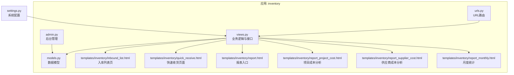
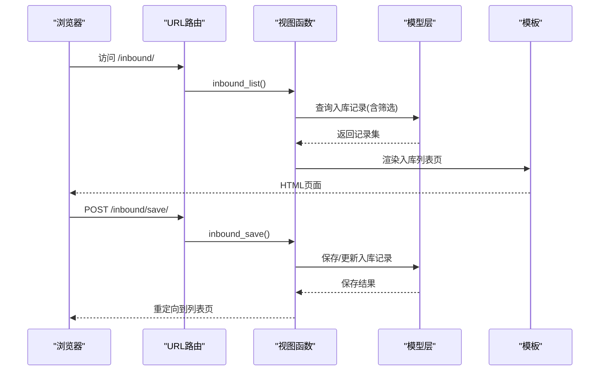
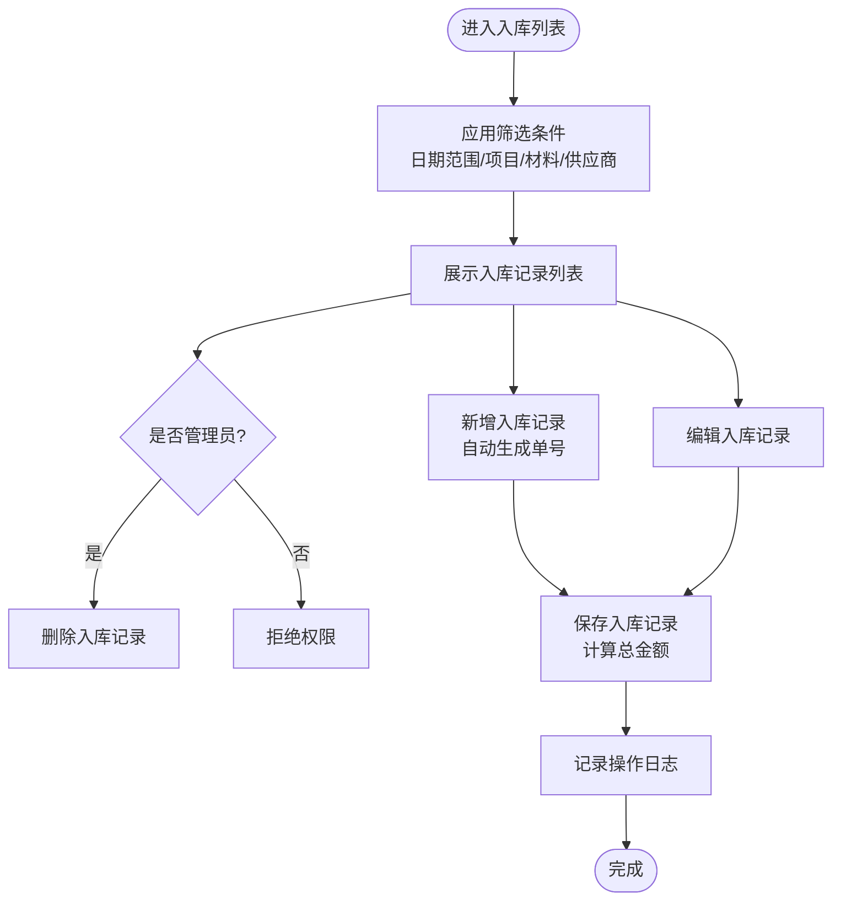
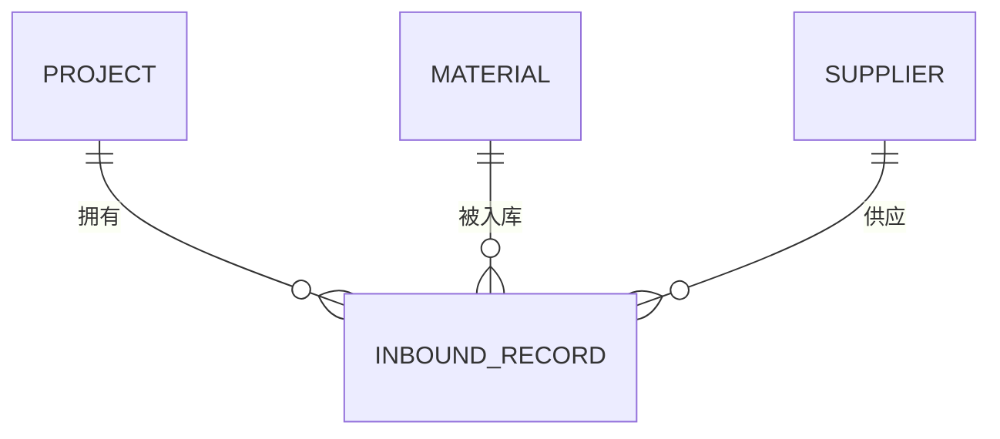
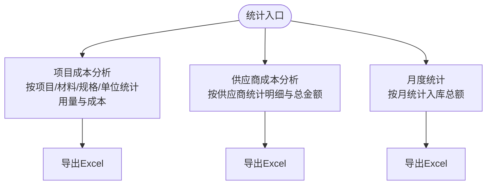
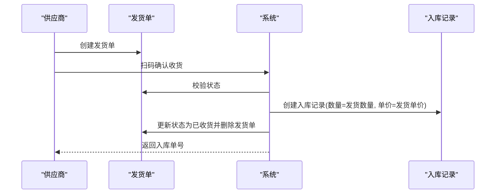
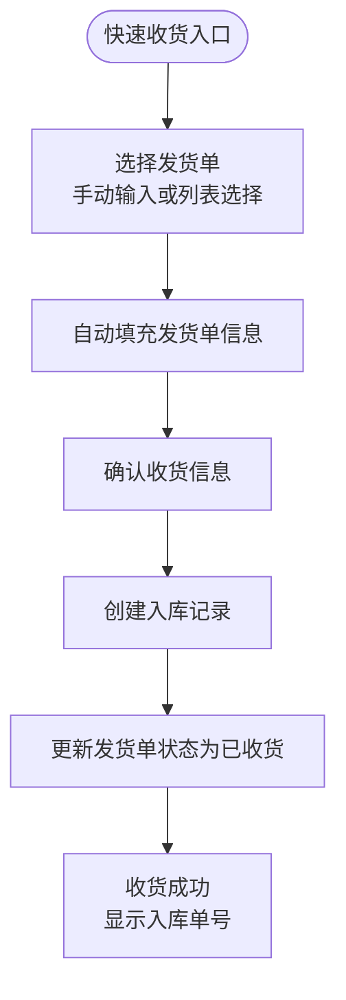
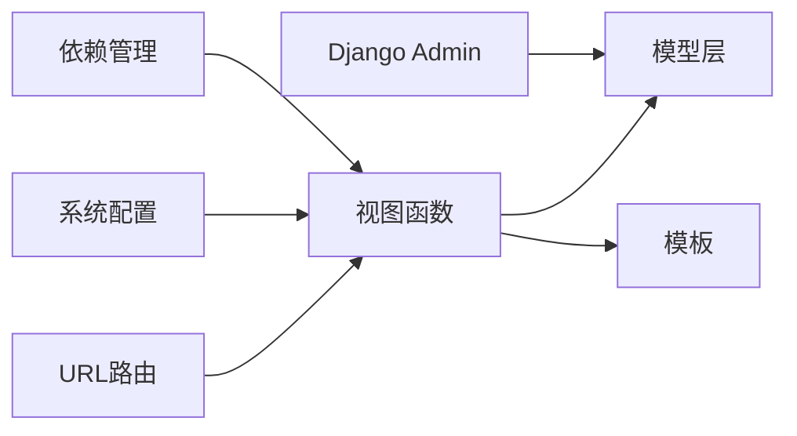

# 入库管理模块

<cite>
**本文档引用的文件**
- [inventory/models.py](file://inventory/models.py)
- [inventory/views.py](file://inventory/views.py)
- [inventory/urls.py](file://inventory/urls.py)
- [inventory/admin.py](file://inventory/admin.py)
- [templates/inventory/inbound_list.html](file://templates/inventory/inbound_list.html)
- [templates/inventory/quick_receive.html](file://templates/inventory/quick_receive.html)
- [templates/inventory/report.html](file://templates/inventory/report.html)
- [templates/inventory/report_project_cost.html](file://templates/inventory/report_project_cost.html)
- [templates/inventory/report_supplier_cost.html](file://templates/inventory/report_supplier_cost.html)
- [templates/inventory/report_monthly.html](file://templates/inventory/report_monthly.html)
- [material_system/settings.py](file://material_system/settings.py)
- [inventory/migrations/0001_initial.py](file://inventory/migrations/0001_initial.py)
- [inventory/migrations/0008_delivery.py](file://inventory/migrations/0008_delivery.py)
- [requirements.txt](file://requirements.txt)
- [requirements.lock.txt](file://requirements.lock.txt)
</cite>

## 更新摘要
**所做更改**
- 移除了QR码生成功能相关的所有代码和依赖
- 简化了快速收货流程，移除二维码扫描功能
- 更新了快速收货页面的交互逻辑
- 移除了qrcode第三方库依赖
- 更新了相关文档中的技术实现说明

## 目录
1. [简介](#简介)
2. [项目结构](#项目结构)
3. [核心组件](#核心组件)
4. [架构概览](#架构概览)
5. [详细组件分析](#详细组件分析)
6. [依赖分析](#依赖分析)
7. [性能考虑](#性能考虑)
8. [故障排除指南](#故障排除指南)
9. [结论](#结论)
10. [附录](#附录)

## 简介
本文件为入库管理模块的全面技术文档，覆盖入库单的创建、编辑、删除与查询功能；入库质量管理流程（质量状态与检验员信息）；入库单与项目、材料、供应商的关联关系与数据完整性约束；入库查询筛选逻辑（按日期范围、项目、材料、供应商）；入库数据统计（入库总量、平均单价、总金额）；权限控制机制（角色与数据访问限制）；Excel导出与报表生成；成本核算与库存更新逻辑；以及最佳实践与操作规范。

**更新** 本版本反映了应用变更：简化入库管理流程，移除QR码生成功能，优化快速收货页面。

## 项目结构
入库管理模块位于 inventory 应用内，采用 Django 的 MVC 架构：
- 模型层：定义入库记录及相关实体的数据结构与关系
- 视图层：处理业务逻辑、权限控制、查询筛选、报表统计、Excel导出
- 模板层：前端页面与交互（入库列表、筛选、编辑、报表、快速收货等）
- URL路由：映射视图函数到URL端点
- 后台管理：Django Admin 配置用于数据维护

**图表来源**
- [inventory/urls.py:1-84](file://inventory/urls.py#L1-L84)
- [inventory/views.py:2030-2179](file://inventory/views.py#L2030-L2179)
- [inventory/models.py:280-361](file://inventory/models.py#L280-L361)
- [templates/inventory/inbound_list.html:1-246](file://templates/inventory/inbound_list.html#L1-L246)
- [templates/inventory/quick_receive.html:1-387](file://templates/inventory/quick_receive.html#L1-L387)
- [templates/inventory/report.html:1-97](file://templates/inventory/report.html#L1-L97)
- [templates/inventory/report_project_cost.html:1-58](file://templates/inventory/report_project_cost.html#L1-L58)
- [templates/inventory/report_supplier_cost.html:1-83](file://templates/inventory/report_supplier_cost.html#L1-L83)
- [templates/inventory/report_monthly.html:1-27](file://templates/inventory/report_monthly.html#L1-L27)
- [material_system/settings.py:1-210](file://material_system/settings.py#L1-L210)

**章节来源**
- [inventory/urls.py:1-84](file://inventory/urls.py#L1-L84)
- [material_system/settings.py:74-87](file://material_system/settings.py#L74-L87)

## 核心组件
- 入库记录模型（InboundRecord）：存储入库单的核心字段（单号、日期、项目、材料、数量、单价、总金额、供应商、批次号、验收人、质量状态、项目地址、规格、操作员、操作时间、备注），并自动计算总金额
- 权限工具函数：can_manage_inventory、is_admin、is_material_dept、is_clerk 等，用于控制入库管理的访问与操作权限
- 入库管理视图：inbound_list、inbound_save、inbound_delete、inbound_detail_api 实现 CRUD 与详情查询
- Excel导出：export_excel 支持导出入库汇总与入库明细
- 报表统计：项目成本分析、供应商成本分析、月度统计
- 快速收货：基于发货单的扫码收货流程，自动生成入库单并更新状态

**更新** 移除了QR码生成功能相关的组件和依赖。

**章节来源**
- [inventory/models.py:280-361](file://inventory/models.py#L280-L361)
- [inventory/views.py:43-53](file://inventory/views.py#L43-L53)
- [inventory/views.py:2030-2179](file://inventory/views.py#L2030-L2179)

## 架构概览
入库管理的前后端交互通过 URL 路由连接到视图函数，视图函数调用模型层进行数据库操作，并渲染模板返回页面或JSON响应。Excel导出与报表统计同样通过视图函数实现。

**图表来源**
- [inventory/urls.py:47-50](file://inventory/urls.py#L47-L50)
- [inventory/views.py:2030-2100](file://inventory/views.py#L2030-L2100)
- [templates/inventory/inbound_list.html:36-96](file://templates/inventory/inbound_list.html#L36-L96)

## 详细组件分析

### 入库单创建、编辑、删除与查询
- 创建与编辑
  - 自动生成入库单号（前缀+日期+序号）
  - 表单提交后保存入库记录，自动计算总金额
  - 支持在新增行与弹窗中填写项目、材料、供应商、数量、单价、规格、项目地址、批次号、验收人、质量状态、备注等
- 删除
  - 仅管理员可删除入库记录
- 查询与筛选
  - 支持按日期范围、项目、材料、供应商筛选
  - 列表页展示入库单号、日期、项目、项目地址、材料、规格、数量、单价、总金额、供应商、操作按钮

**图表来源**
- [inventory/views.py:2030-2100](file://inventory/views.py#L2030-L2100)
- [templates/inventory/inbound_list.html:14-32](file://templates/inventory/inbound_list.html#L14-L32)

**章节来源**
- [inventory/views.py:2030-2100](file://inventory/views.py#L2030-L2100)
- [templates/inventory/inbound_list.html:36-96](file://templates/inventory/inbound_list.html#L36-L96)

### 质量控制流程与检验员信息
- 质量状态字段（合格/不合格），默认合格
- 验收人字段用于记录检验员信息
- 质量状态与验收人在入库单详情API中返回，便于前端展示与编辑

**章节来源**
- [inventory/models.py:280-361](file://inventory/models.py#L280-L361)
- [inventory/views.py:2100-2179](file://inventory/views.py#L2100-L2179)

### 入库单与项目、材料、供应商的关联关系与数据完整性
- 外键关系
  - 入库记录 → 项目（PROTECT）
  - 入库记录 → 材料（PROTECT）
  - 入库记录 → 供应商（PROTECT）
- 数据完整性
  - 删除受保护：若项目/材料/供应商存在入库记录则禁止删除
  - 保存时自动计算总金额（数量×单价）

**图表来源**
- [inventory/models.py:280-361](file://inventory/models.py#L280-L361)
- [inventory/migrations/0001_initial.py:172-189](file://inventory/migrations/0001_initial.py#L172-L189)

**章节来源**
- [inventory/models.py:280-361](file://inventory/models.py#L280-L361)
- [inventory/migrations/0001_initial.py:172-189](file://inventory/migrations/0001_initial.py#L172-L189)

### 入库查询筛选功能实现
- 日期范围：date_from、date_to
- 项目：project_id
- 材料：material_id
- 供应商：supplier_id
- 过滤逻辑：逐项拼接查询条件，最终返回筛选后的入库记录集

**章节来源**
- [inventory/views.py:2030-2060](file://inventory/views.py#L2030-L2060)

### 入库数据统计功能
- 入库总量：按材料聚合入库数量
- 平均单价：按入库记录聚合总金额/总数量（加权平均）
- 总金额：按入库记录聚合总金额
- 项目成本分析：按项目统计材料分类与材料维度的累计用量与成本占比
- 供应商成本分析：按供应商统计材料维度的采购明细与总金额
- 月度统计：按月份统计入库总金额

**图表来源**
- [inventory/views.py:963-1207](file://inventory/views.py#L963-L1207)
- [templates/inventory/report.html:16-94](file://templates/inventory/report.html#L16-L94)
- [templates/inventory/report_project_cost.html:25-53](file://templates/inventory/report_project_cost.html#L25-L53)
- [templates/inventory/report_supplier_cost.html:6-79](file://templates/inventory/report_supplier_cost.html#L6-L79)
- [templates/inventory/report_monthly.html:9-25](file://templates/inventory/report_monthly.html#L9-L25)

**章节来源**
- [inventory/views.py:963-1207](file://inventory/views.py#L963-L1207)
- [templates/inventory/report_project_cost.html:25-53](file://templates/inventory/report_project_cost.html#L25-L53)
- [templates/inventory/report_supplier_cost.html:6-79](file://templates/inventory/report_supplier_cost.html#L6-L79)
- [templates/inventory/report_monthly.html:9-25](file://templates/inventory/report_monthly.html#L9-L25)

### 权限控制机制
- 角色定义：管理员、物资部、材料员、供应商
- 入库管理权限：管理员、物资部、材料员可查看与操作
- 删除权限：仅管理员
- 供应商角色：登录后跳转发货管理，不可直接访问入库管理

**章节来源**
- [inventory/models.py:7-48](file://inventory/models.py#L7-L48)
- [inventory/views.py:43-53](file://inventory/views.py#L43-L53)
- [inventory/views.py:2030-2046](file://inventory/views.py#L2030-L2046)

### Excel导出与数据报表
- 入库汇总：导出材料维度的累计入库量、安全库存、入库均价、入库总值
- 入库记录：导出入库明细（单号、日期、项目、材料、规格、数量、单价、总金额、供应商、验收人）
- 报表导出：项目成本分析、供应商成本分析、月度统计支持导出Excel

**章节来源**
- [inventory/views.py:711-780](file://inventory/views.py#L711-L780)
- [templates/inventory/report_project_cost.html:18-21](file://templates/inventory/report_project_cost.html#L18-L21)
- [templates/inventory/report_supplier_cost.html:76-78](file://templates/inventory/report_supplier_cost.html#L76-L78)

### 成本核算机制与库存更新逻辑
- 成本核算
  - 入库记录保存时自动计算总金额（数量×单价）
  - 材料模型提供加权平均成本计算方法
  - 项目与供应商提供累计采购金额统计
- 库存更新
  - 材料模型提供累计入库量查询方法，支持按项目与日期范围统计
  - 快速收货流程：基于发货单生成入库单，自动更新采购计划状态为"已入库"

**图表来源**
- [inventory/views.py:2100-2179](file://inventory/views.py#L2100-L2179)

**章节来源**
- [inventory/models.py:117-142](file://inventory/models.py#L117-L142)
- [inventory/views.py:2100-2179](file://inventory/views.py#L2100-L2179)

### 快速收货流程优化
**更新** 快速收货流程已简化，移除了QR码生成功能：

- 发货单选择
  - 支持手动输入发货单号查询
  - 显示最近已发货的发货单列表供快速选择
- 收货确认
  - 自动填充发货单信息（项目、材料、数量、单价、总金额）
  - 自动设置收货日期为当天，项目地址从发货单获取
  - 确认收货后自动生成入库单并更新状态
- 流程简化
  - 移除二维码扫描步骤
  - 简化前端交互逻辑
  - 优化移动端适配

**图表来源**
- [inventory/views.py:2030-2179](file://inventory/views.py#L2030-L2179)
- [templates/inventory/quick_receive.html:172-384](file://templates/inventory/quick_receive.html#L172-L384)

**章节来源**
- [inventory/views.py:2030-2179](file://inventory/views.py#L2030-L2179)
- [templates/inventory/quick_receive.html:1-387](file://templates/inventory/quick_receive.html#L1-L387)

### 最佳实践与操作规范
- 字段必填：项目、材料、供应商、数量、单价、规格、项目地址
- 自动填充：项目地址与规格可在选择项目/材料时自动填充
- 质量管理：入库时应明确质量状态与验收人
- 权限分离：仅管理员与物资部可删除入库记录
- 数据一致性：删除前确保无关联记录（项目/材料/供应商的入库记录）
- 报表导出：定期导出入库汇总与明细，配合Excel进行数据分析
- 快速收货：优先使用发货单列表选择，减少手动输入错误

**章节来源**
- [templates/inventory/inbound_list.html:44-71](file://templates/inventory/inbound_list.html#L44-L71)
- [templates/inventory/inbound_list.html:108-143](file://templates/inventory/inbound_list.html#L108-L143)
- [templates/inventory/quick_receive.html:172-384](file://templates/inventory/quick_receive.html#L172-L384)

## 依赖分析
- 视图函数依赖模型层进行数据查询与保存
- URL路由将请求分发到对应视图
- 模板层负责前端展示与交互
- Django Admin 用于后台数据维护
- 系统配置影响数据库、静态资源、媒体文件与日志

**更新** 移除了qrcode第三方库依赖，简化了依赖关系。

**图表来源**
- [inventory/urls.py:1-84](file://inventory/urls.py#L1-84)
- [inventory/views.py:2030-2179](file://inventory/views.py#L2030-L2179)
- [inventory/admin.py:1-54](file://inventory/admin.py#L1-L54)
- [material_system/settings.py:122-146](file://material_system/settings.py#L122-L146)
- [requirements.txt:1-16](file://requirements.txt#L1-L16)

**章节来源**
- [inventory/urls.py:1-84](file://inventory/urls.py#L1-L84)
- [material_system/settings.py:122-146](file://material_system/settings.py#L122-L146)
- [requirements.txt:1-16](file://requirements.txt#L1-L16)

## 性能考虑
- 查询优化：列表页使用 select_related 预加载外键关联，减少数据库查询次数
- 聚合统计：使用聚合函数（Sum、Count、Avg）在数据库层面完成，避免Python侧循环计算
- 分页与筛选：前端筛选参数传递到后端，后端按需构建查询条件
- Excel导出：大批量数据导出建议分批处理或异步任务，避免阻塞请求线程
- 快速收货：简化查询逻辑，减少数据库查询次数

**更新** 快速收货流程优化减少了不必要的数据库查询。

**章节来源**
- [inventory/views.py:149-150](file://inventory/views.py#L149-L150)
- [inventory/views.py:729-734](file://inventory/views.py#L729-L734)
- [inventory/views.py:1009-1010](file://inventory/views.py#L1009-L1010)
- [inventory/views.py:2030-2046](file://inventory/views.py#L2030-L2046)

## 故障排除指南
- 权限错误
  - 现象：访问被拒绝或返回无权限
  - 排查：确认用户角色是否具备入库管理权限；删除操作需管理员
- 数据删除失败
  - 现象：删除项目/材料/供应商时报错"已有入库记录"
  - 排查：检查是否存在关联的入库记录，先清理后再删除
- Excel导出异常
  - 现象：导出失败或文件损坏
  - 排查：确认导出类型参数正确；检查服务器磁盘空间与权限
- 快速收货失败
  - 现象：扫码收货报错
  - 排查：确认发货单状态为"已发货"；检查供应商与材料是否存在
  - **更新** 现在使用发货单号直接查询，不再依赖二维码扫描

**更新** 移除了QR码相关的故障排除内容。

**章节来源**
- [inventory/views.py:205-206](file://inventory/views.py#L205-L206)
- [inventory/views.py:284-285](file://inventory/views.py#L284-L285)
- [inventory/views.py:2030-2046](file://inventory/views.py#L2030-L2046)
- [inventory/views.py:2100-2179](file://inventory/views.py#L2100-L2179)

## 结论
入库管理模块通过清晰的角色权限、完善的筛选与统计功能、严谨的数据模型与外键约束，实现了从入库单创建到报表导出的完整闭环。结合成本核算与快速收货流程，系统能够满足工程项目的材料入库管理需求，并提供良好的扩展性与可维护性。

**更新** 本次更新简化了入库管理流程，移除了QR码生成功能，优化了快速收货页面，提升了系统的易用性和维护性。

## 附录
- 关键URL端点
  - 入库列表：/inbound/
  - 入库保存：/inbound/save/
  - 入库删除：/inbound/<int:pk>/delete/
  - 入库详情API：/api/inbound/<int:pk>/
  - 快速收货：/quick-receive/
  - 快速收货确认：/quick-receive/confirm/
  - 发货单查询API：/api/delivery-by-no/
  - Excel导出：/export/?type=inventory|inbound
  - 报表入口：/reports/
  - 项目成本分析：/reports/project-cost/
  - 供应商成本分析：/reports/supplier-cost/
  - 月度统计：/reports/monthly/

**更新** 移除了QR码相关的URL端点。

**章节来源**
- [inventory/urls.py:47-67](file://inventory/urls.py#L47-L67)