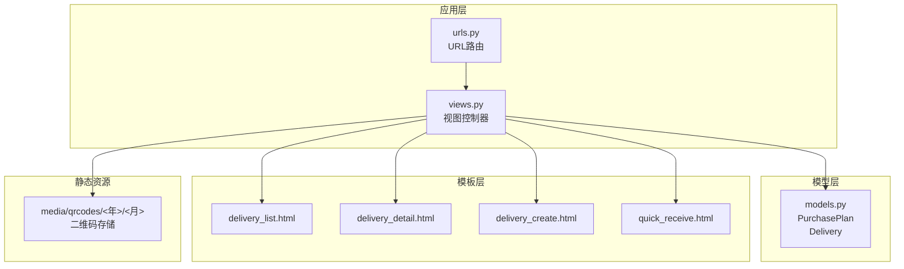
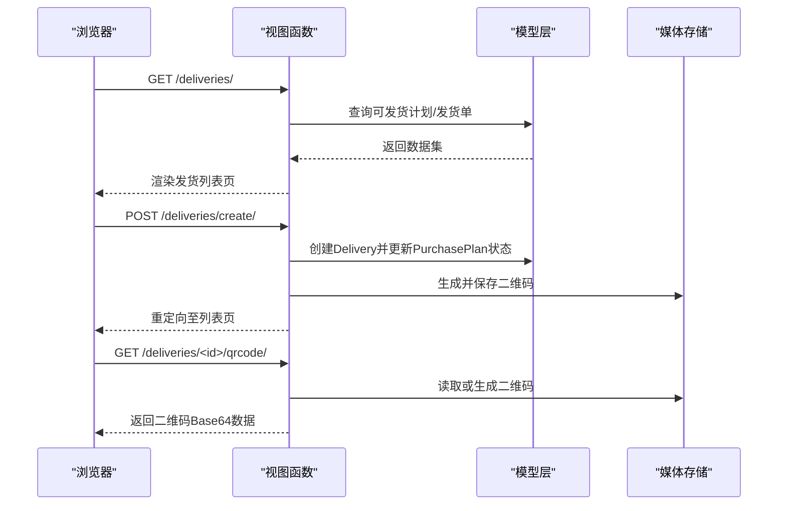
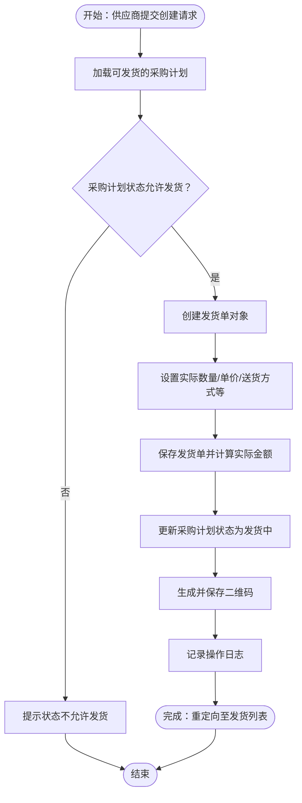
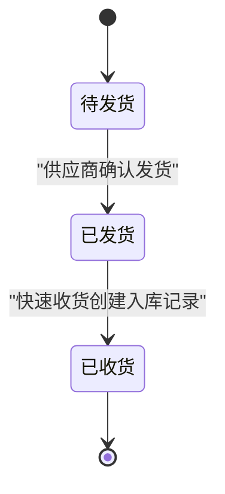
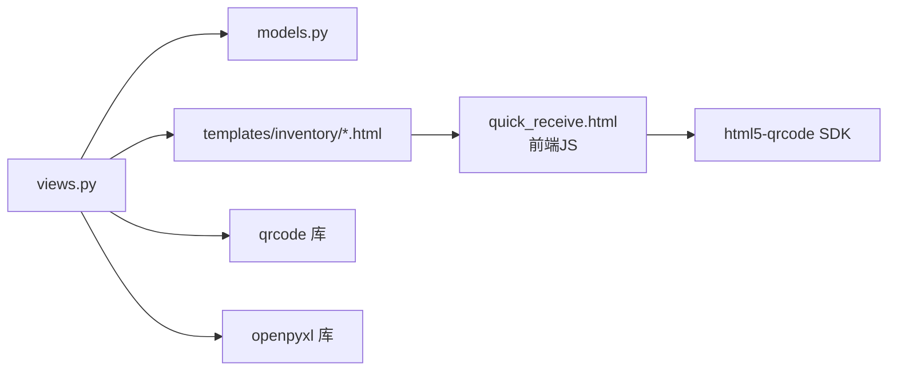
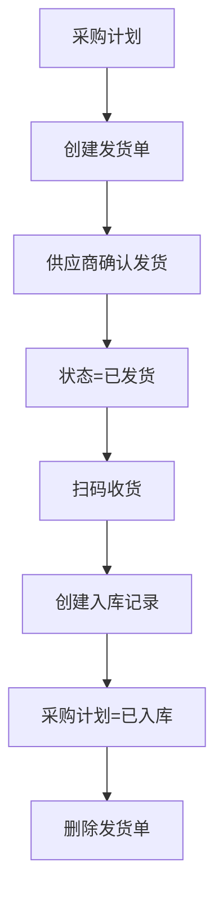

# 发货管理模块

<cite>
**本文档引用的文件**
- [models.py](file://inventory/models.py)
- [views.py](file://inventory/views.py)
- [urls.py](file://inventory/urls.py)
- [delivery_list.html](file://templates/inventory/delivery_list.html)
- [delivery_detail.html](file://templates/inventory/delivery_detail.html)
- [delivery_create.html](file://templates/inventory/delivery_create.html)
- [quick_receive.html](file://templates/inventory/quick_receive.html)
- [user_groups.html](file://templates/inventory/user_groups.html)
- [report.html](file://templates/inventory/report.html)
- [report_monthly.html](file://templates/inventory/report_monthly.html)
</cite>

## 更新摘要
**变更内容**
- 新增发货单模型（Delivery）及其完整生命周期管理
- 实现供应商发货权限控制和安全机制
- 添加发货单状态管理和状态流转逻辑
- 新增发货单与采购计划的关联机制
- 实现二维码生成功能和快速收货流程
- 添加发货单Excel导出和报表统计功能
- 完善权限模型和角色访问控制

## 目录
1. [简介](#简介)
2. [项目结构](#项目结构)
3. [核心组件](#核心组件)
4. [架构概览](#架构概览)
5. [详细组件分析](#详细组件分析)
6. [依赖关系分析](#依赖关系分析)
7. [性能考虑](#性能考虑)
8. [故障排除指南](#故障排除指南)
9. [结论](#结论)
10. [附录](#附录)

## 简介
本文件为发货管理模块的完整技术文档，涵盖发货单创建流程、供应商权限控制、发货状态管理、发货单与采购计划的关联机制、二维码生成与查询、Excel导出与报表统计、权限模型以及业务流程图等内容。文档面向开发与运维人员，帮助理解发货管理模块的设计思路、实现细节与最佳实践。

## 项目结构
发货管理模块位于 inventory 应用内，采用 Django 的 MVC 架构组织代码：
- models.py 定义发货单、采购计划、供应商等核心数据模型
- views.py 实现发货管理的视图逻辑、权限控制、二维码生成与快速收货
- urls.py 定义发货管理相关的路由
- templates/inventory 下的模板文件提供前端界面与交互
- static/media 存储生成的二维码图片



**图表来源**
- [urls.py:1-84](file://inventory/urls.py#L1-L84)
- [views.py:686-804](file://inventory/views.py#L686-L804)
- [models.py:273-310](file://inventory/models.py#L273-L310)

**章节来源**
- [urls.py:1-84](file://inventory/urls.py#L1-L84)
- [views.py:686-804](file://inventory/views.py#L686-L804)
- [models.py:273-310](file://inventory/models.py#L273-L310)

## 核心组件
- 发货单模型（Delivery）：包含发货单号、采购计划关联、实际数量/单价/金额、送货方式、车牌号/运单号、状态、供应商、创建/发货时间、备注等字段；提供保存时计算实际金额的钩子
- 采购计划模型（PurchasePlan）：包含计划编号、项目/材料、计划数量/单价/金额、状态（审批中、采购中、发货中、已入库）、计划日期、操作员、创建/更新时间等
- 权限控制：通过用户角色（admin、material_dept、clerk、supplier）控制对发货管理的访问与操作权限
- 二维码生成：支持两种方式：发货单创建时生成二维码并保存到媒体目录；独立的二维码生成接口返回Base64编码的二维码图片
- 快速收货：基于发货单号的扫码收货流程，创建入库记录并同步更新采购计划状态

**章节来源**
- [models.py:273-310](file://inventory/models.py#L273-L310)
- [models.py:239-271](file://inventory/models.py#L239-L271)
- [views.py:688-696](file://inventory/views.py#L688-L696)
- [views.py:1984-2027](file://inventory/views.py#L1984-L2027)
- [views.py:2030-2180](file://inventory/views.py#L2030-2180)

## 架构概览
发货管理模块遵循前后端分离的视图渲染模式：
- 前端模板负责展示发货单列表、详情与创建表单
- 视图函数处理业务逻辑、权限校验、数据持久化与响应
- 模型层定义数据结构与约束，提供状态变更与计算逻辑
- 二维码生成与快速收货通过AJAX与API接口实现



**图表来源**
- [urls.py:35-41](file://inventory/urls.py#L35-L41)
- [views.py:807-865](file://inventory/views.py#L807-L865)
- [views.py:1984-2027](file://inventory/views.py#L1984-L2027)

**章节来源**
- [urls.py:35-41](file://inventory/urls.py#L35-L41)
- [views.py:807-865](file://inventory/views.py#L807-L865)
- [views.py:1984-2027](file://inventory/views.py#L1984-L2027)

## 详细组件分析

### 发货单创建流程
- 角色限制：仅供应商可创建发货单
- 数据来源：从"已审批"或"发货中"的采购计划中选择
- 关键步骤：
  - 校验采购计划状态（允许创建的范围）
  - 生成发货单号（带日期前缀）
  - 设置实际数量/单价/送货方式等
  - 保存发货单并更新采购计划状态为"发货中"
  - 生成二维码并保存到媒体目录
  - 记录操作日志



**图表来源**
- [views.py:807-865](file://inventory/views.py#L807-L865)
- [models.py:273-310](file://inventory/models.py#L273-L310)

**章节来源**
- [views.py:807-865](file://inventory/views.py#L807-L865)
- [models.py:273-310](file://inventory/models.py#L273-L310)

### 供应商发货权限控制与安全机制
- 角色判定：通过用户档案的 role 字段区分 admin、material_dept、clerk、supplier
- 访问控制：
  - 发货列表：所有可管理发货的用户（admin、material_dept、supplier）均可访问
  - 创建发货单：仅供应商可操作
  - 查看详情：供应商仅能查看自己的发货单
  - 确认发货：仅发货单对应的供应商可操作
- 安全措施：
  - CSRF 保护：所有表单均包含 CSRF token
  - 状态校验：防止重复发货或对非发货状态执行操作
  - 操作日志：记录关键操作（创建、更新、导出等）

**章节来源**
- [views.py:688-696](file://inventory/views.py#L688-L696)
- [views.py:807-865](file://inventory/views.py#L807-L865)
- [views.py:29-33](file://inventory/views.py#L29-L33)

### 发货单状态管理
- 状态枚举：待发货（pending）、已发货（shipped）、已收货（received）
- 状态流转：
  - 创建发货单：状态为 pending
  - 供应商确认发货：状态变更为 shipped，并记录发货时间
  - 快速收货：创建入库记录后，采购计划状态更新为 received，发货单被删除
- 状态约束：
  - 仅 shipped 状态可进行快速收货
  - received 状态不可重复收货



**图表来源**
- [models.py:279-283](file://inventory/models.py#L279-L283)
- [views.py:882-909](file://inventory/views.py#L882-L909)
- [views.py:2100-2180](file://inventory/views.py#L2100-L2180)

**章节来源**
- [models.py:279-283](file://inventory/models.py#L279-L283)
- [views.py:882-909](file://inventory/views.py#L882-L909)
- [views.py:2100-2180](file://inventory/views.py#L2100-L2180)

### 发货单与采购计划的关联与数据同步
- 关联关系：Delivery.purchase_plan 外键指向 PurchasePlan，一对多关系
- 同步机制：
  - 创建发货单时：将采购计划状态更新为"发货中"
  - 快速收货时：创建入库记录后，采购计划状态更新为"已入库"，发货单删除
- 查询优化：视图中使用 select_related 预加载关联对象，减少数据库查询次数

**章节来源**
- [models.py:285-286](file://inventory/models.py#L285-L286)
- [views.py:834-836](file://inventory/views.py#L834-L836)
- [views.py:2159-2166](file://inventory/views.py#L2159-L2166)

### 发货单二维码生成功能
- 生成时机：
  - 创建发货单时：使用 qrcode 库生成二维码并保存到 media/qrcodes/<年>/<月> 目录
  - 独立接口：/deliveries/<id>/qrcode/ 返回 Base64 编码的二维码图片与展示数据
- 内容格式：
  - 接口返回的数据包含发货单号、项目、材料、数量、供应商等信息
  - 二维码图片内容为纯文本发货单号，便于扫码识别
- 存储方式：ImageField 自动保存到 MEDIA_ROOT 下的指定路径

```mermaid
sequenceDiagram
participant Client as "浏览器"
participant View as "generate_delivery_qrcode"
participant FS as "文件系统"
Client->>View : GET /deliveries/<id>/qrcode/
View->>FS : 生成二维码并写入内存缓冲区
View-->>Client : 返回 {qrcode : data : image/png;base64,..., data : {...}}
Note over Client,FS : 发货单创建时也生成二维码并保存到媒体目录
```

**图表来源**
- [views.py:1984-2027](file://inventory/views.py#L1984-L2027)
- [views.py:838-850](file://inventory/views.py#L838-L850)

**章节来源**
- [views.py:1984-2027](file://inventory/views.py#L1984-L2027)
- [views.py:838-850](file://inventory/views.py#L838-L850)

### 发货单查询与统计功能
- 发货单查询：
  - 列表页支持按状态、供应商、时间范围等条件筛选（前端表单提交）
  - 详情页展示发货单的完整信息与二维码
- 报表统计：
  - 项目采购分析、供应商采购分析、月度入库统计
  - 支持导出 Excel 报表（通过 /export/?type=... 接口）
- 快速收货：
  - 支持扫码或手动输入发货单号查询
  - 收货后自动生成入库记录并同步状态

**章节来源**
- [delivery_list.html:1-253](file://templates/inventory/delivery_list.html#L1-L253)
- [delivery_detail.html:1-130](file://templates/inventory/delivery_detail.html#L1-L130)
- [quick_receive.html:1-387](file://templates/inventory/quick_receive.html#L1-L387)
- [report.html:1-97](file://templates/inventory/report.html#L1-L97)
- [report_monthly.html:1-27](file://templates/inventory/report_monthly.html#L1-L27)
- [views.py:722-804](file://inventory/views.py#L722-L804)
- [views.py:2030-2180](file://inventory/views.py#L2030-L2180)

### 权限模型与角色说明
- 角色定义：admin（管理员）、material_dept（物资部）、clerk（材料员）、supplier（供应商）
- 权限矩阵：
  - 管理员：全部权限
  - 物资部：管理权限（采购计划审批、入库管理、报表查看、数据导出）
  - 材料员：操作权限（入库记录管理、采购计划申请、库存查询）
  - 供应商：仅发货管理（创建发货单、确认发货、生成二维码）
- 登录跳转：供应商登录后直接跳转至发货管理页面

**章节来源**
- [user_groups.html:1-224](file://templates/inventory/user_groups.html#L1-L224)
- [views.py:115-136](file://inventory/views.py#L115-L136)

## 依赖关系分析
- 模块耦合：
  - views.py 依赖 models.py 中的模型定义与状态枚举
  - 模板依赖视图提供的上下文数据与URL反向解析
  - 二维码生成依赖 qrcode 库与 Django 文件存储
- 外部依赖：
  - qrcode：生成二维码
  - openpyxl：Excel 导出
  - html5-qrcode：前端扫码识别



**图表来源**
- [views.py:9-19](file://inventory/views.py#L9-L19)
- [views.py:722-804](file://inventory/views.py#L722-L804)
- [quick_receive.html:151-387](file://templates/inventory/quick_receive.html#L151-L387)

**章节来源**
- [views.py:9-19](file://inventory/views.py#L9-L19)
- [views.py:722-804](file://inventory/views.py#L722-L804)
- [quick_receive.html:151-387](file://templates/inventory/quick_receive.html#L151-L387)

## 性能考虑
- 查询优化：使用 select_related 预加载关联对象，减少 N+1 查询
- 二维码生成：采用内存缓冲区避免磁盘频繁 IO；接口返回 Base64 减少二次读取
- Excel 导出：按需生成工作簿，避免一次性加载大量数据
- 前端交互：快速收货页面使用 AJAX 异步查询与提交，提升用户体验

## 故障排除指南
- 供应商无法创建发货单
  - 检查用户角色是否为 supplier
  - 确认采购计划状态在允许范围内
- 二维码生成失败
  - 检查 qrcode 库安装与权限
  - 确认媒体目录可写
- 快速收货异常
  - 确认发货单状态为 shipped
  - 检查收货日期、项目地址、验收人等必填项
- Excel 导出报错
  - 检查导出类型参数是否正确
  - 确认 openpyxl 库版本兼容性

**章节来源**
- [views.py:817-820](file://inventory/views.py#L817-L820)
- [views.py:838-850](file://inventory/views.py#L838-L850)
- [views.py:2110-2116](file://inventory/views.py#L2110-L2116)
- [views.py:798-804](file://inventory/views.py#L798-L804)

## 结论
发货管理模块通过清晰的角色权限控制、严谨的状态流转与完善的业务流程，实现了从采购计划到发货单再到入库收货的闭环管理。模块具备良好的扩展性与安全性，支持二维码与Excel导出等实用功能，满足工程物资管理的实际需求。

## 附录

### 业务流程图（概念性）


[本图为概念性流程示意，不对应具体源码文件]