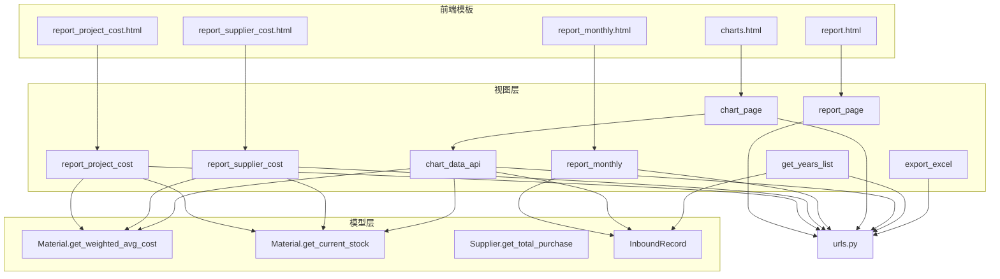
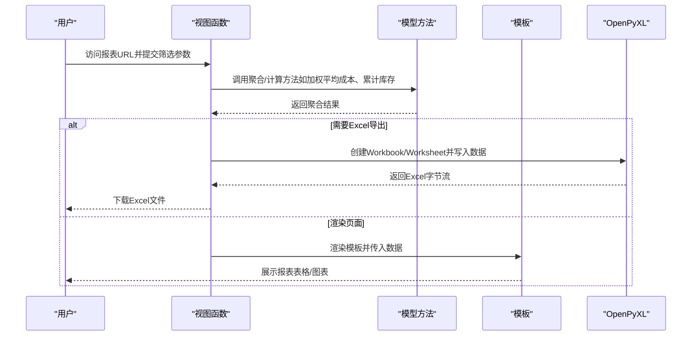
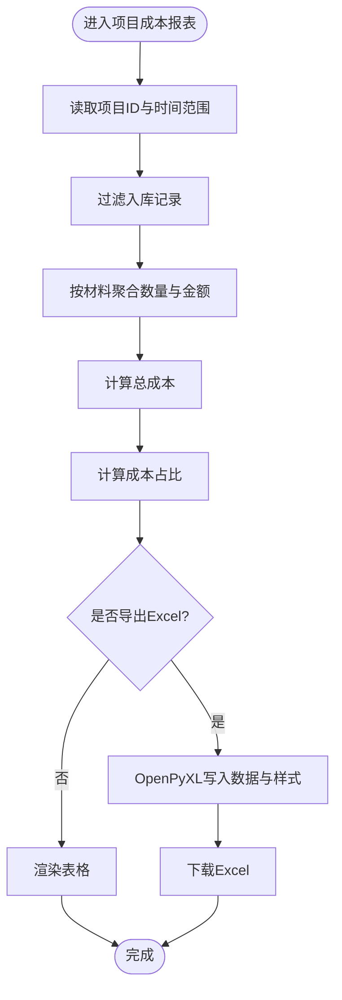
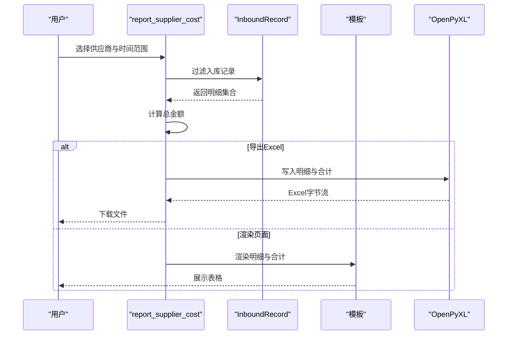
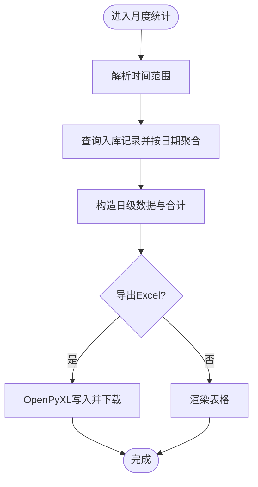
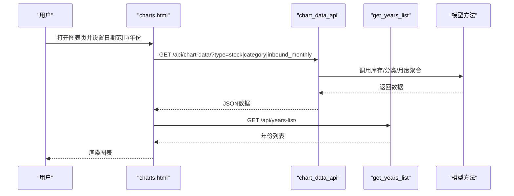
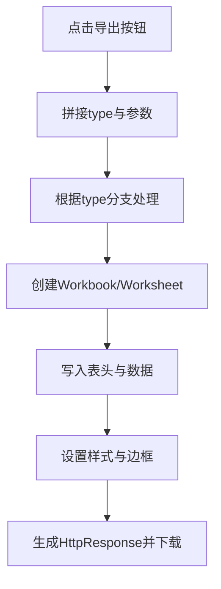
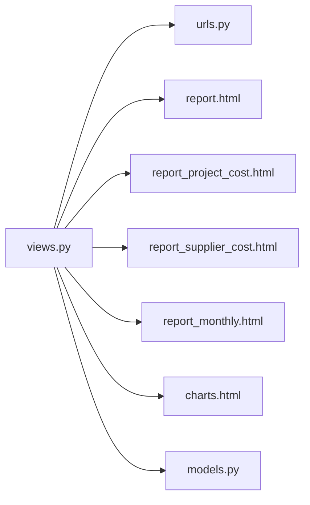

# 报表与数据分析模块

<cite>
**本文引用的文件**
- [inventory/views.py](file://inventory/views.py)
- [inventory/models.py](file://inventory/models.py)
- [inventory/urls.py](file://inventory/urls.py)
- [templates/inventory/report.html](file://templates/inventory/report.html)
- [templates/inventory/report_project_cost.html](file://templates/inventory/report_project_cost.html)
- [templates/inventory/report_supplier_cost.html](file://templates/inventory/report_supplier_cost.html)
- [templates/inventory/report_monthly.html](file://templates/inventory/report_monthly.html)
- [templates/inventory/charts.html](file://templates/inventory/charts.html)
- [requirements.txt](file://requirements.txt)
</cite>

## 目录
1. [简介](#简介)
2. [项目结构](#项目结构)
3. [核心组件](#核心组件)
4. [架构总览](#架构总览)
5. [详细组件分析](#详细组件分析)
6. [依赖关系分析](#依赖关系分析)
7. [性能考量](#性能考量)
8. [故障排查指南](#故障排查指南)
9. [结论](#结论)
10. [附录](#附录)

## 简介
本模块围绕“报表与数据分析”构建，提供多类报表与可视化能力：
- 报表功能：项目成本报表、供应商成本报表、月度入库统计、通用Excel导出
- 数据导出：基于OpenPyXL的Excel导出，含样式与边框控制
- 图表可视化：库存价值TOP10、分类库存分布、月度入库趋势
- 数据计算：加权平均成本、成本分摊、统计指标（金额、占比）
- 查询参数：时间范围、项目筛选、供应商筛选、导出开关
- 性能优化：数据库聚合、批量查询、前端图表懒加载
- 定制与扩展：模板与视图解耦，易于新增报表类型

## 项目结构
报表与数据分析相关代码主要分布在以下位置：
- 视图层：inventory/views.py 中的报表与图表相关函数
- 模型层：inventory/models.py 中的成本与聚合方法
- URL路由：inventory/urls.py 中的报表与图表路由
- 模板层：templates/inventory 下的报表与图表HTML模板
- 依赖：requirements.txt 中的openpyxl、qrcode等

**图表来源**
- [inventory/views.py:961-1286](file://inventory/views.py#L961-L1286)
- [inventory/models.py:117-178](file://inventory/models.py#L117-L178)
- [inventory/urls.py:54-64](file://inventory/urls.py#L54-L64)
- [templates/inventory/report.html:1-97](file://templates/inventory/report.html#L1-L97)
- [templates/inventory/report_project_cost.html:1-58](file://templates/inventory/report_project_cost.html#L1-L58)
- [templates/inventory/report_supplier_cost.html:1-83](file://templates/inventory/report_supplier_cost.html#L1-L83)
- [templates/inventory/report_monthly.html:1-27](file://templates/inventory/report_monthly.html#L1-L27)
- [templates/inventory/charts.html:1-245](file://templates/inventory/charts.html#L1-L245)

**章节来源**
- [inventory/views.py:961-1286](file://inventory/views.py#L961-L1286)
- [inventory/models.py:117-178](file://inventory/models.py#L117-L178)
- [inventory/urls.py:54-64](file://inventory/urls.py#L54-L64)
- [templates/inventory/report.html:1-97](file://templates/inventory/report.html#L1-L97)
- [templates/inventory/report_project_cost.html:1-58](file://templates/inventory/report_project_cost.html#L1-L58)
- [templates/inventory/report_supplier_cost.html:1-83](file://templates/inventory/report_supplier_cost.html#L1-L83)
- [templates/inventory/report_monthly.html:1-27](file://templates/inventory/report_monthly.html#L1-L27)
- [templates/inventory/charts.html:1-245](file://templates/inventory/charts.html#L1-L245)

## 核心组件
- 报表入口页：提供项目成本、供应商成本、月度统计三类报表入口与筛选表单
- 项目成本报表：按材料维度聚合数量与金额，计算成本占比，支持Excel导出
- 供应商成本报表：按项目维度展示供应商采购明细与合计，支持Excel导出
- 月度统计报表：按日聚合入库金额，支持Excel导出
- 图表分析：库存价值TOP10（柱状）、分类库存分布（饼图）、月度入库趋势（折线）
- Excel导出：统一使用OpenPyXL生成工作簿，设置表头样式与边框，支持多种报表类型
- 数据模型：Material提供加权平均成本与累计库存；InboundRecord提供金额与日期字段

**章节来源**
- [inventory/views.py:961-1286](file://inventory/views.py#L961-L1286)
- [inventory/models.py:117-178](file://inventory/models.py#L117-L178)
- [templates/inventory/report.html:1-97](file://templates/inventory/report.html#L1-L97)

## 架构总览
报表与数据分析采用“模板+视图+模型”的三层架构：
- 视图负责接收查询参数、执行聚合计算、渲染模板或返回Excel流
- 模型提供成本与库存计算方法，支撑视图的数据需求
- 模板负责展示与交互，图表页通过AJAX调用API获取数据

**图表来源**
- [inventory/views.py:970-1207](file://inventory/views.py#L970-L1207)
- [inventory/models.py:117-178](file://inventory/models.py#L117-L178)
- [templates/inventory/report_project_cost.html:1-58](file://templates/inventory/report_project_cost.html#L1-L58)
- [templates/inventory/report_supplier_cost.html:1-83](file://templates/inventory/report_supplier_cost.html#L1-L83)
- [templates/inventory/report_monthly.html:1-27](file://templates/inventory/report_monthly.html#L1-L27)

## 详细组件分析

### 项目成本报表
- 功能概述：按项目筛选入库记录，按材料维度聚合数量与金额，计算成本占比，支持Excel导出
- 关键流程：
  - 接收项目ID与时间范围参数
  - 过滤入库记录并按材料聚合
  - 计算总成本与每项占比
  - 渲染表格或生成Excel
- 数据计算：
  - 成本占比 = 单项成本 / 总成本 × 100%
  - 加权平均成本：由模型方法提供
- Excel导出：
  - 表头样式与边框
  - 合计行加粗

**图表来源**
- [inventory/views.py:970-1056](file://inventory/views.py#L970-L1056)
- [templates/inventory/report_project_cost.html:1-58](file://templates/inventory/report_project_cost.html#L1-L58)

**章节来源**
- [inventory/views.py:970-1056](file://inventory/views.py#L970-L1056)
- [templates/inventory/report_project_cost.html:1-58](file://templates/inventory/report_project_cost.html#L1-L58)

### 供应商成本报表
- 功能概述：按供应商筛选入库记录，按项目维度展示明细与合计，支持Excel导出
- 关键流程：
  - 接收供应商ID与时间范围参数
  - 过滤入库记录并构造明细列表
  - 计算总金额
  - 渲染表格或生成Excel
- Excel导出：
  - 表头样式与边框
  - 合计行加粗

**图表来源**
- [inventory/views.py:1058-1137](file://inventory/views.py#L1058-L1137)
- [templates/inventory/report_supplier_cost.html:1-83](file://templates/inventory/report_supplier_cost.html#L1-L83)

**章节来源**
- [inventory/views.py:1058-1137](file://inventory/views.py#L1058-L1137)
- [templates/inventory/report_supplier_cost.html:1-83](file://templates/inventory/report_supplier_cost.html#L1-L83)

### 月度入库统计
- 功能概述：按日聚合入库金额，支持Excel导出
- 关键流程：
  - 接收时间范围参数
  - 按日期聚合总金额
  - 渲染表格或生成Excel

**图表来源**
- [inventory/views.py:1139-1207](file://inventory/views.py#L1139-L1207)
- [templates/inventory/report_monthly.html:1-27](file://templates/inventory/report_monthly.html#L1-L27)

**章节来源**
- [inventory/views.py:1139-1207](file://inventory/views.py#L1139-L1207)
- [templates/inventory/report_monthly.html:1-27](file://templates/inventory/report_monthly.html#L1-L27)

### 图表分析
- 功能概述：库存价值TOP10（柱状）、分类库存分布（饼图）、月度入库趋势（折线）
- 数据来源：
  - 库存价值TOP10：Material.get_current_stock + get_weighted_avg_cost
  - 分类库存分布：Category.materials遍历并聚合
  - 月度入库趋势：按年聚合InboundRecord.total_amount
- 前端交互：
  - charts.html 通过fetch调用 /api/chart-data/ 与 /api/years-list/
  - Chart.js渲染不同图表类型

**图表来源**
- [templates/inventory/charts.html:1-245](file://templates/inventory/charts.html#L1-L245)
- [inventory/views.py:1215-1286](file://inventory/views.py#L1215-L1286)
- [inventory/models.py:117-178](file://inventory/models.py#L117-L178)

**章节来源**
- [templates/inventory/charts.html:1-245](file://templates/inventory/charts.html#L1-L245)
- [inventory/views.py:1215-1286](file://inventory/views.py#L1215-L1286)
- [inventory/models.py:117-178](file://inventory/models.py#L117-L178)

### Excel数据导出
- 实现要点：
  - 使用OpenPyXL创建Workbook/Worksheet
  - 写入表头并设置字体加粗、背景色、边框
  - 支持多种报表类型（库存汇总、入库记录、项目成本、供应商成本、月度统计）
  - 返回HttpResponse并设置Content-Disposition为附件下载
- 依赖库：openpyxl

**图表来源**
- [inventory/views.py:709-780](file://inventory/views.py#L709-L780)
- [inventory/views.py:992-1037](file://inventory/views.py#L992-L1037)
- [inventory/views.py:1080-1118](file://inventory/views.py#L1080-L1118)
- [inventory/views.py:1151-1188](file://inventory/views.py#L1151-L1188)
- [requirements.txt](file://requirements.txt#L7)

**章节来源**
- [inventory/views.py:709-780](file://inventory/views.py#L709-L780)
- [inventory/views.py:992-1037](file://inventory/views.py#L992-L1037)
- [inventory/views.py:1080-1118](file://inventory/views.py#L1080-L1118)
- [inventory/views.py:1151-1188](file://inventory/views.py#L1151-L1188)
- [requirements.txt](file://requirements.txt#L7)

## 依赖关系分析
- 视图与模板：
  - report_page -> report.html
  - report_project_cost -> report_project_cost.html
  - report_supplier_cost -> report_supplier_cost.html
  - report_monthly -> report_monthly.html
  - chart_page -> charts.html
- 视图与模型：
  - 报表视图调用Material.get_weighted_avg_cost、get_current_stock
  - 图表视图调用InboundRecord聚合与日期范围过滤
- 视图与URL：
  - 所有报表与图表路由在inventory/urls.py中注册

**图表来源**
- [inventory/views.py:961-1286](file://inventory/views.py#L961-L1286)
- [inventory/urls.py:54-64](file://inventory/urls.py#L54-L64)
- [templates/inventory/report.html:1-97](file://templates/inventory/report.html#L1-L97)
- [templates/inventory/report_project_cost.html:1-58](file://templates/inventory/report_project_cost.html#L1-L58)
- [templates/inventory/report_supplier_cost.html:1-83](file://templates/inventory/report_supplier_cost.html#L1-L83)
- [templates/inventory/report_monthly.html:1-27](file://templates/inventory/report_monthly.html#L1-L27)
- [templates/inventory/charts.html:1-245](file://templates/inventory/charts.html#L1-L245)
- [inventory/models.py:117-178](file://inventory/models.py#L117-L178)

**章节来源**
- [inventory/views.py:961-1286](file://inventory/views.py#L961-L1286)
- [inventory/urls.py:54-64](file://inventory/urls.py#L54-L64)
- [templates/inventory/report.html:1-97](file://templates/inventory/report.html#L1-L97)
- [templates/inventory/report_project_cost.html:1-58](file://templates/inventory/report_project_cost.html#L1-L58)
- [templates/inventory/report_supplier_cost.html:1-83](file://templates/inventory/report_supplier_cost.html#L1-L83)
- [templates/inventory/report_monthly.html:1-27](file://templates/inventory/report_monthly.html#L1-L27)
- [templates/inventory/charts.html:1-245](file://templates/inventory/charts.html#L1-L245)
- [inventory/models.py:117-178](file://inventory/models.py#L117-L178)

## 性能考量
- 数据库聚合：
  - 使用Django ORM聚合函数（Sum、Count、Max、Min）减少Python侧循环
  - 在图表与报表中尽量一次性聚合，避免多次查询
- 批量查询：
  - select_related预加载外键对象，减少N+1查询
- 时间范围过滤：
  - 在视图层直接对InboundRecord进行日期范围过滤，避免全量加载
- Excel导出：
  - OpenPyXL写入时逐行写入，避免一次性构造大对象
- 前端图表：
  - 年份列表与图表数据按需加载，避免初始渲染压力

[本节为通用性能建议，不直接分析具体文件，故无“章节来源”]

## 故障排查指南
- Excel导出失败
  - 检查OpenPyXL版本与依赖安装
  - 确认视图中Workbook/Worksheet创建与响应头设置正确
- 报表无数据
  - 检查筛选参数（项目/供应商/时间范围）是否正确传递
  - 确认InboundRecord中是否存在对应时间段的数据
- 图表空白
  - 检查 /api/chart-data/ 返回数据格式与前端Chart.js初始化
  - 确认 /api/years-list/ 是否返回有效年份列表
- 权限问题
  - 确认用户角色具备访问报表与图表的权限

**章节来源**
- [requirements.txt](file://requirements.txt#L7)
- [inventory/views.py:1215-1286](file://inventory/views.py#L1215-L1286)

## 结论
本模块以清晰的职责划分与简洁的实现，提供了完整的报表与可视化能力。通过模型层的成本与库存计算方法，视图层的参数处理与聚合逻辑，以及模板层的展示与交互，形成了高内聚、低耦合的报表体系。结合OpenPyXL的Excel导出与Chart.js的前端可视化，满足了日常管理与决策分析的需求。后续可在保持现有架构稳定的基础上，按需扩展新的报表类型与图表维度。

[本节为总结性内容，不直接分析具体文件，故无“章节来源”]

## 附录

### 报表查询参数处理机制
- 项目成本报表：project_id、date_from、date_to、export
- 供应商成本报表：supplier_id、date_from、date_to、export
- 月度统计：date_from、date_to、export
- 图表分析：type（stock/category/inbound_monthly）、date_from、date_to、year

**章节来源**
- [inventory/views.py:970-1207](file://inventory/views.py#L970-L1207)
- [inventory/views.py:1215-1286](file://inventory/views.py#L1215-L1286)

### 报表数据计算逻辑
- 加权平均成本：按累计入库金额/累计入库数量计算
- 成本分摊：按材料维度累加金额并计算占比
- 统计指标：按日/按月聚合入库金额，支持合计行

**章节来源**
- [inventory/models.py:117-178](file://inventory/models.py#L117-L178)
- [inventory/views.py:1039-1051](file://inventory/views.py#L1039-L1051)
- [inventory/views.py:1189-1202](file://inventory/views.py#L1189-L1202)

### 报表定制与扩展开发指导
- 新增报表类型步骤：
  - 在inventory/views.py中新增视图函数，处理参数、聚合数据、渲染模板或导出Excel
  - 在inventory/urls.py中注册新路由
  - 在templates/inventory/中新增或复用模板
  - 如需图表，新增chart_data_api分支并更新前端charts.html
- 最佳实践：
  - 优先使用ORM聚合，避免Python侧大量循环
  - 对外键字段使用select_related，减少查询次数
  - Excel导出时统一设置表头样式与边框，提升可读性
  - 图表数据按需加载，避免一次性渲染过多数据

**章节来源**
- [inventory/views.py:961-1286](file://inventory/views.py#L961-L1286)
- [inventory/urls.py:54-64](file://inventory/urls.py#L54-L64)
- [templates/inventory/charts.html:1-245](file://templates/inventory/charts.html#L1-L245)