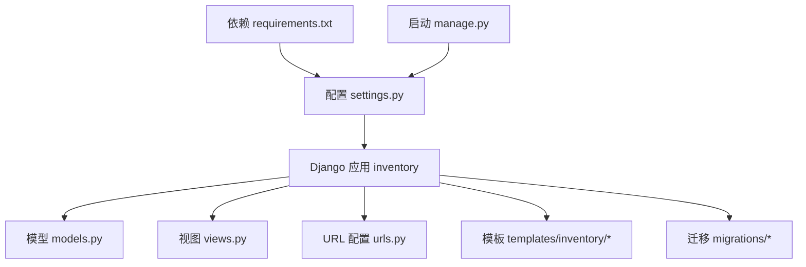
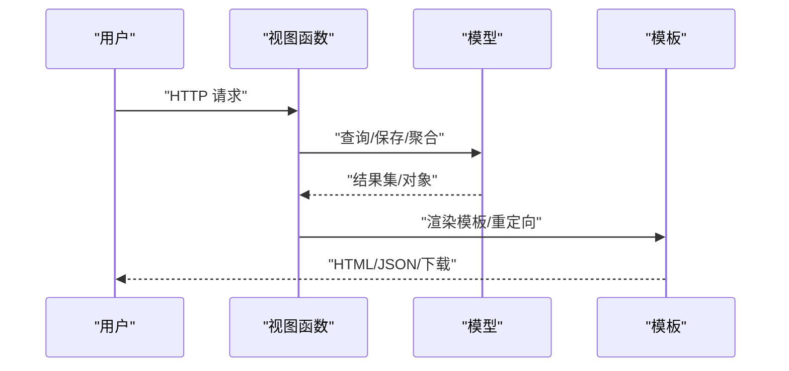
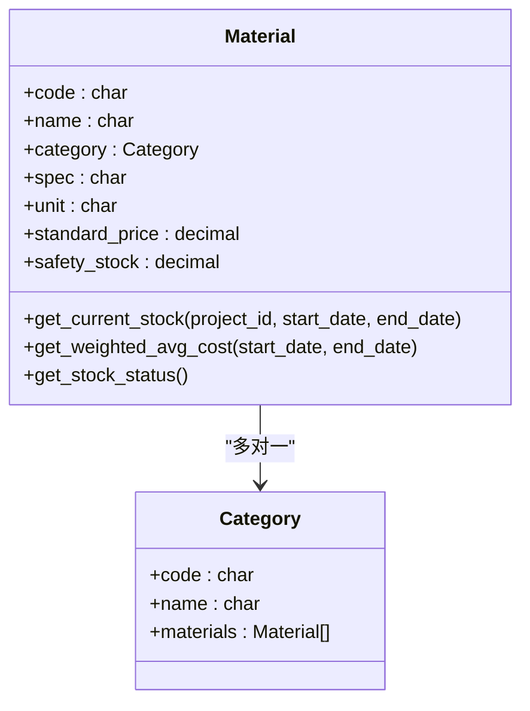
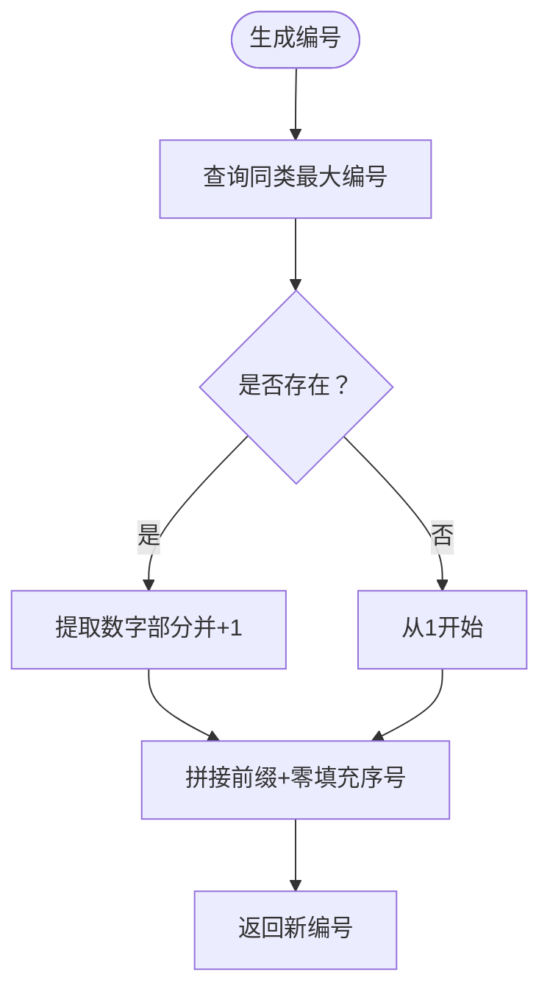
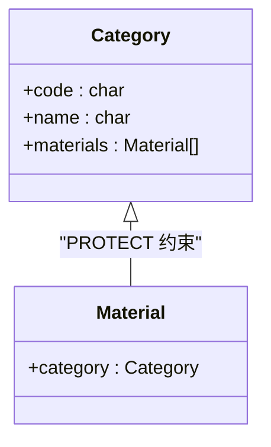
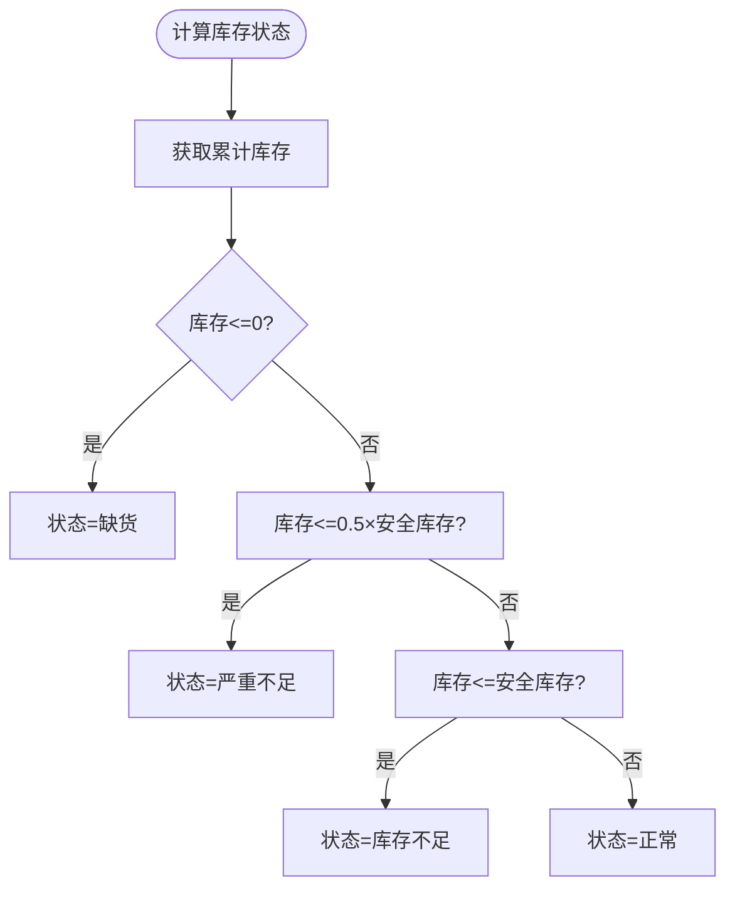
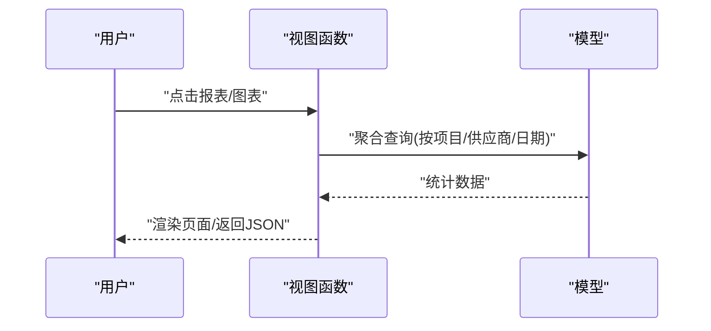
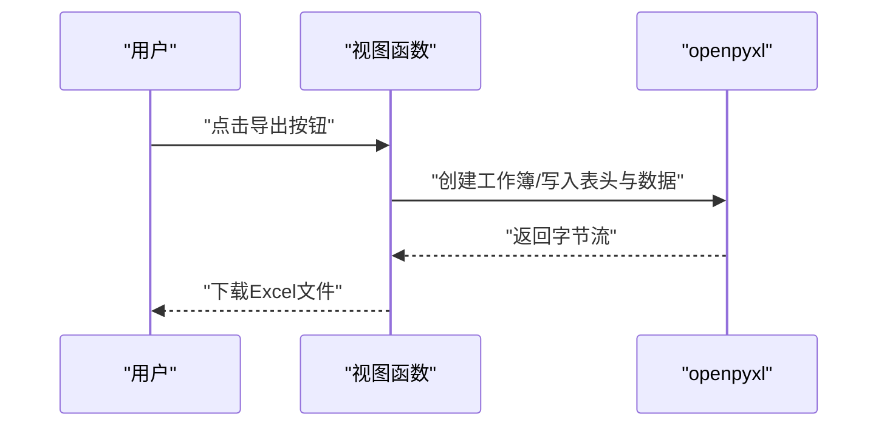
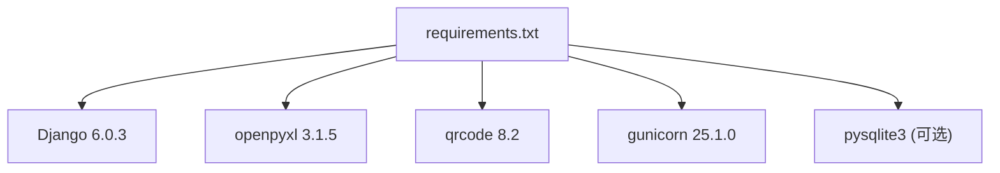

# 材料管理模块

<cite>
**本文档引用的文件**
- [models.py](file://inventory/models.py)
- [views.py](file://inventory/views.py)
- [urls.py](file://inventory/urls.py)
- [settings.py](file://material_system/settings.py)
- [material_list.html](file://templates/inventory/material_list.html)
- [charts.html](file://templates/inventory/charts.html)
- [report.html](file://templates/inventory/report.html)
- [0001_initial.py](file://inventory/migrations/0001_initial.py)
- [requirements.txt](file://requirements.txt)
- [manage.py](file://manage.py)
</cite>

## 目录
1. [简介](#简介)
2. [项目结构](#项目结构)
3. [核心组件](#核心组件)
4. [架构总览](#架构总览)
5. [详细组件分析](#详细组件分析)
6. [依赖分析](#依赖分析)
7. [性能考虑](#性能考虑)
8. [故障排查指南](#故障排查指南)
9. [结论](#结论)
10. [附录](#附录)

## 简介
本项目是一个基于 Django 的工程项目材料出入库管理系统，涵盖材料档案、材料分类、供应商、采购计划、发货管理、入库管理、统计报表与图表分析、Excel 导出、快速收货等核心功能。系统通过统一的编号生成规则保障实体唯一性，提供加权平均成本计算、安全库存预警、库存价值计算与可视化展示，并具备完善的权限控制与操作日志。

## 项目结构
- 后端采用 Django 应用 inventory，包含模型、视图、URL、模板与迁移文件。
- 配置位于 material_system/settings.py，数据库默认使用 SQLite，支持 pysqlite3 兼容层。
- 前端模板位于 templates/inventory，包含材料列表、图表分析、报表入口等页面。
- requirements.txt 定义了运行依赖，如 Django、openpyxl、qrcode、gunicorn 等。

**图表来源**
- [models.py:1-328](file://inventory/models.py#L1-L328)
- [views.py:1-1862](file://inventory/views.py#L1-L1862)
- [urls.py:1-80](file://inventory/urls.py#L1-L80)
- [settings.py:1-210](file://material_system/settings.py#L1-L210)
- [requirements.txt:1-16](file://requirements.txt#L1-L16)
- [manage.py:1-23](file://manage.py#L1-L23)

**章节来源**
- [settings.py:1-210](file://material_system/settings.py#L1-L210)
- [urls.py:1-80](file://inventory/urls.py#L1-L80)

## 核心组件
- 数据模型层：Material、Category、Supplier、Project、InboundRecord、PurchasePlan、Delivery、OperationLog、Profile。
- 视图层：提供 CRUD、权限控制、Excel 导出、图表数据接口、报表导出、批量导入、二维码生成、快速收货等功能。
- 模板层：材料列表、图表分析、报表入口等前端页面。
- 配置层：数据库、静态资源、媒体资源、日志、国际化与时区等。

**章节来源**
- [models.py:7-328](file://inventory/models.py#L7-L328)
- [views.py:1-800](file://inventory/views.py#L1-L800)
- [material_list.html:1-185](file://templates/inventory/material_list.html#L1-L185)

## 架构总览
系统采用经典的 MVC 架构：
- 控制器：views.py 中的函数视图处理请求、权限校验、业务逻辑与响应。
- 模型：models.py 定义数据结构与关系，提供聚合查询与库存计算方法。
- 视图模板：templates/inventory 提供前端页面与交互。
- URL 路由：inventory/urls.py 将请求映射到对应视图。

**图表来源**
- [views.py:233-301](file://inventory/views.py#L233-L301)
- [models.py:92-178](file://inventory/models.py#L92-L178)
- [material_list.html:28-82](file://templates/inventory/material_list.html#L28-L82)

## 详细组件分析

### 材料档案（Material）与 CRUD 实现
- 数据模型：Material 包含编号、名称、分类、规格、单位、标准单价、安全库存、备注与创建时间；提供 get_current_stock、get_weighted_avg_cost、get_stock_status 等方法。
- CRUD 视图：
  - 列表与筛选：material_list 支持按关键字与分类筛选，计算库存、加权成本与库存状态。
  - 保存：material_save 自动生成编号（generate_code），支持新增与更新。
  - 删除：material_delete 在无入库记录时允许删除。
  - 详情 API：material_detail_api 返回 JSON 数据供前端弹窗编辑。
- 前端模板：material_list.html 展示材料列表、状态徽章、导出按钮与批量导入入口。

**图表来源**
- [models.py:92-178](file://inventory/models.py#L92-L178)
- [models.py:78-90](file://inventory/models.py#L78-L90)

**章节来源**
- [models.py:92-178](file://inventory/models.py#L92-L178)
- [views.py:233-301](file://inventory/views.py#L233-L301)
- [material_list.html:28-82](file://templates/inventory/material_list.html#L28-L82)

### 材料编码生成规则与唯一性保证
- 编号前缀与序列：generate_code(prefix, model_class, field) 从同前缀最大编号中提取数字部分并递增，确保同类型实体编号唯一。
- 唯一性约束：模型字段 code、no 等使用 unique=True，数据库层面保证唯一。
- 示例：材料编号 MAT001、供应商 SUP001、项目 PJ001、入库单 IN+日期+序号、采购计划 PP+日期+序号、发货单 DL+日期+序号。

**图表来源**
- [views.py:66-103](file://inventory/views.py#L66-L103)

**章节来源**
- [views.py:66-103](file://inventory/views.py#L66-L103)
- [models.py:99-209](file://inventory/models.py#L99-L209)

### 材料分类管理机制
- 分类模型：Category 包含编号、名称与备注，唯一性由 code 字段保证。
- 关联关系：Material.category 为外键，PROTECT 约束防止删除仍有材料的分类。
- 管理接口：
  - 列表 API：category_list_api 返回分类列表。
  - 初始化与自定义：init_categories、add_custom_category、delete_category 支持分类维护。
  - 前端：settings 页面支持初始化默认分类与自定义分类管理。

**图表来源**
- [models.py:78-101](file://inventory/models.py#L78-L101)
- [views.py:225-229](file://inventory/views.py#L225-L229)

**章节来源**
- [models.py:78-101](file://inventory/models.py#L78-L101)
- [views.py:790-847](file://inventory/views.py#L790-L847)

### 材料库存管理核心算法
- 累计入库量：get_current_stock 支持按项目、日期范围聚合入库数量。
- 加权平均成本：get_weighted_avg_cost 与 _get_avg_cost_at_date 基于入库总金额/总量计算，无数据时回退到最近一次单价。
- 库存状态：get_stock_status 基于安全库存阈值返回“缺货/严重不足/库存不足/正常”状态与颜色标识。
- 库存价值：在列表页计算 stock_value = stock × avg_cost，用于图表与报表。

**图表来源**
- [models.py:169-178](file://inventory/models.py#L169-L178)

**章节来源**
- [models.py:117-178](file://inventory/models.py#L117-L178)
- [views.py:233-255](file://inventory/views.py#L233-L255)

### 材料查询统计功能
- 材料列表：支持按关键字（编号/名称/规格）与分类筛选，计算库存、加权成本与状态。
- 报表页面：report.html 提供项目采购分析、供应商采购分析、月度统计入口。
- 报表导出：支持 Excel 导出（openpyxl），包含项目成本分析、供应商分析、月度统计等。
- 图表分析：charts.html 通过 API 获取库存价值 TOP10、分类库存分布、月度入库趋势。

**图表来源**
- [views.py:961-1207](file://inventory/views.py#L961-L1207)
- [views.py:1215-1286](file://inventory/views.py#L1215-L1286)

**章节来源**
- [views.py:233-255](file://inventory/views.py#L233-L255)
- [views.py:961-1207](file://inventory/views.py#L961-L1207)
- [views.py:1215-1286](file://inventory/views.py#L1215-L1286)
- [report.html:1-97](file://templates/inventory/report.html#L1-L97)
- [charts.html:1-245](file://templates/inventory/charts.html#L1-L245)

### Excel 导出与图表展示机制
- Excel 导出：
  - inventory 类型：导出材料的入库汇总（材料编号、名称、分类、规格、单位、累计入库量、安全库存、入库均价、入库总值）。
  - inbound 类型：导出入库记录明细。
- 图表展示：
  - 库存价值 TOP10：按材料库存价值排序取前 10。
  - 分类库存分布：按分类汇总库存价值。
  - 月度入库趋势：按年份统计月度入库金额。
- 前端：charts.html 使用 Chart.js 动态加载数据并渲染。

**图表来源**
- [views.py:709-780](file://inventory/views.py#L709-L780)
- [views.py:1215-1286](file://inventory/views.py#L1215-L1286)

**章节来源**
- [views.py:709-780](file://inventory/views.py#L709-L780)
- [views.py:1215-1286](file://inventory/views.py#L1215-L1286)
- [charts.html:1-245](file://templates/inventory/charts.html#L1-L245)

### 材料管理的扩展开发指导
- 新增模型：遵循唯一性字段命名规范（code/no），在 migrations 中定义字段与约束。
- 新增视图：使用装饰器 admin_required/can_manage_inventory/can_manage_purchase_plan 等进行权限控制。
- 新增模板：复用 base.html，使用 Bootstrap 组件与表单，注意 CSRF 保护。
- 扩展导出：参考 export_excel，使用 openpyxl 写入表头与数据。
- 扩展图表：在 chart_data_api 中新增类型分支，前端 charts.html 中新增图表容器与渲染逻辑。

**章节来源**
- [views.py:55-64](file://inventory/views.py#L55-L64)
- [views.py:709-780](file://inventory/views.py#L709-L780)
- [views.py:1215-1286](file://inventory/views.py#L1215-L1286)
- [charts.html:1-245](file://templates/inventory/charts.html#L1-L245)

## 依赖分析
- Django 版本：Django==6.0.3
- Excel 处理：openpyxl==3.1.5
- 二维码：qrcode==8.2
- 数据库：默认 sqlite3，支持 pysqlite3 替代以修复 getlimit 兼容性问题
- Web 服务器：gunicorn==25.1.0
- 环境变量：python-dotenv==1.2.2

**图表来源**
- [requirements.txt:1-16](file://requirements.txt#L1-L16)

**章节来源**
- [requirements.txt:1-16](file://requirements.txt#L1-L16)
- [settings.py:14-62](file://material_system/settings.py#L14-L62)

## 性能考虑
- 查询优化：
  - 使用 select_related 预加载关联对象（如项目、材料、供应商），减少 N+1 查询。
  - 聚合查询使用 Sum、Avg 等，避免在 Python 层循环计算。
- 索引建议：
  - 对常用过滤字段（如 code、name、date、project_id、material_id、supplier_id）建立索引，提升筛选与排序性能。
  - 对日期范围查询（如入库日期）建立复合索引以加速区间查询。
- 缓存策略：
  - 对高频报表数据（如库存价值 TOP10）可引入缓存（如 Redis）降低数据库压力。
- 分页与限制：
  - 列表页默认限制展示条目，避免一次性加载大量数据。
- 数据库兼容：
  - 使用 pysqlite3 替代内置 sqlite3，解决高版本特性与 getlimit 问题，提升 SQLite 性能与稳定性。

**章节来源**
- [views.py:149-151](file://inventory/views.py#L149-L151)
- [views.py:626-648](file://inventory/views.py#L626-L648)
- [views.py:1234-1246](file://inventory/views.py#L1234-L1246)
- [settings.py:14-62](file://material_system/settings.py#L14-L62)

## 故障排查指南
- 权限相关：
  - 无权限访问：admin_required、can_manage_inventory、can_manage_purchase_plan 等装饰器会拒绝非授权用户访问。
  - 解决：确认用户角色（Profile.role）与权限分配。
- 唯一性冲突：
  - 编号冲突：generate_code 与模型 unique=True 保证唯一，若仍出现冲突，检查并发写入或手动修改。
- 删除受限：
  - 存在关联记录时禁止删除（如项目、材料、供应商、分类），需先清理关联数据。
- Excel 导出异常：
  - 文件格式错误：确保上传 .xlsx 格式文件；检查 openpyxl 是否安装。
- 图表数据为空：
  - 日期范围不匹配或数据量过少，调整筛选条件或扩大时间范围。
- SQLite 兼容性：
  - 低版本 SQLite 可能导致查询参数上限问题，建议安装 pysqlite3 并启用兼容层。

**章节来源**
- [views.py:55-64](file://inventory/views.py#L55-L64)
- [views.py:205-210](file://inventory/views.py#L205-L210)
- [views.py:284-289](file://inventory/views.py#L284-L289)
- [views.py:837-847](file://inventory/views.py#L837-L847)
- [views.py:715-780](file://inventory/views.py#L715-L780)
- [views.py:1215-1286](file://inventory/views.py#L1215-L1286)
- [settings.py:14-62](file://material_system/settings.py#L14-L62)

## 结论
本材料管理模块通过清晰的模型设计、完善的权限控制、高效的聚合查询与丰富的报表/图表能力，实现了从材料档案到库存状态监控的全链路管理。结合编号生成规则与唯一性约束，确保数据一致性；通过 Excel 导出与图表展示，提升数据分析效率。建议在生产环境中进一步完善索引、缓存与并发控制，持续优化查询性能与用户体验。

## 附录
- 迁移文件：0001_initial.py 定义了初始模型结构与字段约束。
- 启动命令：通过 manage.py 执行 Django 管理命令，结合 settings.py 中的环境变量配置运行。

**章节来源**
- [0001_initial.py:1-198](file://inventory/migrations/0001_initial.py#L1-L198)
- [manage.py:1-23](file://manage.py#L1-L23)