# 核心业务模块

<cite>
**本文引用的文件**
- [material_system/settings.py](file://material_system/settings.py)
- [material_system/urls.py](file://material_system/urls.py)
- [inventory/models.py](file://inventory/models.py)
- [inventory/views.py](file://inventory/views.py)
- [inventory/urls.py](file://inventory/urls.py)
- [inventory/admin.py](file://inventory/admin.py)
- [inventory/apps.py](file://inventory/apps.py)
- [inventory/migrations/0005_delete_outboundrecord.py](file://inventory/migrations/0005_delete_outboundrecord.py)
- [inventory/migrations/0006_alter_inboundrecord_location_purchaseplan.py](file://inventory/migrations/0006_alter_inboundrecord_location_purchaseplan.py)
- [templates/inventory/dashboard.html](file://templates/inventory/dashboard.html)
- [templates/inventory/purchase_plan_list.html](file://templates/inventory/purchase_plan_list.html)
- [templates/inventory/inbound_list.html](file://templates/inventory/inbound_list.html)
- [templates/inventory/delivery_list.html](file://templates/inventory/delivery_list.html)
- [templates/inventory/delivery_create.html](file://templates/inventory/delivery_create.html)
- [templates/inventory/quick_receive.html](file://templates/inventory/quick_receive.html)
- [templates/inventory/material_list.html](file://templates/inventory/material_list.html)
- [templates/inventory/supplier_list.html](file://templates/inventory/supplier_list.html)
- [templates/inventory/project_list.html](file://templates/inventory/project_list.html)
- [requirements.txt](file://requirements.txt)
- [manage.py](file://manage.py)
</cite>

## 更新摘要
**所做更改**
- 移除了出库记录相关模块的描述，因为 OutboundRecord 模型已在迁移中被删除
- 更新了采购计划和发货管理模块的业务流程，反映新的采购计划-发货-入库一体化流程
- 更新了模块间数据流图，移除出库相关的实体关系
- 更新了快速收货功能的描述，强调其与发货管理的集成
- 更新了系统架构图，反映移除出库模块后的简化结构

## 目录
1. [简介](#简介)
2. [项目结构](#项目结构)
3. [核心组件](#核心组件)
4. [架构总览](#架构总览)
5. [详细组件分析](#详细组件分析)
6. [依赖分析](#依赖分析)
7. [性能考虑](#性能考虑)
8. [故障排查指南](#故障排查指南)
9. [结论](#结论)
10. [附录](#附录)

## 简介
本系统是一个基于 Django 的工程项目材料出入库管理系统，围绕"项目管理、材料管理、供应商管理、采购计划、发货管理、入库管理"六大核心模块构建。系统采用模块化架构，通过 inventory 应用承载所有业务逻辑与视图，配合 Django ORM 实现数据持久化；前端模板采用 Bootstrap 和原生 JavaScript，提供直观的操作界面与交互体验。系统还内置操作日志、Excel 导出、快速收货、图表分析、用户与权限管理等功能，满足中小型工程项目的材料全生命周期管理需求。

**更新** 系统已移除传统的出库记录模块，将原有的出库功能整合到新的采购计划和发货管理流程中，实现了从采购计划到发货再到入库的一体化管理。

## 项目结构
系统采用 Django 单应用多模块的组织方式，核心业务集中在 inventory 应用下，URL 路由统一由 inventory/urls.py 定义，主路由 material_system/urls.py 将根路径转发到 inventory 应用。模板位于 templates/inventory/，静态资源位于 static/，媒体资源位于 media/。数据库默认使用 SQLite，可通过环境变量切换为 MySQL/PostrgeSQL。

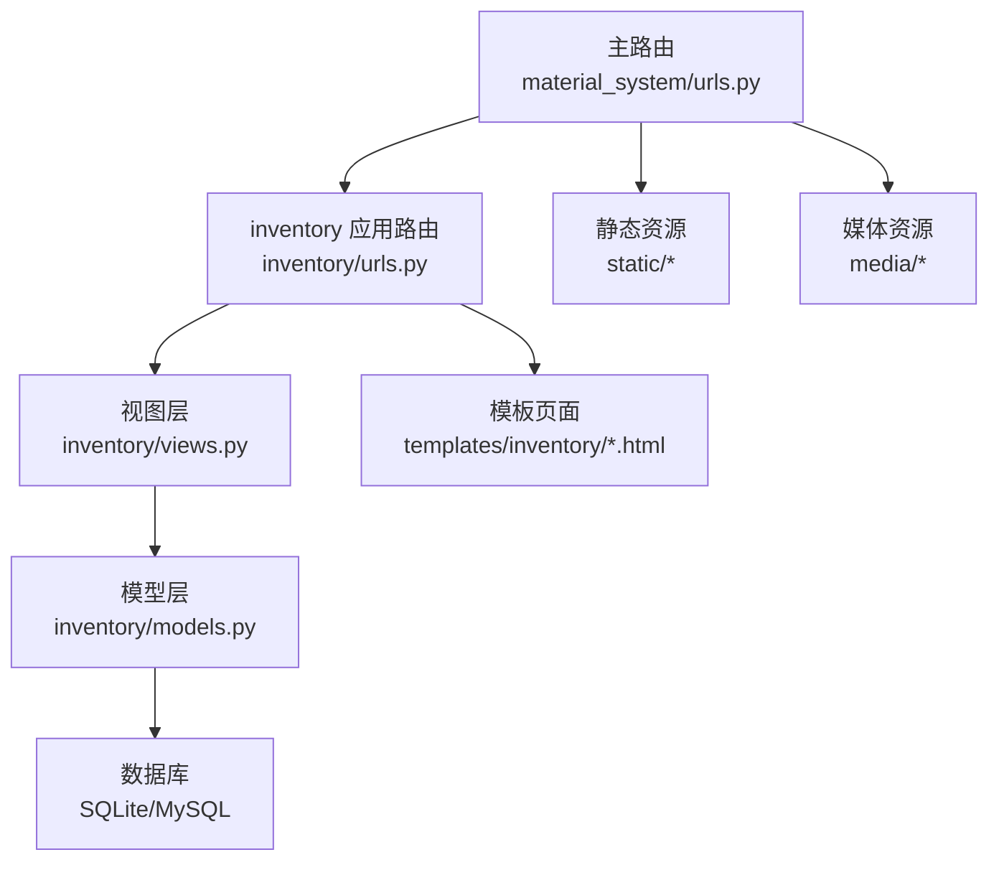

**图表来源**
- [material_system/urls.py:1-13](file://material_system/urls.py#L1-L13)
- [inventory/urls.py:1-84](file://inventory/urls.py#L1-L84)
- [inventory/views.py:1-200](file://inventory/views.py#L1-L200)
- [inventory/models.py:1-361](file://inventory/models.py#L1-L361)

**章节来源**
- [material_system/urls.py:1-13](file://material_system/urls.py#L1-L13)
- [inventory/urls.py:1-84](file://inventory/urls.py#L1-L84)
- [material_system/settings.py:63-210](file://material_system/settings.py#L63-L210)

## 核心组件
- 用户与角色：通过 Profile 扩展 User，支持 admin、material_dept、clerk、supplier 四种角色，用于控制不同模块的访问与操作权限。
- 项目管理：维护项目基础信息、状态与预算，并统计项目入库总额。
- 材料管理：维护材料档案、分类、规格、单位、标准单价与安全库存，并计算当前库存与加权平均成本。
- 供应商管理：维护供应商基础信息、主营类型、信用等级与累计采购额。
- 采购计划：记录项目所需材料的计划数量、单价、金额与状态流转（审批中、采购中、发货中、已入库）。
- 发货管理：供应商创建发货单，记录实际数量、单价、送货方式与二维码，支持确认发货与状态更新。
- 入库管理：记录材料入库的详细信息，包括项目、材料、供应商、数量、单价、总金额、质量状态与项目地址等。
- 操作日志：记录用户在各模块的关键操作，便于审计与追踪。

**更新** 出库记录模块已被移除，系统的库存管理完全通过入库记录和采购计划-发货-入库的完整流程实现。

**章节来源**
- [inventory/models.py:7-49](file://inventory/models.py#L7-L49)
- [inventory/models.py:51-72](file://inventory/models.py#L51-L72)
- [inventory/models.py:92-178](file://inventory/models.py#L92-L178)
- [inventory/models.py:180-205](file://inventory/models.py#L180-L205)
- [inventory/models.py:239-271](file://inventory/models.py#L239-L271)
- [inventory/models.py:273-310](file://inventory/models.py#L273-L310)
- [inventory/models.py:206-237](file://inventory/models.py#L206-L237)
- [inventory/models.py:312-361](file://inventory/models.py#L312-L361)

## 架构总览
系统采用 MVC 分层与模块化设计：
- 视图层（Views）：处理请求、权限校验、业务逻辑与响应渲染，提供 HTML 页面与 JSON API。
- 模型层（Models）：定义业务实体与关系，封装数据查询与聚合计算。
- 模板层（Templates）：提供页面展示与交互，结合前端脚本实现动态效果。
- 配置层（Settings）：集中管理数据库、静态资源、日志、国际化与中间件等。

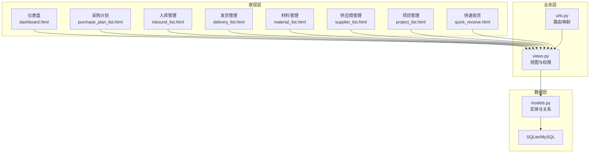

**图表来源**
- [templates/inventory/dashboard.html:1-141](file://templates/inventory/dashboard.html#L1-L141)
- [templates/inventory/purchase_plan_list.html:1-244](file://templates/inventory/purchase_plan_list.html#L1-L244)
- [templates/inventory/inbound_list.html:1-246](file://templates/inventory/inbound_list.html#L1-L246)
- [templates/inventory/delivery_list.html:1-253](file://templates/inventory/delivery_list.html#L1-L253)
- [templates/inventory/material_list.html:1-185](file://templates/inventory/material_list.html#L1-L185)
- [templates/inventory/supplier_list.html:1-172](file://templates/inventory/supplier_list.html#L1-L172)
- [templates/inventory/project_list.html:1-175](file://templates/inventory/project_list.html#L1-L175)
- [templates/inventory/quick_receive.html:1-387](file://templates/inventory/quick_receive.html#L1-L387)
- [inventory/views.py:1-2205](file://inventory/views.py#L1-L2205)
- [inventory/urls.py:1-84](file://inventory/urls.py#L1-L84)
- [inventory/models.py:1-361](file://inventory/models.py#L1-L361)

## 详细组件分析

### 项目管理模块
- 功能要点
  - 列表与筛选：按编号/名称、状态筛选项目。
  - 新增/编辑/删除：支持管理员与物资部权限。
  - 统计：计算项目入库总额。
  - API：提供项目详情 JSON 接口。
- 关键流程
  - 项目列表页加载时，后端聚合计算入库总额并传入模板。
  - 新增/编辑通过表单提交，调用保存视图，生成操作日志。
  - 删除前检查是否存在入库记录，避免破坏数据完整性。
- 权限控制
  - 列表与详情：所有登录用户可访问。
  - 新增/编辑/删除：管理员与物资部可用。
- 数据模型
  - Project：项目基本信息与状态。
  - InboundRecord：与项目关联，用于统计入库总额。

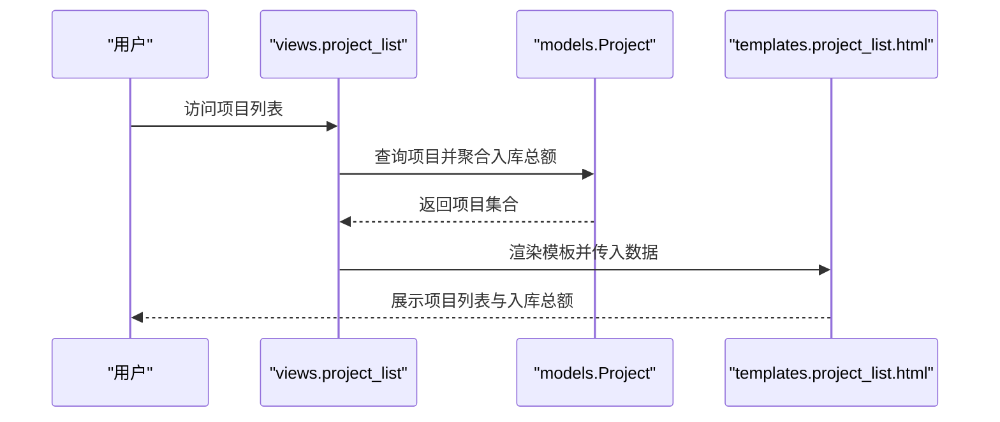

**图表来源**
- [inventory/views.py:174-207](file://inventory/views.py#L174-L207)
- [inventory/models.py:51-72](file://inventory/models.py#L51-L72)

**章节来源**
- [inventory/views.py:174-207](file://inventory/views.py#L174-L207)
- [templates/inventory/project_list.html:1-175](file://templates/inventory/project_list.html#L1-L175)
- [inventory/models.py:51-72](file://inventory/models.py#L51-L72)

### 材料管理模块
- 功能要点
  - 列表与筛选：按名称/编号/规格、分类筛选。
  - 新增/编辑/删除：管理员可用；删除前检查是否存在入库记录。
  - 统计：实时计算当前库存、加权平均成本与库存状态。
  - API：提供材料详情 JSON 接口。
- 关键流程
  - 材料列表页遍历材料，调用模型方法计算库存与成本。
  - 新增/编辑通过表单提交，自动生成编号并保存。
  - 删除时进行约束检查并记录日志。
- 数据模型
  - Material：材料档案与安全库存。
  - Category：材料分类。
  - InboundRecord：用于库存与成本计算。

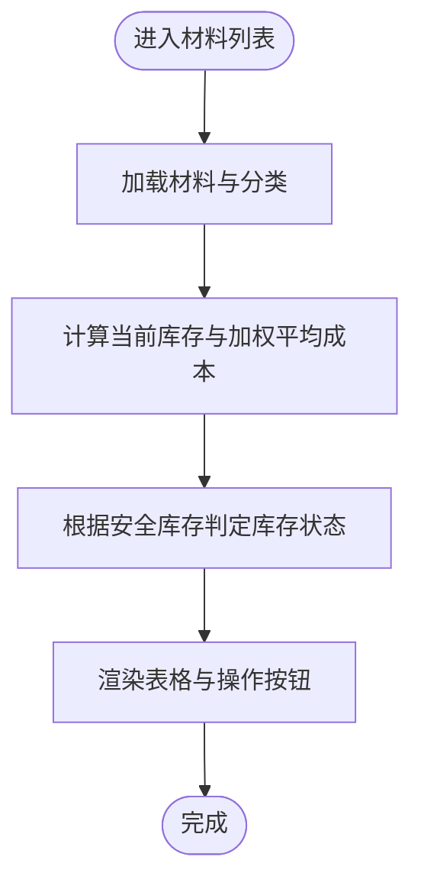

**图表来源**
- [inventory/views.py:233-290](file://inventory/views.py#L233-L290)
- [inventory/models.py:92-178](file://inventory/models.py#L92-L178)

**章节来源**
- [inventory/views.py:233-290](file://inventory/views.py#L233-L290)
- [templates/inventory/material_list.html:1-185](file://templates/inventory/material_list.html#L1-L185)
- [inventory/models.py:92-178](file://inventory/models.py#L92-L178)

### 供应商管理模块
- 功能要点
  - 列表与筛选：按名称/联系人模糊搜索。
  - 新增/编辑/删除：管理员可用；删除前检查是否存在入库记录。
  - 统计：计算供应商累计采购额。
  - API：提供供应商详情 JSON 接口。
- 关键流程
  - 供应商列表页遍历供应商，调用模型方法计算累计采购额。
  - 新增/编辑通过表单提交，自动生成编号并保存。
  - 删除时进行约束检查并记录日志。
- 数据模型
  - Supplier：供应商信息与信用等级。
  - Category：主营类型。
  - InboundRecord：用于累计采购额计算。

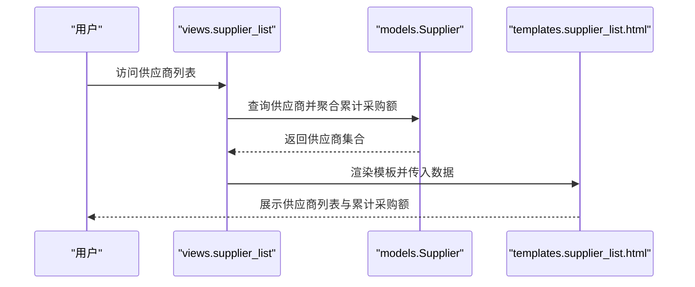

**图表来源**
- [inventory/views.py:305-354](file://inventory/views.py#L305-L354)
- [inventory/models.py:180-205](file://inventory/models.py#L180-L205)

**章节来源**
- [inventory/views.py:305-354](file://inventory/views.py#L305-L354)
- [templates/inventory/supplier_list.html:1-172](file://templates/inventory/supplier_list.html#L1-L172)
- [inventory/models.py:180-205](file://inventory/models.py#L180-L205)

### 采购计划模块
- 功能要点
  - 列表与筛选：按项目、状态、关键词筛选。
  - 新增/编辑/删除：管理员与物资部可用；删除需具备相应权限。
  - 状态管理：支持审批中、采购中、发货中、已入库状态流转。
  - API：提供采购计划详情 JSON 接口。
- 关键流程
  - 采购计划列表页加载时，后端按筛选条件查询并传入模板。
  - 新增/编辑通过表单提交，自动生成计划编号并保存。
  - 删除时进行权限校验并记录日志。
- 数据模型
  - PurchasePlan：采购计划与状态。
  - Project/Material/User：关联实体。

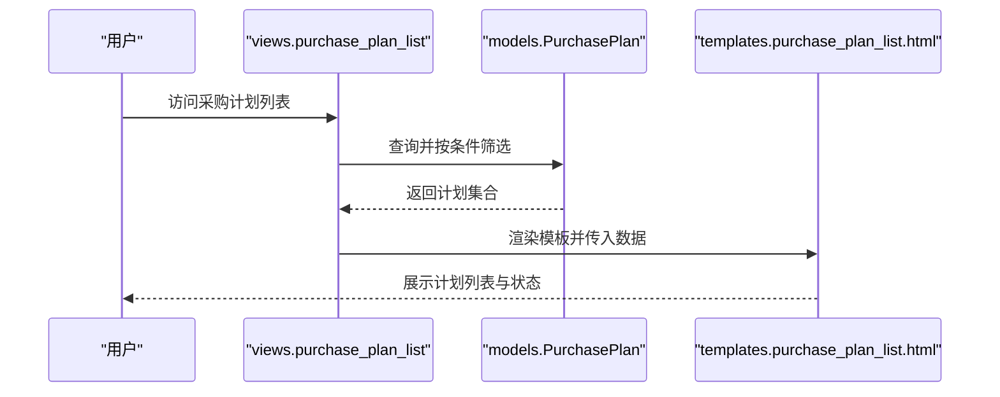

**图表来源**
- [inventory/views.py:379-458](file://inventory/views.py#L379-L458)
- [templates/inventory/purchase_plan_list.html:1-244](file://templates/inventory/purchase_plan_list.html#L1-L244)

**章节来源**
- [inventory/views.py:379-458](file://inventory/views.py#L379-L458)
- [templates/inventory/purchase_plan_list.html:1-244](file://templates/inventory/purchase_plan_list.html#L1-L244)
- [inventory/models.py:239-271](file://inventory/models.py#L239-L271)

### 发货管理模块
- 功能要点
  - 供应商视角：仅能创建与查看自身发货单，支持确认发货。
  - 物资部/管理员：可查看全部发货单并生成二维码。
  - 状态管理：待发货、已发货、已收货。
  - 二维码：为发货单生成二维码，便于线下交接。
- 关键流程
  - 供应商在"待发货的采购计划"中创建发货单，更新采购计划状态为"发货中"。
  - 物资部/管理员可生成二维码并查看发货详情。
  - 供应商确认发货后更新状态与发货时间。
- 数据模型
  - Delivery：发货单与状态。
  - PurchasePlan：关联采购计划。
  - User：供应商身份标识。

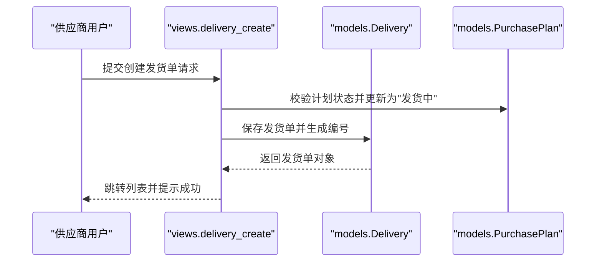

**图表来源**
- [inventory/views.py:807-865](file://inventory/views.py#L807-L865)
- [inventory/models.py:273-310](file://inventory/models.py#L273-L310)

**章节来源**
- [inventory/views.py:686-927](file://inventory/views.py#L686-L927)
- [templates/inventory/delivery_list.html:1-253](file://templates/inventory/delivery_list.html#L1-L253)
- [templates/inventory/delivery_create.html:1-127](file://templates/inventory/delivery_create.html#L1-L127)
- [inventory/models.py:273-310](file://inventory/models.py#L273-L310)

### 入库管理模块
- 功能要点
  - 列表与筛选：按日期范围、项目、材料、供应商筛选。
  - 新增/编辑/删除：管理员与物资部可用；删除需管理员权限。
  - 快速收货：通过扫描发货单号快速生成入库记录。
  - Excel 导出：支持入库记录与库存汇总导出。
  - 批量导入：支持 Excel 批量导入项目、材料、供应商、入库记录。
- 关键流程
  - 入库列表页加载时，后端按筛选条件查询并传入模板。
  - 新增/编辑通过表单提交，自动生成入库单号并保存。
  - 快速收货通过 API 获取发货单详情并生成入库记录。
- 数据模型
  - InboundRecord：入库记录与金额计算。
  - Project/Material/Supplier/User：关联实体。

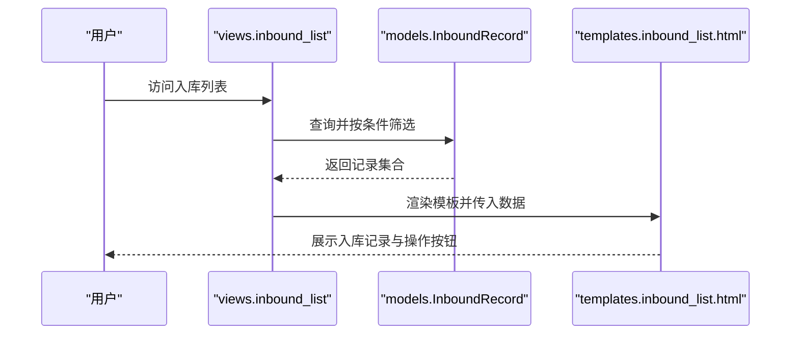

**图表来源**
- [inventory/views.py:931-1015](file://inventory/views.py#L931-L1015)
- [templates/inventory/inbound_list.html:1-246](file://templates/inventory/inbound_list.html#L1-L246)

**章节来源**
- [inventory/views.py:931-1015](file://inventory/views.py#L931-L1015)
- [templates/inventory/inbound_list.html:1-246](file://templates/inventory/inbound_list.html#L1-L246)
- [inventory/models.py:206-237](file://inventory/models.py#L206-L237)

### 快速收货模块
- 功能要点
  - 发货单查询：支持手动输入发货单号或从最近发货单列表选择。
  - 发货单详情展示：显示发货单的完整信息，包括项目、材料、数量、单价等。
  - 收货确认：确认收货后自动生成入库记录。
  - 与发货管理集成：直接对接发货管理模块，实现无缝流转。
- 关键流程
  - 用户在快速收货页面输入或选择发货单号。
  - 系统通过 API 查询发货单详情并展示。
  - 用户确认收货后，系统自动生成入库记录并更新相关状态。
- 数据模型
  - Delivery：发货单信息。
  - InboundRecord：生成的入库记录。

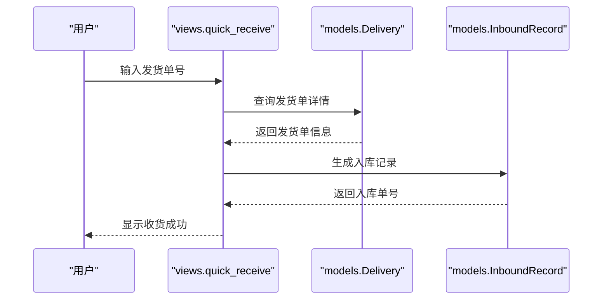

**图表来源**
- [templates/inventory/quick_receive.html:178-299](file://templates/inventory/quick_receive.html#L178-L299)
- [inventory/views.py:1017-1149](file://inventory/views.py#L1017-L1149)

**章节来源**
- [templates/inventory/quick_receive.html:1-387](file://templates/inventory/quick_receive.html#L1-L387)
- [inventory/views.py:1017-1149](file://inventory/views.py#L1017-L1149)

### 模块间业务关联与数据流
- 项目与材料：通过入库记录建立项目与材料的关联，用于统计项目入库总额与材料库存。
- 供应商与入库：入库记录关联供应商，用于统计供应商累计采购额。
- 采购计划与发货：发货单关联采购计划，发货状态影响采购计划状态。
- 发货与入库：发货单通过快速收货生成入库记录，形成闭环。

**更新** 移除了出库记录相关的实体关系，系统现在通过"采购计划-发货-入库"的完整流程管理材料流动。

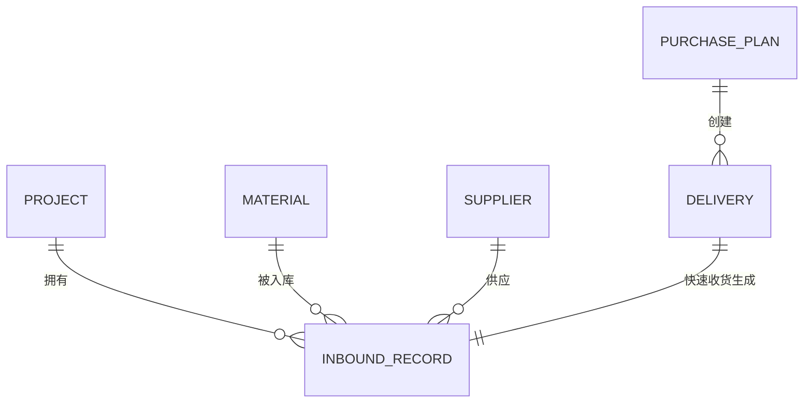

**图表来源**
- [inventory/models.py:51-72](file://inventory/models.py#L51-L72)
- [inventory/models.py:92-178](file://inventory/models.py#L92-L178)
- [inventory/models.py:180-205](file://inventory/models.py#L180-L205)
- [inventory/models.py:239-271](file://inventory/models.py#L239-L271)
- [inventory/models.py:273-310](file://inventory/models.py#L273-L310)
- [inventory/models.py:206-237](file://inventory/models.py#L206-L237)

## 依赖分析
- 应用注册：inventory 应用在 settings 中注册，确保路由与模板生效。
- 中间件与静态资源：配置了会话、CSRF、静态资源与媒体资源路径。
- 数据库：默认 SQLite，支持通过环境变量切换为 MySQL。
- 第三方依赖：包含 Django、admin-interface、openpyxl、qrcode、pillow 等。

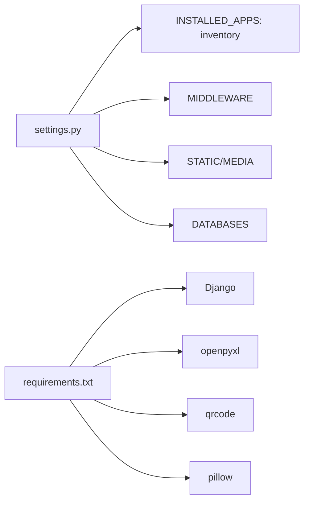

**图表来源**
- [material_system/settings.py:74-147](file://material_system/settings.py#L74-L147)
- [requirements.txt:1-16](file://requirements.txt#L1-L16)

**章节来源**
- [material_system/settings.py:74-147](file://material_system/settings.py#L74-L147)
- [requirements.txt:1-16](file://requirements.txt#L1-L16)

## 性能考虑
- 查询优化
  - 使用 select_related 预加载外键关联，减少 N+1 查询（如入库列表、项目列表、材料列表）。
  - 对高频查询字段添加索引（如项目编号、材料编号、供应商编号）。
- 计算优化
  - 在模型层封装聚合计算（如项目入库总额、材料库存与加权成本），避免在视图层重复计算。
  - 对大量数据导出使用分页或异步任务。
- 前端优化
  - 表单联动计算在前端完成，减轻后端压力。
  - 模态框与动态加载提升用户体验。
- 数据库优化
  - SQLite 默认配置已针对参数上限进行兼容性修复；生产环境建议使用 MySQL/PostgreSQL 并开启连接池与慢查询日志。

## 故障排查指南
- 登录问题
  - 检查用户是否激活，若未激活将被拒绝登录。
  - 确认用户角色与跳转逻辑是否正确。
- 权限问题
  - 供应商仅能创建与查看自身发货单；管理员与物资部可查看全部。
  - 删除项目/材料/供应商前需检查是否存在关联记录。
- 数据一致性
  - 发货单创建后会更新采购计划状态；若状态异常，检查发货流程与日志。
  - 入库金额由数量与单价计算得出，保存时自动计算总金额。
- 日志审计
  - 所有关键操作均写入操作日志，可通过日志页面查看操作详情与时间线。

**章节来源**
- [inventory/views.py:114-143](file://inventory/views.py#L114-L143)
- [inventory/views.py:201-210](file://inventory/views.py#L201-L210)
- [inventory/views.py:280-289](file://inventory/views.py#L280-L289)
- [inventory/views.py:344-353](file://inventory/views.py#L344-L353)
- [inventory/models.py:234-236](file://inventory/models.py#L234-L236)
- [inventory/models.py:312-361](file://inventory/models.py#L312-L361)

## 结论
本系统以 inventory 应用为核心，围绕六大业务模块构建完整的材料管理能力，具备清晰的模块边界与稳定的前后端交互。通过权限控制、数据校验与操作日志，保障了业务的合规性与可追溯性。系统已移除出库记录模块，采用"采购计划-发货-入库"的一体化流程，简化了业务复杂度并提高了数据一致性。建议在生产环境中替换为高性能数据库与反向代理，并引入缓存与异步任务以进一步提升性能与稳定性。

## 附录

### 模块化架构与扩展指引
- 模块化设计
  - inventory 应用内聚业务逻辑，URL 与模板分离，便于独立演进。
  - 新增模块可在 inventory/urls.py 中注册路由，在 views.py 中实现视图与权限控制。
- 数据共享机制
  - 通过 Django ORM 的外键关系实现模块间数据共享；跨模块查询尽量使用 select_related。
  - API 接口统一返回 JSON，便于前端与移动端集成。
- 配置与自定义
  - settings 中集中管理数据库、静态资源、日志与国际化；可通过环境变量灵活切换。
  - admin 后台提供便捷的数据维护入口，适合非技术用户的日常运营。

**章节来源**
- [inventory/urls.py:1-84](file://inventory/urls.py#L1-L84)
- [inventory/views.py:1-2205](file://inventory/views.py#L1-L2205)
- [material_system/settings.py:63-210](file://material_system/settings.py#L63-L210)
- [inventory/admin.py:1-54](file://inventory/admin.py#L1-L54)

### 关键操作界面概览
- 仪表盘：快速导航至项目、材料、供应商与最近入库记录。
- 采购计划：支持新增、编辑、删除与状态管理。
- 入库管理：支持新增、编辑、删除、快速收货与 Excel 导出。
- 发货管理：供应商创建发货单、确认发货与二维码生成。
- 材料/供应商/项目管理：支持新增、编辑、删除与批量导入。
- 快速收货：通过发货单号快速生成入库记录。

**章节来源**
- [templates/inventory/dashboard.html:1-141](file://templates/inventory/dashboard.html#L1-L141)
- [templates/inventory/purchase_plan_list.html:1-244](file://templates/inventory/purchase_plan_list.html#L1-L244)
- [templates/inventory/inbound_list.html:1-246](file://templates/inventory/inbound_list.html#L1-L246)
- [templates/inventory/delivery_list.html:1-253](file://templates/inventory/delivery_list.html#L1-L253)
- [templates/inventory/delivery_create.html:1-127](file://templates/inventory/delivery_create.html#L1-L127)
- [templates/inventory/quick_receive.html:1-387](file://templates/inventory/quick_receive.html#L1-L387)
- [templates/inventory/material_list.html:1-185](file://templates/inventory/material_list.html#L1-L185)
- [templates/inventory/supplier_list.html:1-172](file://templates/inventory/supplier_list.html#L1-L172)
- [templates/inventory/project_list.html:1-175](file://templates/inventory/project_list.html#L1-L175)