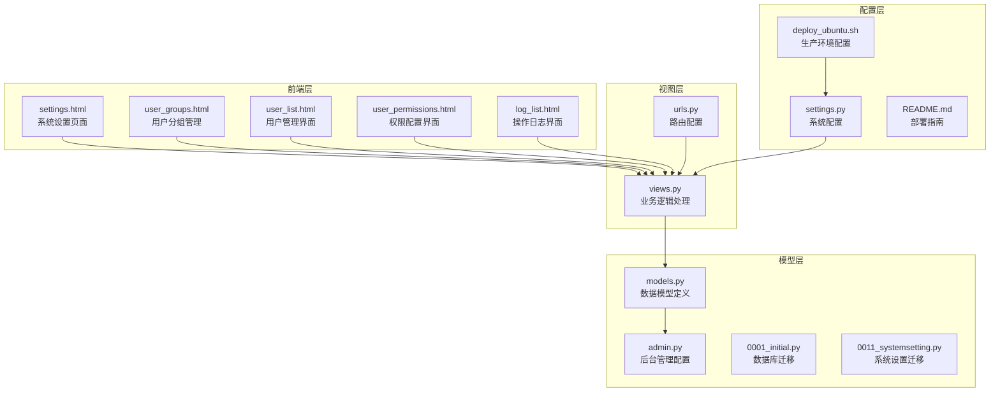
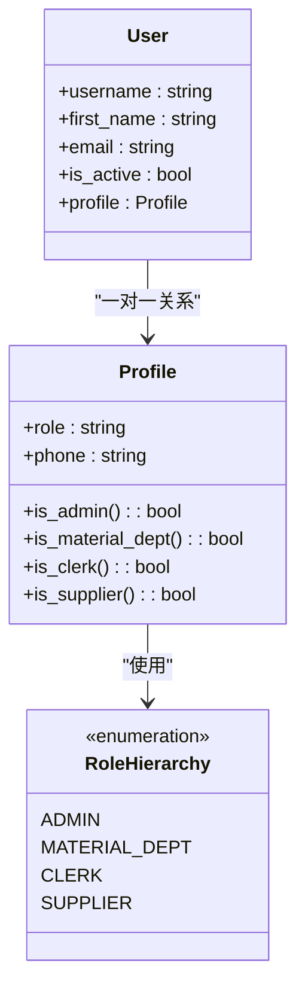
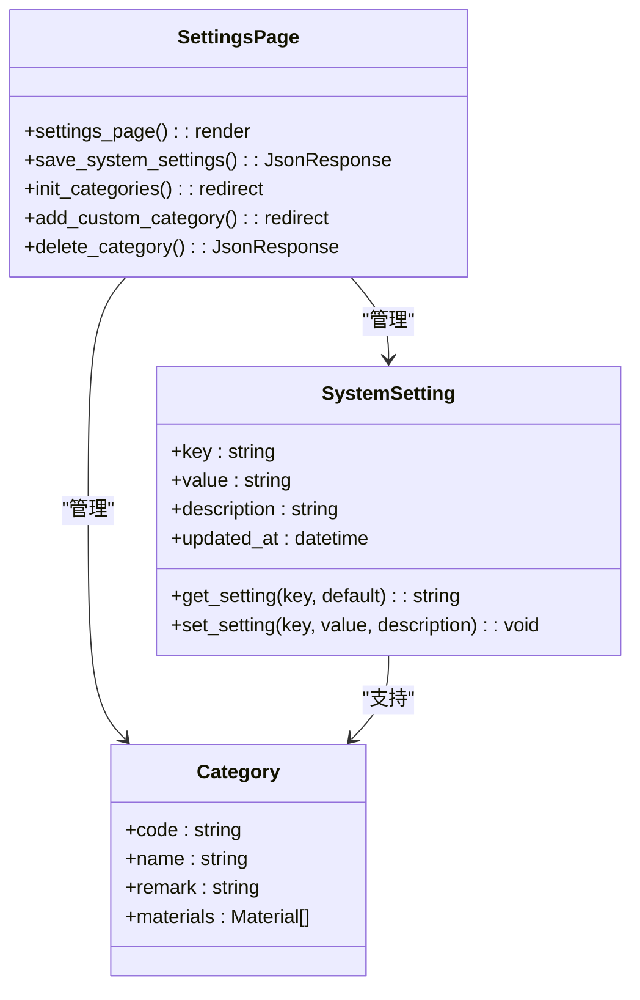
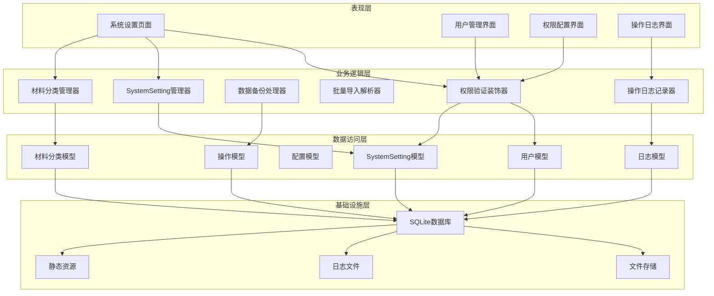
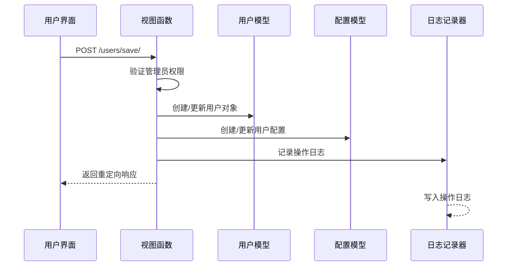
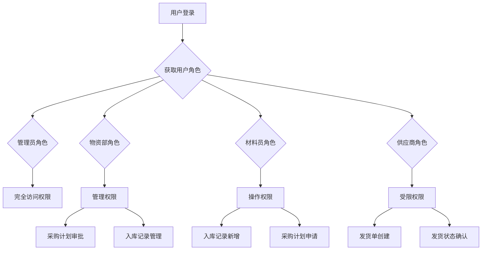
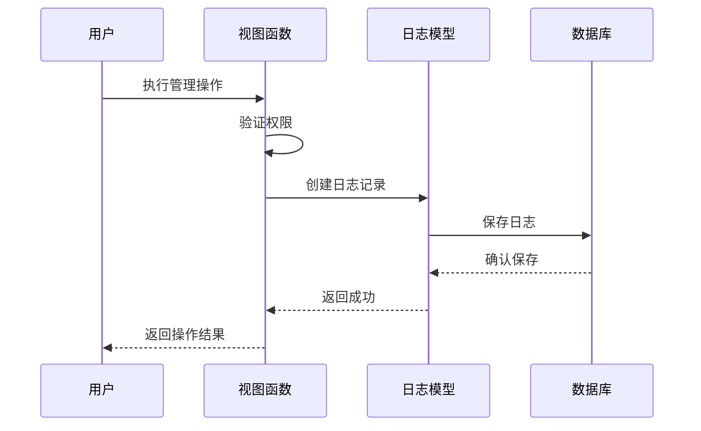
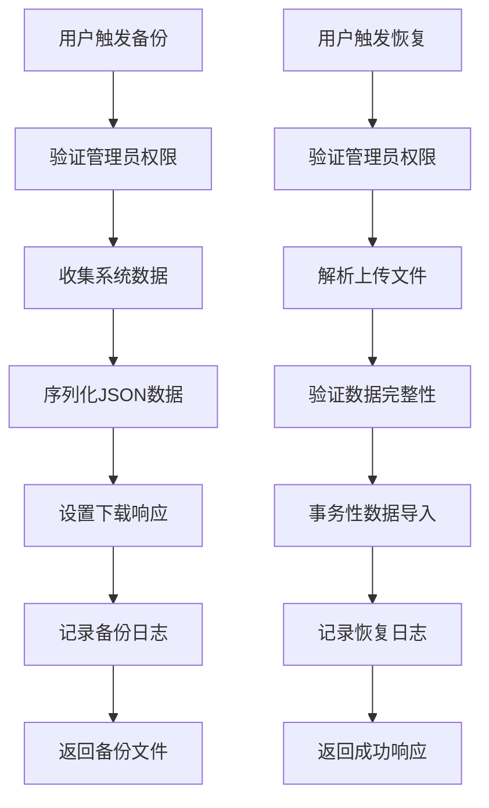
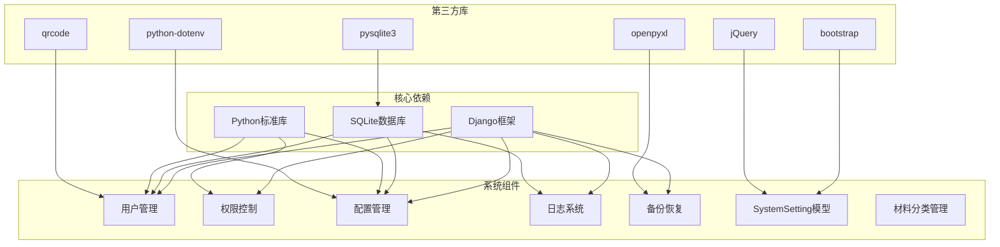

# 系统设置与配置

<cite>
**本文档引用的文件**
- [settings.py](file://material_system/settings.py)
- [models.py](file://inventory/models.py)
- [views.py](file://inventory/views.py)
- [urls.py](file://inventory/urls.py)
- [settings.html](file://templates/inventory/settings.html)
- [user_groups.html](file://templates/inventory/user_groups.html)
- [user_list.html](file://templates/inventory/user_list.html)
- [user_permissions.html](file://templates/inventory/user_permissions.html)
- [log_list.html](file://templates/inventory/log_list.html)
- [admin.py](file://inventory/admin.py)
- [0001_initial.py](file://inventory/migrations/0001_initial.py)
- [0011_systemsetting.py](file://inventory/migrations/0011_systemsetting.py)
- [deploy_ubuntu.sh](file://deploy/ubuntu/deploy_ubuntu_20_22.sh)
- [README.md](file://deploy/centos7/README.md)
</cite>

## 更新摘要
**变更内容**
- 新增系统设置模块，提供集中式配置管理功能
- 添加SystemSetting模型支持动态系统参数调整
- 实现公司名称配置、材料分类管理、数据备份恢复功能
- 新增系统设置页面和相关API接口

## 目录
1. [简介](#简介)
2. [项目结构](#项目结构)
3. [核心组件](#核心组件)
4. [架构概览](#架构概览)
5. [详细组件分析](#详细组件分析)
6. [依赖关系分析](#依赖关系分析)
7. [性能考虑](#性能考虑)
8. [故障排除指南](#故障排除指南)
9. [结论](#结论)
10. [附录](#附录)

## 简介

本文件为材料管理系统中的系统设置与配置模块提供全面的技术文档。系统采用基于角色的访问控制（RBAC）模型，实现了完善的用户管理、权限分配、角色配置和系统配置管理功能。模块支持用户分组管理、权限矩阵配置、系统参数设置、数据备份恢复、操作审计日志等功能。

**更新** 新增系统设置模块，提供集中式配置管理功能，支持动态系统参数调整，包括公司名称配置、材料分类管理、数据备份恢复等核心功能。

系统通过Django框架构建，使用SQLite作为默认数据库，支持生产环境下的MySQL/MariaDB部署。配置模块提供了完整的RESTful API接口和Web界面，确保了良好的用户体验和安全性。

## 项目结构

系统设置与配置模块位于inventory应用中，采用典型的Django三层架构设计：



**图表来源**
- [settings.html:1-320](file://templates/inventory/settings.html#L1-L320)
- [views.py:1089-1160](file://inventory/views.py#L1089-L1160)
- [models.py:331-361](file://inventory/models.py#L331-L361)
- [settings.py:1-210](file://material_system/settings.py#L1-L210)

**章节来源**
- [settings.py:1-210](file://material_system/settings.py#L1-L210)
- [urls.py:77-84](file://inventory/urls.py#L77-L84)

## 核心组件

### 用户角色与权限模型

系统实现了四层用户角色体系，每种角色具有明确的功能权限边界：



**图表来源**
- [models.py:7-48](file://inventory/models.py#L7-L48)

系统权限控制采用装饰器模式，通过`@admin_required`等装饰器实现细粒度的权限控制：

**章节来源**
- [models.py:7-48](file://inventory/models.py#L7-L48)
- [views.py:56-65](file://inventory/views.py#L56-L65)

### 系统配置管理

**更新** 新增SystemSetting模型，提供集中式配置管理功能：



**图表来源**
- [models.py:331-361](file://inventory/models.py#L331-L361)
- [views.py:1091-1160](file://inventory/views.py#L1091-L1160)

系统配置采用环境变量驱动的方式，支持运行时动态配置：

```mermaid
flowchart TD
A[系统启动] --> B{检查环境变量}
B --> |存在| C[使用环境变量配置]
B --> |不存在| D[使用默认配置]
C --> E[数据库连接配置]
C --> F[安全设置配置]
C --> G[日志配置]
D --> H[SQLite默认配置]
E --> I[应用启动]
F --> I
G --> I
H --> I
I --> J[SystemSetting.get_setting()调用]
J --> K[动态配置加载]
```

**图表来源**
- [settings.py:69-140](file://material_system/settings.py#L69-L140)
- [views.py:1094-1099](file://inventory/views.py#L1094-L1099)

**章节来源**
- [models.py:331-361](file://inventory/models.py#L331-L361)
- [settings.py:69-140](file://material_system/settings.py#L69-L140)

## 架构概览

系统设置与配置模块采用分层架构设计，确保了高内聚、低耦合的特性：



**图表来源**
- [views.py:29-33](file://inventory/views.py#L29-L33)
- [models.py:331-361](file://inventory/models.py#L331-L361)

## 详细组件分析

### 用户管理组件

用户管理组件实现了完整的用户生命周期管理，包括用户创建、编辑、删除和状态管理：



**图表来源**
- [views.py:1171-1202](file://inventory/views.py#L1171-L1202)
- [user_list.html:35-71](file://templates/inventory/user_list.html#L35-L71)

用户管理的核心功能包括：

1. **用户创建与编辑**：支持批量创建用户，自动分配默认密码
2. **角色分配**：通过下拉菜单选择用户角色，实时生效
3. **状态管理**：支持启用/禁用用户账户
4. **权限验证**：仅管理员可执行用户管理操作

**章节来源**
- [views.py:1171-1202](file://inventory/views.py#L1171-L1202)
- [user_list.html:1-209](file://templates/inventory/user_list.html#L1-L209)

### 权限控制系统

系统采用基于角色的访问控制（RBAC）模型，实现了细粒度的权限管理：



**图表来源**
- [views.py:35-54](file://inventory/views.py#L35-L54)
- [user_permissions.html:48-182](file://templates/inventory/user_permissions.html#L48-L182)

权限控制的具体实现：

1. **装饰器权限控制**：使用`@admin_required`等装饰器保护敏感操作
2. **函数级权限验证**：通过`is_admin()`、`can_manage_inventory()`等函数实现细粒度控制
3. **前端权限展示**：根据用户角色动态显示菜单和功能按钮

**章节来源**
- [views.py:35-65](file://inventory/views.py#L35-L65)
- [user_permissions.html:1-249](file://templates/inventory/user_permissions.html#L1-L249)

### 系统设置组件

**更新** 新增系统设置组件，提供集中式配置管理功能：

```mermaid
classDiagram
class SystemSetting {
+key : string
+value : string
+description : string
+updated_at : datetime
+get_setting(key, default) : string
+set_setting(key, value, description) : void
}
class SettingsPage {
+settings_page() : render
+save_system_settings() : JsonResponse
+init_categories() : redirect
+add_custom_category() : redirect
+delete_category() : JsonResponse
+backup_data() : HttpResponse
}
class Category {
+code : string
+name : string
+remark : string
+materials : Material[]
}
class BackupData {
+timestamp : datetime
+projects : Project[]
+categories : Category[]
+materials : Material[]
+suppliers : Supplier[]
+inbound_records : InboundRecord[]
+users : User[]
}
SettingsPage --> SystemSetting : "管理"
SettingsPage --> Category : "管理"
SettingsPage --> BackupData : "生成"
SystemSetting --> Category : "支持"
```



**图表来源**
- [models.py:331-361](file://inventory/models.py#L331-L361)
- [views.py:1091-1160](file://inventory/views.py#L1091-L1160)
- [settings.html:1-320](file://templates/inventory/settings.html#L1-L320)

系统设置的主要功能：

1. **公司名称配置**：支持动态设置和显示公司/项目名称
2. **材料分类管理**：支持初始化默认分类、添加自定义分类、删除分类
3. **数据备份恢复**：提供完整的数据备份和恢复功能
4. **配置参数管理**：通过SystemSetting模型管理动态配置参数

**章节来源**
- [models.py:331-361](file://inventory/models.py#L331-L361)
- [views.py:1091-1160](file://inventory/views.py#L1091-L1160)
- [settings.html:1-320](file://templates/inventory/settings.html#L1-L320)

### 操作日志组件

操作日志组件实现了完整的审计跟踪功能：



**图表来源**
- [views.py:29-33](file://inventory/views.py#L29-L33)
- [models.py:312-328](file://inventory/models.py#L312-L328)

日志记录的关键特性：

1. **自动记录**：所有管理操作自动记录到操作日志
2. **详细信息**：记录操作时间、操作员、模块、类型、详情等
3. **过滤查询**：支持按模块、时间范围等条件查询日志
4. **审计追踪**：提供完整的操作审计能力

**章节来源**
- [views.py:29-33](file://inventory/views.py#L29-L33)
- [models.py:312-328](file://inventory/models.py#L312-L328)
- [log_list.html:1-50](file://templates/inventory/log_list.html#L1-L50)

### 数据备份与恢复

系统提供了完整的数据备份与恢复机制：



**图表来源**
- [views.py:1602-1620](file://inventory/views.py#L1602-L1620)

备份恢复功能特点：

1. **完整数据导出**：导出项目、材料、供应商、入库记录、用户等所有数据
2. **时间戳标记**：备份文件包含精确的时间戳
3. **安全传输**：通过HTTPS协议传输备份文件
4. **审计记录**：所有备份恢复操作都会被记录到操作日志

**章节来源**
- [views.py:1602-1620](file://inventory/views.py#L1602-L1620)

## 依赖关系分析

系统设置与配置模块的依赖关系如下：



**图表来源**
- [requirements.txt](file://requirements.txt)
- [views.py:1-25](file://inventory/views.py#L1-L25)

**章节来源**
- [requirements.txt](file://requirements.txt)
- [views.py:1-25](file://inventory/views.py#L1-L25)

## 性能考虑

系统设置与配置模块在设计时充分考虑了性能优化：

### 数据库优化
- 使用适当的索引策略提高查询性能
- 实现批量操作减少数据库往返次数
- 采用事务性操作确保数据一致性

### 缓存策略
- 配置适当的缓存机制
- 实现数据预加载减少查询开销
- 使用分页处理大量数据

### 安全优化
- 实施严格的权限验证
- 使用参数化查询防止SQL注入
- 实现CSRF保护和XSS防护

## 故障排除指南

### 常见问题及解决方案

**问题1：用户权限异常**
- 检查用户角色配置是否正确
- 验证权限装饰器是否正确使用
- 确认用户配置是否已保存

**问题2：数据备份失败**
- 检查磁盘空间是否充足
- 验证文件权限设置
- 确认数据库连接状态

**问题3：操作日志缺失**
- 检查日志配置是否正确
- 验证数据库写入权限
- 确认日志表结构是否完整

**问题4：系统设置不生效**
- 检查SystemSetting模型是否正确创建
- 验证配置参数是否已保存
- 确认重启服务后配置加载

**问题5：材料分类管理异常**
- 检查分类是否存在关联材料
- 验证删除权限是否正确
- 确认分类编码生成规则

**章节来源**
- [views.py:29-33](file://inventory/views.py#L29-L33)
- [models.py:331-361](file://inventory/models.py#L331-L361)

## 结论

系统设置与配置模块为材料管理系统提供了完整的基础设施支持。通过基于角色的访问控制模型、完善的用户管理功能、灵活的配置管理机制和全面的操作审计能力，系统确保了良好的安全性、可维护性和可扩展性。

**更新** 新增的系统设置模块进一步增强了系统的灵活性和可维护性，通过集中式配置管理和动态参数调整，为系统提供了更好的用户体验和管理便利。

模块设计遵循了现代Web应用的最佳实践，采用了分层架构、装饰器模式、工厂模式等多种设计模式，为系统的长期发展奠定了坚实的基础。

## 附录

### 最佳实践建议

1. **安全配置**
   - 定期更新密码策略
   - 实施多因素认证
   - 定期审查权限分配

2. **性能优化**
   - 实施数据库索引优化
   - 使用缓存机制
   - 监控系统性能指标

3. **备份策略**
   - 制定定期备份计划
   - 测试备份恢复流程
   - 存储备份文件到安全位置

4. **监控告警**
   - 实施系统监控
   - 设置性能告警
   - 建立故障响应机制

### 安全建议

1. **密码管理**
   - 强制复杂密码策略
   - 实施密码过期机制
   - 启用密码历史记录

2. **访问控制**
   - 最小权限原则
   - 定期权限审查
   - 异常访问检测

3. **数据保护**
   - 敏感数据加密
   - 数据传输安全
   - 备份数据保护

4. **配置管理**
   - 系统设置变更审计
   - 配置参数验证
   - 动态配置热更新