# 采购计划管理

<cite>
**本文档引用的文件**
- [models.py](file://inventory/models.py)
- [views.py](file://inventory/views.py)
- [urls.py](file://inventory/urls.py)
- [purchase_plan_list.html](file://templates/inventory/purchase_plan_list.html)
- [user_permissions.html](file://templates/inventory/user_permissions.html)
- [charts.html](file://templates/inventory/charts.html)
- [report.html](file://templates/inventory/report.html)
- [settings.py](file://material_system/settings.py)
</cite>

## 更新摘要
**变更内容**
- 新增完整的采购计划管理系统，包括PurchasePlan模型、采购计划列表界面、批量导入功能
- 完善了采购计划与项目、材料的关联关系和数据一致性保证
- 增强了采购计划状态控制逻辑，支持完整的生命周期管理
- 实现了Excel导出和批量导入功能，提升数据处理效率
- 完善了权限控制系统，支持多角色的精细化权限管理

## 目录
1. [简介](#简介)
2. [项目结构](#项目结构)
3. [核心组件](#核心组件)
4. [架构概览](#架构概览)
5. [详细组件分析](#详细组件分析)
6. [依赖关系分析](#依赖关系分析)
7. [性能考虑](#性能考虑)
8. [故障排除指南](#故障排除指南)
9. [结论](#结论)
10. [附录](#附录)

## 简介
本文件为采购计划管理模块的全面技术文档，涵盖采购计划的全生命周期管理，包括创建、审批、执行、完成等状态流转机制；详细解释采购计划与项目、材料的关联关系和数据一致性保证；描述采购计划状态控制逻辑；解释采购计划查询筛选功能的实现；提供采购计划数量和价格管理的实现细节；说明采购计划的操作权限控制机制；包含采购计划的Excel导出功能和数据统计分析；提供采购计划管理的工作流程图和最佳实践指导。

## 项目结构
采购计划管理模块位于 inventory 应用中，采用 Django 框架实现，遵循 MVC 架构模式：
- models.py 定义数据模型和业务规则
- views.py 实现业务逻辑和控制器
- urls.py 配置路由映射
- templates/inventory/ 存放前端模板
- material_system/settings.py 配置系统设置

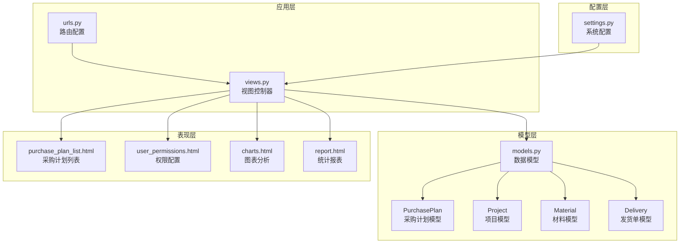

**图表来源**
- [models.py:239-328](file://inventory/models.py#L239-L328)
- [views.py:377-454](file://inventory/views.py#L377-L454)
- [urls.py:27-33](file://inventory/urls.py#L27-L33)

**章节来源**
- [models.py:1-361](file://inventory/models.py#L1-L361)
- [views.py:1-200](file://inventory/views.py#L1-L200)
- [urls.py:1-84](file://inventory/urls.py#L1-L84)

## 核心组件
采购计划管理模块的核心组件包括：

### 数据模型
- **PurchasePlan 采购计划模型**：存储采购计划的基本信息、数量、价格、状态等
- **Project 项目模型**：与采购计划建立多对一关系
- **Material 材料模型**：与采购计划建立多对一关系
- **Delivery 发货单模型**：与采购计划建立一对一关系

### 视图控制器
- **采购计划视图**：处理采购计划的创建、编辑、删除、查询
- **权限控制视图**：基于角色的权限管理和访问控制
- **Excel导出视图**：支持采购计划数据的批量导出
- **批量导入视图**：支持Excel文件的批量导入功能

### 前端模板
- **采购计划列表模板**：提供采购计划的展示和操作界面
- **权限配置模板**：展示各角色的功能权限矩阵
- **图表分析模板**：提供数据可视化展示
- **统计报表模板**：展示各类统计分析结果

**章节来源**
- [models.py:239-328](file://inventory/models.py#L239-L328)
- [views.py:377-666](file://inventory/views.py#L377-L666)
- [purchase_plan_list.html:1-357](file://templates/inventory/purchase_plan_list.html#L1-L357)

## 架构概览
采购计划管理采用分层架构设计，确保关注点分离和代码可维护性：

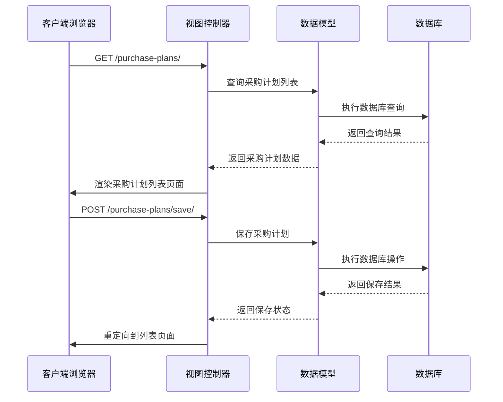

**图表来源**
- [views.py:377-440](file://inventory/views.py#L377-L440)
- [models.py:239-271](file://inventory/models.py#L239-L271)

### 状态流转架构
采购计划状态流转采用有限状态机模式，确保状态转换的合法性和数据一致性：

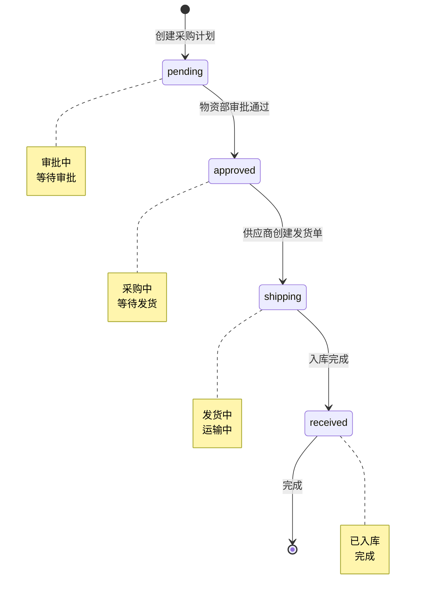

**图表来源**
- [models.py:241-246](file://inventory/models.py#L241-L246)
- [views.py:533-598](file://inventory/views.py#L533-L598)

## 详细组件分析

### 采购计划模型分析
采购计划模型是整个模块的核心，定义了采购计划的所有属性和行为：

#### 数据模型结构
```mermaid
erDiagram
PURCHASE_PLAN {
char no PK
bigint project_id FK
bigint material_id FK
decimal quantity
decimal unit_price
decimal total_amount
char status
date planned_date
text remark
bigint operator_id FK
datetime create_time
datetime update_time
}
PROJECT {
bigint id PK
char code UK
char name
char manager
char location
date start_date
date end_date
decimal budget
char status
text remark
datetime created_at
}
MATERIAL {
bigint id PK
char code UK
char name
bigint category_id FK
char spec
char unit
decimal standard_price
decimal safety_stock
text remark
datetime created_at
}
DELIVERY {
char no PK
bigint purchase_plan_id FK
decimal actual_quantity
decimal actual_unit_price
decimal actual_total_amount
char shipping_method
char plate_number
char tracking_no
char status
bigint supplier_id FK
datetime create_time
datetime ship_time
text remark
}
PURCHASE_PLAN }o--|| PROJECT : "属于"
PURCHASE_PLAN }o--|| MATERIAL : "采购"
PURCHASE_PLAN ||--o| DELIVERY : "对应"
```

**图表来源**
- [models.py:239-328](file://inventory/models.py#L239-L328)

#### 关键字段说明
- **no**: 采购计划编号，唯一标识符，格式为 PPYYYYMMDDNNN
- **project_id**: 所属项目，外键关联 Project 模型
- **material_id**: 材料，外键关联 Material 模型
- **quantity**: 采购数量，使用 Decimal 类型确保精度
- **unit_price**: 预计单价，使用 Decimal 类型确保精度
- **total_amount**: 预计金额，自动计算字段
- **status**: 状态，支持 pending、approved、shipping、received 四种状态
- **operator**: 操作员，外键关联 User 模型

#### 业务规则实现
采购计划模型实现了以下业务规则：
1. **自动计算总金额**：在保存时自动计算 total_amount = quantity × unit_price
2. **状态约束**：只允许特定的状态转换序列
3. **外键约束**：确保项目和材料的有效性
4. **时间戳管理**：自动维护 create_time 和 update_time

**章节来源**
- [models.py:239-271](file://inventory/models.py#L239-L271)

### 采购计划视图分析
采购计划视图实现了完整的 CRUD 操作和业务逻辑：

#### 列表查询功能
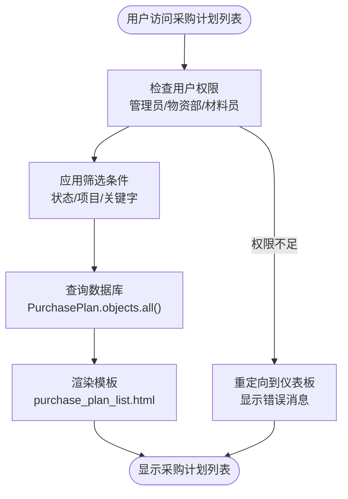

**图表来源**
- [views.py:377-410](file://inventory/views.py#L377-L410)
- [purchase_plan_list.html:8-32](file://templates/inventory/purchase_plan_list.html#L8-L32)

#### 保存操作流程
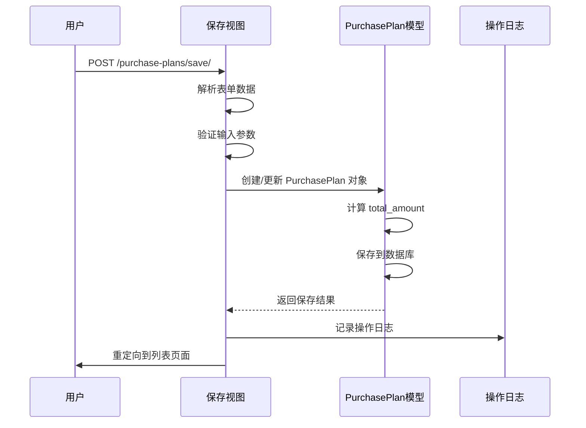

**图表来源**
- [views.py:412-440](file://inventory/views.py#L412-L440)

#### 删除操作权限控制
删除操作具有严格的权限控制：
- 仅管理员和物资部人员可以删除采购计划
- 删除前会记录操作日志
- 支持批量删除操作

#### Excel 导出功能
系统提供了丰富的数据导出功能，支持多种格式的数据导出：

#### 导出类型
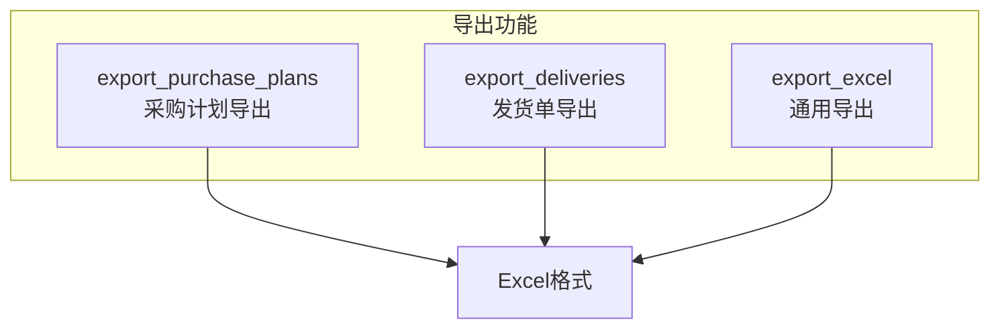

**图表来源**
- [views.py:456-530](file://inventory/views.py#L456-L530)

#### 批量导入功能
系统支持Excel文件的批量导入，提供完整的数据校验和错误处理机制：

#### 导入流程
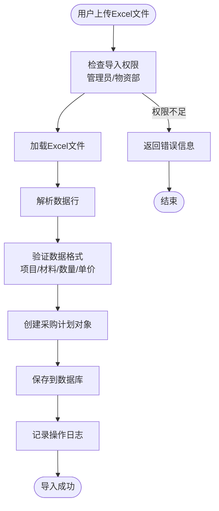

**图表来源**
- [views.py:533-666](file://inventory/views.py#L533-L666)

**章节来源**
- [views.py:377-666](file://inventory/views.py#L377-L666)

### 权限控制系统
系统实现了基于角色的权限控制（RBAC），确保不同用户只能访问其权限范围内的功能：

#### 角色定义
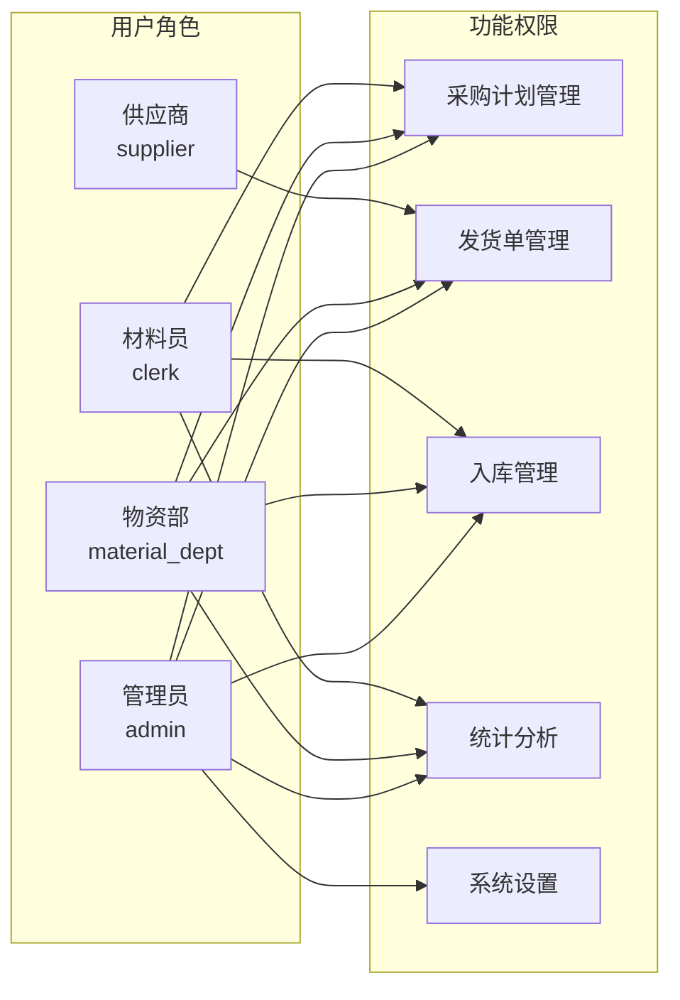

**图表来源**
- [user_permissions.html:49-156](file://templates/inventory/user_permissions.html#L49-L156)

#### 权限验证机制
系统提供了多种权限验证装饰器和辅助函数：
- `can_manage_purchase_plan()`: 检查用户是否有采购计划管理权限
- `is_material_dept()`: 检查用户是否为物资部
- `is_clerk()`: 检查用户是否为材料员
- `is_supplier()`: 检查用户是否为供应商

**章节来源**
- [views.py:34-54](file://inventory/views.py#L34-L54)
- [user_permissions.html:1-249](file://templates/inventory/user_permissions.html#L1-L249)

### 查询筛选功能
采购计划列表支持多维度的查询筛选：

#### 筛选条件
- **状态筛选**：按 pending、approved、shipping、received 状态过滤
- **项目筛选**：按所属项目过滤
- **关键字搜索**：按计划编号或材料名称模糊搜索

#### 查询实现
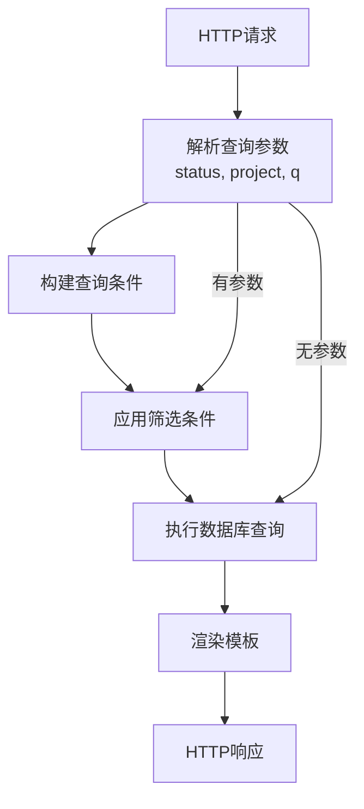

**图表来源**
- [views.py:377-410](file://inventory/views.py#L377-L410)

**章节来源**
- [views.py:377-410](file://inventory/views.py#L377-L410)
- [purchase_plan_list.html:8-32](file://templates/inventory/purchase_plan_list.html#L8-L32)

## 依赖关系分析

### 模块间依赖
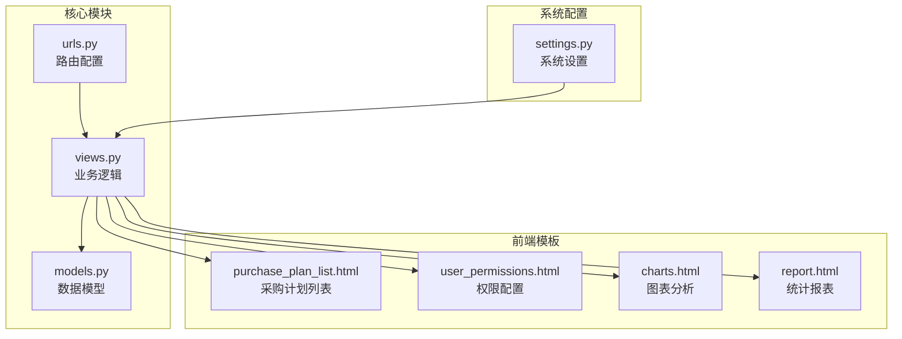

**图表来源**
- [models.py:1-361](file://inventory/models.py#L1-L361)
- [views.py:1-200](file://inventory/views.py#L1-L200)
- [urls.py:1-84](file://inventory/urls.py#L1-L84)

### 外部依赖
系统依赖的主要外部库：
- **Django**: Web 框架核心
- **openpyxl**: Excel 文件处理
- **qrcode**: 二维码生成
- **sqlite3**: 数据库引擎

**章节来源**
- [settings.py:74-87](file://material_system/settings.py#L74-L87)
- [views.py:1-25](file://inventory/views.py#L1-L25)

## 性能考虑
采购计划管理模块在设计时充分考虑了性能优化：

### 数据库优化
- **索引策略**: 在常用查询字段上建立索引
- **查询优化**: 使用 select_related 避免 N+1 查询问题
- **批量操作**: 支持批量删除和批量导入

### 内存管理
- **流式处理**: Excel 导出使用流式写入减少内存占用
- **分页机制**: 列表页面支持分页显示大量数据
- **缓存策略**: 合理使用 Django 缓存机制

### 前端优化
- **异步加载**: 使用 AJAX 实现部分页面刷新
- **客户端计算**: 数量和金额在客户端实时计算
- **懒加载**: 图表和报表按需加载

## 故障排除指南

### 常见问题及解决方案

#### 权限相关问题
**问题**: 用户无法访问采购计划功能
**原因**: 用户角色权限不足
**解决方法**: 
1. 检查用户角色配置
2. 确认用户是否属于管理员、物资部或材料员
3. 验证用户权限矩阵配置

#### 数据一致性问题
**问题**: 采购计划金额计算错误
**原因**: Decimal 精度处理不当
**解决方法**:
1. 确保所有金额字段使用 Decimal 类型
2. 检查 save() 方法中的计算逻辑
3. 验证数据库中的数值精度

#### Excel 导入问题
**问题**: Excel 文件导入失败
**原因**: 数据格式不正确或权限不足
**解决方法**:
1. 检查 Excel 文件格式是否符合要求
2. 确认导入权限（管理员或物资部）
3. 验证项目和材料是否存在
4. 检查数量和单价的数值格式

#### Excel 导出问题
**问题**: Excel 文件打开时报错
**原因**: 数据类型转换问题
**解决方法**:
1. 检查 decimal_default() 函数
2. 确认所有 Decimal 值都正确转换为 float
3. 验证 Excel 文件格式兼容性

**章节来源**
- [views.py:34-64](file://inventory/views.py#L34-L64)
- [views.py:105-111](file://inventory/views.py#L105-L111)

## 结论
采购计划管理模块是一个功能完整、架构清晰的业务系统。通过合理的数据模型设计、完善的权限控制机制、丰富的查询筛选功能和高效的 Excel 导出能力，为企业的采购管理提供了强有力的技术支撑。

模块的主要优势包括：
1. **完整的生命周期管理**: 从创建到完成的全流程覆盖
2. **严格的状态控制**: 确保业务流程的规范性
3. **灵活的权限体系**: 支持多角色的精细化权限控制
4. **强大的数据处理能力**: 支持复杂的数据查询和导出
5. **良好的用户体验**: 现代化的前端界面和交互设计
6. **高效的数据导入导出**: 支持批量数据处理

建议在未来版本中进一步增强的功能：
1. **移动端适配**: 优化移动端用户体验
2. **工作流引擎**: 集成更复杂的工作流管理
3. **审计追踪**: 增强数据变更的审计功能
4. **报表定制**: 提供更灵活的报表定制功能
5. **通知机制**: 集成邮件或短信通知功能

## 附录

### 最佳实践指导

#### 采购计划创建最佳实践
1. **准确估算需求**: 基于历史数据和项目进度合理估算采购数量
2. **及时更新状态**: 采购完成后及时更新采购计划状态
3. **详细记录备注**: 为每个采购计划添加详细的备注信息
4. **定期审查计划**: 定期审查采购计划的执行情况

#### 权限管理最佳实践
1. **最小权限原则**: 为用户分配最小必要的权限
2. **定期权限审查**: 定期审查和调整用户权限
3. **权限变更记录**: 详细记录所有权限变更操作
4. **职责分离**: 确保关键操作由多人协作完成

#### 数据管理最佳实践
1. **数据备份**: 定期备份重要数据
2. **数据清理**: 定期清理过期和冗余数据
3. **数据验证**: 在数据录入时进行严格验证
4. **数据监控**: 建立数据质量监控机制

#### Excel 导入导出最佳实践
1. **格式标准化**: 统一Excel文件的格式要求
2. **数据校验**: 在导入前进行数据完整性检查
3. **错误处理**: 提供详细的错误信息和修复建议
4. **批量处理**: 对大量数据进行分批处理，避免超时