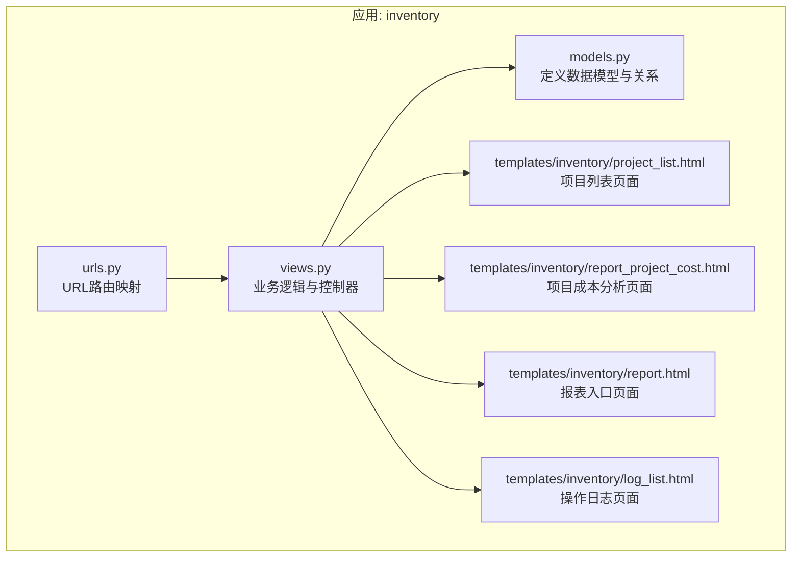
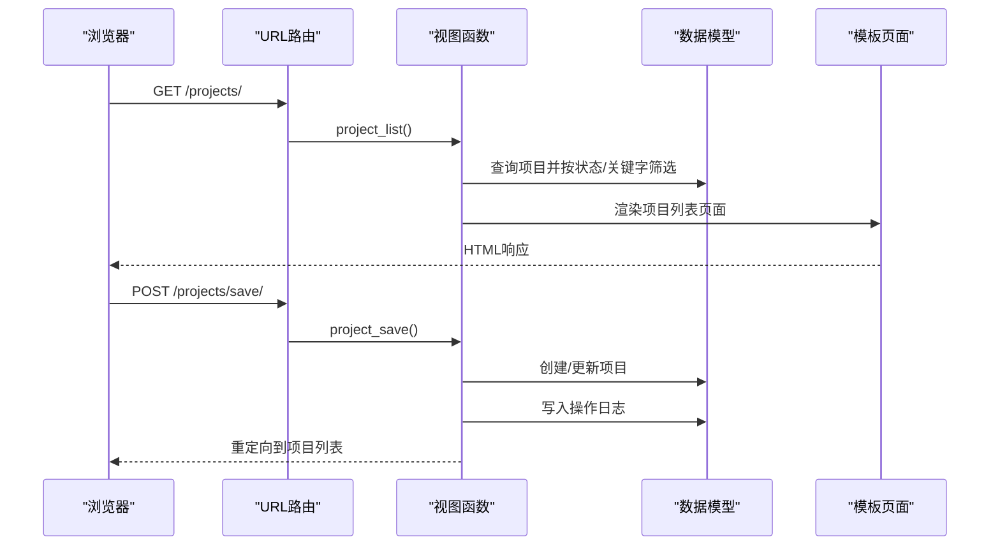
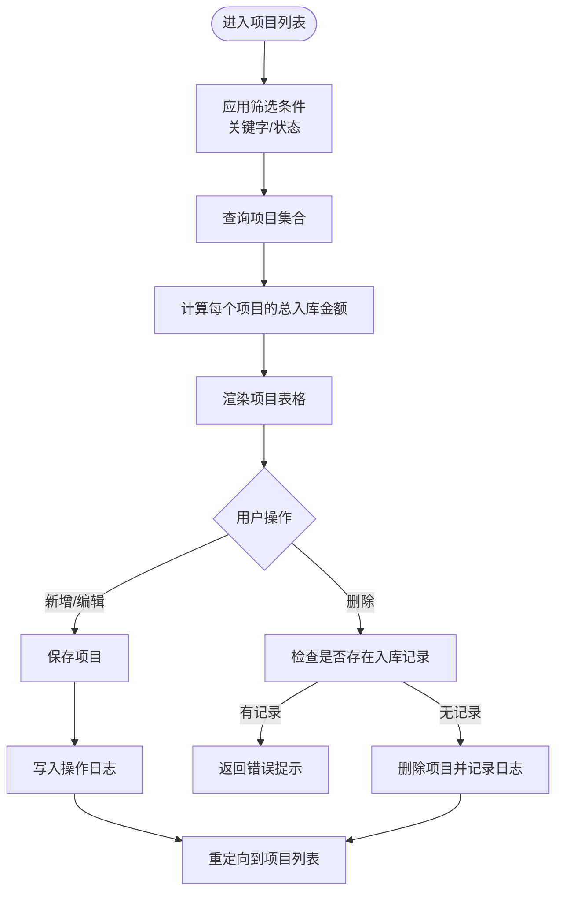
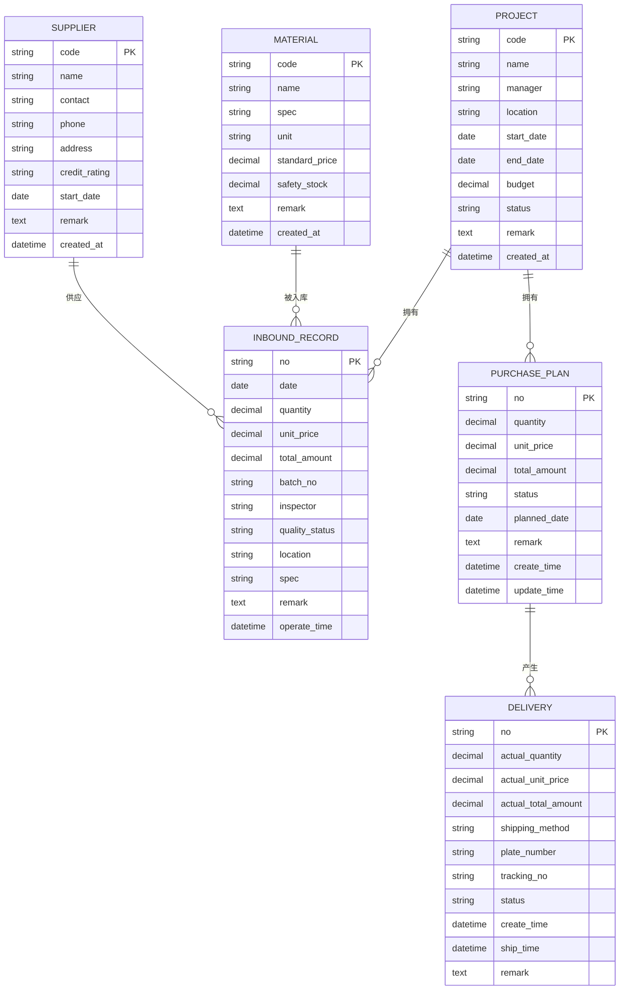
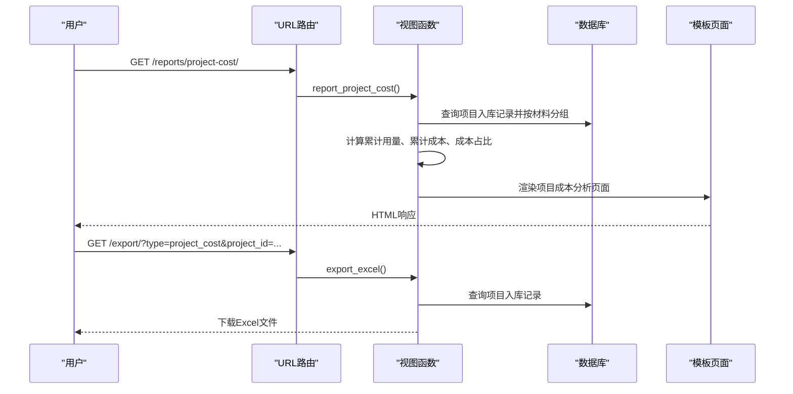
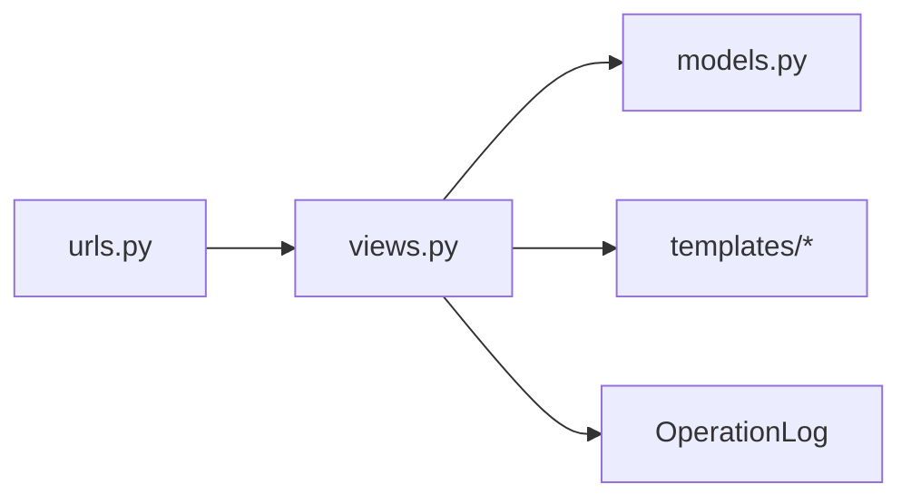

# 项目管理模块

<cite>
**本文引用的文件**
- [models.py](file://inventory/models.py)
- [views.py](file://inventory/views.py)
- [urls.py](file://inventory/urls.py)
- [project_list.html](file://templates/inventory/project_list.html)
- [report_project_cost.html](file://templates/inventory/report_project_cost.html)
- [report.html](file://templates/inventory/report.html)
- [log_list.html](file://templates/inventory/log_list.html)
- [generate_test_data.py](file://generate_test_data.py)
</cite>

## 目录
1. [简介](#简介)
2. [项目结构](#项目结构)
3. [核心组件](#核心组件)
4. [架构概览](#架构概览)
5. [详细组件分析](#详细组件分析)
6. [依赖关系分析](#依赖关系分析)
7. [性能考虑](#性能考虑)
8. [故障排除指南](#故障排除指南)
9. [结论](#结论)
10. [附录](#附录)

## 简介
本技术文档全面阐述项目管理模块的设计与实现，涵盖项目档案的创建、编辑、删除与查询功能；项目状态管理机制（进行中、已完工、暂停）；项目预算控制逻辑；项目与材料、供应商、采购计划之间的关联关系；项目查询筛选功能（按状态、关键字搜索）；项目成本统计功能（项目总入库金额计算）；权限控制机制与操作日志记录；以及最佳实践与常见问题解决方案。文档通过代码级分析、可视化图表和流程图帮助读者深入理解系统的业务流程和技术实现。

## 项目结构
项目管理模块位于 inventory 应用下，采用 Django 的 MVC 架构模式：
- 模型层：定义 Project、Material、Supplier、InboundRecord、PurchasePlan、Delivery、OperationLog 等实体及其字段与关系
- 视图层：处理 HTTP 请求，执行业务逻辑，渲染模板或返回 JSON 数据
- 路由层：定义 URL 映射到具体视图函数
- 模板层：前端页面展示，包含项目列表、报表、日志等功能页面

**图表来源**
- [urls.py:1-80](file://inventory/urls.py#L1-L80)
- [views.py:160-222](file://inventory/views.py#L160-L222)
- [models.py:51-75](file://inventory/models.py#L51-L75)

**章节来源**
- [urls.py:1-80](file://inventory/urls.py#L1-L80)
- [views.py:160-222](file://inventory/views.py#L160-L222)
- [models.py:51-75](file://inventory/models.py#L51-L75)

## 核心组件
- 项目模型（Project）
  - 字段：项目编号、名称、负责人、地点、开工/竣工日期、预算、状态、备注、创建时间
  - 关系：与入库记录（一对多）、与采购计划（一对多）
  - 方法：计算项目总入库金额（基于入库记录的总金额聚合）

- 权限与角色（Profile）
  - 角色：管理员、物资部、材料员、供应商
  - 提供便捷属性判断用户角色，用于权限控制

- 操作日志（OperationLog）
  - 记录模块、操作类型、操作详情、关联单号等，便于审计与追踪

- 报表与统计
  - 项目成本分析：按项目维度统计材料分类、材料名称、规格、单位、累计用量、累计成本及成本占比
  - 供应商成本分析：按供应商维度统计采购明细与合计
  - 月度统计：按日期统计入库金额

**章节来源**
- [models.py:51-75](file://inventory/models.py#L51-L75)
- [models.py:7-48](file://inventory/models.py#L7-L48)
- [models.py:312-328](file://inventory/models.py#L312-L328)
- [views.py:982-1052](file://inventory/views.py#L982-L1052)
- [views.py:1058-1137](file://inventory/views.py#L1058-L1137)
- [views.py:1140-1199](file://inventory/views.py#L1140-L1199)

## 架构概览
项目管理模块遵循 Django 的 MTV 模式，前后端分离但通过模板渲染实现服务端渲染。核心交互流程如下：

**图表来源**
- [urls.py:10-14](file://inventory/urls.py#L10-L14)
- [views.py:162-200](file://inventory/views.py#L162-L200)
- [models.py:312-328](file://inventory/models.py#L312-L328)

## 详细组件分析

### 项目档案管理
- 创建与编辑
  - 自动生成项目编号（前缀+递增序列）
  - 支持设置项目状态、预算、负责人、地点、日期等
  - 保存时写入操作日志，记录模块、类型、详情与关联单号

- 删除
  - 若项目存在入库记录，则禁止删除，避免破坏数据完整性
  - 删除成功后记录操作日志

- 查询与筛选
  - 支持按项目编号/名称关键字搜索
  - 支持按状态（进行中、已完工、暂停）筛选
  - 列表页展示项目总入库金额（通过聚合计算）

**图表来源**
- [views.py:162-211](file://inventory/views.py#L162-L211)
- [models.py:73-74](file://inventory/models.py#L73-L74)

**章节来源**
- [views.py:162-211](file://inventory/views.py#L162-L211)
- [project_list.html:11-24](file://templates/inventory/project_list.html#L11-L24)
- [models.py:51-75](file://inventory/models.py#L51-L75)

### 项目状态管理机制
- 状态枚举：进行中、已完工、暂停
- 状态变更通过编辑界面完成，影响项目在列表中的排序与展示
- 状态与预算共同构成项目成本控制的基础指标

**章节来源**
- [models.py:53-61](file://inventory/models.py#L53-L61)
- [views.py:178-199](file://inventory/views.py#L178-L199)

### 项目预算控制逻辑
- 预算字段存储在项目模型中，用于成本控制与分析
- 项目总入库金额通过入库记录的总金额聚合计算，作为实际成本与预算对比的依据
- 报表功能可按时间段统计项目成本，辅助预算执行监控

**章节来源**
- [models.py:60-74](file://inventory/models.py#L60-L74)
- [views.py:982-1052](file://inventory/views.py#L982-L1052)

### 项目与材料、供应商、采购计划的关联关系
- 项目与入库记录：一对多关系，项目承担入库材料的成本归属
- 项目与采购计划：一对多关系，采购计划服务于项目需求
- 供应商与入库记录：一对多关系，入库记录体现供应商交付情况
- 项目与供应商：间接关联，通过入库记录建立联系

**图表来源**
- [models.py:51-328](file://inventory/models.py#L51-L328)

**章节来源**
- [models.py:51-328](file://inventory/models.py#L51-L328)

### 项目查询筛选功能
- 关键字搜索：支持按项目编号或名称模糊匹配
- 状态筛选：支持按进行中、已完工、暂停状态过滤
- 列表页动态计算每个项目的总入库金额，便于成本对比

**章节来源**
- [views.py:162-175](file://inventory/views.py#L162-L175)
- [project_list.html:11-24](file://templates/inventory/project_list.html#L11-L24)

### 项目成本统计功能
- 项目总入库金额：通过聚合计算入库记录的总金额，用于项目成本统计
- 项目成本分析报表：按材料维度统计累计用量与累计成本，并计算成本占比
- 报表导出：支持 Excel 导出，便于离线分析与归档

**图表来源**
- [urls.py:55-58](file://inventory/urls.py#L55-L58)
- [views.py:982-1052](file://inventory/views.py#L982-L1052)
- [report_project_cost.html:1-58](file://templates/inventory/report_project_cost.html#L1-L58)

**章节来源**
- [views.py:982-1052](file://inventory/views.py#L982-L1052)
- [report_project_cost.html:1-58](file://templates/inventory/report_project_cost.html#L1-L58)
- [report.html:1-97](file://templates/inventory/report.html#L1-L97)

### 权限控制机制与操作日志记录
- 角色与权限
  - 管理员：可访问所有功能，包括项目管理、材料管理、供应商管理、入库管理、用户管理等
  - 物资部：可管理入库记录与采购计划
  - 材料员：可管理入库记录与采购计划
  - 供应商：仅能查看与管理发货相关功能
- 操作日志
  - 记录模块、操作类型（新增、修改、删除、导出、登录、其他）、操作详情、关联单号
  - 日志页面支持按日期范围、模块筛选查询

**章节来源**
- [views.py:34-64](file://inventory/views.py#L34-L64)
- [views.py:28-32](file://inventory/views.py#L28-L32)
- [log_list.html:1-50](file://templates/inventory/log_list.html#L1-L50)
- [models.py:7-48](file://inventory/models.py#L7-L48)

## 依赖关系分析
- 视图函数依赖于 URL 路由配置，路由将请求映射到具体的视图函数
- 视图函数依赖于数据模型进行查询、创建、更新、删除操作
- 模板页面依赖于视图函数提供的上下文数据进行渲染
- 操作日志模型独立于业务模块，通过统一的日志工具函数写入

**图表来源**
- [urls.py:1-80](file://inventory/urls.py#L1-L80)
- [views.py:1-25](file://inventory/views.py#L1-L25)
- [models.py:312-328](file://inventory/models.py#L312-L328)

**章节来源**
- [urls.py:1-80](file://inventory/urls.py#L1-L80)
- [views.py:1-25](file://inventory/views.py#L1-L25)
- [models.py:312-328](file://inventory/models.py#L312-L328)

## 性能考虑
- 查询优化
  - 使用 select_related 预加载外键关联，减少 N+1 查询问题
  - 在项目列表中对入库记录进行聚合计算，避免在模板中重复计算
- 数据库索引
  - 建议为常用查询字段（如项目编号、状态、创建时间）添加索引以提升查询性能
- 分页与导出
  - 大数据量导出建议分批处理，避免内存溢出
- 前端渲染
  - 列表页使用 AJAX 加载详情接口，减少页面刷新带来的性能损耗

## 故障排除指南
- 无法删除项目
  - 原因：项目存在入库记录
  - 解决：先清理相关入库记录或调整业务流程
- 无权限访问
  - 原因：当前用户角色不满足访问要求
  - 解决：切换到具备相应权限的账号或联系管理员授权
- 操作日志缺失
  - 原因：未触发写入日志的业务路径或异常导致日志未记录
  - 解决：检查日志写入逻辑与异常处理，确保关键操作均记录日志
- 成本统计不准确
  - 原因：入库记录数据异常或统计口径不一致
  - 解决：核对入库记录数据，统一统计口径与时间范围

**章节来源**
- [views.py:201-211](file://inventory/views.py#L201-L211)
- [views.py:34-64](file://inventory/views.py#L34-L64)
- [views.py:28-32](file://inventory/views.py#L28-L32)
- [views.py:982-1052](file://inventory/views.py#L982-L1052)

## 结论
项目管理模块通过清晰的数据模型设计、完善的权限控制与操作日志机制、灵活的查询筛选与强大的成本统计能力，实现了对工程项目全生命周期的有效管理。模块化的架构便于扩展与维护，同时提供了丰富的报表与导出功能，满足日常运营与决策分析的需求。

## 附录
- 测试数据生成
  - 通过测试脚本生成示例项目数据，验证项目状态与预算字段的正确性
- 最佳实践
  - 严格区分角色权限，避免越权操作
  - 定期备份数据与日志，确保可追溯性
  - 对高频查询字段建立索引，优化数据库性能
  - 在导出大体量数据时采用分批处理策略

**章节来源**
- [generate_test_data.py:30-47](file://generate_test_data.py#L30-L47)