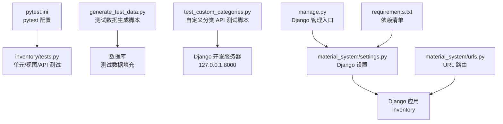
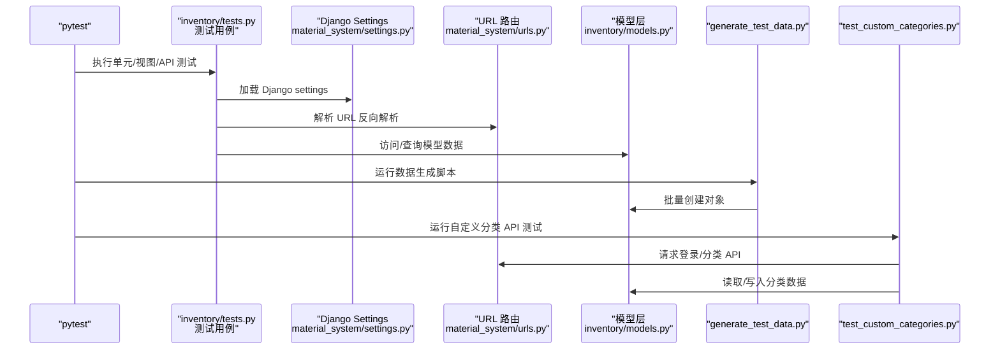
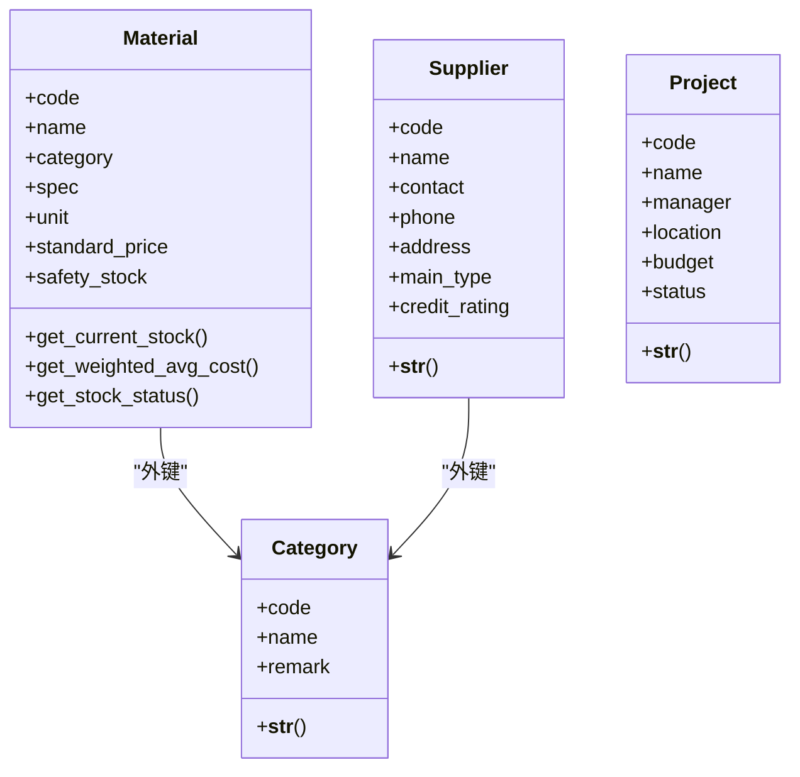
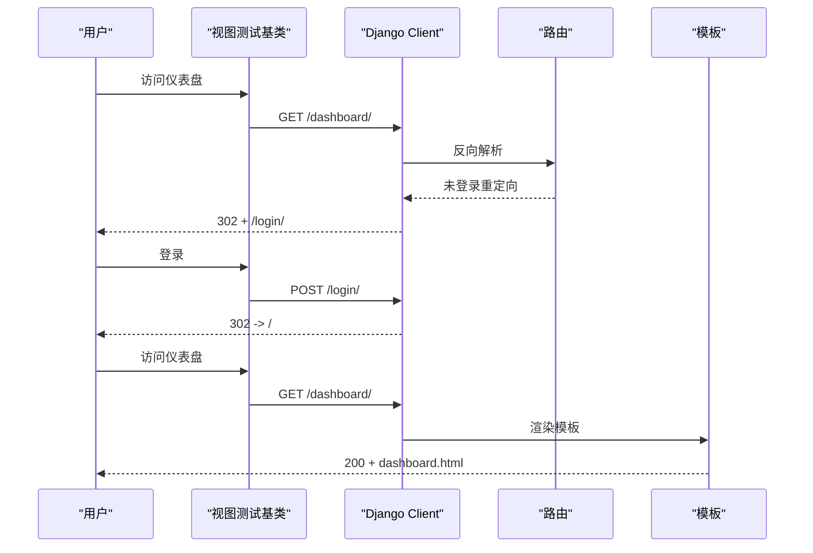
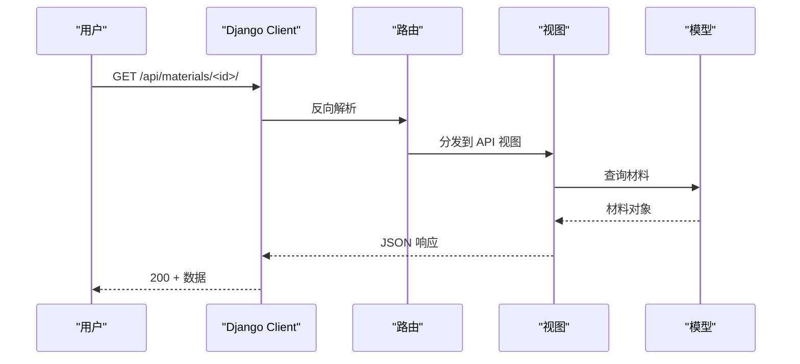
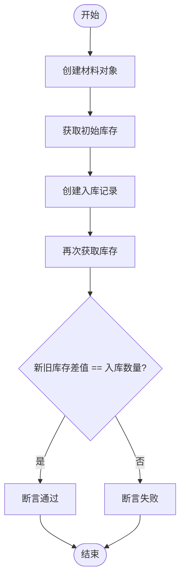
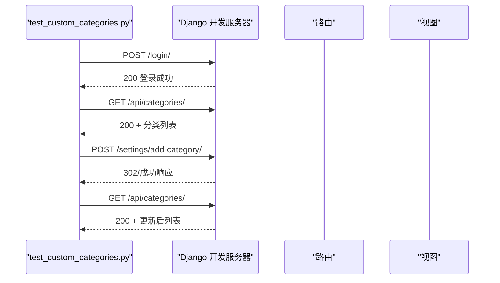
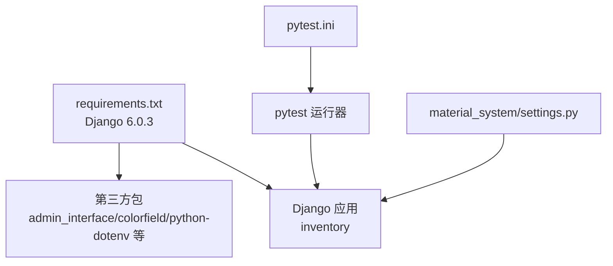

# 测试与开发

<cite>
**本文引用的文件**
- [pytest.ini](file://pytest.ini)
- [inventory/tests.py](file://inventory/tests.py)
- [generate_test_data.py](file://generate_test_data.py)
- [test_custom_categories.py](file://test_custom_categories.py)
- [material_system/settings.py](file://material_system/settings.py)
- [material_system/urls.py](file://material_system/urls.py)
- [manage.py](file://manage.py)
- [requirements.txt](file://requirements.txt)
- [inventory/models.py](file://inventory/models.py)
</cite>

## 目录
1. [简介](#简介)
2. [项目结构](#项目结构)
3. [核心组件](#核心组件)
4. [架构总览](#架构总览)
5. [详细组件分析](#详细组件分析)
6. [依赖分析](#依赖分析)
7. [性能考虑](#性能考虑)
8. [故障排除指南](#故障排除指南)
9. [结论](#结论)
10. [附录](#附录)

## 简介
本指南面向材料管理系统（Django 项目）的测试与开发工作，覆盖以下主题：
- 使用 pytest 进行单元测试、集成测试与 API 功能测试
- pytest 配置与测试执行流程
- 测试数据生成工具与测试环境准备
- 代码质量保证（代码审查标准与覆盖率要求）
- 调试技巧与开发工具（Django 调试器、浏览器开发者工具）
- 开发流程（版本控制、分支管理、持续集成建议）
- 性能测试与压力测试方法与工具
- API 测试与接口验证最佳实践
- 常见问题与故障排除

## 项目结构
该项目采用 Django 应用分层组织，测试集中在 inventory 应用内，并辅以独立的测试数据生成脚本与自定义分类 API 的端到端测试脚本。pytest 通过配置文件统一管理测试发现规则与标记。

图表来源
- [pytest.ini:1-10](file://pytest.ini#L1-L10)
- [inventory/tests.py:1-304](file://inventory/tests.py#L1-L304)
- [generate_test_data.py:1-181](file://generate_test_data.py#L1-L181)
- [test_custom_categories.py:1-99](file://test_custom_categories.py#L1-L99)
- [material_system/settings.py:63-209](file://material_system/settings.py#L63-L209)
- [material_system/urls.py:1-12](file://material_system/urls.py#L1-L12)
- [manage.py:1-23](file://manage.py#L1-L23)
- [requirements.txt:1-16](file://requirements.txt#L1-L16)

章节来源
- [pytest.ini:1-10](file://pytest.ini#L1-L10)
- [inventory/tests.py:1-304](file://inventory/tests.py#L1-L304)
- [generate_test_data.py:1-181](file://generate_test_data.py#L1-L181)
- [test_custom_categories.py:1-99](file://test_custom_categories.py#L1-L99)
- [material_system/settings.py:63-209](file://material_system/settings.py#L63-L209)
- [material_system/urls.py:1-12](file://material_system/urls.py#L1-L12)
- [manage.py:1-23](file://manage.py#L1-L23)
- [requirements.txt:1-16](file://requirements.txt#L1-L16)

## 核心组件
- pytest 配置与标记：通过 pytest.ini 统一设置 Django settings 模块、测试文件发现模式与标记（slow、webtest），并启用严格标记与简短回溯。
- 单元测试：针对 inventory 应用的模型（Category、Material、Supplier、Project）进行创建、唯一性约束与字符串表示等断言。
- 视图测试：基于 Django TestCase 与 Client，验证登录态、重定向行为、模板使用与权限控制。
- API 测试：对材料详情 API 进行鉴权前后的行为断言。
- 业务逻辑测试：通过创建入库记录验证库存累计逻辑。
- 测试数据生成：generate_test_data.py 提供批量创建项目、分类、材料、供应商与入库记录的能力，便于快速搭建测试环境。
- 自定义分类 API 测试：test_custom_categories.py 通过 requests 会话模拟登录、获取 CSRF、调用分类 API 并断言结果。

章节来源
- [pytest.ini:1-10](file://pytest.ini#L1-L10)
- [inventory/tests.py:18-118](file://inventory/tests.py#L18-L118)
- [inventory/tests.py:146-197](file://inventory/tests.py#L146-L197)
- [inventory/tests.py:201-234](file://inventory/tests.py#L201-L234)
- [inventory/tests.py:238-291](file://inventory/tests.py#L238-L291)
- [generate_test_data.py:18-178](file://generate_test_data.py#L18-L178)
- [test_custom_categories.py:7-97](file://test_custom_categories.py#L7-L97)

## 架构总览
下图展示测试执行与数据流的关键节点：pytest 发现并运行测试；测试通过 Django Client 或直接操作模型；generate_test_data.py 用于预置数据；test_custom_categories.py 通过 HTTP 与 API 交互。

图表来源
- [inventory/tests.py:1-304](file://inventory/tests.py#L1-L304)
- [material_system/settings.py:63-209](file://material_system/settings.py#L63-L209)
- [material_system/urls.py:1-12](file://material_system/urls.py#L1-L12)
- [inventory/models.py:1-200](file://inventory/models.py#L1-L200)
- [generate_test_data.py:18-178](file://generate_test_data.py#L18-L178)
- [test_custom_categories.py:7-97](file://test_custom_categories.py#L7-L97)

## 详细组件分析

### pytest 配置与执行流程
- 配置项
  - DJANGO_SETTINGS_MODULE：指向 Django settings 模块，确保测试加载正确的应用与数据库。
  - python_files：定义测试文件发现规则，支持 tests.py、test_*.py、*_tests.py。
  - addopts：启用简短回溯与严格标记，避免未声明标记导致的误用。
  - markers：定义 slow（默认跳过）、webtest（需要浏览器环境）两类标记。
- 执行流程
  - 命令行运行 pytest，默认扫描匹配的测试文件，按类与方法顺序执行。
  - 可通过标记选择性执行或跳过：例如 --markers 查看标记、-m "not slow" 跳过慢速测试。
  - 建议配合覆盖率工具（如 pytest-cov）生成报告。

章节来源
- [pytest.ini:1-10](file://pytest.ini#L1-L10)

### 单元测试（模型层）
- 测试目标
  - Category：创建、唯一性（编码唯一）、字符串表示。
  - Material：创建、字符串表示、当前库存计算、加权平均成本、库存状态。
  - Supplier：创建、联系人字段、字符串表示。
  - Project：创建、状态枚举、字符串表示。
- 断言要点
  - 字段值一致性、异常触发（唯一性冲突）。
  - 业务方法返回值（如 get_current_stock、get_weighted_avg_cost）。
- 复杂度与优化
  - 模型方法多为聚合查询，注意过滤条件与空值处理。
  - 建议在测试中构造边界场景（零库存、负数、空范围）。

图表来源
- [inventory/models.py:78-200](file://inventory/models.py#L78-L200)

章节来源
- [inventory/tests.py:18-118](file://inventory/tests.py#L18-L118)
- [inventory/models.py:78-200](file://inventory/models.py#L78-L200)

### 视图测试（登录与仪表盘）
- 测试目标
  - 未登录访问仪表盘应重定向至登录页。
  - 登录后可访问仪表盘并渲染对应模板。
  - 登录页可访问，POST 提交正确凭据后重定向至仪表盘。
- 断言要点
  - 状态码、重定向 URL、模板使用。
- 复杂度与优化
  - 基于 Client 的请求模拟，无需真实浏览器，适合快速回归测试。

图表来源
- [inventory/tests.py:146-197](file://inventory/tests.py#L146-L197)
- [material_system/urls.py:1-12](file://material_system/urls.py#L1-L12)

章节来源
- [inventory/tests.py:146-197](file://inventory/tests.py#L146-L197)
- [material_system/urls.py:1-12](file://material_system/urls.py#L1-L12)

### API 测试（材料详情）
- 测试目标
  - 未登录访问材料详情 API 返回重定向。
  - 登录后访问 API 返回 JSON 数据，字段值与预期一致。
- 断言要点
  - 状态码、JSON 结构与字段值。
- 复杂度与优化
  - 建议在测试中加入鉴权中间件与权限校验的断言，确保安全边界。

图表来源
- [inventory/tests.py:201-234](file://inventory/tests.py#L201-L234)

章节来源
- [inventory/tests.py:201-234](file://inventory/tests.py#L201-L234)

### 业务逻辑测试（入库增加库存）
- 测试目标
  - 创建入库记录后，材料的累计入库量增加相应数量。
- 断言要点
  - 初始库存与新增后的差值等于入库数量。
- 复杂度与优化
  - 聚合查询需考虑并发与事务隔离级别；建议在测试中构造并发场景以验证一致性。

图表来源
- [inventory/tests.py:238-291](file://inventory/tests.py#L238-L291)

章节来源
- [inventory/tests.py:238-291](file://inventory/tests.py#L238-L291)

### 测试数据生成工具
- 功能概述
  - 自动生成管理员用户、项目、材料分类、材料、供应商与入库记录。
  - 支持幂等创建（get_or_create），避免重复数据。
- 使用方式
  - 在项目环境中执行脚本，自动连接 Django settings 并写入数据库。
- 注意事项
  - 确保数据库可写且 Django 环境已正确初始化。
  - 可结合 pytest 标记（如 slow）在 CI 中按需执行。

章节来源
- [generate_test_data.py:18-178](file://generate_test_data.py#L18-L178)

### 自定义分类 API 测试脚本
- 功能概述
  - 通过 requests 会话模拟登录、获取 CSRF、调用分类 API 并断言结果。
- 使用方式
  - 设置 TEST_USERNAME 与 TEST_PASSWORD 环境变量，或交互式输入密码。
  - 默认访问本地开发服务器 127.0.0.1:8000。
- 断言要点
  - 登录成功、获取分类列表、添加自定义分类成功、最终分类数量变化。

图表来源
- [test_custom_categories.py:7-97](file://test_custom_categories.py#L7-L97)

章节来源
- [test_custom_categories.py:7-97](file://test_custom_categories.py#L7-L97)

## 依赖分析
- Django 版本与依赖
  - Django 6.0.3，依赖包括 admin_interface、colorfield、python-dotenv、qrcode、openpyxl 等。
- 测试相关依赖
  - pytest 与 pytest-django（若使用 pytest-django 插件）；建议安装 pytest-cov 以生成覆盖率报告。
- 数据库与日志
  - 默认 SQLite，可通过环境变量切换；日志配置包含轮转与错误日志分离。

图表来源
- [requirements.txt:1-16](file://requirements.txt#L1-L16)
- [pytest.ini:1-10](file://pytest.ini#L1-L10)
- [material_system/settings.py:74-87](file://material_system/settings.py#L74-L87)

章节来源
- [requirements.txt:1-16](file://requirements.txt#L1-L16)
- [pytest.ini:1-10](file://pytest.ini#L1-L10)
- [material_system/settings.py:74-87](file://material_system/settings.py#L74-L87)

## 性能考虑
- 单元测试
  - 使用 Django TestCase 与内存数据库（默认 SQLite）可快速执行。
  - 对聚合查询（如 get_current_stock、get_weighted_avg_cost）进行边界测试（大量数据、空集、极端数值）。
- 集成测试
  - 使用 Client 模拟请求，避免真实浏览器开销；对慢速测试使用 slow 标记并在 CI 中跳过。
- API 测试
  - 对高并发场景，建议在测试中模拟并发写入并验证一致性。
- 性能测试与压力测试
  - 建议引入 locust 或 wrk 对关键 API（如分类列表、材料详情）进行压力测试。
  - 关注数据库连接池、索引与查询计划（可通过 Django ORM 的查询日志辅助分析）。

[本节为通用指导，不直接分析具体文件]

## 故障排除指南
- 测试无法加载 Django settings
  - 确认 pytest.ini 中 DJANGO_SETTINGS_MODULE 指向正确模块。
  - 确认 manage.py 与 settings.py 路径一致。
- 测试数据库连接超时
  - 检查 DATABASES 配置与环境变量；必要时调整 timeout。
- 登录测试失败
  - 确认测试用户已创建且密码正确；检查 CSRF 令牌与会话状态。
- API 测试返回 403/404
  - 确认 URL 反向解析正确；检查路由是否包含在 material_system/urls.py。
- 覆盖率报告缺失
  - 安装 pytest-cov 并使用 --cov=inventory --cov-report=html 生成报告。

章节来源
- [pytest.ini:1-10](file://pytest.ini#L1-L10)
- [material_system/settings.py:122-130](file://material_system/settings.py#L122-L130)
- [material_system/urls.py:1-12](file://material_system/urls.py#L1-L12)

## 结论
本指南总结了材料管理系统的测试与开发实践：以 pytest 为核心，结合单元测试、视图测试与 API 测试，辅以测试数据生成脚本与自定义分类 API 测试脚本，形成完整的测试体系。通过合理的配置与标记策略、覆盖率与性能测试，以及规范的开发与故障排除流程，可有效保障系统质量与稳定性。

[本节为总结性内容，不直接分析具体文件]

## 附录

### 测试执行清单
- 运行所有测试：pytest
- 仅运行非慢速测试：pytest -m "not slow"
- 生成覆盖率报告：pytest --cov=inventory --cov-report=html
- 查看标记：pytest --markers

章节来源
- [pytest.ini:1-10](file://pytest.ini#L1-L10)

### 代码质量保证
- 代码审查标准
  - 单元测试覆盖率不低于 80%（建议以 inventory 为主）。
  - 新增功能必须配套单元测试与 API 测试。
  - 复杂业务逻辑需补充边界与异常场景测试。
- 测试覆盖率要求
  - 建议在 CI 中设置覆盖率阈值，低于阈值则阻断合并。
  - 对关键路径（模型聚合、权限控制、API）进行重点覆盖。

[本节为通用指导，不直接分析具体文件]

### 调试技巧与开发工具
- Django 调试器
  - 在 settings.py 中开启 DEBUG；使用 logging 配置输出详细日志。
  - 使用 Django 的 shell_plus（如可用）进行交互式调试。
- 浏览器开发者工具
  - 检查网络面板中的请求与响应、CSRF 令牌、跨域与缓存头。
- 日志与监控
  - 关注 logs 目录下的 django.log 与 error.log，定位异常。

章节来源
- [material_system/settings.py:69-72](file://material_system/settings.py#L69-L72)
- [material_system/settings.py:149-203](file://material_system/settings.py#L149-L203)

### 开发流程指导
- 版本控制与分支管理
  - 使用 Git，主分支保护；特性分支开发，提交前运行测试。
- 持续集成
  - 在 CI 中执行 pytest、覆盖率检查与静态分析（如 flake8/black）。
- 发布流程
  - 通过部署脚本（如 deploy.sh）进行部署，确保数据库迁移与静态资源收集。

[本节为通用指导，不直接分析具体文件]