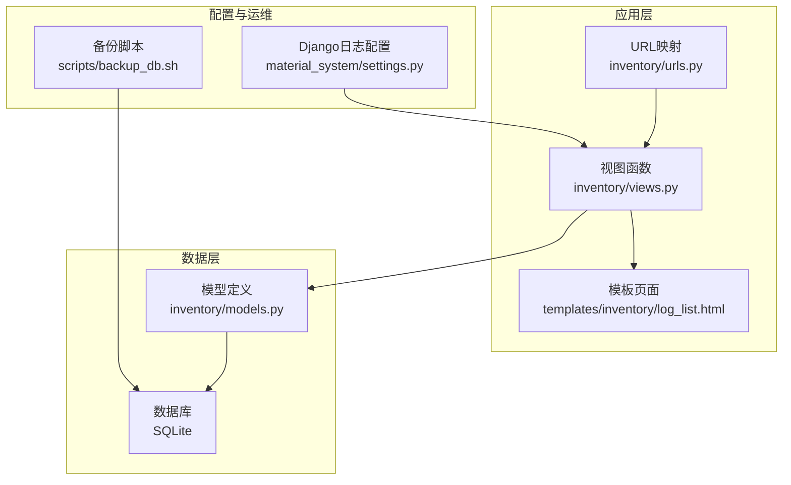
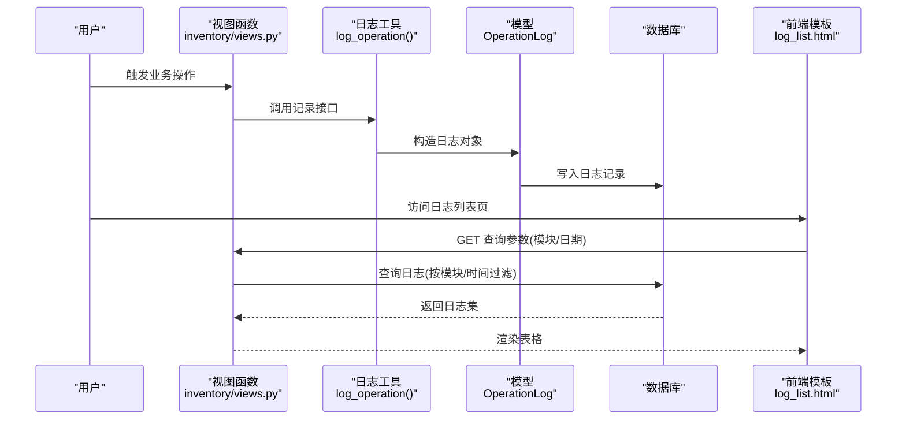
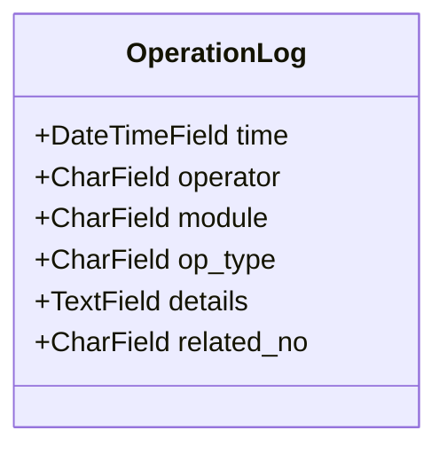
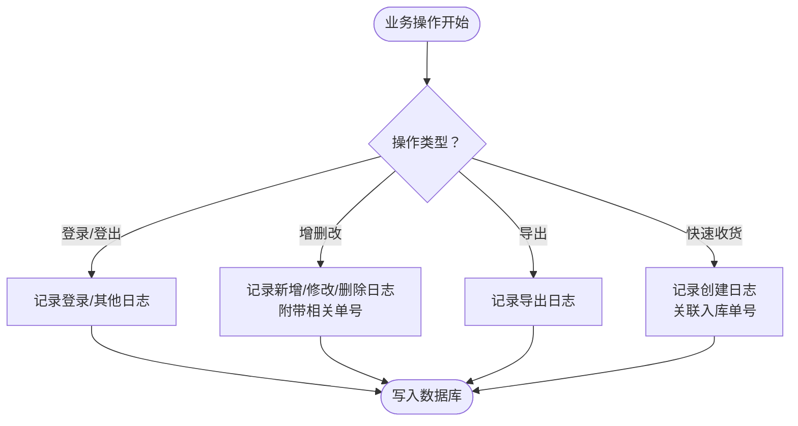
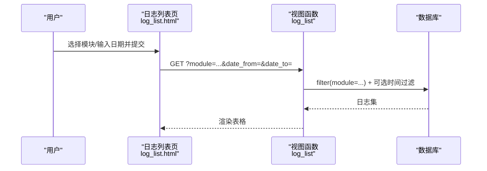
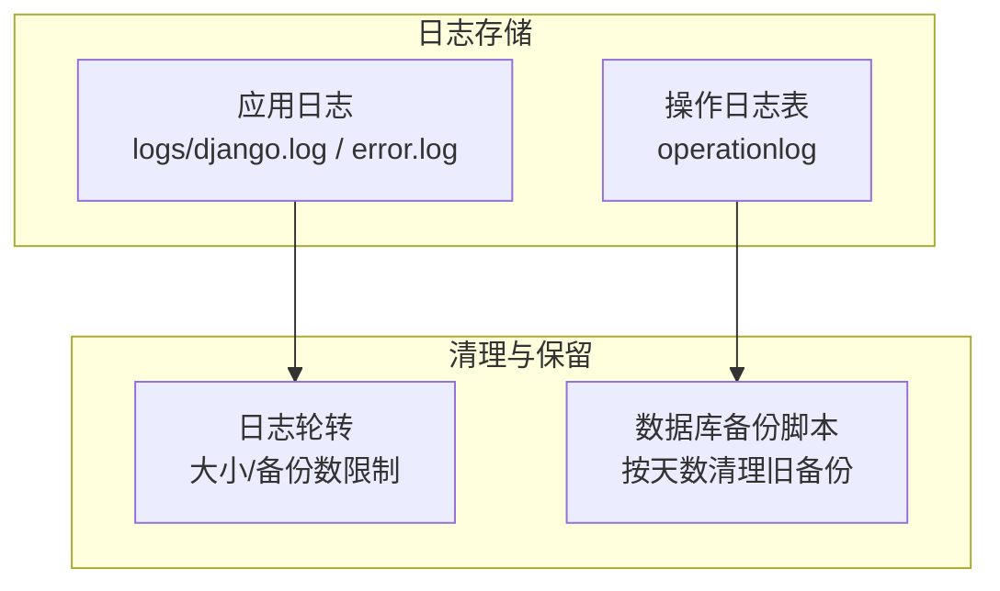
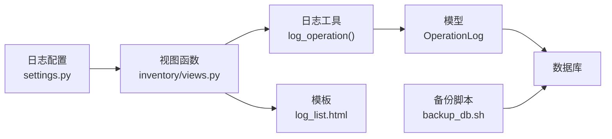

# 操作日志系统

<cite>
**本文引用的文件**
- [inventory/models.py](file://inventory/models.py)
- [inventory/views.py](file://inventory/views.py)
- [inventory/urls.py](file://inventory/urls.py)
- [templates/inventory/log_list.html](file://templates/inventory/log_list.html)
- [material_system/settings.py](file://material_system/settings.py)
- [scripts/backup_db.sh](file://scripts/backup_db.sh)
</cite>

## 目录
1. [简介](#简介)
2. [项目结构](#项目结构)
3. [核心组件](#核心组件)
4. [架构概览](#架构概览)
5. [详细组件分析](#详细组件分析)
6. [依赖分析](#依赖分析)
7. [性能考量](#性能考量)
8. [故障排查指南](#故障排查指南)
9. [结论](#结论)
10. [附录](#附录)

## 简介
本文件面向“材料管理系统的操作日志系统”，围绕 OperationLog 模型设计、日志记录策略、查询与筛选、存储与清理、分析与报表、以及安全与隐私保护等方面进行全面说明。目标是帮助开发者与运维人员理解并高效维护该系统。

## 项目结构
与操作日志系统直接相关的文件分布如下：
- 模型定义：inventory/models.py 中的 OperationLog 模型
- 视图与工具：inventory/views.py 中的日志记录工具函数、日志列表视图、各业务模块的记录点
- URL 映射：inventory/urls.py 中的日志列表路由
- 前端模板：templates/inventory/log_list.html 中的日志查询与展示界面
- 日志配置：material_system/settings.py 中的 Django 日志轮转配置
- 备份脚本：scripts/backup_db.sh 中的数据库备份与保留策略

**图表来源**
- [inventory/urls.py:1-80](file://inventory/urls.py#L1-L80)
- [inventory/views.py:28-32](file://inventory/views.py#L28-L32)
- [inventory/models.py:312-328](file://inventory/models.py#L312-L328)
- [templates/inventory/log_list.html:1-50](file://templates/inventory/log_list.html#L1-L50)
- [material_system/settings.py:148-203](file://material_system/settings.py#L148-L203)
- [scripts/backup_db.sh:1-56](file://scripts/backup_db.sh#L1-L56)

**章节来源**
- [inventory/urls.py:1-80](file://inventory/urls.py#L1-L80)
- [inventory/views.py:28-32](file://inventory/views.py#L28-L32)
- [inventory/models.py:312-328](file://inventory/models.py#L312-L328)
- [templates/inventory/log_list.html:1-50](file://templates/inventory/log_list.html#L1-L50)
- [material_system/settings.py:148-203](file://material_system/settings.py#L148-L203)
- [scripts/backup_db.sh:1-56](file://scripts/backup_db.sh#L1-L56)

## 核心组件
- OperationLog 模型：用于持久化操作日志，包含时间戳、操作员、模块、操作类型、详情与关联单号等字段。
- 日志记录工具函数：统一在业务逻辑的关键节点调用，确保一致性与完整性。
- 日志列表视图与模板：支持按模块筛选、分页展示，便于审计与追溯。
- 日志配置与备份：Django 日志轮转与数据库备份脚本共同保障日志数据的长期可用性。

**章节来源**
- [inventory/models.py:312-328](file://inventory/models.py#L312-L328)
- [inventory/views.py:28-32](file://inventory/views.py#L28-L32)
- [inventory/views.py:951-959](file://inventory/views.py#L951-L959)
- [templates/inventory/log_list.html:8-29](file://templates/inventory/log_list.html#L8-L29)
- [material_system/settings.py:148-203](file://material_system/settings.py#L148-L203)
- [scripts/backup_db.sh:1-56](file://scripts/backup_db.sh#L1-L56)

## 架构概览
下图展示了日志从产生到展示的整体流程，包括触发点、记录点、存储与查询路径。

**图表来源**
- [inventory/views.py:28-32](file://inventory/views.py#L28-L32)
- [inventory/views.py:951-959](file://inventory/views.py#L951-L959)
- [inventory/models.py:312-328](file://inventory/models.py#L312-L328)
- [templates/inventory/log_list.html:8-29](file://templates/inventory/log_list.html#L8-L29)

## 详细组件分析

### OperationLog 模型设计
- 字段说明
  - time：操作时间，自动记录，按时间倒序排列，便于最新日志优先展示。
  - operator：操作员，记录执行操作的用户标识。
  - module：模块，用于标识操作发生的业务域（如“系统”、“项目管理”、“材料管理”、“供应商管理”、“入库管理”、“采购计划”、“用户管理”、“Excel导出”等）。
  - op_type：操作类型，采用枚举，支持“新增”、“修改”、“删除”、“导出”、“登录”、“其他”等。
  - details：操作详情，记录具体的操作描述，便于审计与回溯。
  - related_no：关联单号，记录与本次操作相关的业务单据编号，便于追踪。
- 设计要点
  - 枚举化 op_type 提升可读性与一致性。
  - related_no 与业务单据强关联，有助于跨模块审计。
  - ordering 按时间倒序，满足常见审计场景。

**图表来源**
- [inventory/models.py:312-328](file://inventory/models.py#L312-L328)

**章节来源**
- [inventory/models.py:312-328](file://inventory/models.py#L312-L328)

### 日志记录触发时机与策略
- 登录/登出：登录成功与退出时分别记录“登录”和“其他”类型日志。
- 增删改查：在各业务模块的保存与删除接口中统一记录“新增/修改/删除”日志，并附带相关单据编号。
- 导出：在报表导出与 Excel 导出接口记录“导出”类型日志。
- 快速收货：在扫码收货流程中记录“创建”类型日志，关联生成的入库单号。
- 策略说明
  - 统一通过工具函数 log_operation() 记录，保证所有业务操作均有迹可循。
  - details 字段包含关键上下文（如单号、材料、数量），提升可读性与审计价值。

**图表来源**
- [inventory/views.py:131-142](file://inventory/views.py#L131-L142)
- [inventory/views.py:196-198](file://inventory/views.py#L196-L198)
- [inventory/views.py:275-277](file://inventory/views.py#L275-L277)
- [inventory/views.py:339-341](file://inventory/views.py#L339-L341)
- [inventory/views.py:540-543](file://inventory/views.py#L540-L543)
- [inventory/views.py:677-680](file://inventory/views.py#L677-L680)
- [inventory/views.py:689-692](file://inventory/views.py#L689-L692)
- [inventory/views.py:779](file://inventory/views.py#L779)
- [inventory/views.py:1849-1852](file://inventory/views.py#L1849-L1852)

**章节来源**
- [inventory/views.py:131-142](file://inventory/views.py#L131-L142)
- [inventory/views.py:196-198](file://inventory/views.py#L196-L198)
- [inventory/views.py:275-277](file://inventory/views.py#L275-L277)
- [inventory/views.py:339-341](file://inventory/views.py#L339-L341)
- [inventory/views.py:540-543](file://inventory/views.py#L540-L543)
- [inventory/views.py:677-680](file://inventory/views.py#L677-L680)
- [inventory/views.py:689-692](file://inventory/views.py#L689-L692)
- [inventory/views.py:779](file://inventory/views.py#L779)
- [inventory/views.py:1849-1852](file://inventory/views.py#L1849-L1852)

### 日志查询与筛选
- 模块筛选：前端提供模块下拉选择，后端按 module 字段过滤。
- 时间筛选：当前模板未内置日期范围筛选；可在现有基础上扩展 date_from/date_to 参数并添加后端过滤逻辑。
- 展示：模板以表格形式展示日志，包含时间、操作员、模块、类型、详情与关联单号。

**图表来源**
- [templates/inventory/log_list.html:8-29](file://templates/inventory/log_list.html#L8-L29)
- [inventory/views.py:951-959](file://inventory/views.py#L951-L959)

**章节来源**
- [templates/inventory/log_list.html:8-29](file://templates/inventory/log_list.html#L8-L29)
- [inventory/views.py:951-959](file://inventory/views.py#L951-L959)

### 日志数据存储与清理
- 存储位置
  - 应用日志：Django 日志轮转文件，位于 logs/django.log、logs/error.log，按大小轮转并保留多个备份。
  - 操作日志：数据库表 operationlog，由 Django ORM 管理。
- 清理策略
  - 应用日志：通过 LOGGING 配置的 RotatingFileHandler 控制单文件大小与备份数量。
  - 操作日志：当前未见自动清理策略；建议结合业务需求制定保留期限并在后台任务中定期清理过期日志。
- 备份策略
  - 数据库备份脚本支持按保留天数清理旧备份，确保数据库与日志数据的长期可用性。

**图表来源**
- [material_system/settings.py:148-203](file://material_system/settings.py#L148-L203)
- [scripts/backup_db.sh:44-52](file://scripts/backup_db.sh#L44-L52)

**章节来源**
- [material_system/settings.py:148-203](file://material_system/settings.py#L148-L203)
- [scripts/backup_db.sh:44-52](file://scripts/backup_db.sh#L44-L52)

### 日志分析与报表
- 报表导出：系统提供多种报表导出（如项目成本分析、供应商采购分析、月度统计），导出时会记录“导出”类型日志，便于审计导出行为。
- 分析建议：可基于 OperationLog 的模块与操作类型维度进行统计，例如统计各模块操作频次、导出次数、登录趋势等，形成可视化图表。

**章节来源**
- [inventory/views.py:1036](file://inventory/views.py#L1036)
- [inventory/views.py:1117](file://inventory/views.py#L1117)
- [inventory/views.py:1145-1150](file://inventory/views.py#L1145-L1150)

### 日志安全与隐私保护
- 访问控制：日志列表仅管理员可见，防止非授权查看敏感操作记录。
- 最小披露：details 字段记录必要信息，避免泄露敏感数据；如需更严格，可在记录前对敏感字段做脱敏处理。
- 传输与存储：生产环境建议启用 HTTPS，确保日志查询与导出过程中的数据安全；数据库与日志文件应设置适当文件权限。
- 审计留痕：统一的日志记录策略确保所有关键操作均可追溯，配合权限矩阵与角色控制，降低内部风险。

**章节来源**
- [inventory/views.py:951-954](file://inventory/views.py#L951-L954)
- [templates/inventory/user_permissions.html:12-156](file://templates/inventory/user_permissions.html#L12-L156)

## 依赖分析
- 模块耦合
  - 视图层通过工具函数 log_operation() 与模型层解耦，便于集中管理日志策略。
  - 日志列表视图与模板通过 URL 映射连接，形成清晰的前后端分离。
- 外部依赖
  - Django ORM 与日志框架负责数据持久化与日志输出。
  - 备份脚本依赖系统文件与定时任务，保障数据安全。

**图表来源**
- [inventory/views.py:28-32](file://inventory/views.py#L28-L32)
- [inventory/models.py:312-328](file://inventory/models.py#L312-L328)
- [templates/inventory/log_list.html:1-50](file://templates/inventory/log_list.html#L1-L50)
- [material_system/settings.py:148-203](file://material_system/settings.py#L148-L203)
- [scripts/backup_db.sh:1-56](file://scripts/backup_db.sh#L1-L56)

**章节来源**
- [inventory/views.py:28-32](file://inventory/views.py#L28-L32)
- [inventory/models.py:312-328](file://inventory/models.py#L312-L328)
- [templates/inventory/log_list.html:1-50](file://templates/inventory/log_list.html#L1-L50)
- [material_system/settings.py:148-203](file://material_system/settings.py#L148-L203)
- [scripts/backup_db.sh:1-56](file://scripts/backup_db.sh#L1-L56)

## 性能考量
- 查询优化：日志表按时间倒序，建议在 module 与 time 字段上建立索引以提升筛选与排序性能。
- 分页与缓存：日志列表建议分页加载；对于高频查询可考虑短期缓存热点模块的统计结果。
- 导出性能：大体量导出时建议异步处理并提供进度反馈，避免阻塞主线程。

## 故障排查指南
- 日志无法查看
  - 确认用户角色为管理员；否则将被重定向至仪表盘。
  - 检查 URL 是否正确映射至日志列表路由。
- 日志缺失
  - 确认业务逻辑中是否调用了 log_operation()。
  - 检查数据库写入是否成功，关注异常日志。
- 日志过多影响性能
  - 建议增加索引与分页；必要时引入自动清理策略。
- 备份与恢复
  - 使用备份脚本定期备份数据库；按需清理旧备份，避免磁盘占用过高。

**章节来源**
- [inventory/views.py:951-954](file://inventory/views.py#L951-L954)
- [inventory/urls.py:66](file://inventory/urls.py#L66)
- [scripts/backup_db.sh:44-52](file://scripts/backup_db.sh#L44-L52)

## 结论
操作日志系统通过统一的模型设计与工具函数，实现了对各类业务操作的完整记录；前端模板提供了便捷的筛选与展示能力。结合日志轮转与数据库备份策略，系统在可用性与安全性方面具备良好基础。建议后续完善时间筛选、自动清理与异步导出等能力，进一步提升用户体验与系统稳定性。

## 附录
- 关键实现路径参考
  - 模型定义：[inventory/models.py:312-328](file://inventory/models.py#L312-L328)
  - 日志工具函数：[inventory/views.py:28-32](file://inventory/views.py#L28-L32)
  - 登录/登出记录：[inventory/views.py:131-142](file://inventory/views.py#L131-L142)
  - 增删改记录：[inventory/views.py:196-198](file://inventory/views.py#L196-L198), [inventory/views.py:275-277](file://inventory/views.py#L275-L277), [inventory/views.py:339-341](file://inventory/views.py#L339-L341), [inventory/views.py:540-543](file://inventory/views.py#L540-L543), [inventory/views.py:677-680](file://inventory/views.py#L677-L680), [inventory/views.py:689-692](file://inventory/views.py#L689-L692), [inventory/views.py:1849-1852](file://inventory/views.py#L1849-L1852)
  - 导出记录：[inventory/views.py:779](file://inventory/views.py#L779), [inventory/views.py:1036](file://inventory/views.py#L1036), [inventory/views.py:1117](file://inventory/views.py#L1117)
  - 日志列表视图与模板：[inventory/views.py:951-959](file://inventory/views.py#L951-L959), [templates/inventory/log_list.html:8-29](file://templates/inventory/log_list.html#L8-L29)
  - 日志配置：[material_system/settings.py:148-203](file://material_system/settings.py#L148-L203)
  - 备份脚本：[scripts/backup_db.sh:44-52](file://scripts/backup_db.sh#L44-L52)