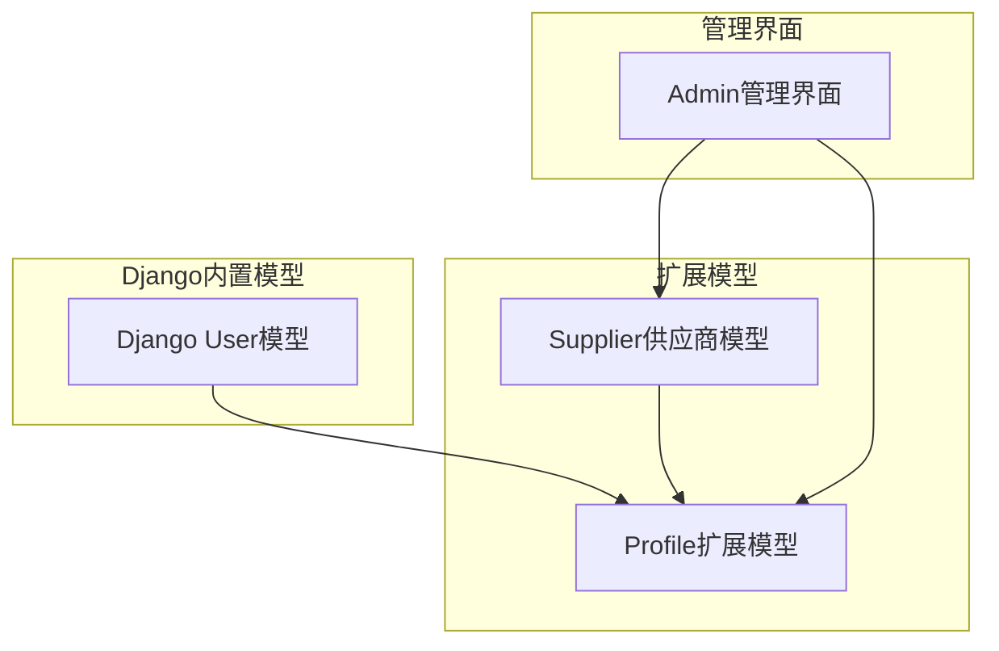
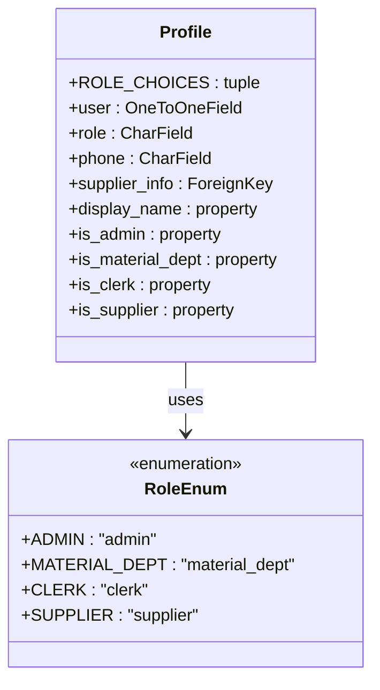
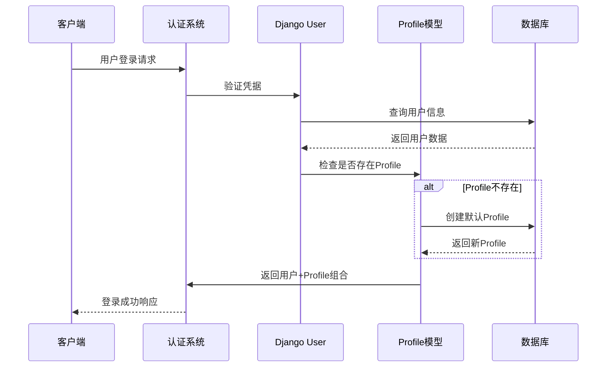
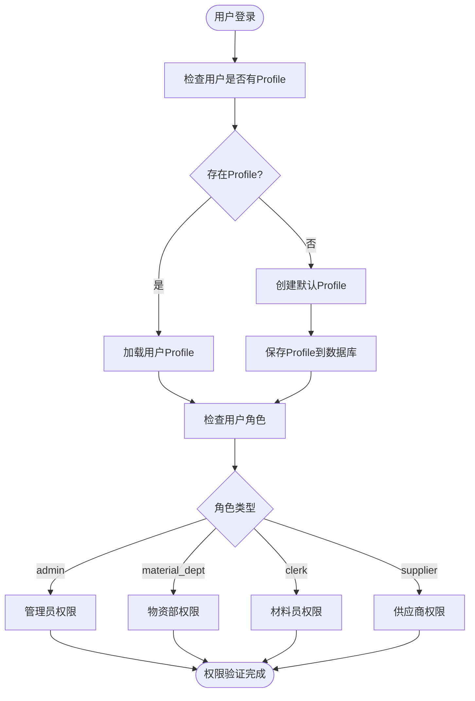
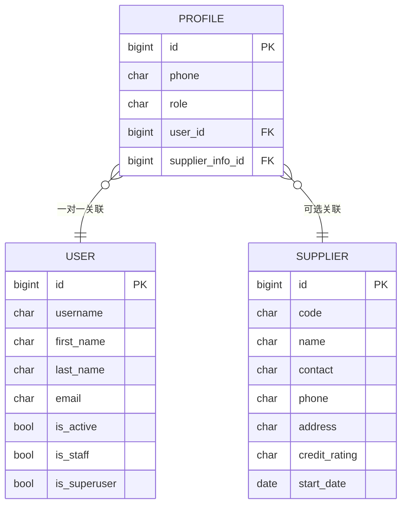
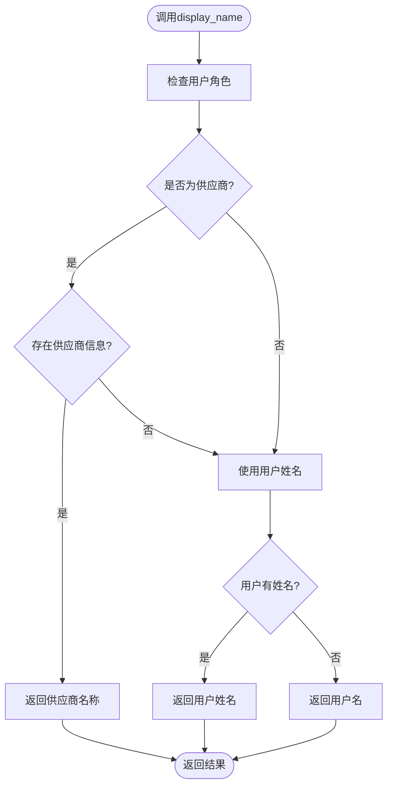
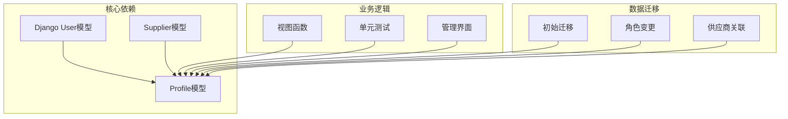
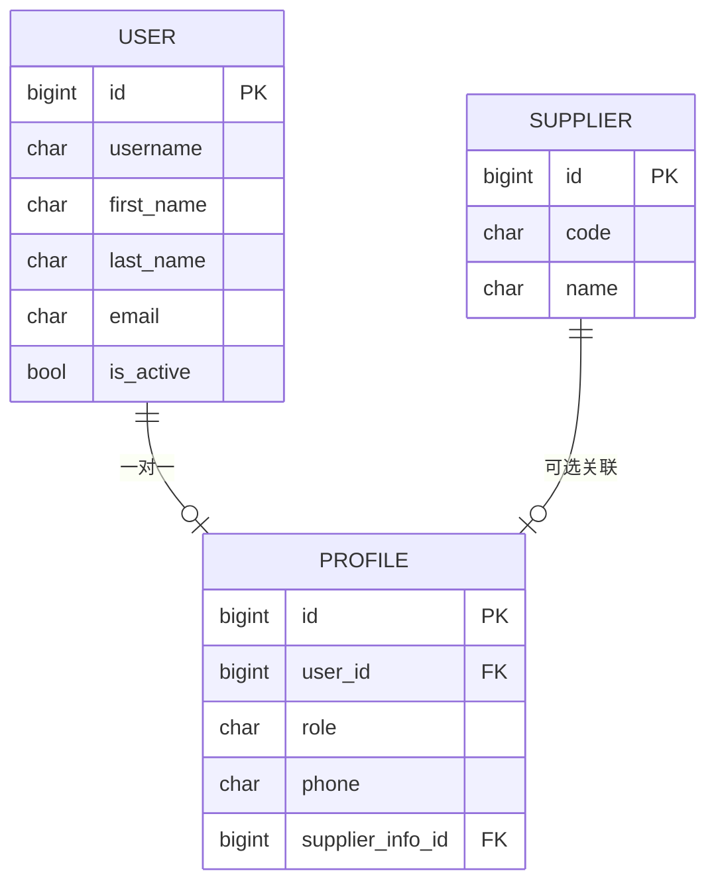

# 用户模型设计

<cite>
**本文档引用的文件**
- [models.py](file://inventory/models.py)
- [admin.py](file://inventory/admin.py)
- [0001_initial.py](file://inventory/migrations/0001_initial.py)
- [0007_alter_profile_role.py](file://inventory/migrations/0007_alter_profile_role.py)
- [0010_profile_supplier_info.py](file://inventory/migrations/0010_profile_supplier_info.py)
- [views.py](file://inventory/views.py)
- [tests.py](file://inventory/tests.py)
</cite>

## 目录
1. [简介](#简介)
2. [项目结构](#项目结构)
3. [核心组件](#核心组件)
4. [架构概览](#架构概览)
5. [详细组件分析](#详细组件分析)
6. [依赖关系分析](#依赖关系分析)
7. [性能考虑](#性能考虑)
8. [故障排除指南](#故障排除指南)
9. [结论](#结论)

## 简介

本文件详细阐述材料管理系统的用户模型设计，重点分析Django内置User模型与Profile扩展模型之间的关系、OneToOneField关联的设计原理、角色枚举常量ROLE_CHOICES的定义与使用，以及用户扩展字段的设计理念。系统通过Profile模型扩展Django的User模型，实现了多角色权限管理，支持管理员、物资部、材料员、供应商四种角色的职责划分，并提供了供应商角色的特殊处理机制。

## 项目结构

材料管理系统的用户模型位于inventory应用的models.py文件中，采用Django的标准模型设计模式：



**图表来源**
- [models.py:7-49](file://inventory/models.py#L7-L49)
- [admin.py:10-15](file://inventory/admin.py#L10-L15)

**章节来源**
- [models.py:1-328](file://inventory/models.py#L1-L328)
- [admin.py:1-54](file://inventory/admin.py#L1-L54)

## 核心组件

### Profile扩展模型

Profile模型是Django内置User模型的完美扩展，通过OneToOneField建立一对一关联关系，确保每个用户都有且仅有一个对应的用户档案。

#### 主要字段设计

| 字段名 | 类型 | 描述 | 约束 |
|--------|------|------|------|
| user | OneToOneField | 关联Django User模型 | CASCADE删除，related_name='profile' |
| role | CharField | 用户角色标识 | choices=ROLE_CHOICES, default='clerk' |
| phone | CharField | 联系电话 | max_length=20, blank=True |
| supplier_info | ForeignKey | 关联供应商档案 | SET_NULL, related_name='user_profiles' |

#### 角色枚举常量ROLE_CHOICES

系统定义了完整的角色枚举体系，支持四种核心角色：



**图表来源**
- [models.py:9-14](file://inventory/models.py#L9-L14)
- [models.py:15-18](file://inventory/models.py#L15-L18)

**章节来源**
- [models.py:7-49](file://inventory/models.py#L7-L49)
- [0007_alter_profile_role.py:9-18](file://inventory/migrations/0007_alter_profile_role.py#L9-L18)

### 角色职责划分

系统通过四个角色实现精细化的权限管理：

| 角色 | 英文标识 | 中文名称 | 权限范围 | 特殊功能 |
|------|----------|----------|----------|----------|
| admin | admin | 管理员 | 系统完全控制 | 系统最高权限 |
| material_dept | material_dept | 物资部 | 物资管理 | 项目管理权限 |
| clerk | clerk | 材料员 | 日常操作 | 库存操作权限 |
| supplier | supplier | 供应商 | 供应商视角 | 发货管理权限 |

**章节来源**
- [models.py:9-14](file://inventory/models.py#L9-L14)
- [views.py:34-53](file://inventory/views.py#L34-L53)

## 架构概览

用户模型采用经典的Django扩展模式，通过OneToOneField实现User模型的透明扩展：



**图表来源**
- [views.py:129-130](file://inventory/views.py#L129-L130)
- [models.py:15](file://inventory/models.py#L15)

## 详细组件分析

### OneToOneField关联设计

Profile模型通过OneToOneField与Django内置User模型建立强关联关系：

#### 关联特性

1. **一对一约束**：确保用户与档案的唯一对应关系
2. **级联删除**：User删除时自动删除对应Profile
3. **反向关联**：User对象可通过profile属性访问Profile
4. **related_name**：Profile可通过user.profile访问User

#### 关联查询优化



**图表来源**
- [views.py:129-130](file://inventory/views.py#L129-L130)
- [views.py:34-53](file://inventory/views.py#L34-L53)

**章节来源**
- [models.py:15](file://inventory/models.py#L15)
- [0001_initial.py:113](file://inventory/migrations/0001_initial.py#L113)

### 角色枚举常量设计

ROLE_CHOICES定义了完整的角色体系，采用元组格式存储英文标识和中文显示名称：

#### 角色定义结构

```python
ROLE_CHOICES = [
    ('admin', '管理员'),
    ('material_dept', '物资部'),
    ('clerk', '材料员'),
    ('supplier', '供应商'),
]
```

#### 角色属性方法

系统为每种角色提供便捷的属性访问器：

| 属性方法 | 功能描述 | 使用场景 |
|----------|----------|----------|
| is_admin | 检查是否为管理员 | 系统配置管理 |
| is_material_dept | 检查是否为物资部 | 项目管理权限 |
| is_clerk | 检查是否为材料员 | 日常库存操作 |
| is_supplier | 检查是否为供应商 | 发货管理权限 |

**章节来源**
- [models.py:9-14](file://inventory/models.py#L9-L14)
- [models.py:35-48](file://inventory/models.py#L35-L48)

### 用户扩展字段设计

#### 联系电话字段

phone字段提供用户的联系方式，采用CharField类型，最大长度20字符，允许为空：

- **用途**：用于系统通知、紧急联系
- **验证**：前端JavaScript验证，后端模型层不强制验证
- **显示**：在用户列表和搜索中可见

#### 供应商关联字段

supplier_info字段建立了Profile与Supplier模型的可选关联：



**图表来源**
- [models.py:17](file://inventory/models.py#L17)
- [0010_profile_supplier_info.py:14-18](file://inventory/migrations/0010_profile_supplier_info.py#L14-L18)

**章节来源**
- [models.py:17-18](file://inventory/models.py#L17-L18)
- [0010_profile_supplier_info.py:14-18](file://inventory/migrations/0010_profile_supplier_info.py#L14-L18)

### display_name属性实现

display_name属性提供了灵活的用户显示名称生成逻辑：



**图表来源**
- [models.py:27-32](file://inventory/models.py#L27-L32)

#### 实现逻辑详解

1. **供应商优先原则**：如果用户是供应商且关联了供应商档案，则优先返回供应商名称
2. **用户姓名回退**：如果用户有first_name则返回姓名，否则返回username
3. **空值处理**：确保始终返回可用的显示名称

**章节来源**
- [models.py:27-32](file://inventory/models.py#L27-L32)

### 用户模型操作示例

#### 创建用户模型

```python
# 方式一：通过Django管理界面
# 在Admin界面创建User，系统会自动创建Profile

# 方式二：通过代码创建
from django.contrib.auth.models import User
from inventory.models import Profile

# 创建用户
user = User.objects.create_user(
    username='john_doe',
    password='secure_password',
    first_name='John',
    last_name='Doe'
)

# 创建用户档案（可选）
profile = Profile.objects.create(
    user=user,
    role='clerk',
    phone='13800138000'
)
```

#### 查询用户模型

```python
# 通过用户名查询
user = User.objects.get(username='john_doe')

# 通过Profile查询用户
profile = Profile.objects.get(role='admin')
user = profile.user

# 查询所有供应商用户
supplier_profiles = Profile.objects.filter(role='supplier').select_related('user')

# 查询特定供应商的用户
supplier_users = Profile.objects.filter(
    supplier_info__code='SUP001'
).select_related('user', 'supplier_info')
```

#### 更新用户模型

```python
# 更新用户基本信息
user.first_name = 'Jane'
user.save()

# 更新用户档案
profile = user.profile
profile.phone = '13900139000'
profile.role = 'material_dept'
profile.save()

# 批量更新
Profile.objects.filter(role='clerk').update(phone='')
```

**章节来源**
- [tests.py:133-138](file://inventory/tests.py#L133-L138)
- [admin.py:10-15](file://inventory/admin.py#L10-L15)

## 依赖关系分析

用户模型与其他系统组件的依赖关系如下：



**图表来源**
- [models.py:1-328](file://inventory/models.py#L1-L328)
- [views.py:21-24](file://inventory/views.py#L21-L24)

### 外键依赖关系



**图表来源**
- [models.py:15](file://inventory/models.py#L15)
- [models.py:18](file://inventory/models.py#L18)

**章节来源**
- [models.py:15-18](file://inventory/models.py#L15-L18)
- [0010_profile_supplier_info.py:14-18](file://inventory/migrations/0010_profile_supplier_info.py#L14-L18)

## 性能考虑

### 查询优化策略

1. **选择性加载**：使用select_related()减少数据库查询次数
2. **批量操作**：使用bulk_create()和bulk_update()提高批量处理效率
3. **索引优化**：在常用查询字段上建立数据库索引

### 缓存策略

```python
# 使用缓存装饰器减少重复查询
from django.views.decorators.cache import cache_control

@cache_control(max_age=300)
def user_profile_view(request):
    # 用户档案查询逻辑
    pass
```

### 内存优化

1. **分页查询**：对大量用户数据使用分页
2. **惰性求值**：利用Django QuerySet的惰性特性
3. **批量删除**：使用delete()方法批量清理

## 故障排除指南

### 常见问题及解决方案

#### 1. 用户登录后无Profile

**问题现象**：用户登录后出现权限异常或显示错误

**原因分析**：新创建的用户可能没有对应的Profile

**解决方案**：
```python
# 在登录流程中自动创建Profile
if not hasattr(user, 'profile'):
    Profile.objects.create(
        user=user,
        role='admin' if user.is_superuser else 'clerk'
    )
```

#### 2. 供应商显示名称异常

**问题现象**：供应商登录后显示名称不是预期的供应商名称

**原因分析**：Profile的supplier_info字段为空或供应商档案被删除

**解决方案**：
```python
# 检查供应商档案完整性
if profile.role == 'supplier' and not profile.supplier_info:
    # 提示用户完善供应商信息
    messages.warning(request, '请完善供应商档案信息')
```

#### 3. 角色权限判断错误

**问题现象**：权限判断结果与预期不符

**解决方案**：
```python
# 使用属性方法进行权限判断
if user.profile.is_admin:
    # 管理员操作
elif user.profile.is_material_dept:
    # 物资部操作
elif user.profile.is_clerk:
    # 材料员操作
elif user.profile.is_supplier:
    # 供应商操作
```

**章节来源**
- [views.py:129-130](file://inventory/views.py#L129-L130)
- [models.py:27-48](file://inventory/models.py#L27-L48)

## 结论

材料管理系统的用户模型设计体现了Django最佳实践，通过Profile模型优雅地扩展了Django内置的User模型。该设计具有以下优势：

1. **清晰的角色分离**：四种角色职责明确，权限边界清晰
2. **灵活的扩展性**：OneToOneField关联提供了完美的扩展点
3. **用户体验友好**：display_name属性确保了良好的用户显示体验
4. **维护性强**：模块化设计便于后续功能扩展和维护

通过合理的字段设计、完善的权限控制和友好的用户交互，该用户模型为整个材料管理系统的稳定运行奠定了坚实基础。