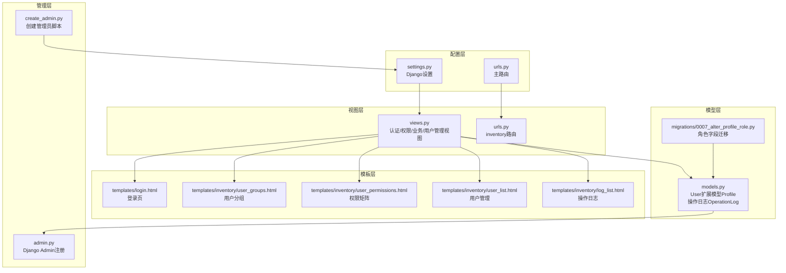
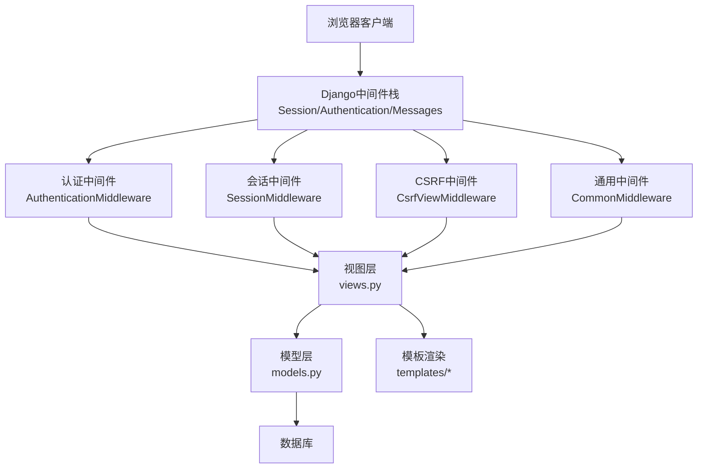
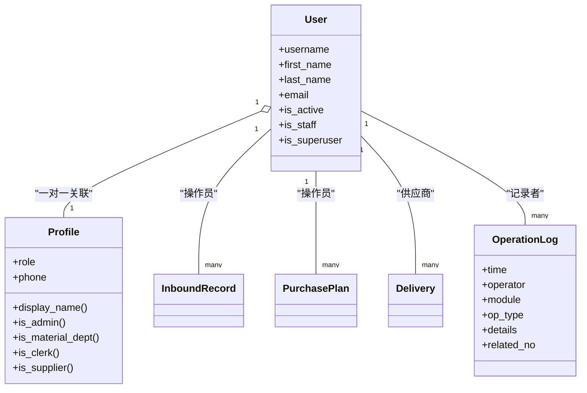
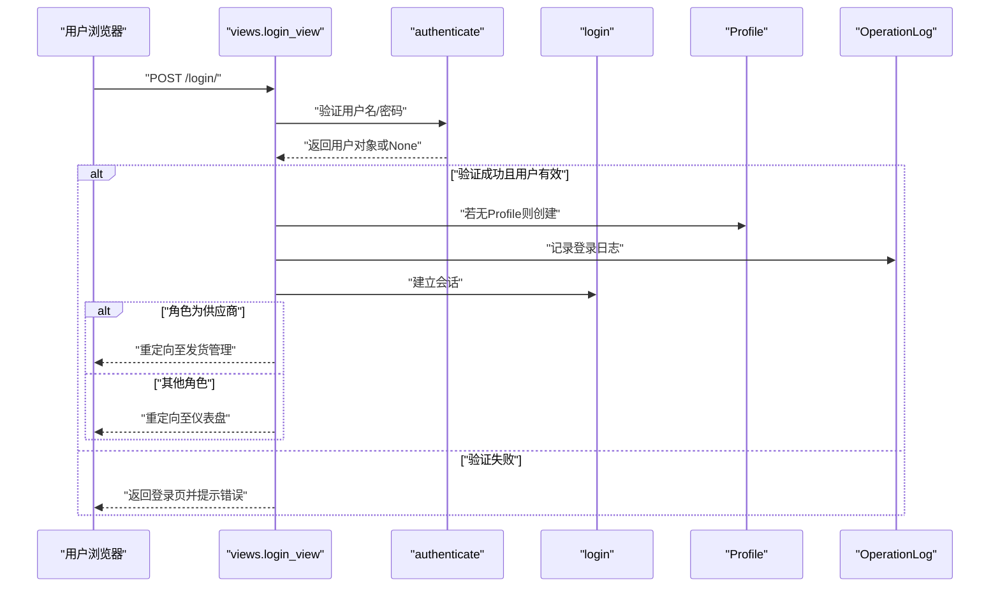
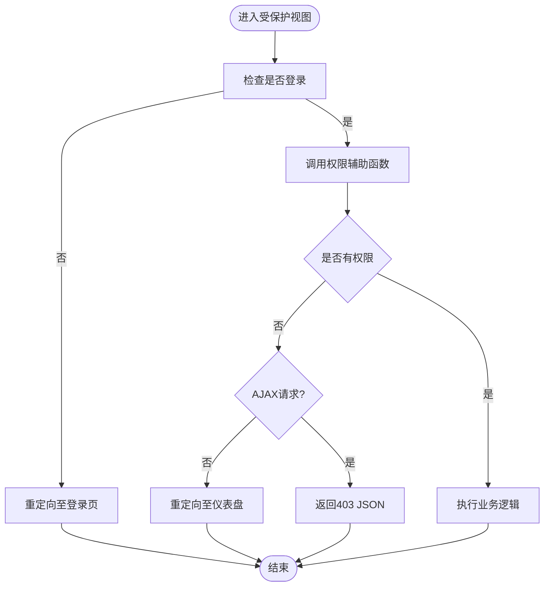
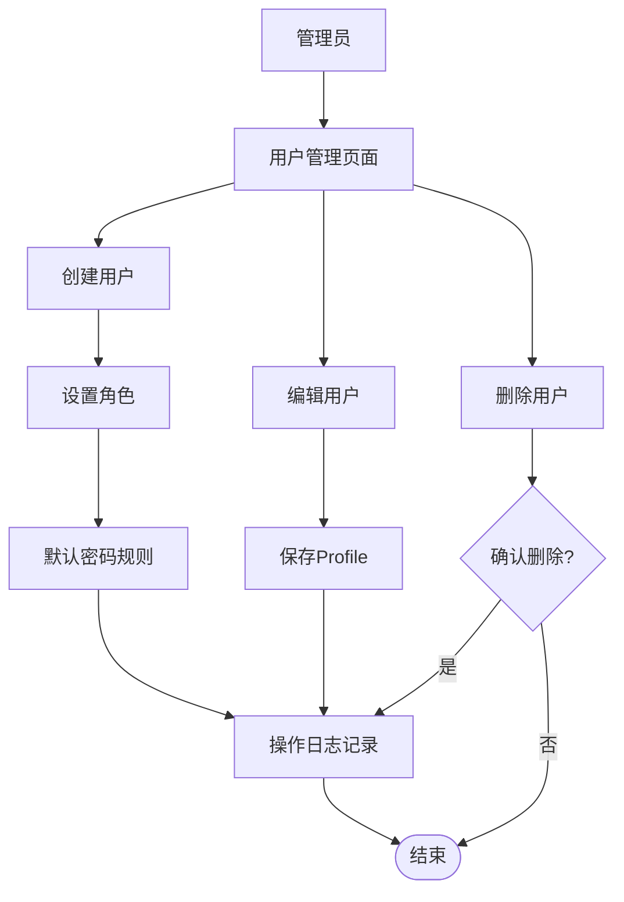
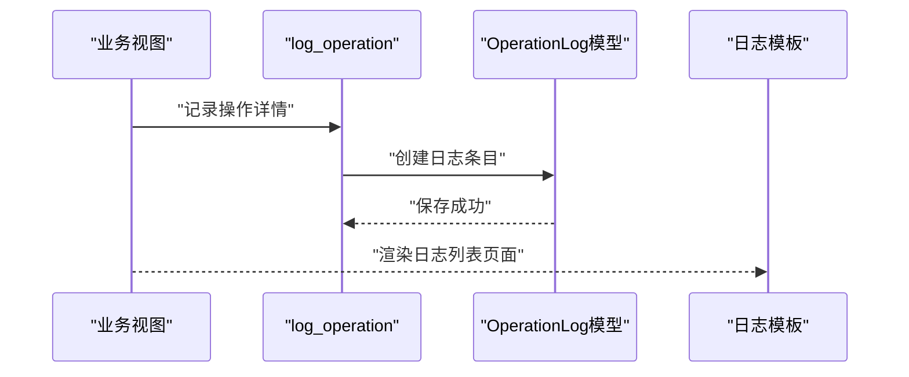
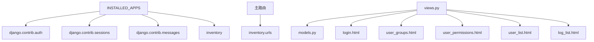

# 用户认证与权限系统

<cite>
**本文档引用的文件**
- [material_system/settings.py](file://material_system/settings.py)
- [material_system/urls.py](file://material_system/urls.py)
- [inventory/models.py](file://inventory/models.py)
- [inventory/admin.py](file://inventory/admin.py)
- [inventory/views.py](file://inventory/views.py)
- [inventory/urls.py](file://inventory/urls.py)
- [inventory/migrations/0007_alter_profile_role.py](file://inventory/migrations/0007_alter_profile_role.py)
- [templates/login.html](file://templates/login.html)
- [templates/inventory/user_groups.html](file://templates/inventory/user_groups.html)
- [templates/inventory/user_permissions.html](file://templates/inventory/user_permissions.html)
- [templates/inventory/user_list.html](file://templates/inventory/user_list.html)
- [templates/inventory/log_list.html](file://templates/inventory/log_list.html)
- [create_admin.py](file://create_admin.py)
</cite>

## 更新摘要
**变更内容**
- 新增用户组管理功能，提供角色分组统计和权限说明
- 新增权限矩阵配置页面，展示详细的模块权限分配
- 增强用户管理功能，支持用户创建、编辑、删除和角色分配
- 完善权限控制机制，基于角色的访问控制(RBAC)体系
- 新增操作日志记录和审计功能

## 目录
1. [简介](#简介)
2. [项目结构](#项目结构)
3. [核心组件](#核心组件)
4. [架构概览](#架构概览)
5. [详细组件分析](#详细组件分析)
6. [依赖关系分析](#依赖关系分析)
7. [性能考虑](#性能考虑)
8. [故障排除指南](#故障排除指南)
9. [结论](#结论)
10. [附录](#附录)

## 简介
本文件面向材料管理系统中的用户认证与权限系统，基于Django框架实现。系统采用基于角色的访问控制（RBAC），通过扩展Django内置User模型的Profile模型实现多角色权限体系，涵盖管理员、物资部、材料员、供应商四类角色。系统提供完整的认证流程（登录/登出）、会话管理、权限控制、操作日志审计以及用户管理功能。新增的用户组管理和权限管理功能进一步增强了系统的权限控制能力和管理透明度。

## 项目结构
系统采用Django标准的应用结构，认证与权限相关的核心文件分布如下：
- 配置层：Django设置、URL路由
- 模型层：用户扩展模型Profile、操作日志模型OperationLog
- 视图层：认证视图、权限装饰器、业务视图、用户管理视图
- 模板层：登录页、用户分组与权限矩阵展示页、用户管理页、操作日志页
- 管理层：Django Admin注册与展示配置

**图表来源**
- [material_system/settings.py:1-210](file://material_system/settings.py#L1-L210)
- [material_system/urls.py:1-13](file://material_system/urls.py#L1-L13)
- [inventory/models.py:1-361](file://inventory/models.py#L1-L361)
- [inventory/views.py:1-2205](file://inventory/views.py#L1-L2205)
- [inventory/urls.py:1-84](file://inventory/urls.py#L1-L84)
- [inventory/migrations/0007_alter_profile_role.py:1-19](file://inventory/migrations/0007_alter_profile_role.py#L1-L19)
- [templates/login.html:1-48](file://templates/login.html#L1-L48)
- [templates/inventory/user_groups.html:1-224](file://templates/inventory/user_groups.html#L1-L224)
- [templates/inventory/user_permissions.html:1-249](file://templates/inventory/user_permissions.html#L1-L249)
- [templates/inventory/user_list.html:1-209](file://templates/inventory/user_list.html#L1-L209)
- [templates/inventory/log_list.html:1-50](file://templates/inventory/log_list.html#L1-L50)
- [inventory/admin.py:1-54](file://inventory/admin.py#L1-L54)
- [create_admin.py:1-45](file://create_admin.py#L1-L45)

**章节来源**
- [material_system/settings.py:1-210](file://material_system/settings.py#L1-L210)
- [material_system/urls.py:1-13](file://material_system/urls.py#L1-L13)
- [inventory/models.py:1-361](file://inventory/models.py#L1-L361)
- [inventory/views.py:1-2205](file://inventory/views.py#L1-L2205)
- [inventory/urls.py:1-84](file://inventory/urls.py#L1-L84)

## 核心组件
- 用户模型与扩展
  - Django内置User模型作为基础身份标识
  - Profile扩展模型，一对一关联User，包含角色字段、电话、供应商档案关联
  - 角色枚举：管理员、物资部、材料员、供应商
- 权限控制
  - 基于角色的访问控制（RBAC）
  - 视图装饰器：admin_required等
  - 辅助函数：is_admin、is_material_dept、is_clerk、can_manage_inventory等
- 认证流程
  - 登录视图：处理用户名/密码验证、会话建立、角色跳转
  - 登出视图：记录登出日志并清理会话
- 审计与日志
  - OperationLog模型记录操作时间、模块、类型、详情、关联单号
  - 全局日志记录工具函数log_operation
- 用户管理与权限配置
  - 用户管理：创建/编辑/删除用户，角色分配
  - 用户分组：角色统计、权限说明
  - 权限矩阵：模块权限可视化展示
- 管理界面
  - Django Admin注册Profile、OperationLog等模型
  - 用户分组与权限矩阵展示页

**章节来源**
- [inventory/models.py:7-50](file://inventory/models.py#L7-L50)
- [inventory/views.py:28-64](file://inventory/views.py#L28-L64)
- [inventory/views.py:114-143](file://inventory/views.py#L114-L143)
- [inventory/admin.py:10-16](file://inventory/admin.py#L10-L16)
- [templates/inventory/user_groups.html:1-224](file://templates/inventory/user_groups.html#L1-L224)
- [templates/inventory/user_permissions.html:1-249](file://templates/inventory/user_permissions.html#L1-L249)
- [templates/inventory/user_list.html:1-209](file://templates/inventory/user_list.html#L1-L209)

## 架构概览
系统采用Django中间件栈进行认证与会话管理，URL路由将请求分发至inventory应用，业务逻辑在views.py中实现，数据持久化通过Django ORM完成。新增的用户组管理和权限管理功能通过专门的视图函数和模板页面提供管理界面。

**图表来源**
- [material_system/settings.py:93-101](file://material_system/settings.py#L93-L101)
- [material_system/settings.py:207-209](file://material_system/settings.py#L207-L209)
- [inventory/views.py:114-143](file://inventory/views.py#L114-L143)

## 详细组件分析

### 用户模型与角色体系
- Profile模型
  - 一对一关联Django User
  - 角色字段choices包含admin、material_dept、clerk、supplier
  - 属性方法：display_name、is_admin、is_material_dept、is_clerk、is_supplier
- 角色字段迁移
  - 固定角色枚举，确保数据一致性
- 角色权限映射
  - 管理员：全权限
  - 物资部：管理权限（采购计划审批、入库管理、报表查看、数据导出）
  - 材料员：操作权限（入库记录管理、采购计划申请、库存查询）
  - 供应商：仅发货管理（创建发货单、确认发货、生成二维码）

**图表来源**
- [inventory/models.py:7-50](file://inventory/models.py#L7-L50)
- [inventory/models.py:206-236](file://inventory/models.py#L206-L236)
- [inventory/models.py:239-271](file://inventory/models.py#L239-L271)
- [inventory/models.py:273-310](file://inventory/models.py#L273-L310)
- [inventory/models.py:312-361](file://inventory/models.py#L312-L361)

**章节来源**
- [inventory/models.py:7-50](file://inventory/models.py#L7-L50)
- [inventory/migrations/0007_alter_profile_role.py:12-18](file://inventory/migrations/0007_alter_profile_role.py#L12-L18)
- [templates/inventory/user_groups.html:39-110](file://templates/inventory/user_groups.html#L39-L110)

### 认证流程与会话管理
- 登录流程
  - 表单提交用户名/密码
  - authenticate验证用户
  - login建立会话
  - 若用户无Profile则创建默认角色
  - 记录登录日志
  - 根据角色跳转至不同页面（供应商跳转至发货管理）
- 登出流程
  - 记录登出日志
  - 清理会话并重定向至登录页
- 设置项
  - LOGIN_URL、LOGIN_REDIRECT_URL、LOGOUT_REDIRECT_URL
  - 中间件包含AuthenticationMiddleware

**图表来源**
- [inventory/views.py:114-143](file://inventory/views.py#L114-L143)
- [material_system/settings.py:207-209](file://material_system/settings.py#L207-L209)
- [material_system/settings.py:98](file://material_system/settings.py#L98)

**章节来源**
- [inventory/views.py:114-143](file://inventory/views.py#L114-L143)
- [material_system/settings.py:207-209](file://material_system/settings.py#L207-L209)
- [templates/login.html:30-43](file://templates/login.html#L30-L43)

### 权限控制机制
- 视图装饰器
  - admin_required：仅管理员可访问
- 辅助函数
  - is_admin、is_material_dept、is_clerk：基于Profile属性判断
  - can_manage_inventory、can_manage_purchase_plan：组合权限判断
- 权限矩阵
  - 用户分组页展示各角色的功能权限
  - 权限矩阵页详细列出各模块的权限分配

**图表来源**
- [inventory/views.py:55-64](file://inventory/views.py#L55-L64)
- [inventory/views.py:34-54](file://inventory/views.py#L34-L54)
- [templates/inventory/user_groups.html:120-195](file://templates/inventory/user_groups.html#L120-L195)
- [templates/inventory/user_permissions.html:48-183](file://templates/inventory/user_permissions.html#L48-L183)

**章节来源**
- [inventory/views.py:55-64](file://inventory/views.py#L55-L64)
- [inventory/views.py:34-54](file://inventory/views.py#L34-L54)
- [templates/inventory/user_groups.html:120-195](file://templates/inventory/user_groups.html#L120-L195)
- [templates/inventory/user_permissions.html:48-183](file://templates/inventory/user_permissions.html#L48-L183)

### 用户管理与权限配置
- 用户管理功能
  - 管理员可创建/编辑/删除用户
  - 默认密码规则：新建用户默认密码为用户名+123
  - 用户角色与Profile同步
  - 用户状态管理（启用/禁用）
- 用户分组管理
  - 统计各角色用户数量
  - 角色权限说明卡片
  - 登录后跳转页面说明
- 权限矩阵配置
  - 模块权限可视化展示
  - 角色权限对比表格
  - 权限图例说明
- 管理员创建
  - 脚本create_admin.py支持创建超级管理员

**图表来源**
- [inventory/views.py:1163-1202](file://inventory/views.py#L1163-L1202)
- [inventory/views.py:1234-1258](file://inventory/views.py#L1234-L1258)
- [templates/inventory/user_groups.html:206-218](file://templates/inventory/user_groups.html#L206-L218)
- [create_admin.py:36-44](file://create_admin.py#L36-L44)

**章节来源**
- [inventory/views.py:1163-1202](file://inventory/views.py#L1163-L1202)
- [inventory/views.py:1234-1258](file://inventory/views.py#L1234-L1258)
- [templates/inventory/user_groups.html:206-218](file://templates/inventory/user_groups.html#L206-L218)
- [create_admin.py:36-44](file://create_admin.py#L36-L44)

### 操作日志记录机制
- 日志模型
  - OperationLog：记录操作时间、操作员、模块、类型、详情、关联单号
- 记录策略
  - 全局工具函数log_operation统一记录
  - 关键业务操作均调用日志记录
- 审计页面
  - 管理员可查看操作日志，支持按模块筛选

**图表来源**
- [inventory/views.py:28-32](file://inventory/views.py#L28-L32)
- [inventory/models.py:312-361](file://inventory/models.py#L312-L361)
- [templates/inventory/log_list.html:1-50](file://templates/inventory/log_list.html#L1-L50)

**章节来源**
- [inventory/views.py:28-32](file://inventory/views.py#L28-L32)
- [inventory/models.py:312-361](file://inventory/models.py#L312-L361)
- [templates/inventory/log_list.html:1-50](file://templates/inventory/log_list.html#L1-L50)

## 依赖关系分析
- 应用依赖
  - inventory应用依赖Django auth、contenttypes、sessions、messages
  - 主路由include inventory.urls
- 模型依赖
  - Profile依赖User
  - 各业务模型依赖Profile（操作员/供应商）
- 视图依赖
  - 认证视图依赖Django authenticate/login/logout
  - 权限视图依赖Profile属性
  - 用户管理视图依赖Django User模型
- 模板依赖
  - 登录页依赖Bootstrap样式
  - 权限页展示角色与模块权限矩阵
  - 用户管理页提供CRUD操作界面

**图表来源**
- [material_system/settings.py:74-87](file://material_system/settings.py#L74-L87)
- [material_system/urls.py:6-9](file://material_system/urls.py#L6-L9)
- [inventory/views.py:11-24](file://inventory/views.py#L11-L24)
- [templates/login.html:7-16](file://templates/login.html#L7-L16)

**章节来源**
- [material_system/settings.py:74-87](file://material_system/settings.py#L74-L87)
- [material_system/urls.py:6-9](file://material_system/urls.py#L6-L9)
- [inventory/views.py:11-24](file://inventory/views.py#L11-L24)

## 性能考虑
- 数据库查询优化
  - 使用select_related减少外键查询次数
  - 在视图中对常用关联进行预加载
  - 用户分组统计使用聚合查询优化
- 日志写入
  - OperationLog写入为同步I/O，建议在高并发场景下考虑异步日志
- 模板渲染
  - 合理使用模板缓存与静态资源压缩
  - 权限矩阵页面使用条件渲染优化
- 会话存储
  - 使用默认数据库会话存储，生产环境建议使用Redis等高性能存储

## 故障排除指南
- 登录失败
  - 检查用户名/密码是否正确
  - 确认用户是否被禁用（is_active）
  - 查看登录页错误消息
- 权限不足
  - 确认用户角色是否正确
  - 检查权限装饰器使用是否正确
  - 查看权限矩阵页面确认模块权限
- 会话问题
  - 检查SessionMiddleware是否启用
  - 确认Cookie域与路径设置
- 日志缺失
  - 确认log_operation调用点
  - 检查日志级别与文件权限
- 用户管理问题
  - 确认管理员权限
  - 检查用户角色分配
  - 验证密码规则（用户名+123）

**章节来源**
- [inventory/views.py:124-137](file://inventory/views.py#L124-L137)
- [inventory/views.py:58-63](file://inventory/views.py#L58-L63)
- [material_system/settings.py:98](file://material_system/settings.py#L98)

## 结论
本系统基于Django实现了完善的用户认证与权限管理体系。通过Profile扩展模型与角色枚举，结合视图装饰器与辅助函数，构建了清晰的RBAC模型。新增的用户组管理和权限管理功能进一步增强了系统的管理能力，提供了直观的权限配置界面。登录/登出流程简洁可靠，操作日志提供了完整的审计能力。模板层的权限矩阵与分组页面提升了管理透明度。建议在生产环境中进一步优化日志写入性能与会话存储方案。

## 附录
- 最佳实践
  - 使用admin_required装饰器保护敏感视图
  - 在业务关键点调用log_operation记录操作
  - 定期审查用户角色与权限矩阵
  - 生产环境配置强密码策略与会话安全参数
  - 合理使用用户分组功能进行权限管理
- 常见问题
  - 用户无法登录：检查用户状态与密码
  - 权限异常：核对Profile角色与权限辅助函数
  - 日志不显示：确认日志级别与模板过滤条件
  - 用户管理权限：确认当前用户具备管理员权限
- 自定义权限扩展
  - 可在Profile中增加更多角色或权限字段
  - 可扩展OperationLog记录更详细的操作上下文
  - 可引入Django内置权限系统与组概念进行细粒度控制
  - 可扩展用户分组功能支持更复杂的权限组织