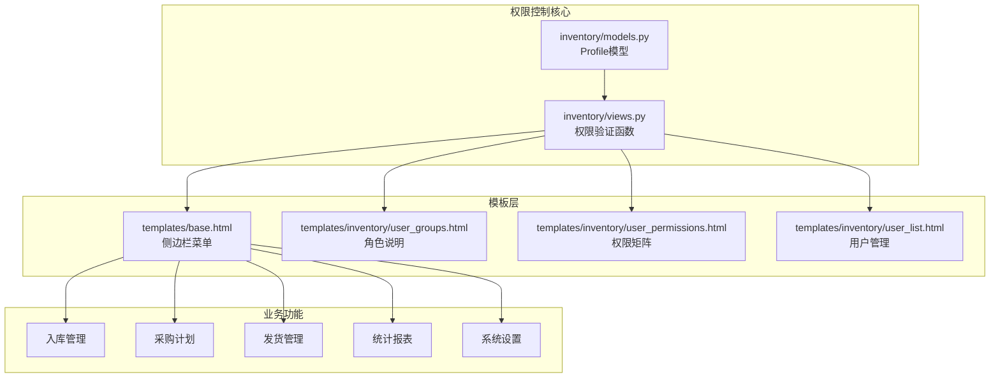
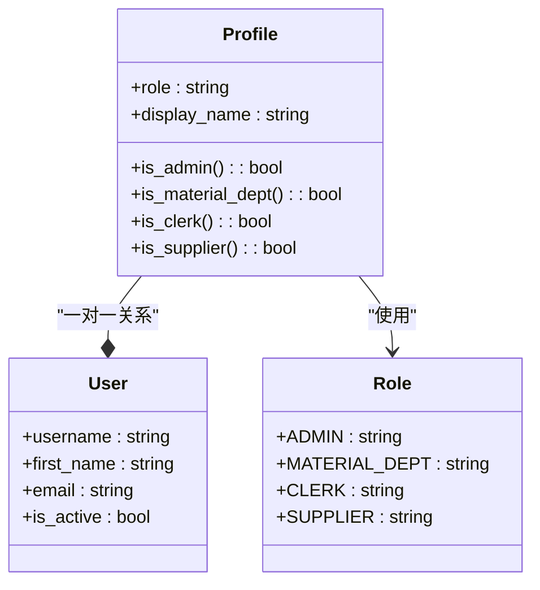
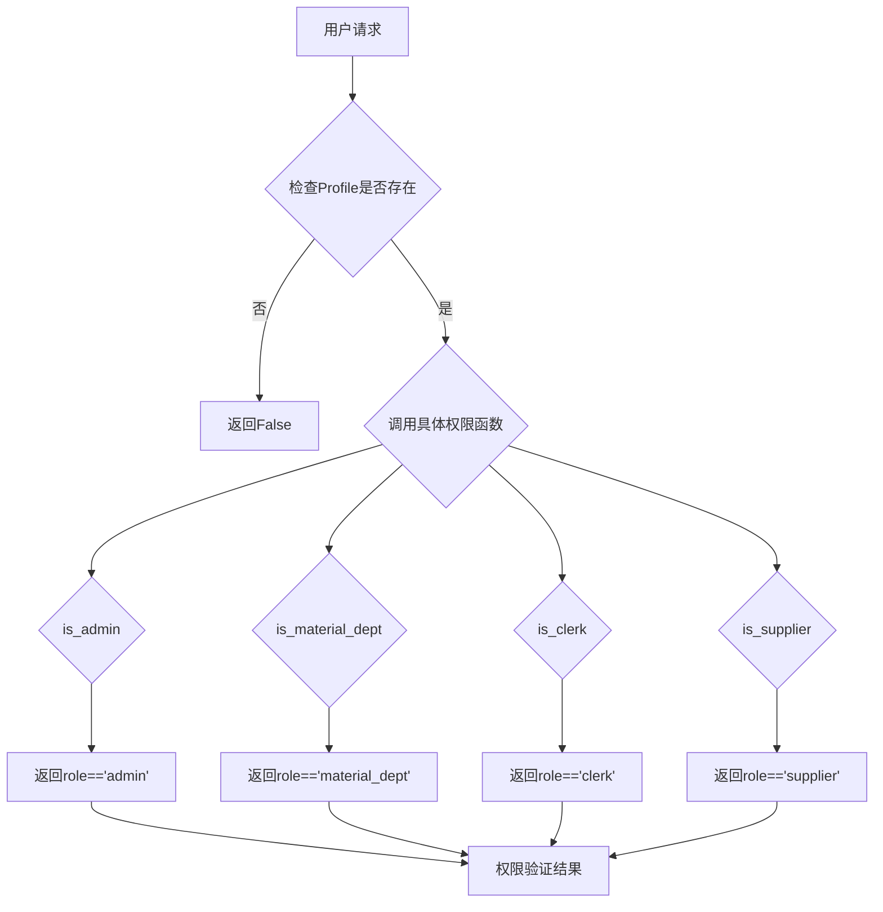
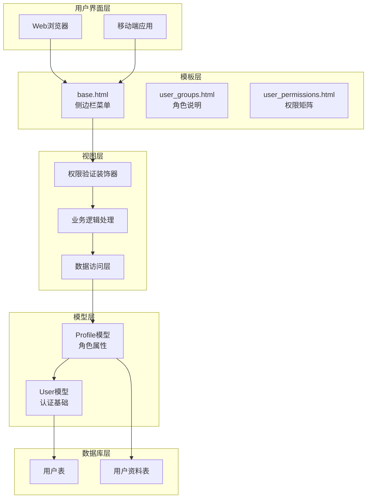
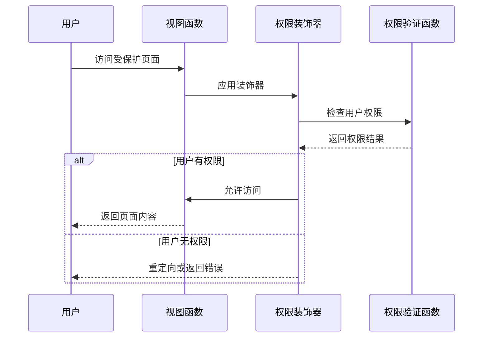
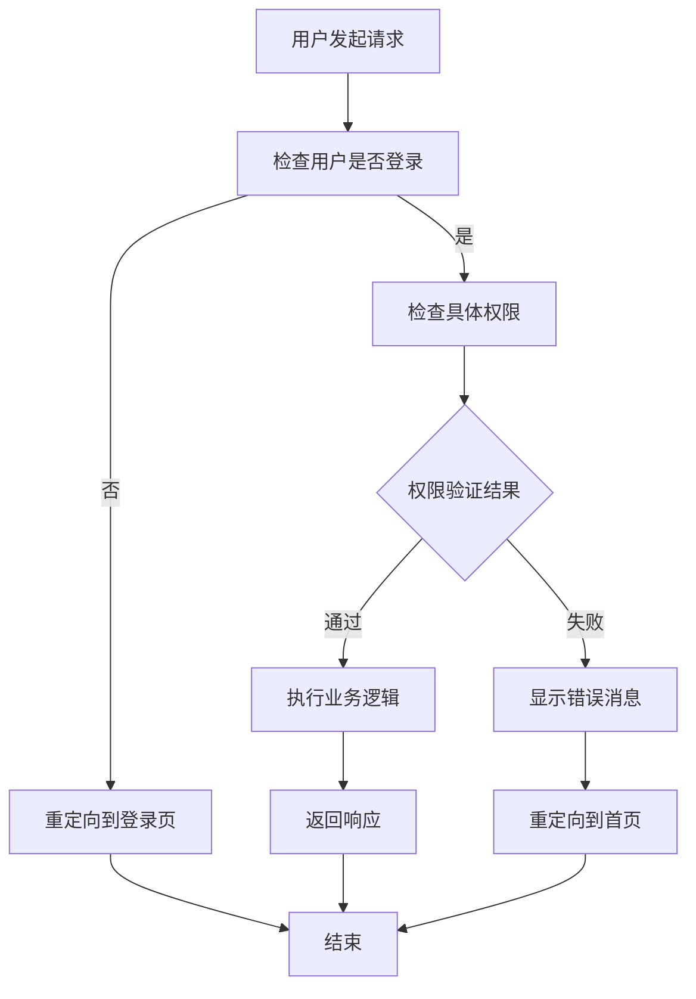
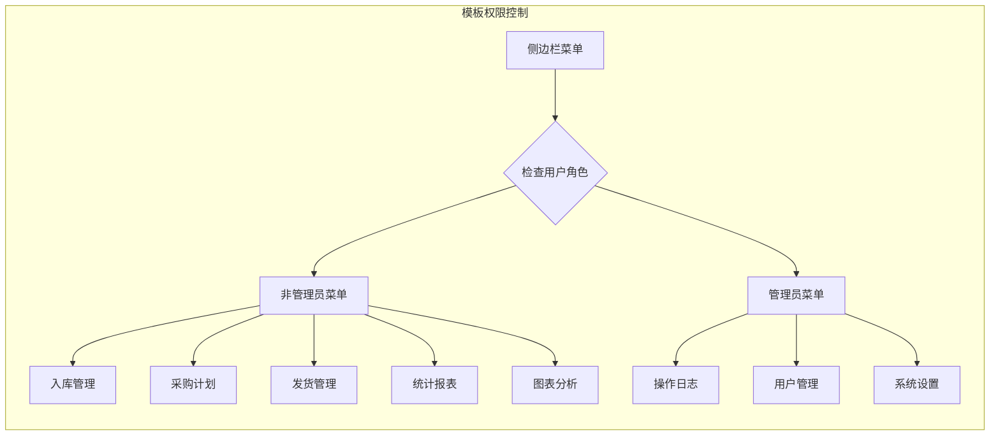
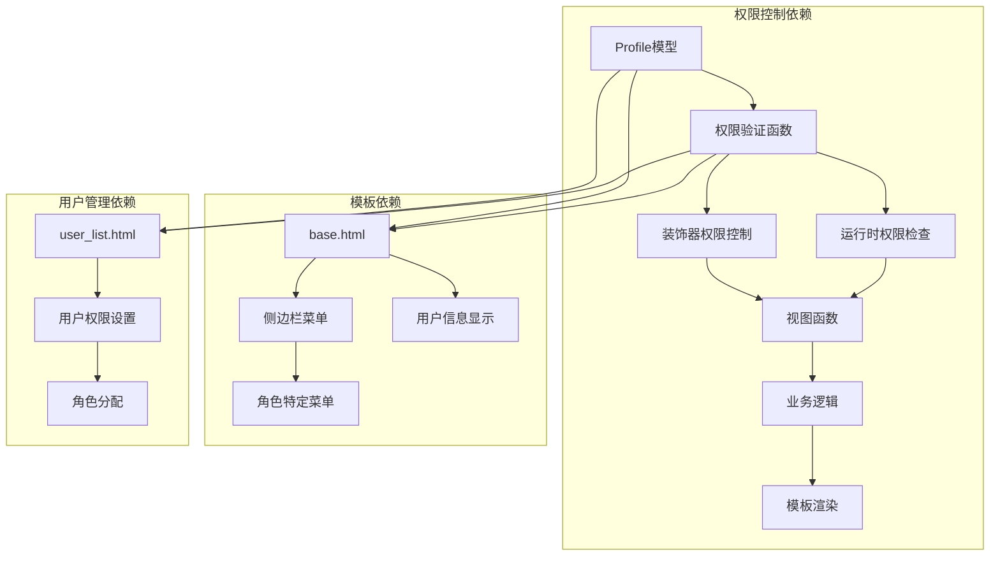

# 角色权限体系

<cite>
**本文档引用的文件**
- [inventory/models.py](file://inventory/models.py)
- [inventory/views.py](file://inventory/views.py)
- [templates/base.html](file://templates/base.html)
- [templates/inventory/user_groups.html](file://templates/inventory/user_groups.html)
- [templates/inventory/user_permissions.html](file://templates/inventory/user_permissions.html)
- [templates/inventory/user_list.html](file://templates/inventory/user_list.html)
</cite>

## 目录
1. [简介](#简介)
2. [项目结构](#项目结构)
3. [核心组件](#核心组件)
4. [架构概览](#架构概览)
5. [详细组件分析](#详细组件分析)
6. [依赖关系分析](#依赖关系分析)
7. [性能考虑](#性能考虑)
8. [故障排除指南](#故障排除指南)
9. [结论](#结论)

## 简介

本系统采用基于角色的访问控制（RBAC）机制，为材料管理系统提供了完善的权限管理体系。系统定义了四个核心角色：管理员（admin）、物资部（material_dept）、材料员（clerk）和供应商（supplier），每个角色都有明确的权限范围和职责边界。

RBAC实现通过`Profile`模型的`role`字段和多个辅助方法来控制用户对系统功能的访问权限。权限验证不仅在视图层进行，还在模板层通过条件渲染确保用户只能看到和操作其权限范围内的功能。

## 项目结构

系统采用Django框架的标准项目结构，权限控制相关的代码主要分布在以下位置：

**图表来源**
- [inventory/models.py:7-48](file://inventory/models.py#L7-L48)
- [inventory/views.py:34-64](file://inventory/views.py#L34-L64)
- [templates/base.html:20-86](file://templates/base.html#L20-L86)

**章节来源**
- [inventory/models.py:1-328](file://inventory/models.py#L1-L328)
- [inventory/views.py:1-1862](file://inventory/views.py#L1-L1862)

## 核心组件

### Profile模型与角色属性

`Profile`模型是RBAC系统的核心，它扩展了Django的User模型并添加了角色字段：

**图表来源**
- [inventory/models.py:7-48](file://inventory/models.py#L7-L48)

系统支持四种角色：
- **管理员（admin）**：系统超级管理员，拥有最高权限
- **物资部（material_dept）**：负责采购计划审批和入库管理
- **材料员（clerk）**：负责日常入库操作和库存查询
- **供应商（supplier）**：外部供应商，仅能管理自己的发货单

**章节来源**
- [inventory/models.py:9-18](file://inventory/models.py#L9-L18)
- [inventory/models.py:34-48](file://inventory/models.py#L34-L48)

### 权限验证函数

系统提供了多个权限验证函数来简化权限检查：

**图表来源**
- [inventory/views.py:34-43](file://inventory/views.py#L34-L43)

**章节来源**
- [inventory/views.py:34-53](file://inventory/views.py#L34-L53)

## 架构概览

RBAC系统采用多层防护架构，确保权限控制的可靠性和一致性：

**图表来源**
- [templates/base.html:20-86](file://templates/base.html#L20-L86)
- [inventory/views.py:55-64](file://inventory/views.py#L55-L64)
- [inventory/models.py:7-18](file://inventory/models.py#L7-L18)

## 详细组件分析

### 角色权限矩阵

系统为每个角色定义了明确的功能权限范围：

| 功能模块 | 管理员 | 物资部 | 材料员 | 供应商 |
|---------|--------|--------|--------|--------|
| **档案管理** | ✅ 完全权限 | ✅ 完全权限 | 👁️ 仅查看 | ❌ 无权限 |
| **入库管理** | ✅ 完全权限 | ✅ 完全权限 | ✅ 完全权限 | ❌ 无权限 |
| **采购计划** | ✅ 完全权限 | ✅ 完全权限 | ✅ 完全权限 | ❌ 无权限 |
| **发货管理** | ✅ 完全权限 | 👁️ 仅查看 | 👁️ 仅查看 | ✅ 完全权限 |
| **统计分析** | ✅ 完全权限 | ✅ 完全权限 | 👁️ 仅查看 | ❌ 无权限 |
| **系统管理** | ✅ 完全权限 | ❌ 无权限 | ❌ 无权限 | ❌ 无权限 |

**章节来源**
- [templates/inventory/user_permissions.html:48-182](file://templates/inventory/user_permissions.html#L48-L182)

### 权限验证机制

系统实现了多层次的权限验证机制：

#### 1. 装饰器权限控制

**图表来源**
- [inventory/views.py:55-64](file://inventory/views.py#L55-L64)

#### 2. 运行时权限检查

对于需要动态权限控制的功能，系统在视图函数内部进行权限检查：

**图表来源**
- [inventory/views.py:367-398](file://inventory/views.py#L367-L398)

**章节来源**
- [inventory/views.py:55-64](file://inventory/views.py#L55-L64)
- [inventory/views.py:367-441](file://inventory/views.py#L367-L441)

### 角色特定功能实现

#### 管理员权限

管理员拥有系统的最高权限，可以管理所有功能：

- 用户管理：创建、编辑、删除用户
- 系统设置：配置系统参数
- 数据管理：维护所有档案数据
- 权限控制：分配角色和权限

#### 物资部权限

物资部负责采购计划审批和入库管理：

- 采购计划审批：审核和批准采购计划
- 入库管理：管理入库记录
- 报表查看：查看各类统计报表
- 数据导出：导出统计数据

#### 材料员权限

材料员负责日常操作：

- 入库记录管理：新增、编辑入库记录
- 采购计划申请：提交采购计划
- 库存查询：查看库存信息
- 报表查看：查看统计报表

#### 供应商权限

供应商仅能管理自己的发货单：

- 创建发货单：为已审批的采购计划创建发货单
- 确认发货：确认发货状态
- 生成二维码：为发货单生成二维码
- 专属发货管理：登录后直接进入发货管理页面

**章节来源**
- [templates/inventory/user_groups.html:120-194](file://templates/inventory/user_groups.html#L120-L194)

### 模板层权限控制

系统在模板层也实现了权限控制，确保用户只能看到和操作其权限范围内的功能：

**图表来源**
- [templates/base.html:25-84](file://templates/base.html#L25-L84)

**章节来源**
- [templates/base.html:25-84](file://templates/base.html#L25-L84)

## 依赖关系分析

系统权限控制的依赖关系如下：

**图表来源**
- [inventory/models.py:7-48](file://inventory/models.py#L7-L48)
- [inventory/views.py:34-64](file://inventory/views.py#L34-L64)
- [templates/base.html:20-137](file://templates/base.html#L20-L137)

**章节来源**
- [inventory/models.py:7-48](file://inventory/models.py#L7-L48)
- [inventory/views.py:34-64](file://inventory/views.py#L34-L64)

## 性能考虑

### 权限检查优化

系统采用了多种优化策略来提高权限检查的性能：

1. **惰性加载**：权限验证函数只在需要时才检查用户资料
2. **缓存机制**：利用Django的查询集缓存减少数据库查询
3. **批量查询**：在模板中使用`select_related`减少N+1查询问题

### 内存使用优化

- 权限验证函数使用简单的布尔表达式，避免复杂的对象创建
- 模板层的权限检查使用条件渲染，减少不必要的DOM元素创建

## 故障排除指南

### 常见权限问题

#### 1. 用户无法访问受保护页面

**症状**：用户登录后被重定向到首页或收到权限错误

**解决方案**：
- 检查用户的角色设置是否正确
- 确认用户资料是否正确创建
- 验证装饰器是否正确应用

#### 2. 供应商用户无法看到发货管理

**症状**：供应商用户登录后看不到发货管理选项

**解决方案**：
- 检查`is_supplier`属性是否正确返回
- 验证模板中的条件渲染逻辑
- 确认供应商用户的`role`字段设置

#### 3. 权限验证失败

**症状**：权限检查函数返回意外结果

**解决方案**：
- 检查用户是否有对应的`Profile`对象
- 验证`role`字段的值是否正确
- 确认权限验证函数的逻辑

**章节来源**
- [inventory/views.py:55-64](file://inventory/views.py#L55-L64)
- [templates/base.html:25-84](file://templates/base.html#L25-L84)

## 结论

材料管理系统的角色权限体系通过RBAC机制实现了精细化的权限控制。系统设计具有以下特点：

1. **清晰的角色定义**：四种角色职责明确，权限边界清晰
2. **多层次的安全防护**：从模板层到视图层的全方位权限控制
3. **灵活的扩展性**：易于添加新的角色和权限规则
4. **良好的用户体验**：根据用户角色动态显示相应的功能

该权限体系为材料管理系统的安全运行提供了坚实的基础，确保了数据的完整性和操作的合规性。通过合理的权限设计和严格的执行机制，系统能够有效防止未授权访问和操作，保障了业务流程的顺利进行。