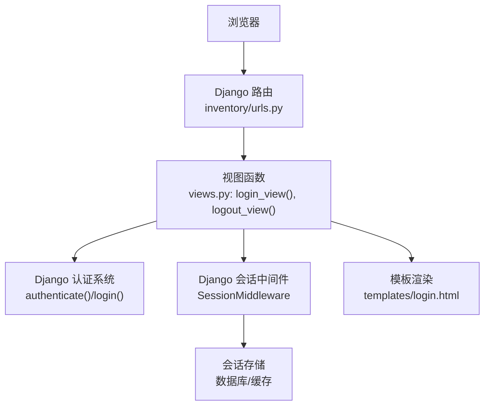
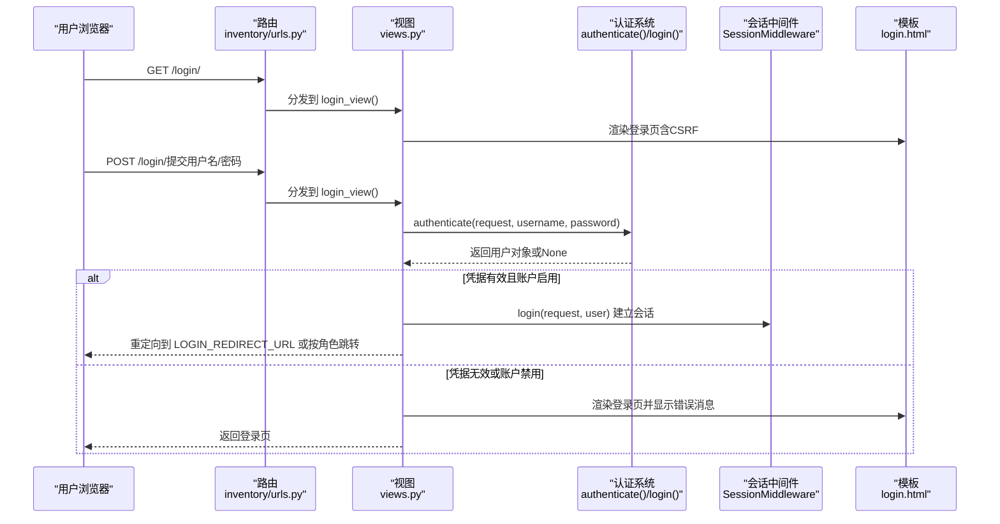
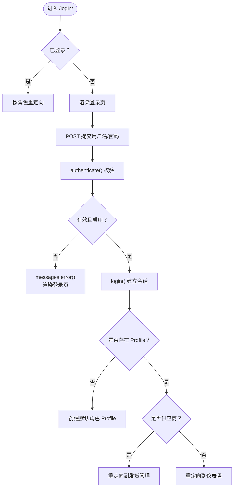
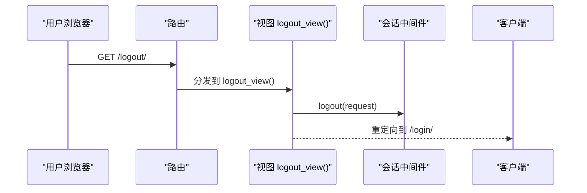
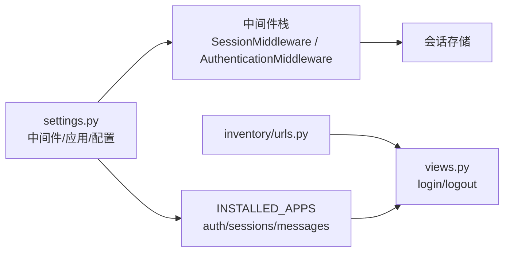

# 认证流程

<cite>
**本文引用的文件**
- [settings.py](file://material_system/settings.py)
- [urls.py](file://material_system/urls.py)
- [urls.py](file://inventory/urls.py)
- [views.py](file://inventory/views.py)
- [login.html](file://templates/login.html)
- [models.py](file://inventory/models.py)
- [wsgi.py](file://material_system/wsgi.py)
- [asgi.py](file://material_system/asgi.py)
- [requirements.txt](file://requirements.txt)
</cite>

## 目录
1. [简介](#简介)
2. [项目结构](#项目结构)
3. [核心组件](#核心组件)
4. [架构总览](#架构总览)
5. [详细组件分析](#详细组件分析)
6. [依赖关系分析](#依赖关系分析)
7. [性能考量](#性能考量)
8. [故障排查指南](#故障排查指南)
9. [结论](#结论)

## 简介
本文件面向材料管理系统的认证与会话管理，系统基于 Django 6.0，采用内置的认证框架与会话中间件完成用户登录、权限控制、登出与会话生命周期管理。本文将详细描述从登录页面到会话建立的完整流程，解释 authenticate() 与 login() 的调用时机，说明会话超时策略与安全配置，并提供自定义认证后重定向、错误处理与 remember me 安全实现建议。

## 项目结构
与认证相关的关键文件与职责如下：
- 配置层
  - settings.py：Django 应用配置，包含认证、会话、模板、静态资源、日志等；定义了 LOGIN_URL、LOGIN_REDIRECT_URL、LOGOUT_REDIRECT_URL。
  - urls.py（项目级）：路由入口，包含 inventory 应用的 URL 映射。
  - urls.py（应用级）：定义 /login/ 与 /logout/ 路由，映射到视图。
- 视图层
  - views.py：实现登录视图 login_view()、登出视图 logout_view()，并使用 authenticate()、login()、logout()。
- 模板层
  - login.html：登录表单模板，包含 CSRF 标记与错误消息展示。
- 模型层
  - models.py：定义 Profile 模型，用于扩展用户角色与权限判定。
- 运行时
  - wsgi.py / asgi.py：WSGI/ASGI 启动入口，承载 Django 中间件栈。

图表来源
- [urls.py](file://inventory/urls.py)
- [views.py](file://inventory/views.py)
- [login.html](file://templates/login.html)

章节来源
- [settings.py: 74-101:74-101](file://material_system/settings.py#L74-L101)
- [urls.py](file://material_system/urls.py)
- [urls.py](file://inventory/urls.py)
- [views.py: 114-143:114-143](file://inventory/views.py#L114-L143)
- [login.html: 30-43:30-43](file://templates/login.html#L30-L43)

## 核心组件
- 认证视图
  - 登录：接收 POST 参数 username/password，调用 authenticate() 校验凭据，再调用 login() 建立会话；根据用户角色与状态执行不同重定向。
  - 登出：记录操作日志，调用 logout() 清理会话，重定向到登录页。
- 模板与消息
  - 登录模板包含 CSRF 令牌与错误消息展示，便于反馈认证失败原因。
- 角色扩展
  - Profile 模型通过 role 字段区分 admin、material_dept、clerk、supplier，配合装饰器与工具函数实现细粒度权限控制。
- 配置项
  - LOGIN_URL、LOGIN_REDIRECT_URL、LOGOUT_REDIRECT_URL 控制认证入口与重定向行为。
  - MIDDLEWARE 包含 SessionMiddleware、AuthenticationMiddleware，确保会话与认证中间件生效。

章节来源
- [views.py: 114-143:114-143](file://inventory/views.py#L114-L143)
- [login.html: 25-29:25-29](file://templates/login.html#L25-L29)
- [models.py: 7-49:7-49](file://inventory/models.py#L7-L49)
- [settings.py: 207-209:207-209](file://material_system/settings.py#L207-L209)
- [settings.py: 93-101:93-101](file://material_system/settings.py#L93-L101)

## 架构总览
下图展示了认证流程在系统中的位置与交互：

图表来源
- [urls.py](file://inventory/urls.py)
- [views.py: 114-137:114-137](file://inventory/views.py#L114-L137)
- [login.html: 30-43:30-43](file://templates/login.html#L30-L43)

## 详细组件分析

### 登录流程（从页面到会话）
- 页面加载
  - 访问 /login/ 时，若用户已登录则按角色重定向；否则渲染登录模板。
- 表单提交
  - 使用 POST 提交 username 与 password，视图调用 authenticate() 校验。
- 会话建立
  - 若 authenticate() 返回有效用户且 is_active=True，则调用 login() 建立会话。
- 角色与重定向
  - 若用户无 Profile 则自动创建默认角色；供应商用户登录后跳转发货管理，其他用户跳转仪表盘。
- 错误处理
  - 账户禁用或凭据错误时，通过 messages.error() 设置错误消息并重新渲染登录页。

图表来源
- [views.py: 114-137:114-137](file://inventory/views.py#L114-L137)
- [login.html: 25-29:25-29](file://templates/login.html#L25-L29)

章节来源
- [views.py: 114-137:114-137](file://inventory/views.py#L114-L137)
- [login.html: 30-43:30-43](file://templates/login.html#L30-L43)

### 登出流程与会话清理
- 登出视图
  - 记录操作日志，调用 logout() 清理会话，重定向到 LOGOUT_REDIRECT_URL。
- 会话清理
  - logout() 会清除当前会话数据，使后续请求不再携带用户身份。

图表来源
- [urls.py](file://inventory/urls.py)
- [views.py: 139-143:139-143](file://inventory/views.py#L139-L143)

章节来源
- [views.py: 139-143:139-143](file://inventory/views.py#L139-L143)
- [settings.py: 209](file://material_system/settings.py#L209)

### 会话管理与超时策略
- 默认会话配置
  - Django 默认会话引擎为数据库存储，Cookie 名称 sessionid，Cookie 有效期为两周（SESSION_COOKIE_AGE），关闭浏览器不会自动过期（SESSION_EXPIRE_AT_BROWSER_CLOSE=False）。
- 项目配置
  - settings.py 未显式覆盖 SESSION_COOKIE_AGE，因此继承 Django 默认两周有效期。
- 实践建议
  - 生产环境建议开启 HTTPS 并设置 SESSION_COOKIE_SECURE=True，同时根据业务需求调整 SESSION_COOKIE_AGE 与 SESSION_SAVE_EVERY_REQUEST。

章节来源
- [settings.py: 93-101:93-101](file://material_system/settings.py#L93-L101)
- [settings.py: 207-209:207-209](file://material_system/settings.py#L207-L209)

### 密码验证与安全措施
- 密码校验
  - authenticate() 通过 Django 认证后端对用户提供的明文密码与数据库中存储的哈希值进行比对。
- 存储安全
  - Django 默认使用安全的散列算法存储密码，无需额外配置。
- 传输安全
  - 当前配置未强制 HTTPS，建议在生产环境启用 HTTPS 并设置 SESSION_COOKIE_SECURE=True，防止会话 Cookie 在非加密通道中被截获。
- 密码强度
  - AUTH_PASSWORD_VALIDATORS 中设置了最小长度校验，可根据需要增加复杂度规则。

章节来源
- [settings.py: 132-134:132-134](file://material_system/settings.py#L132-L134)
- [settings.py: 93-101:93-101](file://material_system/settings.py#L93-L101)

### 自定义认证后重定向
- 入口与默认重定向
  - LOGIN_URL 指定未登录访问受保护资源时的跳转路径；LOGIN_REDIRECT_URL 指定登录成功后的默认重定向路径。
- 视图内重定向
  - 登录视图根据用户角色与状态进行差异化重定向（例如供应商跳转发货管理，其他用户跳转仪表盘）。

章节来源
- [settings.py: 207-209:207-209](file://material_system/settings.py#L207-L209)
- [views.py: 117-135:117-135](file://inventory/views.py#L117-L135)

### 认证失败的错误处理与用户体验
- 错误消息
  - 登录失败时通过 messages.error() 设置错误消息，并在登录模板中循环展示，提升用户反馈体验。
- 输入校验
  - 登录模板对用户名与密码字段设置 required 属性，减少空输入导致的服务器压力。

章节来源
- [views.py: 125-127:125-127](file://inventory/views.py#L125-L127)
- [views.py: 136](file://inventory/views.py#L136)
- [login.html: 25-29:25-29](file://templates/login.html#L25-L29)
- [login.html: 33-38:33-38](file://templates/login.html#L33-L38)

### remember me 功能实现与安全考虑
- 当前实现
  - 代码未实现“记住我”复选框或持久化会话机制。
- 安全建议
  - 若需实现“记住我”，建议：
    - 使用长有效期 Cookie（结合 SESSION_COOKIE_SECURE、SESSION_COOKIE_SAMESITE）；
    - 对“记住我”登录单独记录设备指纹与 IP 白名单；
    - 引入二次验证（如短信/邮件验证码）；
    - 限制“记住我”的最长使用期限并支持一键撤销。
  - 注意：不要将敏感信息写入 Cookie，避免明文存储密码。

（本节为概念性指导，不直接对应具体源码）

## 依赖关系分析
- 应用与中间件
  - settings.py 中 INSTALLED_APPS 包含 django.contrib.auth、django.contrib.sessions、django.contrib.messages，确保认证与会话可用。
  - MIDDLEWARE 中包含 SessionMiddleware、AuthenticationMiddleware，保证会话与认证中间件生效。
- 路由与视图
  - 项目级 urls.py 将根路径转发到 inventory 应用；inventory/urls.py 定义 /login/ 与 /logout/ 路由，分别映射到 views.py 的登录与登出视图。
- 运行时入口
  - wsgi.py 与 asgi.py 分别暴露 WSGI/ASGI 应用，承载中间件栈。

图表来源
- [settings.py: 74-101:74-101](file://material_system/settings.py#L74-L101)
- [urls.py](file://inventory/urls.py)
- [views.py: 114-143:114-143](file://inventory/views.py#L114-L143)

章节来源
- [settings.py: 74-101:74-101](file://material_system/settings.py#L74-L101)
- [urls.py](file://inventory/urls.py)
- [views.py: 114-143:114-143](file://inventory/views.py#L114-L143)

## 性能考量
- 会话存储
  - 默认使用数据库存储会话，适合开发与中小规模应用；高并发场景建议迁移到 Redis 等内存存储并配置 SESSION_ENGINE 与 SESSION_CACHE_ALIAS。
- 会话刷新
  - SESSION_SAVE_EVERY_REQUEST=False，避免每次请求都写入会话，降低数据库压力。
- CSRF 与安全中间件
  - CSRF 保护与安全头中间件会带来少量开销，但对安全性至关重要。

（本节为通用指导，不直接对应具体源码）

## 故障排查指南
- 无法登录
  - 检查 LOGIN_URL 是否正确，确认 /login/ 路由映射到 views.login_view()。
  - 确认 authenticate() 返回值与用户 is_active 状态。
- 重定向异常
  - 检查 LOGIN_REDIRECT_URL 与视图内的角色重定向逻辑。
- 会话未建立
  - 确认 SessionMiddleware 与 AuthenticationMiddleware 顺序正确且未被覆盖。
- 密码错误提示
  - 确认 messages 框架正常工作，模板中正确渲染 messages。
- 传输安全问题
  - 生产环境务必启用 HTTPS 并设置 SESSION_COOKIE_SECURE=True。

章节来源
- [urls.py](file://inventory/urls.py)
- [views.py: 114-137:114-137](file://inventory/views.py#L114-L137)
- [login.html: 25-29:25-29](file://templates/login.html#L25-L29)
- [settings.py: 93-101:93-101](file://material_system/settings.py#L93-L101)

## 结论
本系统基于 Django 内置认证与会话机制，实现了简洁可靠的登录、登出与权限控制流程。登录视图通过 authenticate() 与 login() 完成凭据校验与会话建立，并依据用户角色进行差异化重定向；登出视图负责清理会话并返回登录页。当前会话有效期为两周，未强制 HTTPS，建议在生产环境启用 HTTPS 并根据业务需求调整会话策略与安全配置。对于“记住我”等高级特性，可在遵循安全原则的前提下逐步引入。