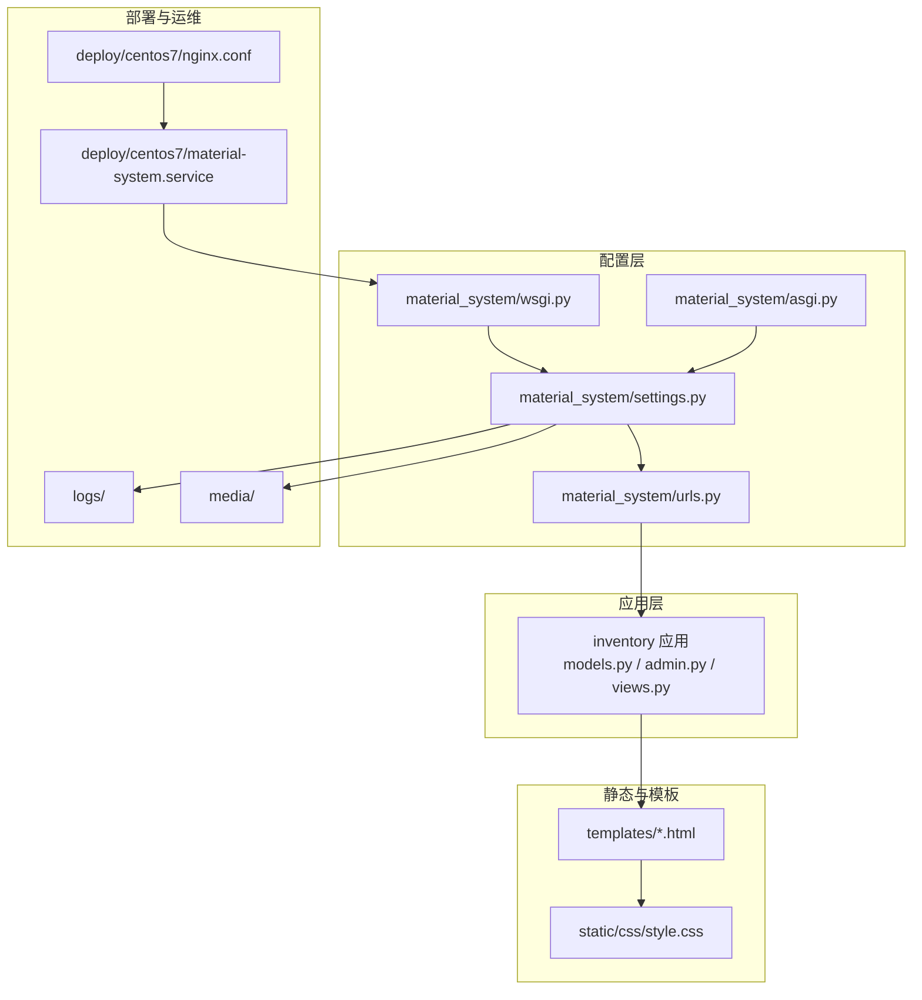
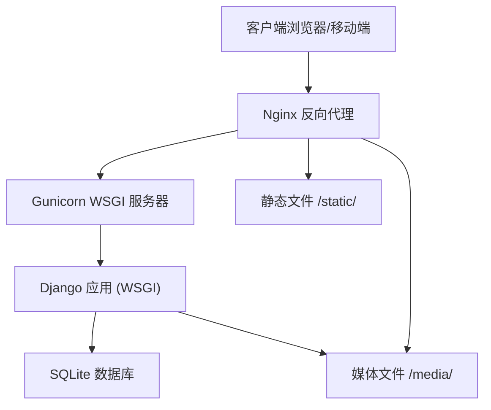
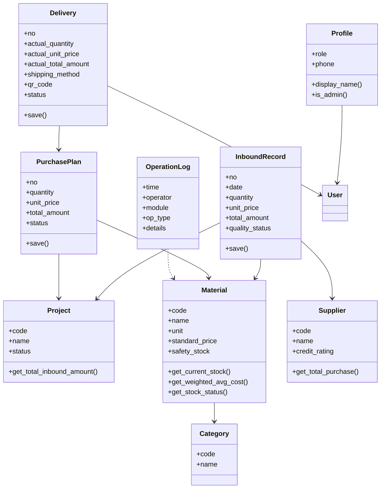
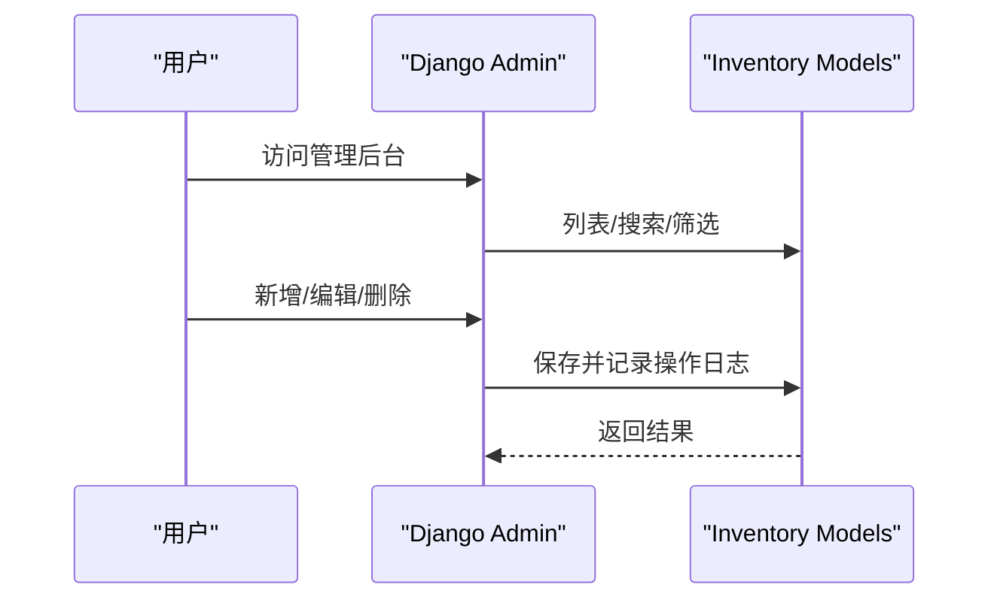
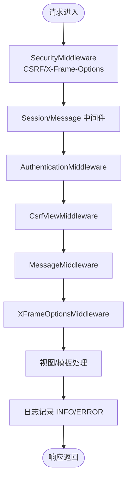
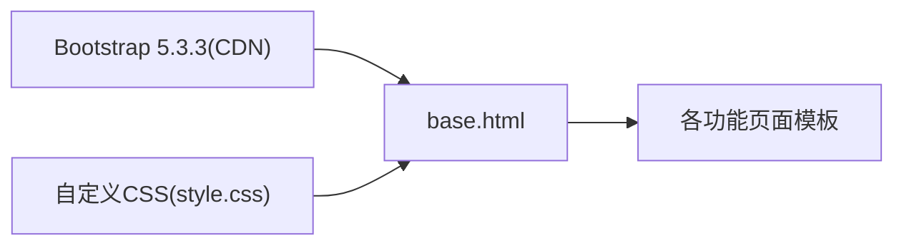
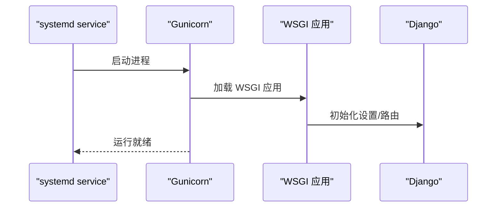
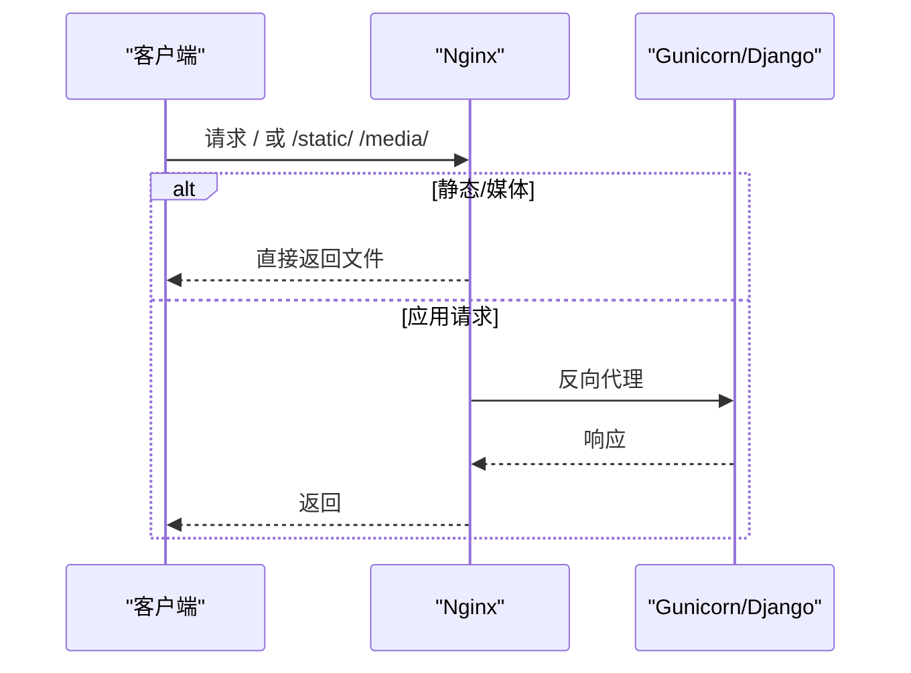
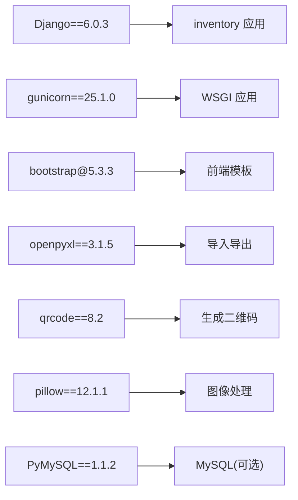

# 技术栈

<cite>
**本文引用的文件**
- [settings.py](file://material_system/settings.py)
- [wsgi.py](file://material_system/wsgi.py)
- [asgi.py](file://material_system/asgi.py)
- [urls.py](file://material_system/urls.py)
- [requirements.txt](file://requirements.txt)
- [requirements.lock.txt](file://requirements.lock.txt)
- [manage.py](file://manage.py)
- [models.py](file://inventory/models.py)
- [admin.py](file://inventory/admin.py)
- [views.py](file://inventory/views.py)
- [base.html](file://templates/base.html)
- [style.css](file://static/css/style.css)
- [nginx.conf](file://deploy/centos7/nginx.conf)
- [material-system.service](file://deploy/centos7/material-system.service)
- [backup_db.sh](file://scripts/backup_db.sh)
</cite>

## 目录
1. [简介](#简介)
2. [项目结构](#项目结构)
3. [核心组件](#核心组件)
4. [架构总览](#架构总览)
5. [详细组件分析](#详细组件分析)
6. [依赖分析](#依赖分析)
7. [性能考虑](#性能考虑)
8. [故障排查指南](#故障排查指南)
9. [结论](#结论)
10. [附录](#附录)

## 简介
本技术栈文档面向“材料管理系统”，围绕后端Django 6.0.3、前端Bootstrap 5.3.3、数据库SQLite 3.8.3+、WSGI服务器Gunicorn与反向代理Nginx，以及OpenPyXL、qrcode、Pillow等第三方库的应用场景，系统梳理项目的架构设计、数据流、处理逻辑与运维要点，并给出版本兼容性与升级建议。

## 项目结构
项目采用Django多应用结构，核心位于inventory应用，包含模型、管理后台、URL路由与视图；静态资源与模板分别位于static与templates；部署相关配置位于deploy目录，日志与媒体文件位于logs与media目录；WSGI/ASGI入口位于material_system包内。

图表来源
- [settings.py:1-210](file://material_system/settings.py#L1-L210)
- [urls.py:1-13](file://material_system/urls.py#L1-L13)
- [wsgi.py:1-17](file://material_system/wsgi.py#L1-L17)
- [asgi.py:1-17](file://material_system/asgi.py#L1-L17)
- [models.py:1-328](file://inventory/models.py#L1-L328)
- [admin.py:1-54](file://inventory/admin.py#L1-L54)
- [views.py:1-200](file://inventory/views.py#L1-L200)
- [base.html:1-137](file://templates/base.html#L1-L137)
- [style.css:1-741](file://static/css/style.css#L1-L741)
- [nginx.conf:1-87](file://deploy/centos7/nginx.conf#L1-L87)
- [material-system.service:1-26](file://deploy/centos7/material-system.service#L1-L26)

章节来源
- [settings.py:1-210](file://material_system/settings.py#L1-L210)
- [urls.py:1-13](file://material_system/urls.py#L1-L13)
- [wsgi.py:1-17](file://material_system/wsgi.py#L1-L17)
- [asgi.py:1-17](file://material_system/asgi.py#L1-L17)
- [models.py:1-328](file://inventory/models.py#L1-L328)
- [admin.py:1-54](file://inventory/admin.py#L1-L54)
- [views.py:1-200](file://inventory/views.py#L1-L200)
- [base.html:1-137](file://templates/base.html#L1-L137)
- [style.css:1-741](file://static/css/style.css#L1-L741)
- [nginx.conf:1-87](file://deploy/centos7/nginx.conf#L1-L87)
- [material-system.service:1-26](file://deploy/centos7/material-system.service#L1-L26)

## 核心组件
- Django 6.0.3：提供MTV架构、ORM、管理后台、中间件、模板系统、静态文件与媒体文件处理、日志系统、国际化与时区支持。
- Python 3.8+：满足Django 6要求，支持f-string、类型注解、pathlib等语言特性，便于路径与字符串处理。
- SQLite 3.8.3+：零配置、轻量部署、适合中小规模业务；通过替换内置sqlite3为pysqlite3修复getlimit兼容性问题。
- Bootstrap 5.3.3：响应式布局、组件丰富，结合自定义CSS实现统一风格与交互体验。
- Gunicorn 25.1.0：WSGI服务，支持多工作进程、超时与keep-alive配置，配合systemd服务管理。
- Nginx：反向代理、静态/媒体文件缓存、安全头、健康检查端点与超时控制。
- 第三方库：OpenPyXL用于Excel导入导出；qrcode用于生成发货单二维码；Pillow用于图像处理（含二维码存储）。

章节来源
- [requirements.txt:1-16](file://requirements.txt#L1-L16)
- [requirements.lock.txt:1-13](file://requirements.lock.txt#L1-L13)
- [settings.py:14-62](file://material_system/settings.py#L14-L62)
- [base.html:12-13](file://templates/base.html#L12-L13)
- [style.css:1-741](file://static/css/style.css#L1-L741)
- [material-system.service:13](file://deploy/centos7/material-system.service#L13)
- [nginx.conf:4-52](file://deploy/centos7/nginx.conf#L4-L52)

## 架构总览
系统采用“浏览器/移动端 → Nginx → Gunicorn → Django(WSGI)”的典型部署链路；Django内部通过ORM访问SQLite数据库，模板渲染Bootstrap界面，静态与媒体文件由Nginx直接提供或经Django在开发模式下提供。

图表来源
- [nginx.conf:19-52](file://deploy/centos7/nginx.conf#L19-L52)
- [material-system.service:13](file://deploy/centos7/material-system.service#L13)
- [wsgi.py:12-16](file://material_system/wsgi.py#L12-L16)
- [settings.py:122-130](file://material_system/settings.py#L122-L130)
- [urls.py:11-12](file://material_system/urls.py#L11-L12)

## 详细组件分析

### Django ORM 与模型设计
- 模型覆盖用户扩展、项目、材料分类、材料、供应商、入库记录、采购计划、发货单、操作日志等实体，使用外键与聚合查询实现统计与报表需求。
- 关键特性：Decimal精确计算、聚合统计（Sum）、条件过滤（Q）、自动时间字段、ImageField存储二维码图片。
- 性能优化：select_related减少查询N+1；聚合查询一次性汇总数据；合理索引与choices枚举降低存储与查询开销。

图表来源
- [models.py:7-328](file://inventory/models.py#L7-L328)

章节来源
- [models.py:1-328](file://inventory/models.py#L1-L328)

### Django 管理后台与权限控制
- 使用admin_interface增强管理后台外观，注册所有模型并配置列表展示、筛选与搜索字段。
- 角色驱动的权限控制：管理员、物资部、材料员、供应商四类角色，不同角色可见与可操作范围不同。
- 登录/登出流程：基于Django认证系统，供应商登录后定向跳转至发货管理。

图表来源
- [admin.py:1-54](file://inventory/admin.py#L1-L54)
- [views.py:114-143](file://inventory/views.py#L114-L143)
- [models.py:312-328](file://inventory/models.py#L312-L328)

章节来源
- [admin.py:1-54](file://inventory/admin.py#L1-L54)
- [views.py:114-143](file://inventory/views.py#L114-L143)
- [models.py:312-328](file://inventory/models.py#L312-L328)

### 中间件系统与安全配置
- 安全中间件：SecurityMiddleware、CSRF、XFrameOptions等默认启用，结合X_FRAME_OPTIONS与SILENCED_SYSTEM_CHECKS提升安全性。
- 国际化与时区：语言与时区通过环境变量配置，USE_TZ=False确保本地化展示一致性。
- 日志系统：RotatingFileHandler按大小轮转，区分INFO与ERROR日志，根日志器与应用日志器分离。

图表来源
- [settings.py:93-101](file://material_system/settings.py#L93-L101)
- [settings.py:149-203](file://material_system/settings.py#L149-L203)

章节来源
- [settings.py:93-101](file://material_system/settings.py#L93-L101)
- [settings.py:149-203](file://material_system/settings.py#L149-L203)

### 前端框架与响应式设计
- Bootstrap 5.3.3：通过CDN引入，提供栅格系统、导航、按钮、表单、模态框等组件。
- 自定义样式：style.css定义字体、颜色、阴影、圆角、动画与响应式断点，适配移动端体验。
- 模板继承：base.html统一头部、侧边栏、导航与消息提示，子模板按需扩展。

图表来源
- [base.html:12-14](file://templates/base.html#L12-L14)
- [base.html:18-130](file://templates/base.html#L18-L130)
- [style.css:1-741](file://static/css/style.css#L1-L741)

章节来源
- [base.html:1-137](file://templates/base.html#L1-L137)
- [style.css:1-741](file://static/css/style.css#L1-L741)

### WSGI/ASGI 与部署
- WSGI：通过get_wsgi_application暴露Django应用，供Gunicorn加载。
- ASGI：保留ASGI入口以备未来异步扩展。
- Gunicorn：systemd服务启动，绑定127.0.0.1:8000，3个工作进程，超时120秒，keep-alive 5秒。

图表来源
- [material-system.service:13](file://deploy/centos7/material-system.service#L13)
- [wsgi.py:12-16](file://material_system/wsgi.py#L12-L16)

章节来源
- [wsgi.py:1-17](file://material_system/wsgi.py#L1-L17)
- [asgi.py:1-17](file://material_system/asgi.py#L1-L17)
- [material-system.service:1-26](file://deploy/centos7/material-system.service#L1-L26)

### 反向代理与静态/媒体文件
- Nginx：上游指向127.0.0.1:8000；设置安全头；静态文件(/static/)与媒体文件(/media/)分别缓存与过期策略；代理超时与缓冲参数优化长连接。
- 健康检查：/health/端点返回200，便于监控。
- HTTPS示例：提供注释化的HTTPS与HTTP→HTTPS重定向参考。

图表来源
- [nginx.conf:4-52](file://deploy/centos7/nginx.conf#L4-L52)
- [nginx.conf:54-59](file://deploy/centos7/nginx.conf#L54-L59)

章节来源
- [nginx.conf:1-87](file://deploy/centos7/nginx.conf#L1-L87)

### 第三方库应用场景
- OpenPyXL 3.1.5：用于Excel导入导出，常见于报表与批量数据处理。
- qrcode 8.2：生成发货单二维码，ImageField存储至media/qrcodes。
- Pillow 12.1.1：图像处理与存储，支撑二维码生成与媒体文件上传。

章节来源
- [requirements.txt:7-13](file://requirements.txt#L7-L13)
- [models.py:292](file://inventory/models.py#L292)

### 环境变量管理、日志系统与安全配置
- 环境变量：SECRET_KEY、DEBUG、ALLOWED_HOSTS、DB_ENGINE、DB_NAME、LANGUAGE_CODE、TIME_ZONE等通过python-dotenv加载。
- 日志：INFO与ERROR分文件轮转，编码UTF-8，根日志器与应用日志器分离。
- 安全：X_FRAME_OPTIONS、SILENCED_SYSTEM_CHECKS、CSRF/X-Frame-Options中间件、安全头设置。

章节来源
- [settings.py:69-72](file://material_system/settings.py#L69-L72)
- [settings.py:149-203](file://material_system/settings.py#L149-L203)
- [settings.py:93-101](file://material_system/settings.py#L93-L101)
- [settings.py:90-91](file://material_system/settings.py#L90-L91)

## 依赖分析
- 版本锁定：requirements.lock.txt与requirements.txt保持一致，确保生产与开发环境一致性。
- 关键依赖：Django 6.0.3、Gunicorn 25.1.0、Bootstrap 5.3.3、OpenPyXL、qrcode、Pillow、PyMySQL（可选MySQL驱动）。

图表来源
- [requirements.txt:1-16](file://requirements.txt#L1-L16)
- [requirements.lock.txt:1-13](file://requirements.lock.txt#L1-L13)

章节来源
- [requirements.txt:1-16](file://requirements.txt#L1-L16)
- [requirements.lock.txt:1-13](file://requirements.lock.txt#L1-L13)

## 性能考虑
- 数据库：SQLite适合中小规模，注意并发写入与查询优化；必要时迁移至PostgreSQL/MySQL。
- ORM：使用select_related与聚合查询减少数据库往返；Decimal避免浮点误差。
- 静态与媒体：Nginx缓存静态文件，压缩传输；媒体文件按需缓存。
- WSGI：Gunicorn多进程与超时配置平衡吞吐与稳定性。
- 前端：Bootstrap组件按需加载，自定义CSS减少冗余样式。

## 故障排查指南
- SQLite版本兼容：若系统自带SQLite低于3.8.3，通过替换sqlite3为pysqlite3并打补丁解决getlimit限制。
- 日志定位：查看logs目录下的django.log与error.log，区分INFO与ERROR级别。
- 媒体文件：确认MEDIA_ROOT与Nginx alias一致，权限可读写。
- 健康检查：通过/health/端点验证Nginx→Gunicorn→Django连通性。
- 备份策略：使用backup_db.sh执行数据库文件复制备份与清理旧备份。

章节来源
- [settings.py:14-62](file://material_system/settings.py#L14-L62)
- [settings.py:149-203](file://material_system/settings.py#L149-L203)
- [nginx.conf:54-59](file://deploy/centos7/nginx.conf#L54-L59)
- [backup_db.sh:1-57](file://scripts/backup_db.sh#L1-L57)

## 结论
本项目以Django 6.0.3为核心，结合Bootstrap 5.3.3前端、SQLite数据库、Gunicorn与Nginx，构建了轻量、易部署且功能完备的材料管理系统。通过合理的ORM设计、管理后台与中间件安全配置、完善的日志与备份策略，系统在中小规模场景下具备良好的可维护性与扩展性。

## 附录

### 版本兼容性与升级路径
- Django 6.0.3：Python 3.8+，建议使用3.10+以获得更好性能与生态支持。
- SQLite 3.8.3+：生产建议使用3.35+以获得更好的SQL能力；若系统自带较低，使用pysqlite3替代方案。
- Bootstrap 5.3.3：与现代浏览器兼容良好，升级时关注CSS类名变更与组件API变化。
- Gunicorn 25.1.0：升级时关注worker类与超时参数变化，结合systemd配置同步调整。
- Nginx：升级时检查代理头、缓存与安全头语法，确保HTTPS与健康检查配置。

章节来源
- [requirements.txt:1-16](file://requirements.txt#L1-L16)
- [settings.py:14-62](file://material_system/settings.py#L14-L62)
- [base.html:12-13](file://templates/base.html#L12-L13)
- [material-system.service:13](file://deploy/centos7/material-system.service#L13)
- [nginx.conf:13-17](file://deploy/centos7/nginx.conf#L13-L17)