# 数据流设计

<cite>
**本文引用的文件**
- [settings.py](file://material_system/settings.py)
- [urls.py](file://material_system/urls.py)
- [urls.py](file://inventory/urls.py)
- [views.py](file://inventory/views.py)
- [models.py](file://inventory/models.py)
- [wsgi.py](file://material_system/wsgi.py)
- [asgi.py](file://material_system/asgi.py)
- [base.html](file://templates/base.html)
- [dashboard.html](file://templates/inventory/dashboard.html)
- [inbound_list.html](file://templates/inventory/inbound_list.html)
- [login.html](file://templates/login.html)
- [style.css](file://static/css/style.css)
- [app.js](file://static/js/app.js)
</cite>

## 目录
1. [简介](#简介)
2. [项目结构](#项目结构)
3. [核心组件](#核心组件)
4. [架构总览](#架构总览)
5. [详细组件分析](#详细组件分析)
6. [依赖分析](#依赖分析)
7. [性能考虑](#性能考虑)
8. [故障排查指南](#故障排查指南)
9. [结论](#结论)
10. [附录](#附录)

## 简介
本文件面向材料管理系统，聚焦“从用户请求到数据库操作”的完整数据流设计，覆盖以下主题：
- HTTP请求接收与URL路由匹配
- 视图函数处理、模板渲染与响应返回
- Django中间件在会话、CSRF、安全等方面的职责
- ORM查询执行流程（模型查询→SQL生成→数据库执行）
- 模板上下文数据传递机制
- 静态文件处理流程
- 错误处理与异常传播
- 缓存策略与性能优化建议
- 结合实际代码路径给出典型请求处理流程示意

## 项目结构
系统采用Django分层架构：全局路由聚合inventory子应用路由；inventory应用内含视图、模型与模板；静态资源与媒体资源分别由Django静态文件与开发服务器提供。

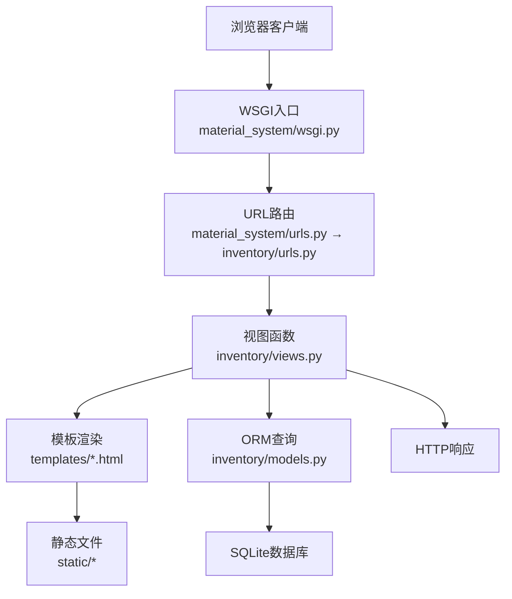

**图表来源**
- [wsgi.py:1-17](file://material_system/wsgi.py#L1-L17)
- [urls.py:1-13](file://material_system/urls.py#L1-L13)
- [urls.py:1-80](file://inventory/urls.py#L1-L80)
- [views.py:1-800](file://inventory/views.py#L1-L800)
- [models.py:1-328](file://inventory/models.py#L1-L328)

**章节来源**
- [urls.py:1-13](file://material_system/urls.py#L1-L13)
- [urls.py:1-80](file://inventory/urls.py#L1-L80)
- [wsgi.py:1-17](file://material_system/wsgi.py#L1-L17)

## 核心组件
- 路由与中间件
  - 全局URL聚合：根路由包含admin与inventory子应用路由
  - 中间件栈：安全、会话、通用、CSRF、认证、消息、点击劫持等
- 视图层
  - 登录/登出、仪表盘、项目/材料/供应商/采购计划/发货/入库管理、报表与图表、Excel导出、系统设置等
- 模型层
  - 用户档案、项目、材料、供应商、入库记录、采购计划、发货单、操作日志等
- 模板层
  - 基础布局、各业务页面模板、登录页
- 静态资源
  - CSS/JS与媒体文件，开发模式下由Django提供

**章节来源**
- [settings.py:93-101](file://material_system/settings.py#L93-L101)
- [urls.py:6-9](file://material_system/urls.py#L6-L9)
- [urls.py:4-80](file://inventory/urls.py#L4-L80)
- [views.py:114-143](file://inventory/views.py#L114-L143)
- [models.py:7-328](file://inventory/models.py#L7-L328)
- [base.html:1-137](file://templates/base.html#L1-L137)
- [login.html:1-48](file://templates/login.html#L1-L48)

## 架构总览
下图展示一次典型“入库列表”请求的端到端数据流，包括路由、视图、模板、ORM与响应。

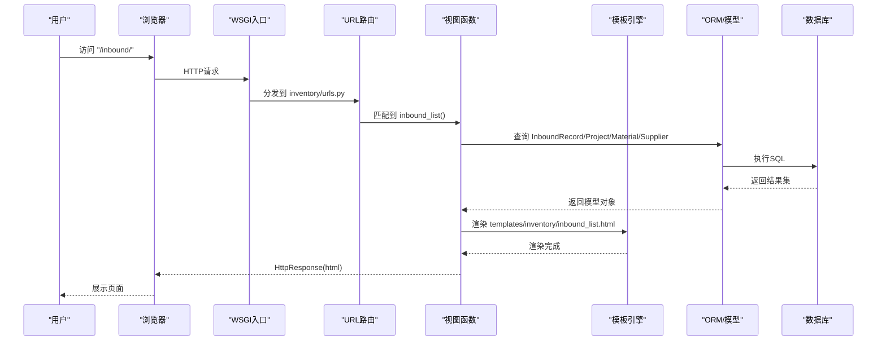

**图表来源**
- [urls.py:44-47](file://inventory/urls.py#L44-L47)
- [views.py:621-649](file://inventory/views.py#L621-L649)
- [models.py:206-237](file://inventory/models.py#L206-L237)
- [inbound_list.html:1-246](file://templates/inventory/inbound_list.html#L1-L246)

## 详细组件分析

### 1) HTTP请求接收与URL路由匹配
- 入口
  - WSGI应用在运行时由部署服务器调用，负责将HTTP请求交由Django处理
- 路由
  - 根路由聚合admin与inventory子应用
  - inventory子路由定义了大量业务URL，如“入库列表/inbound/”“登录/login/”等
- 匹配规则
  - 通过path/include按顺序匹配，支持参数捕获（如发货单详情的<int:pk>）

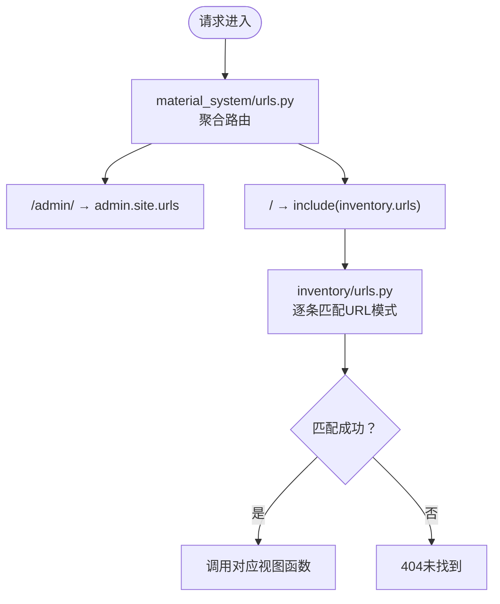

**图表来源**
- [urls.py:6-9](file://material_system/urls.py#L6-L9)
- [urls.py:4-80](file://inventory/urls.py#L4-L80)

**章节来源**
- [wsgi.py:10-16](file://material_system/wsgi.py#L10-L16)
- [urls.py:1-13](file://material_system/urls.py#L1-L13)
- [urls.py:1-80](file://inventory/urls.py#L1-L80)

### 2) 视图函数处理与模板渲染
- 登录流程
  - 登录页模板提供表单，视图接收POST，验证凭据，创建或获取Profile，写入操作日志，按角色跳转
- 仪表盘
  - 登录后按权限加载最近入库、项目、材料、供应商列表
- 入库管理
  - 列表页：筛选条件（日期、项目、材料、供应商），查询ORM并渲染模板
  - 表单提交：POST保存入库记录，计算总金额，写入日志

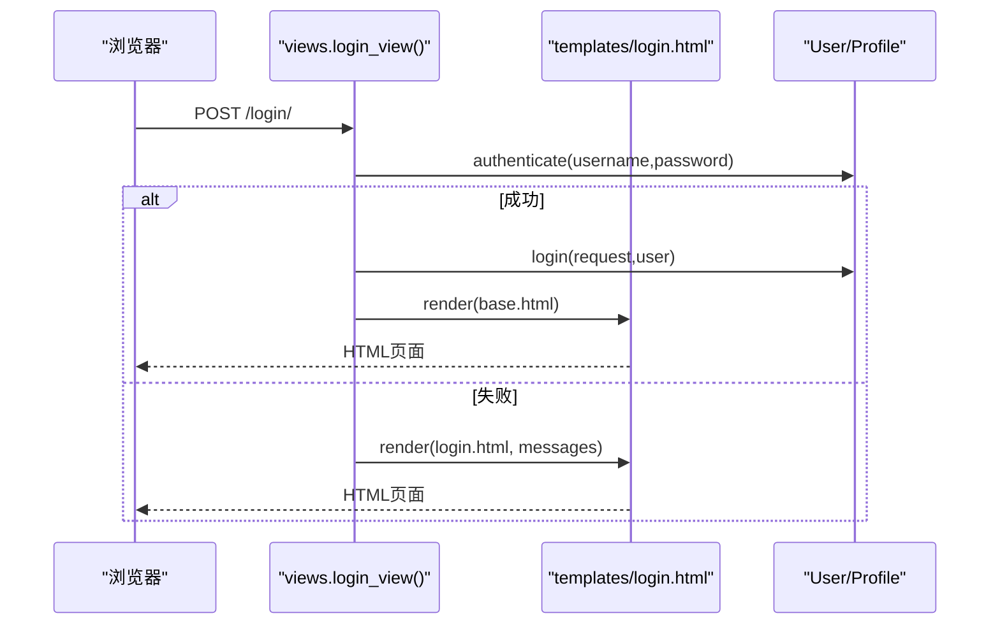

**图表来源**
- [views.py:114-137](file://inventory/views.py#L114-L137)
- [login.html:30-43](file://templates/login.html#L30-L43)
- [base.html:1-137](file://templates/base.html#L1-L137)

**章节来源**
- [views.py:114-158](file://inventory/views.py#L114-L158)
- [login.html:1-48](file://templates/login.html#L1-L48)
- [dashboard.html:1-141](file://templates/inventory/dashboard.html#L1-L141)

### 3) Django中间件在数据流中的作用
- 会话管理
  - SessionMiddleware在请求早期建立会话，使后续视图可读写request.session
- CSRF保护
  - CsrfViewMiddleware在POST/PUT/DELETE请求上校验CSRF令牌，防止跨站请求伪造
- 安全检查
  - SecurityMiddleware/XFrameOptionsMiddleware等提供安全头与点击劫持防护
- 认证与消息
  - AuthenticationMiddleware注入request.user；MessageMiddleware提供消息框架

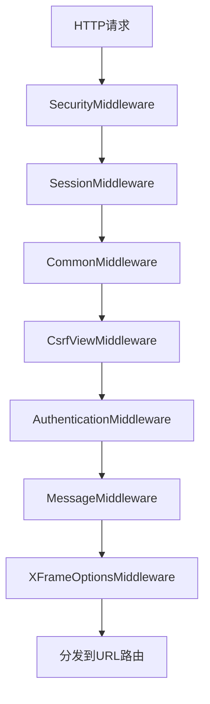

**图表来源**
- [settings.py:93-101](file://material_system/settings.py#L93-L101)

**章节来源**
- [settings.py:93-101](file://material_system/settings.py#L93-L101)

### 4) ORM查询执行流程
- 查询入口
  - 视图中使用Django ORM进行查询，如select_related优化外键查询、聚合统计等
- SQL生成
  - ORM将查询表达式翻译为SQL语句（含WHERE、JOIN、聚合等）
- 数据库执行
  - 通过SQLite连接执行SQL，返回结果集
- 对象映射
  - ORM将结果映射为模型实例，供视图与模板使用

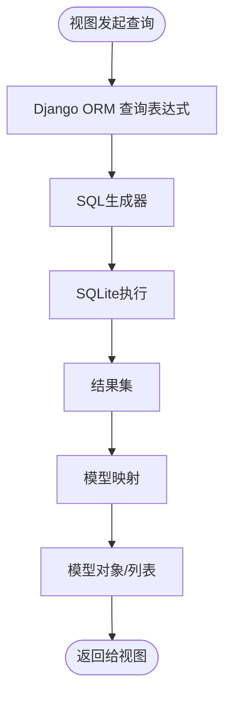

**图表来源**
- [views.py:149-158](file://inventory/views.py#L149-L158)
- [models.py:117-142](file://inventory/models.py#L117-L142)

**章节来源**
- [views.py:626-649](file://inventory/views.py#L626-L649)
- [models.py:117-142](file://inventory/models.py#L117-L142)

### 5) 模板渲染与上下文数据传递
- 上下文构建
  - 视图将查询结果与筛选参数打包为字典传入render
- 模板继承
  - 各页面模板继承base.html，复用导航、侧边栏、消息提示与静态资源
- 数据绑定
  - 模板通过变量与过滤器展示数据，如金额格式化、状态徽章等

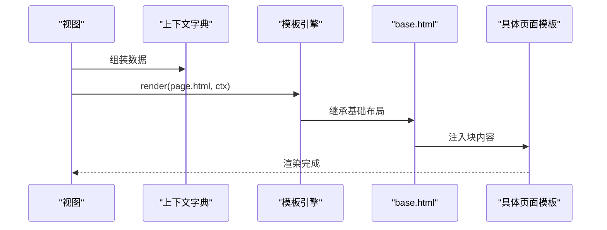

**图表来源**
- [dashboard.html:1-141](file://templates/inventory/dashboard.html#L1-L141)
- [base.html:1-137](file://templates/base.html#L1-L137)
- [inbound_list.html:1-246](file://templates/inventory/inbound_list.html#L1-L246)

**章节来源**
- [views.py:148-158](file://inventory/views.py#L148-L158)
- [base.html:1-137](file://templates/base.html#L1-L137)
- [inbound_list.html:1-246](file://templates/inventory/inbound_list.html#L1-L246)

### 6) 静态文件处理流程
- 配置
  - STATIC_URL/STATIC_ROOT/STATICFILES_DIRS定义静态资源目录
  - MEDIA_URL/MEDIA_ROOT定义媒体资源目录
- 开发模式
  - DEBUG=True时，URL路由自动附加静态与媒体文件服务
- 使用
  - 模板通过标签引用CSS/JS，bootstrap等CDN资源直接加载

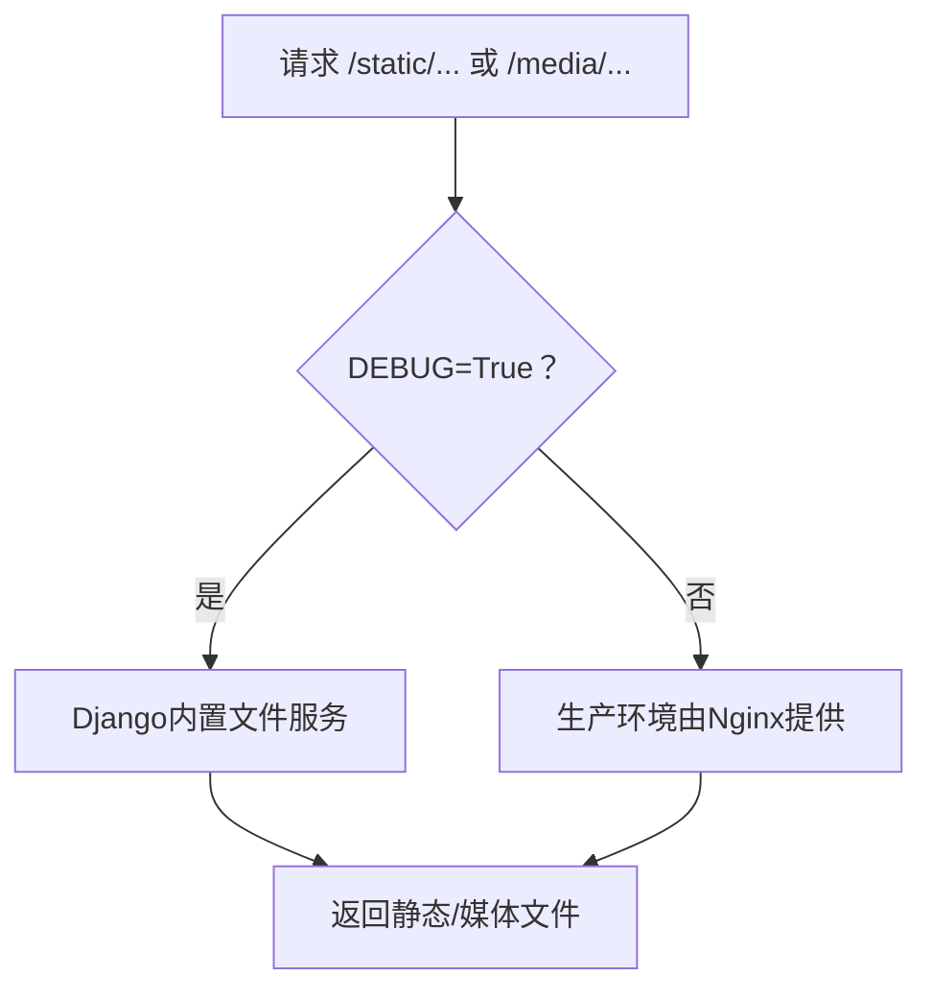

**图表来源**
- [settings.py:141-146](file://material_system/settings.py#L141-L146)
- [urls.py:11-12](file://material_system/urls.py#L11-L12)
- [style.css:1-741](file://static/css/style.css#L1-L741)
- [app.js:1-82](file://static/js/app.js#L1-L82)

**章节来源**
- [settings.py:141-146](file://material_system/settings.py#L141-L146)
- [urls.py:11-12](file://material_system/urls.py#L11-L12)
- [base.html:14-14](file://templates/base.html#L14-L14)

### 7) 错误处理与异常传播机制
- 视图层
  - 登录失败/权限不足/删除受限等场景返回错误消息或JSON
- 模板层
  - messages框架在页面渲染时显示提示
- 日志
  - settings中配置RotatingFileHandler，分别记录INFO与ERROR级别日志

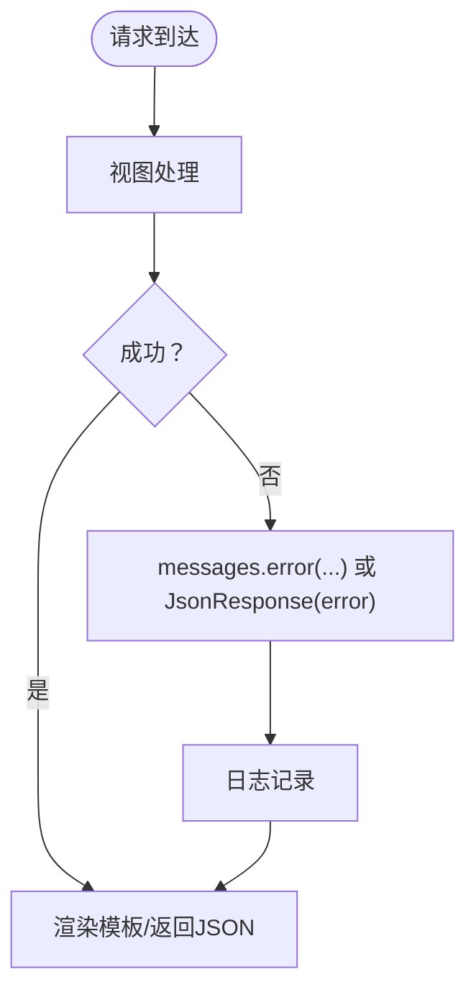

**图表来源**
- [views.py:124-137](file://inventory/views.py#L124-L137)
- [settings.py:149-203](file://material_system/settings.py#L149-L203)

**章节来源**
- [views.py:203-210](file://inventory/views.py#L203-L210)
- [settings.py:149-203](file://material_system/settings.py#L149-L203)

### 8) 典型请求处理流程示例
以下以“快速收货页面加载”为例，展示从请求到响应的完整数据流：

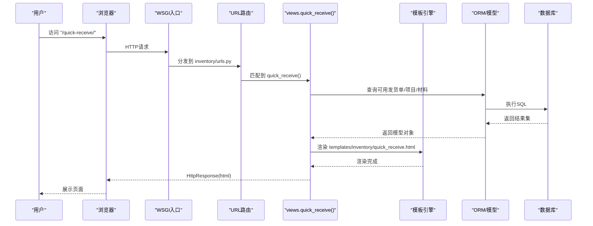

**图表来源**
- [urls.py:40-42](file://inventory/urls.py#L40-L42)
- [views.py:1-800](file://inventory/views.py#L1-L800)
- [models.py:273-309](file://inventory/models.py#L273-L309)

## 依赖分析
- 应用与路由
  - material_system/urls.py聚合inventory/urls.py
  - inventory/urls.py定义业务路由
- 视图与模型
  - views.py依赖inventory/models.py中的模型定义
- 模板与静态
  - 模板依赖base.html与静态资源（CSS/JS）
- 中间件
  - settings.py定义中间件顺序，影响请求生命周期

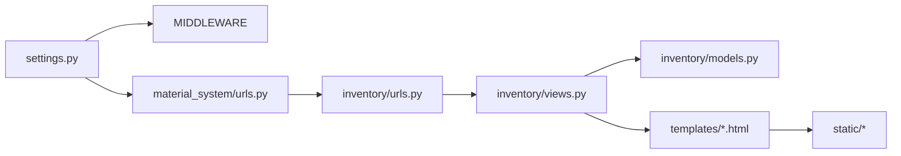

**图表来源**
- [settings.py:93-101](file://material_system/settings.py#L93-L101)
- [urls.py:6-9](file://material_system/urls.py#L6-L9)
- [urls.py:4-80](file://inventory/urls.py#L4-L80)
- [views.py:21-24](file://inventory/views.py#L21-L24)
- [models.py:1-328](file://inventory/models.py#L1-L328)
- [base.html:1-137](file://templates/base.html#L1-L137)

**章节来源**
- [settings.py:93-101](file://material_system/settings.py#L93-L101)
- [urls.py:6-9](file://material_system/urls.py#L6-L9)
- [urls.py:4-80](file://inventory/urls.py#L4-L80)
- [views.py:21-24](file://inventory/views.py#L21-L24)
- [models.py:1-328](file://inventory/models.py#L1-L328)

## 性能考虑
- ORM优化
  - 使用select_related/ prefetch_related减少N+1查询
  - 聚合查询（Sum/Count/Max等）在数据库端完成
- 查询限制
  - 适当分页与筛选条件，避免一次性加载海量数据
- 静态资源
  - 生产环境由Nginx提供静态/媒体文件，降低Django负载
- 缓存策略（建议）
  - 对热点列表页增加缓存（如Redis），结合ETag/Last-Modified
  - 对只读数据（如字典类数据）做进程级缓存
- 日志轮转
  - INFO/ERROR分离，避免单文件过大

[本节为通用指导，无需特定文件引用]

## 故障排查指南
- 登录失败
  - 检查用户名/密码是否正确，用户是否启用；查看messages提示
- 权限不足
  - 确认用户角色与视图装饰器要求；检查Profile是否存在
- 删除失败
  - 某些记录因关联数据而无法删除，返回错误信息
- 静态文件404
  - 确认DEBUG=True且URL路由已附加静态/媒体服务
- 日志定位
  - 查看logs目录下的django.log与error.log

**章节来源**
- [views.py:124-137](file://inventory/views.py#L124-L137)
- [views.py:203-210](file://inventory/views.py#L203-L210)
- [settings.py:149-203](file://material_system/settings.py#L149-L203)

## 结论
本文从请求入口、路由匹配、视图处理、模板渲染、ORM执行、静态资源与中间件七个维度梳理了材料管理系统的数据流设计，并结合实际代码路径给出了序列图与流程图。建议在生产环境中强化静态资源服务、引入缓存与监控，并持续优化ORM查询与模板渲染性能。

## 附录
- 关键URL与视图
  - 登录：/login/ → views.login_view
  - 仪表盘：/ → views.dashboard
  - 入库管理：/inbound/ → views.inbound_list
  - 快速收货：/quick-receive/ → views.quick_receive
- 关键模板
  - base.html：布局与导航
  - dashboard.html：仪表盘
  - inbound_list.html：入库列表与表单
  - login.html：登录页
- 静态资源
  - CSS：static/css/style.css
  - JS：static/js/app.js