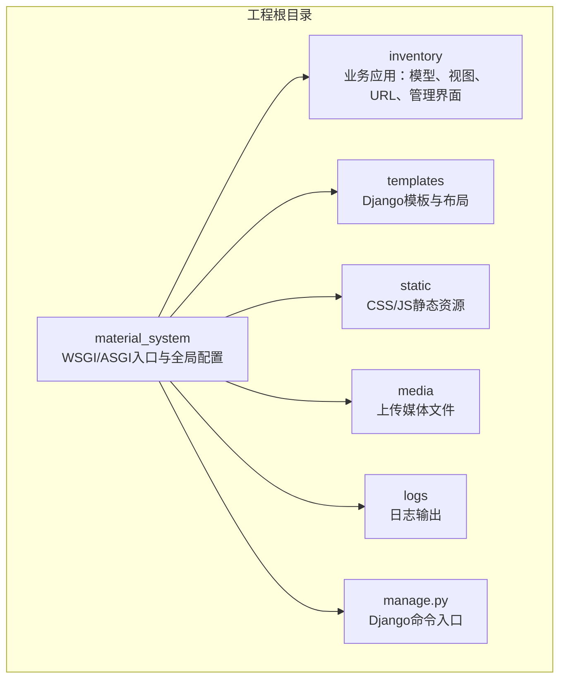
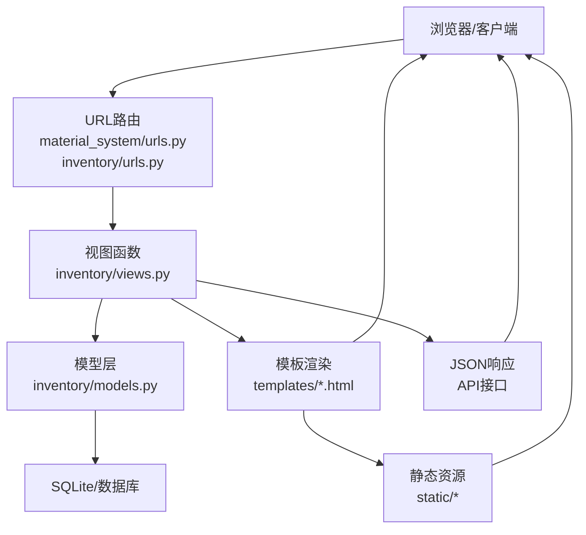
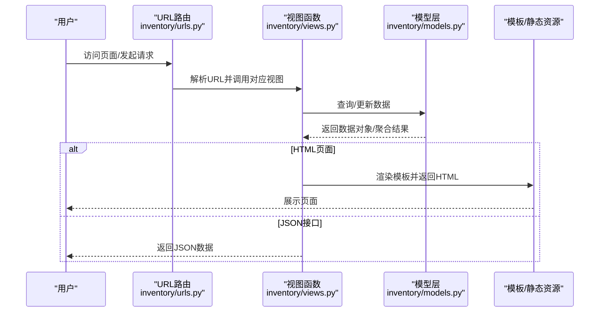
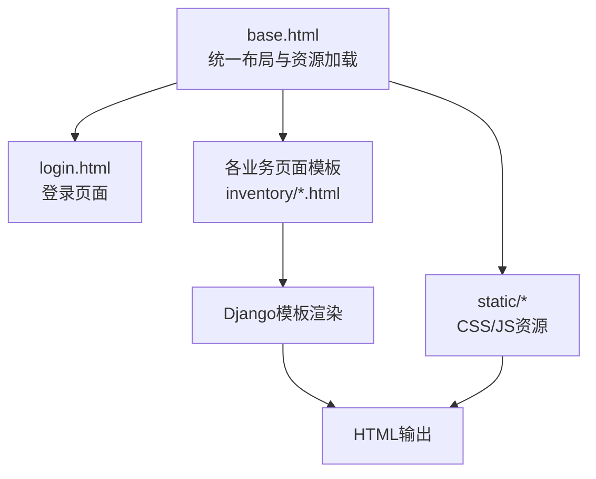
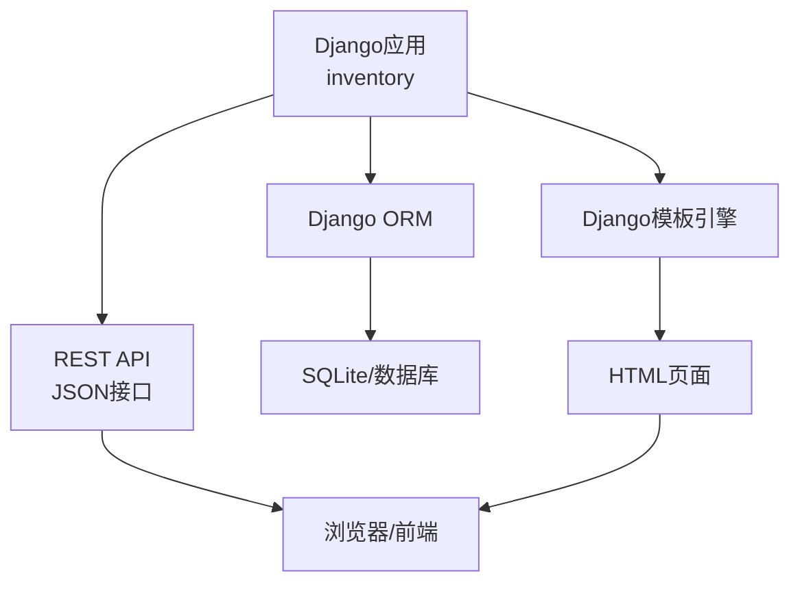

# 整体设计

<cite>
**本文引用的文件**
- [settings.py](file://material_system/settings.py)
- [urls.py](file://material_system/urls.py)
- [urls.py](file://inventory/urls.py)
- [models.py](file://inventory/models.py)
- [views.py](file://inventory/views.py)
- [base.html](file://templates/base.html)
- [login.html](file://templates/login.html)
- [style.css](file://static/css/style.css)
- [app.js](file://static/js/app.js)
- [admin.py](file://inventory/admin.py)
- [apps.py](file://inventory/apps.py)
- [wsgi.py](file://material_system/wsgi.py)
- [asgi.py](file://material_system/asgi.py)
- [manage.py](file://manage.py)
- [requirements.txt](file://requirements.txt)
</cite>

## 目录
1. [引言](#引言)
2. [项目结构](#项目结构)
3. [核心组件](#核心组件)
4. [架构总览](#架构总览)
5. [详细组件分析](#详细组件分析)
6. [依赖分析](#依赖分析)
7. [性能考虑](#性能考虑)
8. [故障排查指南](#故障排查指南)
9. [结论](#结论)
10. [附录](#附录)

## 引言
本设计文档面向“材料管理系统”，基于Django框架实现，采用经典的MVC（Model-View-Controller）架构模式，围绕inventory应用构建完整的工程材料出入库管理能力。系统通过清晰的分层架构（表现层、业务逻辑层、数据访问层）、模块化设计（inventory应用的独立性与可扩展性）、RESTful与传统Web路由结合的URL设计、Django模板引擎与Bootstrap前端集成的模板系统、以及规范化的静态资源管理策略，形成一套可维护、可扩展且易于部署的工程化方案。

## 项目结构
系统采用Django多应用结构，主工程位于material_system，核心业务应用为inventory，模板与静态资源分别位于templates与static目录，媒体文件位于media目录，日志输出至logs目录。



图表来源
- [settings.py:1-210](file://material_system/settings.py#L1-L210)
- [urls.py:1-13](file://material_system/urls.py#L1-L13)
- [urls.py:1-80](file://inventory/urls.py#L1-L80)

章节来源
- [settings.py:63-147](file://material_system/settings.py#L63-L147)
- [urls.py:1-13](file://material_system/urls.py#L1-L13)
- [urls.py:1-80](file://inventory/urls.py#L1-L80)

## 核心组件
- 数据访问层（Model）
  - inventory/models.py 定义了完整的领域模型，涵盖用户档案、项目、材料分类、材料、供应商、入库记录、采购计划、发货单、操作日志等，采用Django ORM进行数据库抽象与查询优化。
- 业务逻辑层（View）
  - inventory/views.py 实现了丰富的业务逻辑，包含认证、仪表盘、档案管理、入库管理、采购计划、发货管理、报表统计、Excel导出、用户管理、系统设置等功能，并内置权限控制与操作日志。
- 表现层（Template）
  - templates/base.html 提供统一布局与侧边栏导航；templates/login.html 提供登录页面；各子页面模板按功能模块组织在templates/inventory下。
- 路由与控制器（URL/Controller）
  - material_system/urls.py 作为全局路由入口，include inventory/urls.py；inventory/urls.py 定义具体业务路由，支持REST风格API与传统Web页面路由的混合设计。
- 静态资源与前端
  - static/css/style.css 提供Bootstrap集成的样式体系；static/js/app.js 提供前端交互脚本；模板通过标签引用资源。

章节来源
- [models.py:1-328](file://inventory/models.py#L1-L328)
- [views.py:1-800](file://inventory/views.py#L1-L800)
- [base.html:1-137](file://templates/base.html#L1-L137)
- [urls.py:1-80](file://inventory/urls.py#L1-L80)
- [style.css:1-741](file://static/css/style.css#L1-L741)

## 架构总览
系统遵循Django MVC模式：
- Model：inventory/models.py 定义实体与关系，提供聚合查询与计算方法（如库存、加权平均成本）。
- View：inventory/views.py 实现业务处理、权限校验、数据组装与响应（HTML/JSON）。
- Controller：inventory/urls.py 将HTTP请求映射到对应视图函数，实现路由控制。
- Template：Django模板引擎渲染页面，继承base.html，复用Bootstrap组件。
- Static：静态资源集中管理，开发时通过Django静态文件服务，生产可通过Nginx代理。



图表来源
- [urls.py:1-13](file://material_system/urls.py#L1-L13)
- [urls.py:1-80](file://inventory/urls.py#L1-L80)
- [views.py:1-800](file://inventory/views.py#L1-L800)
- [models.py:1-328](file://inventory/models.py#L1-L328)
- [base.html:1-137](file://templates/base.html#L1-L137)
- [style.css:1-741](file://static/css/style.css#L1-L741)

## 详细组件分析

### 数据模型与关系
系统围绕“项目-材料-供应商-入库记录-采购计划-发货单-用户档案-操作日志”构建核心数据域，模型间通过外键建立强约束关系，确保数据一致性与完整性。

```mermaid
erDiagram
PROFILE {
uuid id PK
uuid user_id FK
string role
string phone
uuid supplier_info_id FK
}
USER {
uuid id PK
string username
string first_name
}
SUPPLIER {
uuid id PK
string code
string name
uuid main_type_id FK
}
CATEGORY {
uuid id PK
string code
string name
}
MATERIAL {
uuid id PK
string code
string name
uuid category_id FK
string unit
decimal standard_price
decimal safety_stock
}
PROJECT {
uuid id PK
string code
string name
string status
}
INBOUND_RECORD {
uuid id PK
string no
date date
uuid project_id FK
uuid material_id FK
uuid supplier_id FK
decimal quantity
decimal unit_price
decimal total_amount
string quality_status
string location
string spec
uuid operator_id FK
}
PURCHASE_PLAN {
uuid id PK
string no
uuid project_id FK
uuid material_id FK
decimal quantity
decimal unit_price
decimal total_amount
string status
date planned_date
uuid operator_id FK
}
DELIVERY {
uuid id PK
string no
uuid purchase_plan_id FK
decimal actual_quantity
decimal actual_unit_price
decimal actual_total_amount
string shipping_method
string plate_number
string tracking_no
uuid supplier_id FK
datetime create_time
datetime ship_time
}
OPERATION_LOG {
uuid id PK
datetime time
string operator
string module
string op_type
string details
string related_no
}
PROFILE }o--|| USER : "一对一"
SUPPLIER }o--|| CATEGORY : "可为空"
MATERIAL }o|--|| CATEGORY : "多对一"
INBOUND_RECORD }o|--|| PROJECT : "多对一"
INBOUND_RECORD }o|--|| MATERIAL : "多对一"
INBOUND_RECORD }o|--|| SUPPLIER : "多对一"
PURCHASE_PLAN }o|--|| PROJECT : "多对一"
PURCHASE_PLAN }o|--|| MATERIAL : "多对一"
DELIVERY }o|--|| PURCHASE_PLAN : "多对一"
DELIVERY }o|--|| USER : "多对一"
OPERATION_LOG }o|--|| USER : "可选"
```

图表来源
- [models.py:1-328](file://inventory/models.py#L1-L328)

章节来源
- [models.py:1-328](file://inventory/models.py#L1-L328)

### 视图与控制器（URL路由）
- 全局路由：material_system/urls.py 将/admin/交由Django Admin，根路径include inventory/urls.py。
- inventory/urls.py 定义了完整的业务路由，覆盖登录/登出、仪表盘、项目/材料/供应商档案、入库管理、采购计划、发货管理、快速收货、报表统计、图表分析、Excel导出、用户管理、系统设置等。
- API路由采用REST风格命名，如/api/...，便于前后端分离或AJAX调用；传统Web路由用于完整页面渲染。



图表来源
- [urls.py:1-80](file://inventory/urls.py#L1-L80)
- [views.py:1-800](file://inventory/views.py#L1-L800)
- [models.py:1-328](file://inventory/models.py#L1-L328)

章节来源
- [urls.py:1-80](file://inventory/urls.py#L1-L80)
- [views.py:114-144](file://inventory/views.py#L114-L144)
- [views.py:147-158](file://inventory/views.py#L147-L158)

### 模板系统与前端集成
- 基础模板：templates/base.html 统一引入Bootstrap 5、图标库、自定义样式与脚本，支持侧边栏导航、顶部导航、消息提示与响应式布局。
- 登录模板：templates/login.html 提供简洁的登录表单，集成Bootstrap样式与CSRF保护。
- 样式与脚本：static/css/style.css 提供完整的UI样式体系；static/js/app.js 作为前端交互脚本入口。
- 模板继承：各业务页面继承base.html，通过block定义标题、内容与额外CSS/JS注入点。



图表来源
- [base.html:1-137](file://templates/base.html#L1-L137)
- [login.html:1-48](file://templates/login.html#L1-L48)
- [style.css:1-741](file://static/css/style.css#L1-L741)

章节来源
- [base.html:1-137](file://templates/base.html#L1-L137)
- [login.html:1-48](file://templates/login.html#L1-L48)
- [style.css:1-741](file://static/css/style.css#L1-L741)

### 静态资源管理策略
- 静态文件目录：settings.py 中通过STATIC_URL、STATICFILES_DIRS与STATIC_ROOT配置，开发时由Django提供，生产可通过Nginx代理。
- 媒体文件：MEDIA_URL与MEDIA_ROOT用于上传文件存储，如发货单二维码图片。
- 资源引用：模板通过标签引用CSS/JS，避免硬编码路径，提升可移植性。

章节来源
- [settings.py:141-146](file://material_system/settings.py#L141-L146)
- [base.html:14-133](file://templates/base.html#L14-L133)

### 系统边界与组件通信
- 系统边界：material_system为应用容器，inventory为业务边界，Admin后台与静态/媒体资源为外部可见面。
- 组件通信：
  - 路由层：URLconf将请求分发至视图。
  - 视图层：视图函数负责权限校验、参数解析、调用模型层、组装响应。
  - 模型层：ORM封装数据库访问，提供聚合查询与计算方法。
  - 模板层：渲染HTML，传递上下文数据。
  - API层：JSON接口返回标准化数据，支持异步调用与前端交互。

章节来源
- [urls.py:1-13](file://material_system/urls.py#L1-L13)
- [views.py:28-32](file://inventory/views.py#L28-L32)
- [models.py:117-177](file://inventory/models.py#L117-L177)

## 依赖分析
- 运行时依赖：Django 6.0.3、django-admin-interface、django-colorfield、openpyxl、qrcode、pillow、PyMySQL、python-dotenv、gunicorn等。
- 部署与运行：WSGI/ASGI入口分别位于material_system/wsgi.py与material_system/asgi.py，配合manage.py启动Django应用。



图表来源
- [requirements.txt:1-16](file://requirements.txt#L1-L16)
- [wsgi.py:1-17](file://material_system/wsgi.py#L1-L17)
- [asgi.py:1-17](file://material_system/asgi.py#L1-L17)
- [manage.py:1-23](file://manage.py#L1-L23)

章节来源
- [requirements.txt:1-16](file://requirements.txt#L1-L16)
- [wsgi.py:1-17](file://material_system/wsgi.py#L1-L17)
- [asgi.py:1-17](file://material_system/asgi.py#L1-L17)
- [manage.py:1-23](file://manage.py#L1-L23)

## 性能考虑
- 查询优化：视图中广泛使用select_related与prefetch_related减少N+1查询；聚合查询（Sum/Count）在模型层直接实现，降低视图层复杂度。
- 缓存与日志：日志系统采用轮转策略，避免磁盘占用过大；SQLite连接超时配置保障并发稳定性。
- 前端性能：Bootstrap与自定义CSS按需加载，静态资源通过CDN加速；模板中条件渲染减少不必要的DOM节点。
- 导出性能：Excel导出采用openpyxl批量写入，避免逐行拼接字符串。

章节来源
- [views.py:149-150](file://inventory/views.py#L149-L150)
- [views.py:234-251](file://inventory/views.py#L234-L251)
- [settings.py:149-203](file://material_system/settings.py#L149-L203)

## 故障排查指南
- 登录问题：检查settings.py中的LOGIN_URL与用户状态；登录视图会创建Profile并记录登录日志。
- 权限问题：视图中使用装饰器与can_manage_*辅助函数进行权限校验，API场景返回403错误。
- 数据一致性：模型层提供聚合与计算方法，若出现异常可先核对聚合查询条件与字段类型。
- 日志定位：系统为inventory与Django分别配置日志处理器，错误日志输出至logs/error.log，普通日志输出至logs/django.log。

章节来源
- [views.py:114-144](file://inventory/views.py#L114-L144)
- [views.py:55-64](file://inventory/views.py#L55-L64)
- [models.py:117-177](file://inventory/models.py#L117-L177)
- [settings.py:149-203](file://material_system/settings.py#L149-L203)

## 结论
本系统以Django为核心，通过清晰的MVC分层、模块化的inventory应用、完善的路由与模板体系、规范的静态资源管理与日志策略，实现了从项目档案、材料档案、供应商档案到入库管理、采购计划、发货管理与报表统计的全链路工程材料管理能力。系统具备良好的可维护性、可扩展性与部署友好性，适合在中小型工程场景中落地实施。

## 附录
- 开发与部署建议
  - 使用Python虚拟环境安装requirements.txt中的依赖。
  - 生产环境建议使用Gunicorn + Nginx部署，静态文件由Nginx代理。
  - SQLite适用于中小规模数据，若需高并发可考虑切换MySQL/PostgreSQL。
- 扩展方向
  - 引入缓存（Redis/Memcached）提升热点查询性能。
  - 增加任务队列（Celery）异步处理Excel导出与二维码生成。
  - 前后端分离：将API与页面分离，前端使用Vue/React，后端保持Django REST API。