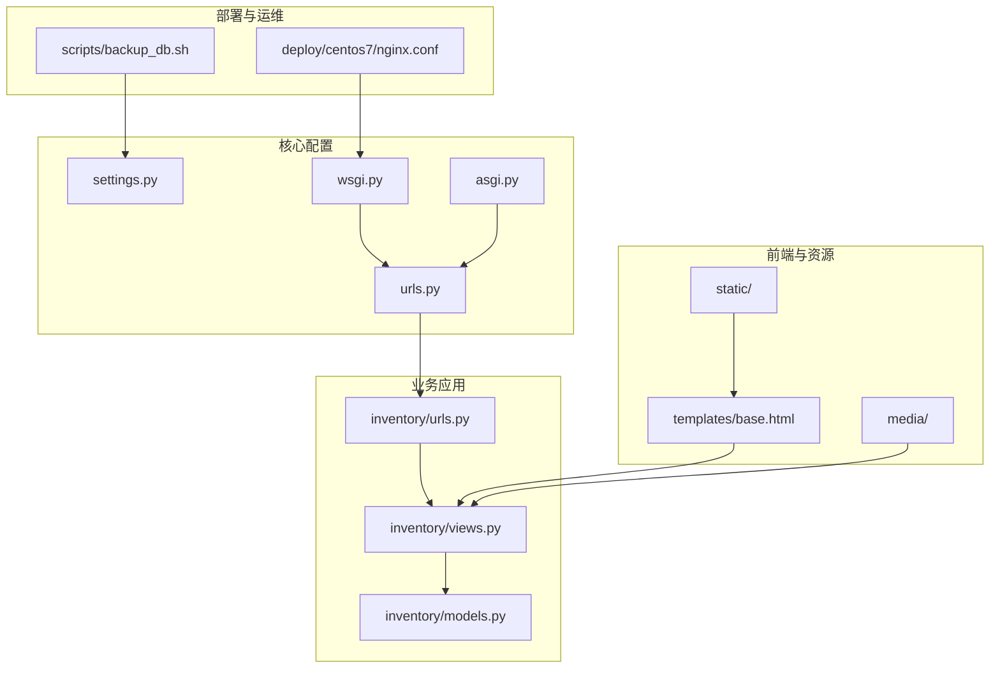
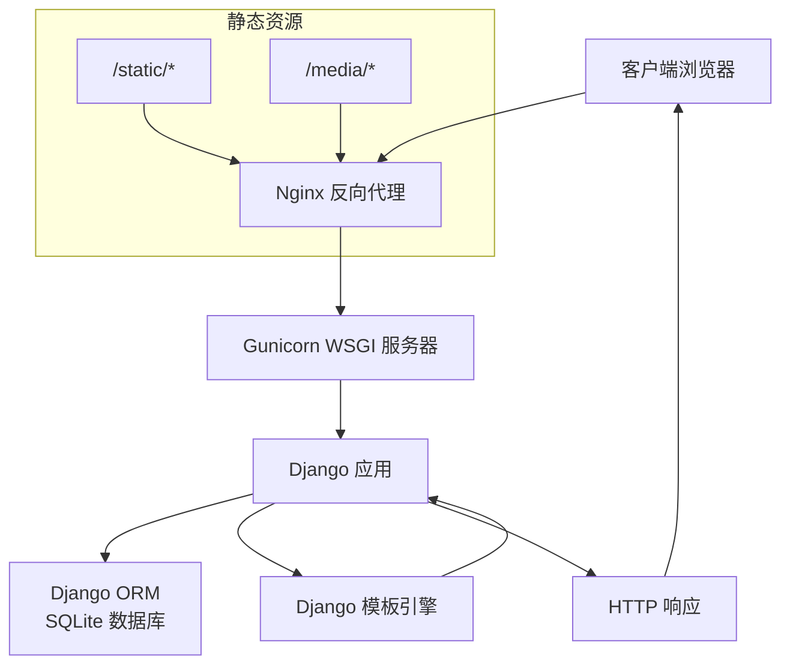
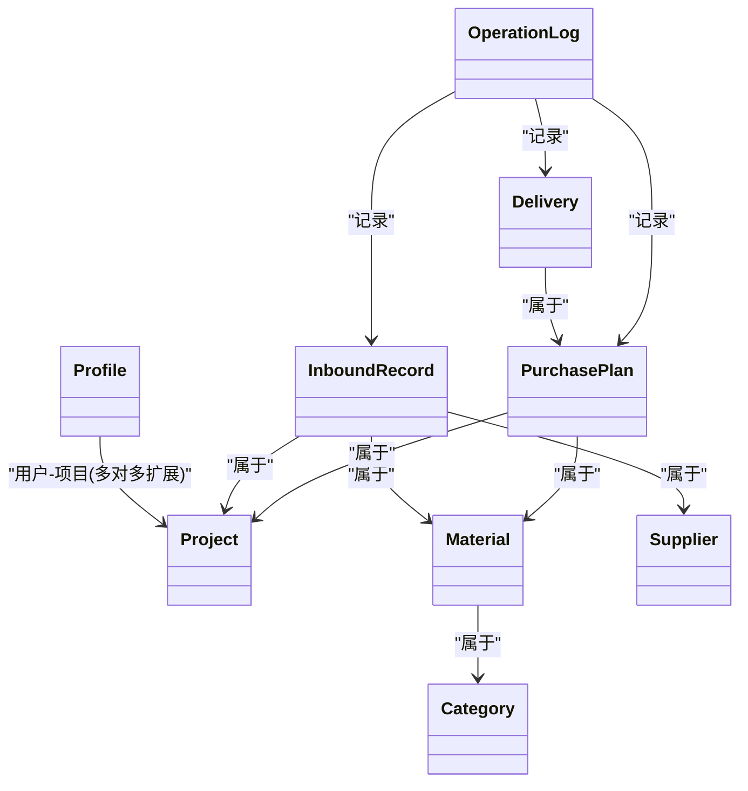
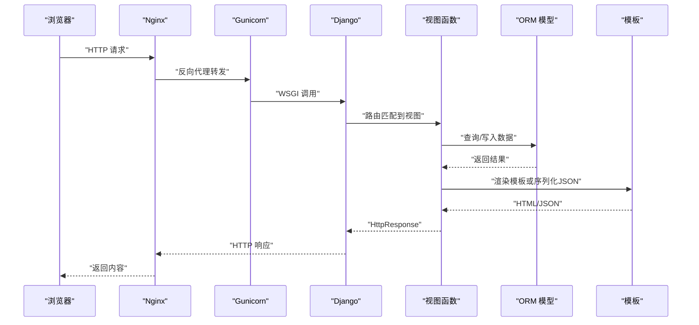
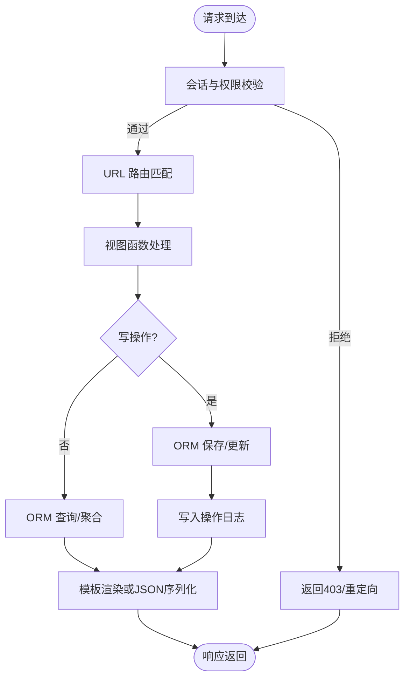
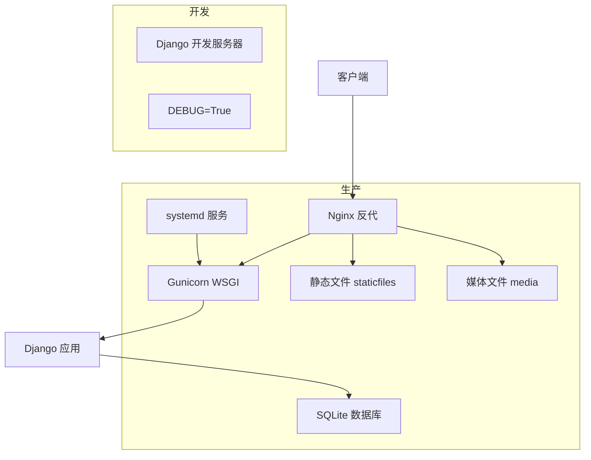
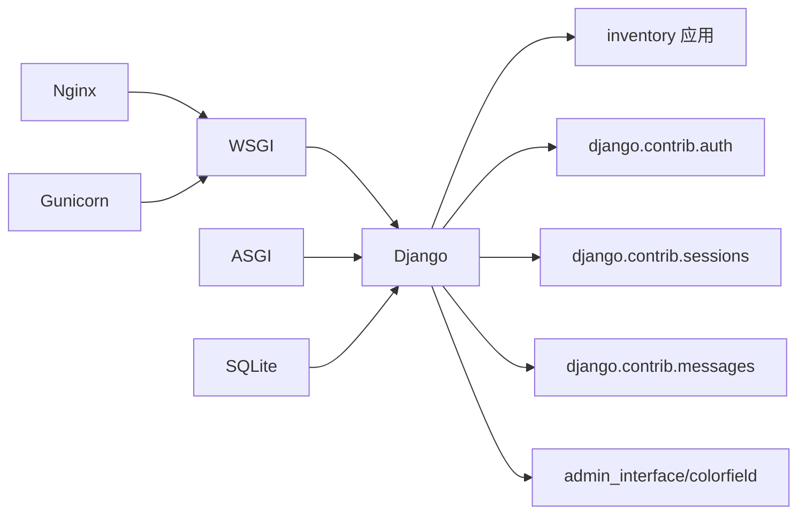

# 系统架构

<cite>
**本文引用的文件**
- [material_system/settings.py](file://material_system/settings.py)
- [material_system/urls.py](file://material_system/urls.py)
- [material_system/wsgi.py](file://material_system/wsgi.py)
- [material_system/asgi.py](file://material_system/asgi.py)
- [inventory/models.py](file://inventory/models.py)
- [inventory/views.py](file://inventory/views.py)
- [inventory/urls.py](file://inventory/urls.py)
- [templates/base.html](file://templates/base.html)
- [requirements.txt](file://requirements.txt)
- [deploy/centos7/nginx.conf](file://deploy/centos7/nginx.conf)
- [scripts/backup_db.sh](file://scripts/backup_db.sh)
- [manage.py](file://manage.py)
- [README.md](file://README.md)
- [deploy/centos7/README.md](file://deploy/centos7/README.md)
</cite>

## 目录
1. [引言](#引言)
2. [项目结构](#项目结构)
3. [核心组件](#核心组件)
4. [架构总览](#架构总览)
5. [详细组件分析](#详细组件分析)
6. [依赖分析](#依赖分析)
7. [性能考量](#性能考量)
8. [故障排查指南](#故障排查指南)
9. [结论](#结论)
10. [附录](#附录)

## 引言
本系统为一个基于Django框架的材料管理系统，围绕“工程项目材料出入库”业务场景构建，采用MVC分层架构与Django内置的MTV（Model-Template-View）模式组织代码。系统通过SQLite作为默认数据库，结合Bootstrap实现响应式前端界面，并通过Nginx+Gunicorn在生产环境提供稳定的服务能力。本文档从系统架构、数据流、部署架构、组件交互、安全与集成等方面进行全面阐述。

## 项目结构
项目采用Django标准分层组织方式：
- 核心配置位于 material_system/ 下，包含settings、urls、wsgi、asgi等入口与配置文件
- 主业务应用 inventory/ 包含模型、视图、URL路由、模板与迁移文件
- 模板 templates/ 与静态资源 static/、媒体文件 media/ 分离管理
- 部署相关脚本与配置位于 deploy/ 与 scripts/

**图表来源**
- [material_system/urls.py:1-13](file://material_system/urls.py#L1-L13)
- [inventory/urls.py:1-80](file://inventory/urls.py#L1-L80)
- [material_system/wsgi.py:1-17](file://material_system/wsgi.py#L1-L17)
- [material_system/asgi.py:1-17](file://material_system/asgi.py#L1-L17)
- [templates/base.html:1-137](file://templates/base.html#L1-L137)
- [deploy/centos7/nginx.conf:1-87](file://deploy/centos7/nginx.conf#L1-L87)
- [scripts/backup_db.sh:1-57](file://scripts/backup_db.sh#L1-L57)

**章节来源**
- [README.md:89-113](file://README.md#L89-L113)

## 核心组件
- 配置与中间件：settings.py集中管理应用、数据库、静态/媒体、日志、国际化、登录重定向等；中间件链路覆盖安全、会话、CSRF、消息与点击劫持防护
- 路由系统：ROOT_URLCONF指向主URL，inventory子应用独立路由，支持静态文件在DEBUG下直接提供
- ORM模型：围绕“项目-材料-供应商-入库记录-采购计划-发货单-用户档案-操作日志”建立实体关系，提供库存统计、成本计算与状态机
- 视图层：基于函数视图实现业务逻辑，统一使用装饰器进行权限校验与登录保护，提供JSON API与HTML渲染
- 模板系统：基于Django模板引擎，使用Bootstrap实现响应式布局，按角色动态渲染菜单与功能入口
- 部署与运行：WSGI/ASGI入口，Nginx反向代理，Gunicorn提供WSGI应用服务，支持systemd托管与健康检查

**章节来源**
- [material_system/settings.py:74-101](file://material_system/settings.py#L74-L101)
- [material_system/urls.py:1-13](file://material_system/urls.py#L1-L13)
- [inventory/models.py:1-328](file://inventory/models.py#L1-L328)
- [inventory/views.py:1-800](file://inventory/views.py#L1-L800)
- [templates/base.html:1-137](file://templates/base.html#L1-L137)
- [material_system/wsgi.py:1-17](file://material_system/wsgi.py#L1-L17)
- [material_system/asgi.py:1-17](file://material_system/asgi.py#L1-L17)

## 架构总览
系统采用前后端分离的Web架构，但模板渲染仍由后端完成。请求自Nginx进入，经WSGI交由Django处理，视图调用模型执行数据操作，模板渲染输出HTML或JSON，静态/媒体资源由Nginx直传。

**图表来源**
- [deploy/centos7/nginx.conf:1-87](file://deploy/centos7/nginx.conf#L1-L87)
- [material_system/wsgi.py:1-17](file://material_system/wsgi.py#L1-L17)
- [material_system/settings.py:141-146](file://material_system/settings.py#L141-L146)

## 详细组件分析

### MVC与MTV映射
- Model（模型）：inventory/models.py 定义领域模型与关系，封装库存统计、成本计算与状态字段
- Template（模板）：templates/base.html 及各功能页模板，使用Bootstrap实现响应式UI
- View（视图）：inventory/views.py 实现业务逻辑，配合装饰器进行权限控制与登录保护
- Controller（控制器）：Django URL路由与视图函数承担控制器职责，协调模型与模板

**图表来源**
- [inventory/models.py:1-328](file://inventory/models.py#L1-L328)

**章节来源**
- [inventory/models.py:1-328](file://inventory/models.py#L1-L328)
- [templates/base.html:1-137](file://templates/base.html#L1-L137)

### URL路由与视图协作
- 主URL聚合 inventory/urls.py 中的业务路由，登录/登出、仪表盘、项目/材料/供应商管理、入库管理、采购计划、发货管理、报表与导出、日志与用户管理等均通过URL映射到对应视图
- 视图层通过装饰器实现权限控制与登录保护，统一记录操作日志

**图表来源**
- [material_system/urls.py:1-13](file://material_system/urls.py#L1-L13)
- [inventory/urls.py:1-80](file://inventory/urls.py#L1-L80)
- [material_system/wsgi.py:1-17](file://material_system/wsgi.py#L1-L17)

**章节来源**
- [material_system/urls.py:1-13](file://material_system/urls.py#L1-L13)
- [inventory/urls.py:1-80](file://inventory/urls.py#L1-L80)
- [inventory/views.py:1-800](file://inventory/views.py#L1-L800)

### 数据流设计（从请求到数据库）
- 登录流程：视图接收凭据，认证通过后写入会话，记录登录日志，按角色重定向
- 业务写入：入库、采购计划、发货等视图在POST中解析参数，构造模型实例，ORM自动计算金额等字段并持久化
- 查询与筛选：视图根据GET参数过滤，ORM生成SQL，模板渲染结果或返回JSON
- 导出与报表：视图生成Excel工作簿或图表数据API，供前端展示

**图表来源**
- [inventory/views.py:114-143](file://inventory/views.py#L114-L143)
- [inventory/views.py:652-681](file://inventory/views.py#L652-L681)
- [inventory/views.py:712-780](file://inventory/views.py#L712-L780)

**章节来源**
- [inventory/views.py:114-143](file://inventory/views.py#L114-L143)
- [inventory/views.py:652-681](file://inventory/views.py#L652-L681)
- [inventory/views.py:712-780](file://inventory/views.py#L712-L780)

### 部署架构（开发与生产）
- 开发环境：manage.py 直接启动开发服务器，DEBUG开启，静态文件由Django在DEBUG下提供
- 生产环境：Nginx作为反向代理，Gunicorn承载WSGI应用，systemd托管服务，静态/媒体由Nginx直传，日志与备份脚本保障运维

**图表来源**
- [material_system/urls.py:11-12](file://material_system/urls.py#L11-L12)
- [deploy/centos7/nginx.conf:1-87](file://deploy/centos7/nginx.conf#L1-L87)
- [material_system/wsgi.py:1-17](file://material_system/wsgi.py#L1-L17)
- [deploy/centos7/README.md:67-103](file://deploy/centos7/README.md#L67-L103)

**章节来源**
- [material_system/urls.py:11-12](file://material_system/urls.py#L11-L12)
- [deploy/centos7/nginx.conf:1-87](file://deploy/centos7/nginx.conf#L1-L87)
- [deploy/centos7/README.md:67-103](file://deploy/centos7/README.md#L67-L103)

### 安全考虑
- CSRF保护：启用CSRF中间件，确保跨站请求验证
- 会话管理：使用Django会话中间件，结合安全头与X-Frame-Options
- 权限控制：基于用户角色的装饰器与视图内权限判断，限制敏感操作
- 日志审计：统一记录登录、增删改、导出等操作，便于审计
- 生产安全：建议关闭DEBUG、设置ALLOWED_HOSTS、使用HTTPS与强密钥

**章节来源**
- [material_system/settings.py:93-101](file://material_system/settings.py#L93-L101)
- [material_system/settings.py:149-203](file://material_system/settings.py#L149-L203)
- [inventory/views.py:55-64](file://inventory/views.py#L55-L64)

### 技术栈选择说明
- Django：提供成熟的MVC/MTV框架、ORM、Admin后台、中间件与模板系统，适合快速迭代与团队协作
- ORM优势：模型抽象清晰、关系定义直观、聚合与事务处理便捷，降低数据库耦合
- SQLite：轻量、零配置、文件级存储，适合中小规模业务与开发/测试环境
- Bootstrap：响应式UI框架，提升移动端体验与开发效率
- Nginx+Gunicorn：Nginx负责静态资源与反向代理，Gunicorn承载Django应用，稳定可靠

**章节来源**
- [requirements.txt:1-16](file://requirements.txt#L1-L16)
- [material_system/settings.py:122-130](file://material_system/settings.py#L122-L130)
- [templates/base.html:12-14](file://templates/base.html#L12-L14)

## 依赖分析
- 应用依赖：inventory 应用依赖 Django 内置应用与第三方 admin-interface/colorfield
- 运行时依赖：WSGI/ASGI入口、Nginx、Gunicorn、SQLite
- 前端依赖：Bootstrap 5、Bootstrap Icons、自定义样式与脚本

**图表来源**
- [material_system/settings.py:74-87](file://material_system/settings.py#L74-L87)
- [material_system/wsgi.py:1-17](file://material_system/wsgi.py#L1-L17)
- [material_system/asgi.py:1-17](file://material_system/asgi.py#L1-L17)
- [requirements.txt:1-16](file://requirements.txt#L1-L16)

**章节来源**
- [material_system/settings.py:74-87](file://material_system/settings.py#L74-L87)
- [requirements.txt:1-16](file://requirements.txt#L1-L16)

## 性能考量
- ORM优化：视图中广泛使用 select_related 与聚合查询，减少N+1查询与重复计算
- 静态资源：Nginx缓存与压缩，提升静态文件传输效率
- 数据库：SQLite默认配置满足中小规模需求，生产建议监控与定期备份
- 并发：Gunicorn多进程模型，结合systemd重启策略保证稳定性

[本节为通用指导，无需列出具体文件来源]

## 故障排查指南
- 日志定位：Django日志与请求错误日志分别落盘，结合Nginx访问日志定位问题
- 数据库兼容：settings中对SQLite版本与参数上限进行兼容性处理，必要时安装pysqlite3
- 备份策略：提供自动化备份脚本，支持保留周期与压缩，建议纳入定时任务
- 部署验证：systemd服务状态、防火墙端口开放、Nginx配置正确性与健康检查端点

**章节来源**
- [material_system/settings.py:149-203](file://material_system/settings.py#L149-L203)
- [scripts/backup_db.sh:1-57](file://scripts/backup_db.sh#L1-L57)
- [deploy/centos7/README.md:135-181](file://deploy/centos7/README.md#L135-L181)

## 结论
本系统以Django为核心，结合SQLite与Bootstrap，构建了面向工程项目的材料出入库管理平台。通过清晰的MVC/MTV分层、完善的权限与日志体系、以及Nginx+Gunicorn的生产部署方案，实现了易用、可维护与可扩展的系统架构。后续可在保持现有架构的基础上，引入Redis缓存、PostgreSQL替换SQLite、微服务拆分与容器化等演进路径。

[本节为总结性内容，无需列出具体文件来源]

## 附录
- 系统边界与集成点
  - 系统边界：内部用户通过登录访问，业务数据在本地SQLite存储，静态/媒体由Nginx提供
  - 集成点：可对接ERP/财务系统（通过Excel导出或API），未来可扩展为REST API与消息队列
- 关键文件索引
  - 配置与入口：[settings.py](file://material_system/settings.py)、[urls.py](file://material_system/urls.py)、[wsgi.py](file://material_system/wsgi.py)、[asgi.py](file://material_system/asgi.py)
  - 业务模型与视图：[models.py](file://inventory/models.py)、[views.py](file://inventory/views.py)、[urls.py](file://inventory/urls.py)
  - 前端模板：[base.html](file://templates/base.html)
  - 部署与运维：[nginx.conf](file://deploy/centos7/nginx.conf)、[backup_db.sh](file://scripts/backup_db.sh)
  - 项目说明：[README.md](file://README.md)

[本节为补充说明，无需列出具体文件来源]