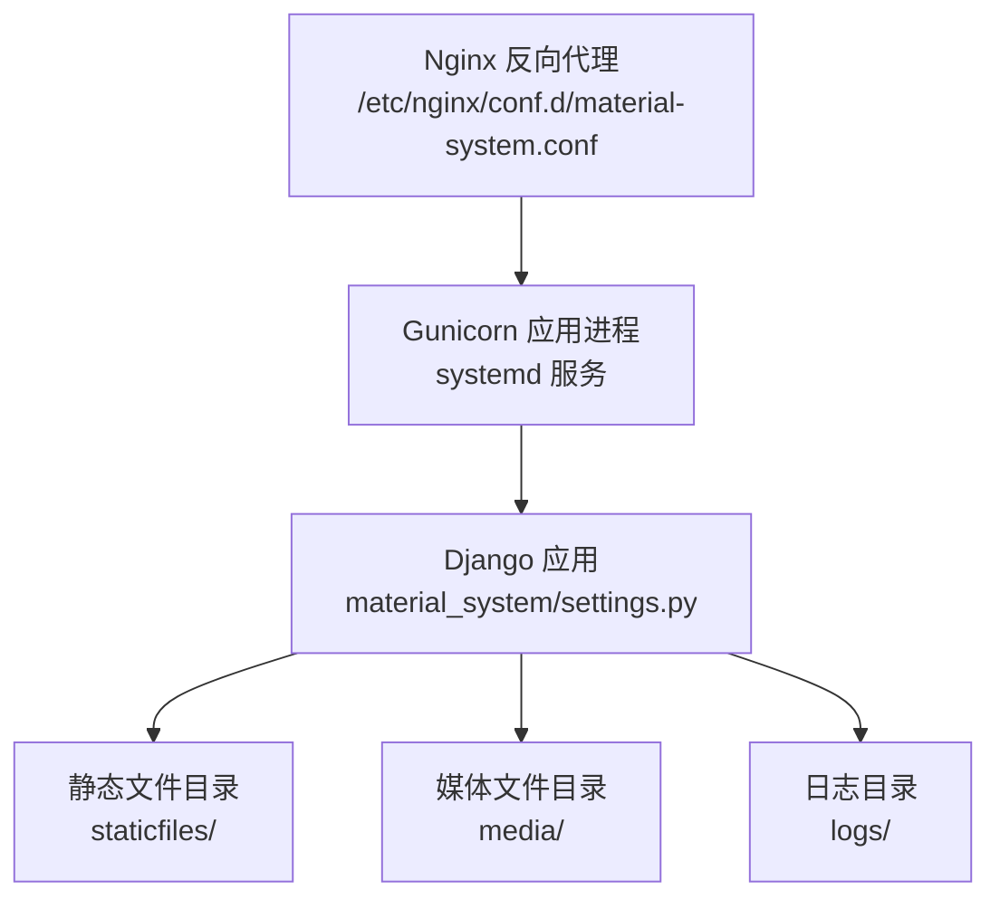
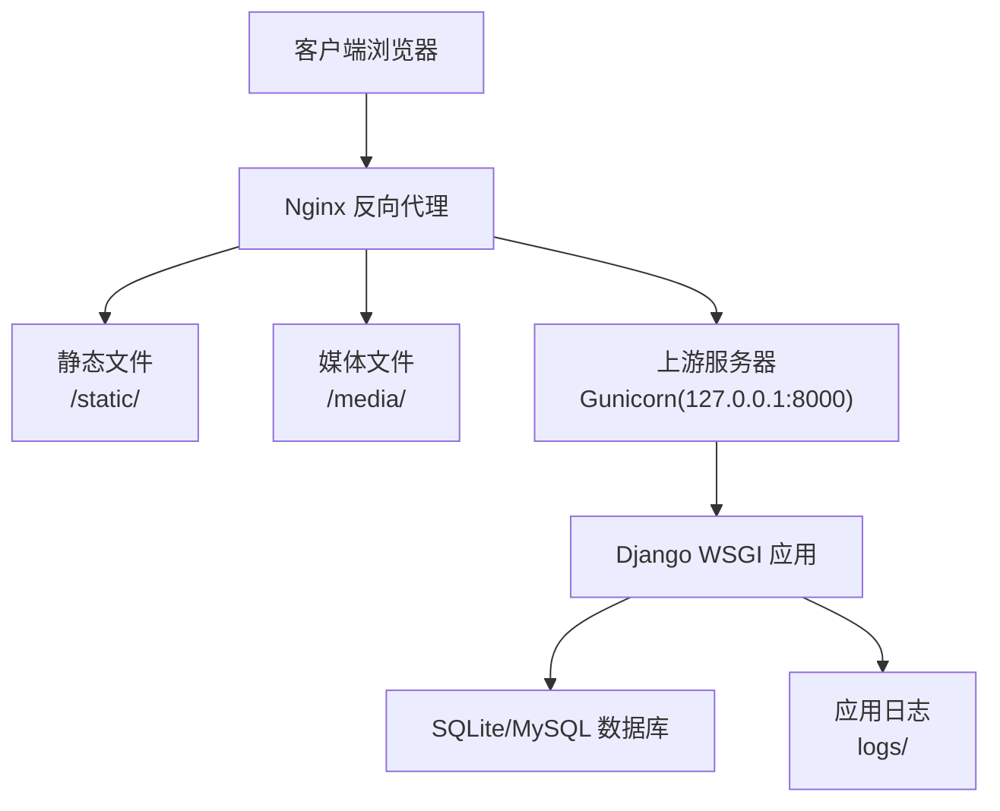
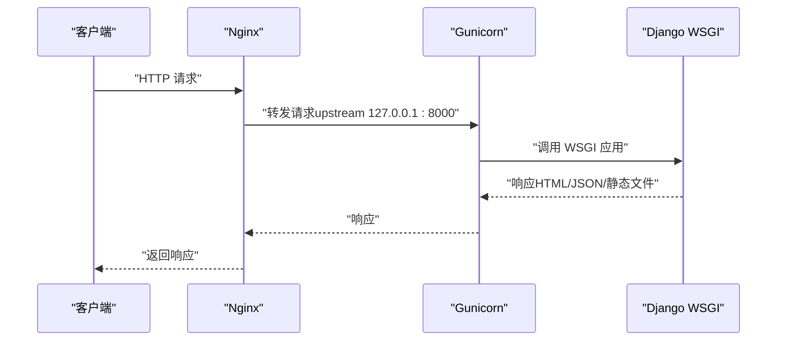
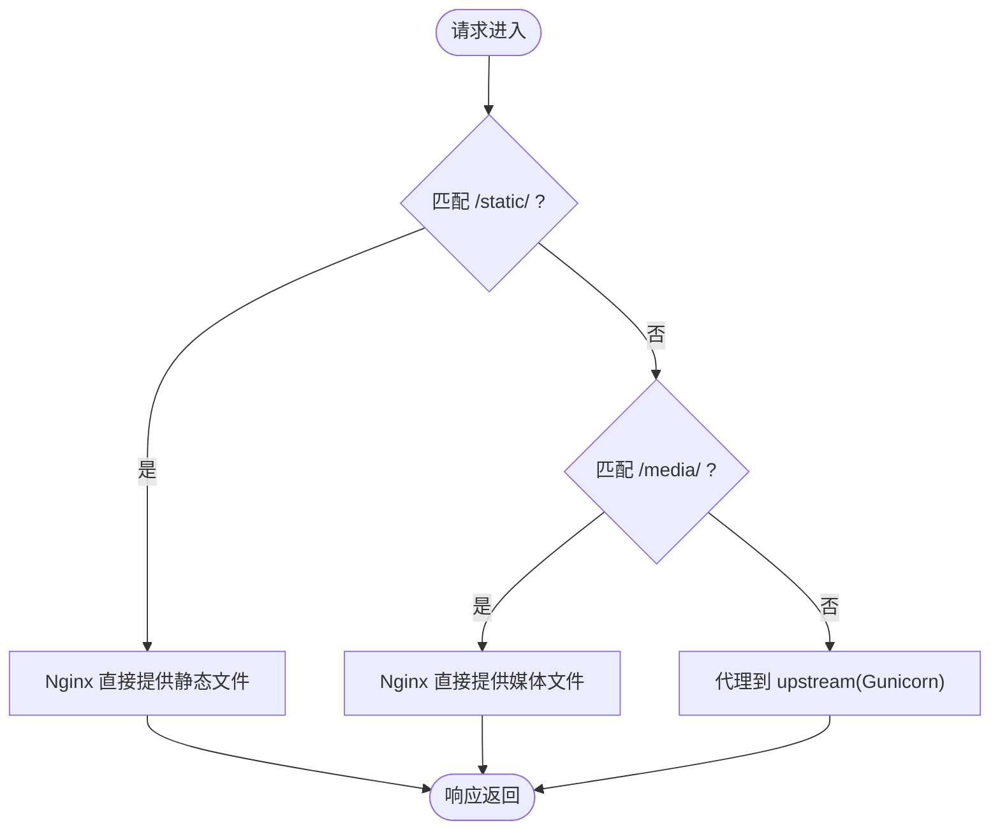
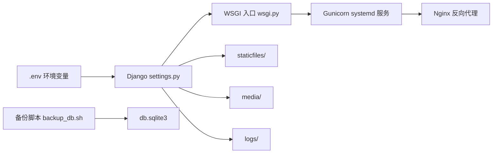

# 部署架构

<cite>
**本文引用的文件**
- [settings.py](file://material_system/settings.py)
- [wsgi.py](file://material_system/wsgi.py)
- [asgi.py](file://material_system/asgi.py)
- [manage.py](file://manage.py)
- [requirements.txt](file://requirements.txt)
- [nginx.conf](file://deploy/centos7/nginx.conf)
- [material-system.service](file://deploy/centos7/material-system.service)
- [deploy_ubuntu.sh](file://deploy_ubuntu.sh)
- [deploy.sh](file://deploy/centos7/deploy.sh)
- [README.md](file://deploy/centos7/README.md)
- [deployment_checklist.md](file://deploy/centos7/deployment_checklist.md)
- [monitor.sh](file://deploy/centos7/monitor.sh)
- [backup_db.sh](file://scripts/backup_db.sh)
</cite>

## 目录
1. [简介](#简介)
2. [项目结构](#项目结构)
3. [核心组件](#核心组件)
4. [架构总览](#架构总览)
5. [详细组件分析](#详细组件分析)
6. [依赖关系分析](#依赖关系分析)
7. [性能考虑](#性能考虑)
8. [故障排除指南](#故障排除指南)
9. [结论](#结论)
10. [附录](#附录)

## 简介
本部署架构文档面向材料管理系统（Django 项目），覆盖开发与生产环境配置差异、WSGI 应用服务器（Gunicorn）部署、Nginx 反向代理配置、systemd 服务管理、文件系统与权限、环境变量与敏感信息管理、Ubuntu/CentOS 部署差异、部署检查清单、故障排除以及实际配置文件示例与部署命令。

## 项目结构
- Django 核心位于 material_system，包含 settings、WSGI/ASGI 入口与日志配置。
- 静态文件与媒体文件目录由 settings.py 定义，生产环境通过 Nginx 提供静态/媒体文件服务。
- 部署相关脚本与配置位于 deploy/centos7 与根目录下的 deploy_ubuntu.sh。
- 依赖通过 requirements.txt 管理，包含 Django、Gunicorn、PyMySQL、python-dotenv 等。

图表来源
- [nginx.conf:1-87](file://deploy/centos7/nginx.conf#L1-L87)
- [material-system.service:1-26](file://deploy/centos7/material-system.service#L1-L26)
- [settings.py:141-147](file://material_system/settings.py#L141-L147)

章节来源
- [settings.py:141-147](file://material_system/settings.py#L141-L147)
- [requirements.txt:1-16](file://requirements.txt#L1-L16)

## 核心组件
- Django 设置与环境变量
  - 通过环境变量控制 DEBUG、ALLOWED_HOSTS、数据库引擎与名称等。
  - 静态文件与媒体文件路径在 settings.py 中定义，生产环境需收集静态文件至 STATIC_ROOT。
- WSGI/ASGI 入口
  - WSGI 用于生产部署（Gunicorn），ASGI 用于异步场景（本项目以 WSGI 为主）。
- Nginx 反向代理
  - 提供静态文件缓存、媒体文件直传、上游代理与健康检查端点。
- systemd 服务
  - Gunicorn 作为 systemd 服务运行，具备重启策略与安全限制。
- 备份与监控
  - 提供数据库备份脚本与系统监控脚本，支持健康检查与自动重启。

章节来源
- [settings.py:69-72](file://material_system/settings.py#L69-L72)
- [settings.py:122-130](file://material_system/settings.py#L122-L130)
- [settings.py:141-147](file://material_system/settings.py#L141-L147)
- [wsgi.py:1-17](file://material_system/wsgi.py#L1-L17)
- [asgi.py:1-17](file://material_system/asgi.py#L1-L17)
- [nginx.conf:1-87](file://deploy/centos7/nginx.conf#L1-L87)
- [material-system.service:1-26](file://deploy/centos7/material-system.service#L1-L26)
- [backup_db.sh:1-57](file://scripts/backup_db.sh#L1-L57)
- [monitor.sh:1-232](file://deploy/centos7/monitor.sh#L1-L232)

## 架构总览
下图展示了典型的生产部署拓扑：客户端请求经 Nginx 反向代理，静态/媒体文件由 Nginx 直接提供，动态请求转发给 Gunicorn，后者调用 Django WSGI 应用。

图表来源
- [nginx.conf:19-52](file://deploy/centos7/nginx.conf#L19-L52)
- [material-system.service:13-13](file://deploy/centos7/material-system.service#L13-L13)
- [settings.py:122-130](file://material_system/settings.py#L122-L130)

## 详细组件分析

### 开发与生产环境配置差异
- DEBUG 模式
  - 开发：DEBUG 默认开启，便于调试。
  - 生产：通过环境变量或 systemd 服务设置 DEBUG=False，关闭调试输出与敏感信息泄露风险。
- 静态文件处理
  - 开发：Django 直接提供 static/ 目录。
  - 生产：先执行 collectstatic，将静态文件收集至 STATIC_ROOT，再由 Nginx 提供静态文件，提升性能与安全性。
- 数据库配置
  - 开发：默认使用 SQLite（DB_ENGINE 与 DB_NAME 由环境变量控制）。
  - 生产：可切换为 MySQL（PyMySQL 已在依赖中），通过环境变量指定 ENGINE 与 NAME。
- 安全与 Cookie
  - 生产环境建议启用 CSRF_COOKIE_SECURE、SESSION_COOKIE_SECURE、HSTS 等安全头（Ubuntu 脚本中提供了示例配置片段）。

章节来源
- [settings.py:71-72](file://material_system/settings.py#L71-L72)
- [settings.py:122-130](file://material_system/settings.py#L122-L130)
- [deploy_ubuntu.sh:84-103](file://deploy_ubuntu.sh#L84-L103)
- [requirements.txt:10-10](file://requirements.txt#L10-L10)

### WSGI 应用服务器（Gunicorn）部署
- 进程模型与绑定
  - 通过 systemd 服务启动 Gunicorn，绑定 0.0.0.0:8000，设置 workers 数量与超时参数。
- 进程管理与重启策略
  - 使用 Restart=always 与 RestartSec=10，实现异常自动重启。
- 安全与隔离
  - 通过 PrivateTmp、ProtectSystem、ProtectHome、ReadWritePaths 等限制进程可访问范围。
- 与 Nginx 的配合
  - Nginx upstream 指向 127.0.0.1:8000，代理请求头包含 X-Real-IP、X-Forwarded-For、X-Forwarded-Proto 等。

图表来源
- [nginx.conf:4-52](file://deploy/centos7/nginx.conf#L4-L52)
- [material-system.service:13-13](file://deploy/centos7/material-system.service#L13-L13)

章节来源
- [material-system.service:1-26](file://deploy/centos7/material-system.service#L1-L26)
- [nginx.conf:34-52](file://deploy/centos7/nginx.conf#L34-L52)

### Nginx 反向代理配置要点
- 静态文件服务
  - 使用 alias 指向 STATIC_ROOT，设置 expires 与 Cache-Control，提升缓存效率。
- 媒体文件服务
  - 使用 alias 指向 MEDIA_ROOT，设置较短过期时间，便于变更生效。
- 上游服务器配置
  - upstream 指向本地 Gunicorn（127.0.0.1:8000），location / 代理到 upstream。
- 安全头与健康检查
  - 添加安全相关响应头；提供 /health/ 端点返回健康状态。
- HTTPS 示例
  - 提供了 HTTPS 与 HTTP 到 HTTPS 重定向的注释示例，便于启用 SSL。

图表来源
- [nginx.conf:19-52](file://deploy/centos7/nginx.conf#L19-L52)

章节来源
- [nginx.conf:1-87](file://deploy/centos7/nginx.conf#L1-L87)

### systemd 服务管理
- 服务单元
  - Type=simple，User/Group 指定专用用户，WorkingDirectory 指向项目目录。
  - Environment 注入 DJANGO_SETTINGS_MODULE 与 DEBUG。
  - ExecStart 指向 gunicorn WSGI 应用入口。
- 重启策略
  - Restart=always，RestartSec=10，保证服务稳定性。
- 安全限制
  - NoNewPrivileges、PrivateTmp、ProtectSystem、ProtectHome、ReadWritePaths 等。
- 启动与状态管理
  - 使用 systemctl enable/start/restart/status 控制服务生命周期。

章节来源
- [material-system.service:1-26](file://deploy/centos7/material-system.service#L1-L26)

### 文件系统结构与权限
- 目录布局
  - 静态文件：settings.py 中定义 STATIC_ROOT（生产）、STATICFILES_DIRS（开发）。
  - 媒体文件：MEDIA_ROOT 指向 media/。
  - 日志文件：logs/ 目录在 BASE_DIR 下，RotatingFileHandler 轮转。
- 权限与归属
  - CentOS 部署脚本与服务文件建议使用专用用户（如 django），并限制对系统路径的写入。
  - 日志目录需具备写权限，便于 systemd/journald 写入。

章节来源
- [settings.py:63-67](file://material_system/settings.py#L63-L67)
- [settings.py:141-147](file://material_system/settings.py#L141-L147)
- [settings.py:149-203](file://material_system/settings.py#L149-L203)
- [material-system.service:7-23](file://deploy/centos7/material-system.service#L7-L23)

### 环境变量与敏感信息管理
- 关键环境变量
  - SECRET_KEY：生产环境必须设置为强随机值。
  - DEBUG：生产环境设为 False。
  - ALLOWED_HOSTS：生产环境应限定为实际域名/IP。
  - DB_ENGINE/DB_NAME：数据库引擎与名称（默认 SQLite，可切换 MySQL）。
  - LANGUAGE_CODE/TIME_ZONE：国际化与时区。
- 环境加载
  - settings.py 使用 python-dotenv 从 .env 文件加载变量。
- 安全建议
  - 不将敏感信息提交到版本库；使用只读权限的配置文件；定期轮换密钥。

章节来源
- [settings.py:69-72](file://material_system/settings.py#L69-L72)
- [settings.py:122-130](file://material_system/settings.py#L122-L130)
- [requirements.txt:11-11](file://requirements.txt#L11-L11)

### Ubuntu 与 CentOS 部署差异与注意事项
- Ubuntu 部署脚本
  - 使用 Python 虚拟环境，安装 gunicorn、PyMySQL、python-dotenv。
  - 生成生产配置文件（包含安全头、静态文件存储等），执行 migrate 与 collectstatic。
  - 通过 systemd socket（unix:/material-system.sock）与 Nginx 通信。
- CentOS 部署脚本
  - 使用系统用户 django，直接 pip3 --user 安装依赖。
  - 通过 systemd 直接绑定 0.0.0.0:8000，Nginx upstream 指向该端口。
  - 提供防火墙规则配置（firewalld）与健康检查端点。
- 共同点
  - 均通过 systemd 管理 Gunicorn，Nginx 提供静态/媒体文件与反向代理。
  - 均提供监控脚本与备份脚本，便于运维。

章节来源
- [deploy_ubuntu.sh:60-74](file://deploy_ubuntu.sh#L60-L74)
- [deploy_ubuntu.sh:80-121](file://deploy_ubuntu.sh#L80-L121)
- [deploy_ubuntu.sh:138-158](file://deploy_ubuntu.sh#L138-L158)
- [deploy_ubuntu.sh:160-183](file://deploy_ubuntu.sh#L160-L183)
- [deploy.sh:47-92](file://deploy/centos7/deploy.sh#L47-L92)
- [deploy.sh:94-118](file://deploy/centos7/deploy.sh#L94-L118)
- [README.md:135-141](file://deploy/centos7/README.md#L135-L141)

### 部署检查清单
- 系统与依赖
  - 系统版本、Python 版本、必要系统包、防火墙开放端口。
- 用户与权限
  - 专用用户、项目目录归属、日志目录可写。
- 应用配置
  - settings.py 正确、数据库迁移完成、静态文件收集完成、媒体目录存在。
- 服务与代理
  - systemd 服务开机自启、Gunicorn 监听端口、Nginx 配置生效、健康检查通过。
- 安全与监控
  - DEBUG 关闭、HTTPS（可选）、日志轮转、监控脚本部署、备份策略。

章节来源
- [deployment_checklist.md:1-182](file://deploy/centos7/deployment_checklist.md#L1-L182)

### 故障排除指南
- 服务无法启动
  - 检查 systemd 状态与 journalctl 日志；确认依赖安装与环境变量。
- 端口无法访问
  - 检查防火墙规则与 Nginx 配置；确认 Gunicorn 是否监听 8000。
- 数据库连接失败
  - 检查数据库文件存在与权限；确认 DB_ENGINE/DB_NAME 配置。
- 静态文件 404
  - 确认 collectstatic 已执行；检查 Nginx alias 路径与权限。
- 性能问题
  - 调整 Gunicorn workers 与超时；启用静态文件缓存；监控 CPU/内存使用。

章节来源
- [deployment_checklist.md:145-159](file://deploy/centos7/deployment_checklist.md#L145-L159)
- [monitor.sh:32-129](file://deploy/centos7/monitor.sh#L32-L129)

## 依赖关系分析
- Django settings 依赖环境变量与 .env 文件。
- WSGI 应用通过 manage.py 启动，systemd 服务指向 WSGI 入口。
- Nginx 依赖静态/媒体目录与 Gunicorn 进程。
- 备份脚本依赖 SQLite 数据库文件与备份目录。

图表来源
- [settings.py:69-72](file://material_system/settings.py#L69-L72)
- [wsgi.py:1-17](file://material_system/wsgi.py#L1-L17)
- [material-system.service:13-13](file://deploy/centos7/material-system.service#L13-L13)
- [nginx.conf:19-52](file://deploy/centos7/nginx.conf#L19-L52)
- [backup_db.sh:8-11](file://scripts/backup_db.sh#L8-L11)

章节来源
- [settings.py:69-72](file://material_system/settings.py#L69-L72)
- [wsgi.py:1-17](file://material_system/wsgi.py#L1-L17)
- [material-system.service:1-26](file://deploy/centos7/material-system.service#L1-L26)
- [nginx.conf:1-87](file://deploy/centos7/nginx.conf#L1-L87)
- [backup_db.sh:1-57](file://scripts/backup_db.sh#L1-L57)

## 性能考虑
- 静态文件缓存
  - Nginx 对 /static/ 设置长缓存，减少后端压力。
- 媒体文件缓存
  - 对 /media/ 设置短期缓存，便于内容更新。
- Gunicorn 并发
  - 合理设置 workers 数量与 keep-alive 超时，平衡吞吐与内存占用。
- 日志轮转
  - 使用 RotatingFileHandler 控制日志大小与数量，避免磁盘膨胀。

章节来源
- [nginx.conf:20-31](file://deploy/centos7/nginx.conf#L20-L31)
- [material-system.service:13-13](file://deploy/centos7/material-system.service#L13-L13)
- [settings.py:149-203](file://material_system/settings.py#L149-L203)

## 故障排除指南
- 常见问题定位
  - 服务状态：systemctl status material-system
  - 应用日志：journalctl -u material-system -f
  - Nginx 日志：tail -f /var/log/nginx/access.log /var/log/nginx/error.log
  - 端口监听：netstat -tlnp | grep :8000
  - 数据库测试：python manage.py dbshell
- 自动化检查
  - 使用 monitor.sh 执行健康检查、资源监控与自动重启（可选）。

章节来源
- [deployment_checklist.md:145-159](file://deploy/centos7/deployment_checklist.md#L145-L159)
- [monitor.sh:32-129](file://deploy/centos7/monitor.sh#L32-L129)

## 结论
本部署架构以 Django + Gunicorn + Nginx 为核心，结合 systemd 实现稳定的服务管理，配合 Nginx 的静态/媒体文件服务与日志轮转机制，满足中小型项目的生产需求。通过环境变量与安全头配置，提升安全性与可维护性。Ubuntu 与 CentOS 提供了可复用的自动化部署脚本与检查清单，便于快速落地与标准化运维。

## 附录

### 实际配置文件示例与部署命令
- Ubuntu 部署
  - 执行部署脚本：sudo bash deploy_ubuntu.sh
  - 生成生产配置：脚本自动创建 production_settings.py 并执行 migrate 与 collectstatic
  - 启动服务：systemctl enable/start material-system；nginx -t && systemctl reload nginx
  - 常用命令：重启、状态、日志查看与备份恢复
- CentOS 部署
  - 执行部署脚本：./deploy.sh（非 root 用户）
  - systemd 服务：/etc/systemd/system/material-system.service
  - Nginx 配置：/etc/nginx/conf.d/material-system.conf
  - 防火墙：firewalld 开放 http/https 与 8000 端口
- 环境变量与敏感信息
  - 在 .env 中设置 SECRET_KEY、DEBUG、ALLOWED_HOSTS、DB_ENGINE、DB_NAME 等
- 备份与监控
  - 数据库备份：./scripts/backup_db.sh [保留天数]
  - 系统监控：/home/django/material_system/deploy/centos7/monitor.sh check/info/restart

章节来源
- [deploy_ubuntu.sh:1-205](file://deploy_ubuntu.sh#L1-L205)
- [deploy.sh:1-153](file://deploy/centos7/deploy.sh#L1-L153)
- [material-system.service:1-26](file://deploy/centos7/material-system.service#L1-L26)
- [nginx.conf:1-87](file://deploy/centos7/nginx.conf#L1-L87)
- [deployment_checklist.md:87-143](file://deploy/centos7/deployment_checklist.md#L87-L143)
- [backup_db.sh:1-57](file://scripts/backup_db.sh#L1-L57)
- [monitor.sh:191-232](file://deploy/centos7/monitor.sh#L191-L232)