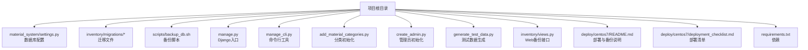
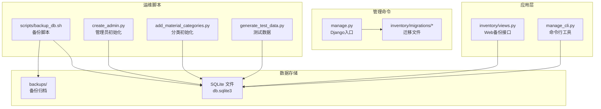
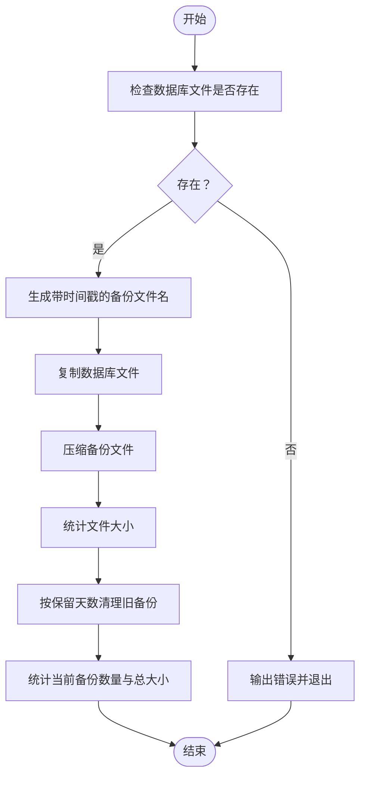
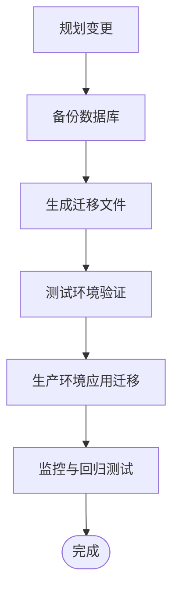
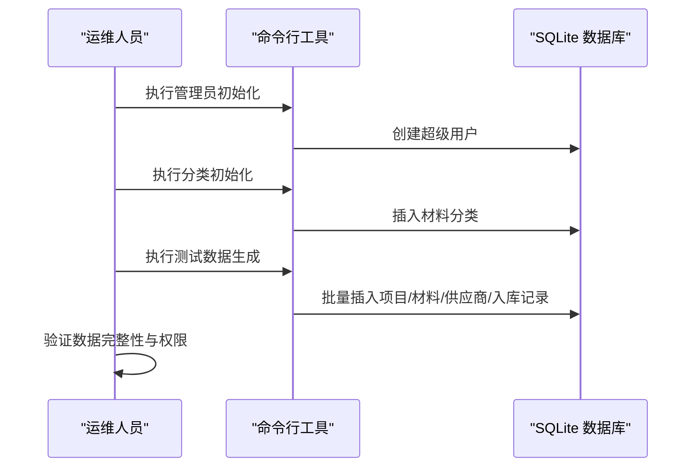
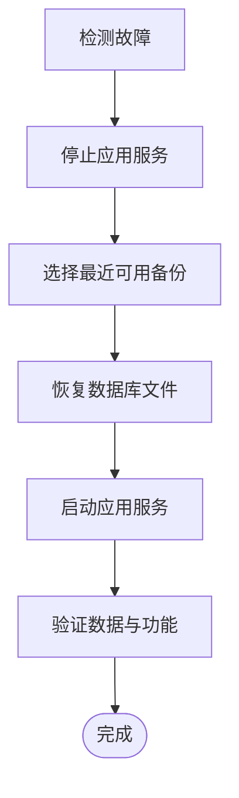
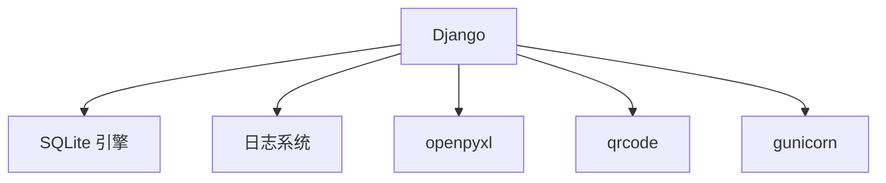

# 数据库管理

<cite>
**本文引用的文件**
- [material_system/settings.py](file://material_system/settings.py)
- [scripts/backup_db.sh](file://scripts/backup_db.sh)
- [inventory/migrations/0001_initial.py](file://inventory/migrations/0001_initial.py)
- [manage.py](file://manage.py)
- [manage_cli.py](file://manage_cli.py)
- [add_material_categories.py](file://add_material_categories.py)
- [create_admin.py](file://create_admin.py)
- [generate_test_data.py](file://generate_test_data.py)
- [deploy/centos7/README.md](file://deploy/centos7/README.md)
- [deploy/centos7/deployment_checklist.md](file://deploy/centos7/deployment_checklist.md)
- [inventory/views.py](file://inventory/views.py)
- [requirements.txt](file://requirements.txt)
</cite>

## 目录
1. [简介](#简介)
2. [项目结构](#项目结构)
3. [核心组件](#核心组件)
4. [架构总览](#架构总览)
5. [详细组件分析](#详细组件分析)
6. [依赖分析](#依赖分析)
7. [性能考虑](#性能考虑)
8. [故障排查指南](#故障排查指南)
9. [结论](#结论)
10. [附录](#附录)

## 简介
本指南面向材料管理系统（Django + SQLite）的数据库管理与运维，覆盖以下主题：
- 数据库备份策略与脚本使用（含自动化配置与执行）
- 数据库迁移管理（创建、应用、回滚）
- 数据库初始化（表结构、初始数据、权限）
- 性能优化（索引、查询、连接池）
- 监控与维护（空间清理、统计信息、健康检查）
- 数据恢复与灾难恢复流程

## 项目结构
系统采用 Django 应用与 SQLite 数据库的轻量架构，数据库位于项目根目录下的 SQLite 文件；迁移文件集中于 inventory/migrations；备份脚本位于 scripts；初始化与运维脚本位于项目根目录。

图表来源
- [material_system/settings.py:122-130](file://material_system/settings.py#L122-L130)
- [inventory/migrations/0001_initial.py:1-198](file://inventory/migrations/0001_initial.py#L1-L198)
- [scripts/backup_db.sh:1-57](file://scripts/backup_db.sh#L1-L57)
- [manage.py:1-23](file://manage.py#L1-L23)
- [manage_cli.py:1-200](file://manage_cli.py#L1-L200)
- [add_material_categories.py:1-60](file://add_material_categories.py#L1-L60)
- [create_admin.py:1-45](file://create_admin.py#L1-L45)
- [generate_test_data.py:1-181](file://generate_test_data.py#L1-L181)
- [inventory/views.py:1290-1308](file://inventory/views.py#L1290-L1308)
- [deploy/centos7/README.md:155-168](file://deploy/centos7/README.md#L155-L168)
- [deploy/centos7/deployment_checklist.md:121-131](file://deploy/centos7/deployment_checklist.md#L121-L131)
- [requirements.txt:1-16](file://requirements.txt#L1-L16)

章节来源
- [material_system/settings.py:122-130](file://material_system/settings.py#L122-L130)
- [scripts/backup_db.sh:1-57](file://scripts/backup_db.sh#L1-L57)
- [inventory/migrations/0001_initial.py:1-198](file://inventory/migrations/0001_initial.py#L1-L198)
- [manage.py:1-23](file://manage.py#L1-L23)
- [manage_cli.py:1-200](file://manage_cli.py#L1-L200)
- [add_material_categories.py:1-60](file://add_material_categories.py#L1-L60)
- [create_admin.py:1-45](file://create_admin.py#L1-L45)
- [generate_test_data.py:1-181](file://generate_test_data.py#L1-L181)
- [inventory/views.py:1290-1308](file://inventory/views.py#L1290-L1308)
- [deploy/centos7/README.md:155-168](file://deploy/centos7/README.md#L155-L168)
- [deploy/centos7/deployment_checklist.md:121-131](file://deploy/centos7/deployment_checklist.md#L121-L131)
- [requirements.txt:1-16](file://requirements.txt#L1-L16)

## 核心组件
- 数据库配置与连接
  - 默认使用 SQLite，数据库文件路径由设置决定，支持超时参数。
- 迁移系统
  - 使用 Django migrations 管理模型变更历史。
- 备份能力
  - 提供 Bash 脚本与 Web 接口两种备份方式。
- 初始化脚本
  - 管理员创建、常用分类与测试数据生成。
- 运维脚本
  - 命令行工具用于日常数据操作与统计。

章节来源
- [material_system/settings.py:122-130](file://material_system/settings.py#L122-L130)
- [inventory/migrations/0001_initial.py:1-198](file://inventory/migrations/0001_initial.py#L1-L198)
- [scripts/backup_db.sh:1-57](file://scripts/backup_db.sh#L1-L57)
- [inventory/views.py:1290-1308](file://inventory/views.py#L1290-L1308)
- [create_admin.py:1-45](file://create_admin.py#L1-L45)
- [add_material_categories.py:1-60](file://add_material_categories.py#L1-L60)
- [generate_test_data.py:1-181](file://generate_test_data.py#L1-L181)
- [manage_cli.py:1-200](file://manage_cli.py#L1-L200)

## 架构总览
下图展示数据库相关组件在系统中的交互关系与职责边界。

图表来源
- [inventory/views.py:1290-1308](file://inventory/views.py#L1290-L1308)
- [manage_cli.py:1-200](file://manage_cli.py#L1-L200)
- [manage.py:1-23](file://manage.py#L1-L23)
- [inventory/migrations/0001_initial.py:1-198](file://inventory/migrations/0001_initial.py#L1-L198)
- [scripts/backup_db.sh:1-57](file://scripts/backup_db.sh#L1-L57)
- [create_admin.py:1-45](file://create_admin.py#L1-L45)
- [add_material_categories.py:1-60](file://add_material_categories.py#L1-L60)
- [generate_test_data.py:1-181](file://generate_test_data.py#L1-L181)

## 详细组件分析

### 数据库备份策略与脚本使用
- 备份脚本
  - 功能：复制 SQLite 文件并压缩，按保留天数清理旧备份，输出统计信息。
  - 位置：scripts/backup_db.sh
  - 参数：保留天数（默认30天）
  - 行为：创建备份目录、检查数据库文件、生成带时间戳的备份文件、压缩、清理过期备份、统计当前备份数量与总大小。
- Web 备份接口
  - 功能：管理员可下载系统数据 JSON 备份文件，包含项目、分类、材料、供应商、入库记录、用户等。
  - 位置：inventory/views.py 中的 backup_data 视图
  - 权限：仅管理员可访问
- 备份策略建议
  - 本地备份：使用脚本定期执行，结合系统定时任务。
  - 远程备份：将备份目录映射至远程存储（如对象存储）。
  - 增量与全量：SQLite 适合全量备份；若需增量，可考虑 WAL 模式配合时间点恢复（需额外工具链）。
- 自动化配置示例
  - crontab 示例：每日凌晨 2:00 执行备份脚本，保留 30 天。
  - 备份后校验：检查备份文件大小与压缩状态。
  - 失败告警：通过日志轮转与外部监控触发告警。

图表来源
- [scripts/backup_db.sh:22-56](file://scripts/backup_db.sh#L22-L56)

章节来源
- [scripts/backup_db.sh:1-57](file://scripts/backup_db.sh#L1-L57)
- [inventory/views.py:1290-1308](file://inventory/views.py#L1290-L1308)
- [deploy/centos7/README.md:155-168](file://deploy/centos7/README.md#L155-L168)

### 数据库迁移管理
- 迁移文件
  - 初始迁移文件定义了项目、分类、材料、供应商、入库记录、出库记录、采购计划、发货单、用户资料、操作日志等模型。
- 迁移应用
  - 使用 Django 管理命令应用迁移，确保数据库结构与模型一致。
- 迁移回滚
  - SQLite 不支持直接回滚；推荐做法：
    - 在变更前执行全量备份；
    - 使用迁移历史记录定位目标版本；
    - 通过重建数据库并回放迁移至目标版本的方式实现“回滚”。
- 迁移最佳实践
  - 变更前备份；
  - 小步快跑，频繁提交；
  - 在测试环境先行验证；
  - 对外键与唯一约束变更谨慎处理。

图表来源
- [inventory/migrations/0001_initial.py:1-198](file://inventory/migrations/0001_initial.py#L1-L198)
- [manage.py:1-23](file://manage.py#L1-L23)

章节来源
- [inventory/migrations/0001_initial.py:1-198](file://inventory/migrations/0001_initial.py#L1-L198)
- [manage.py:1-23](file://manage.py#L1-L23)

### 数据库初始化过程
- 数据库文件与配置
  - 数据库引擎与文件路径由设置文件定义，默认使用 SQLite。
- 迁移执行
  - 应用初始迁移以创建表结构。
- 初始数据导入
  - 管理员初始化：create_admin.py 支持创建超级用户。
  - 分类初始化：add_material_categories.py 用于添加常用分类。
  - 测试数据：generate_test_data.py 生成项目、分类、材料、供应商与入库记录等测试数据。
- 权限设置
  - 管理员账户具备最高权限；
  - Web 备份接口仅管理员可访问。

图表来源
- [create_admin.py:1-45](file://create_admin.py#L1-L45)
- [add_material_categories.py:1-60](file://add_material_categories.py#L1-L60)
- [generate_test_data.py:1-181](file://generate_test_data.py#L1-L181)

章节来源
- [material_system/settings.py:122-130](file://material_system/settings.py#L122-L130)
- [create_admin.py:1-45](file://create_admin.py#L1-L45)
- [add_material_categories.py:1-60](file://add_material_categories.py#L1-L60)
- [generate_test_data.py:1-181](file://generate_test_data.py#L1-L181)

### 数据库性能优化
- 索引优化
  - 为高频查询字段建立索引（如项目编号、材料编号、日期范围查询）。
  - 避免对大字段频繁排序或过滤。
- 查询优化
  - 使用 select_related/ prefetch_related 减少 N+1 查询。
  - 聚合查询使用原生聚合函数，避免在 Python 层二次计算。
- 连接池配置
  - SQLite 默认连接数受限；建议：
    - 单实例部署时保持默认；
    - 若并发较高，考虑切换至 PostgreSQL 并配置连接池（需调整数据库引擎与连接参数）。
- 其他建议
  - 控制单次查询结果集大小；
  - 使用分页与延迟加载；
  - 定期分析慢查询日志（可通过 Django 日志与系统监控）。

章节来源
- [material_system/settings.py:148-203](file://material_system/settings.py#L148-L203)
- [requirements.txt:1-16](file://requirements.txt#L1-L16)

### 数据库监控与维护
- 监控与日志
  - Django 日志轮转：应用日志与错误日志分别轮转，便于问题定位。
  - 系统日志：通过 systemd/journald 查看服务状态与错误。
- 维护任务
  - 空间清理：定期清理过期备份与临时文件。
  - 统计信息：定期备份以保证可恢复性。
  - 健康检查：检查数据库文件可读写、服务进程状态、端口监听。
- 建议流程
  - 每日巡检：服务状态、日志级别、备份任务执行情况。
  - 每月维护：数据库文件大小评估、索引碎片检查（SQLite 无需重建索引）。

章节来源
- [material_system/settings.py:148-203](file://material_system/settings.py#L148-L203)
- [deploy/centos7/README.md:143-153](file://deploy/centos7/README.md#L143-L153)
- [deploy/centos7/deployment_checklist.md:87-143](file://deploy/centos7/deployment_checklist.md#L87-L143)

### 数据恢复流程与灾难恢复策略
- 恢复流程
  - 停止应用服务；
  - 从最近备份复制数据库文件；
  - 启动服务并验证数据完整性。
- 灾难恢复策略
  - 本地+异地多副本备份；
  - 定期演练恢复流程；
  - 关键数据双写或多活（如适用）。
- 与部署文档联动
  - 参考部署文档中的备份与恢复命令与检查清单。

图表来源
- [deploy/centos7/README.md:121-131](file://deploy/centos7/README.md#L121-L131)
- [deploy/centos7/deployment_checklist.md:145-159](file://deploy/centos7/deployment_checklist.md#L145-L159)

章节来源
- [deploy/centos7/README.md:121-131](file://deploy/centos7/README.md#L121-L131)
- [deploy/centos7/deployment_checklist.md:145-159](file://deploy/centos7/deployment_checklist.md#L145-L159)

## 依赖分析
- 数据库与引擎
  - 默认 SQLite 引擎，适用于小规模应用；高并发场景建议 PostgreSQL。
- 第三方依赖
  - Django、gunicorn、openpyxl、qrcode 等；注意版本兼容性。
- 外部集成
  - 备份脚本依赖 cp/gzip/find/du 等系统工具；Web 备份依赖 JSON 序列化。

图表来源
- [requirements.txt:1-16](file://requirements.txt#L1-L16)
- [material_system/settings.py:148-203](file://material_system/settings.py#L148-L203)

章节来源
- [requirements.txt:1-16](file://requirements.txt#L1-L16)
- [material_system/settings.py:148-203](file://material_system/settings.py#L148-L203)

## 性能考虑
- SQLite 限制
  - 单文件锁、并发写入受限；建议控制写入频率与批量事务。
- 查询与索引
  - 针对高频筛选与排序字段建立索引；
  - 使用聚合查询减少往返。
- 连接池
  - SQLite 无连接池概念；如需连接池，需迁移到 PostgreSQL 并配置相应参数。
- 监控与调优
  - 结合日志与系统监控识别瓶颈；
  - 定期评估备份与恢复流程的耗时。

章节来源
- [material_system/settings.py:148-203](file://material_system/settings.py#L148-L203)
- [requirements.txt:1-16](file://requirements.txt#L1-L16)

## 故障排查指南
- 常见问题
  - 服务无法启动：检查日志、依赖安装、端口占用。
  - 数据库连接失败：检查数据库文件是否存在、权限是否正确。
  - 备份失败：检查备份脚本权限、磁盘空间、保留天数参数。
- 快速定位
  - 查看应用日志与错误日志；
  - 使用 Django 管理命令进入 shell 检查数据库连接；
  - 验证静态文件与媒体文件目录。
- 应急处理
  - 立即检查服务状态；
  - 回滚至上一次稳定备份；
  - 启动备用节点（如适用）。

章节来源
- [deploy/centos7/README.md:170-181](file://deploy/centos7/README.md#L170-L181)
- [deploy/centos7/deployment_checklist.md:145-159](file://deploy/centos7/deployment_checklist.md#L145-L159)

## 结论
本指南基于现有代码与部署文档，提供了针对 SQLite + Django 材料管理系统的数据库管理实践。建议在生产环境中：
- 明确备份策略与演练频次；
- 严格迁移流程与回放验证；
- 持续监控与性能优化；
- 建立完善的应急响应与灾难恢复机制。

## 附录
- 常用命令参考
  - 备份：执行备份脚本并检查输出；
  - 恢复：停止服务、替换数据库文件、启动服务；
  - 迁移：应用迁移并验证表结构；
  - 初始化：创建管理员、导入分类与测试数据。

章节来源
- [scripts/backup_db.sh:1-57](file://scripts/backup_db.sh#L1-L57)
- [deploy/centos7/README.md:121-131](file://deploy/centos7/README.md#L121-L131)
- [manage.py:1-23](file://manage.py#L1-L23)
- [create_admin.py:1-45](file://create_admin.py#L1-L45)
- [add_material_categories.py:1-60](file://add_material_categories.py#L1-L60)
- [generate_test_data.py:1-181](file://generate_test_data.py#L1-L181)