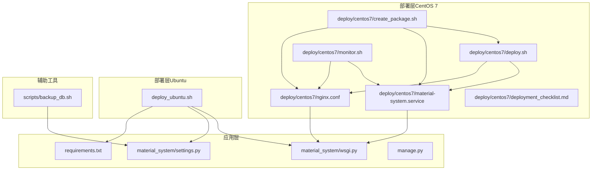
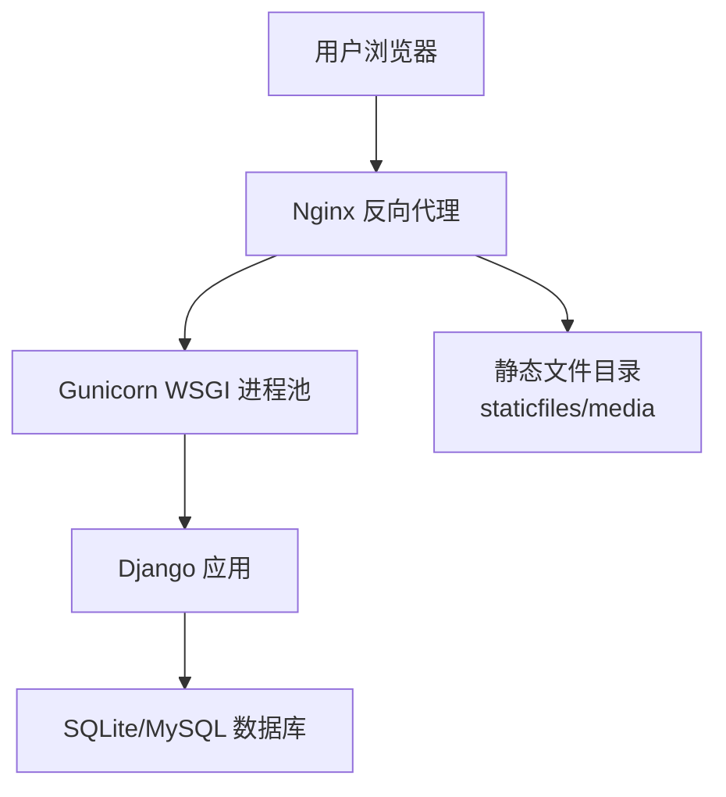
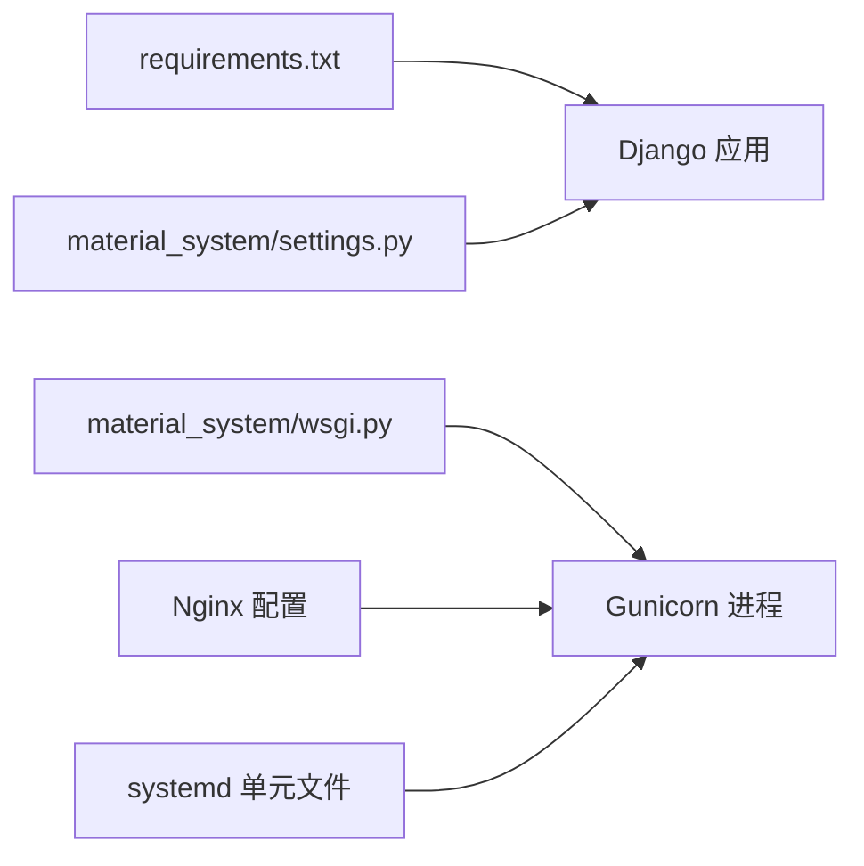
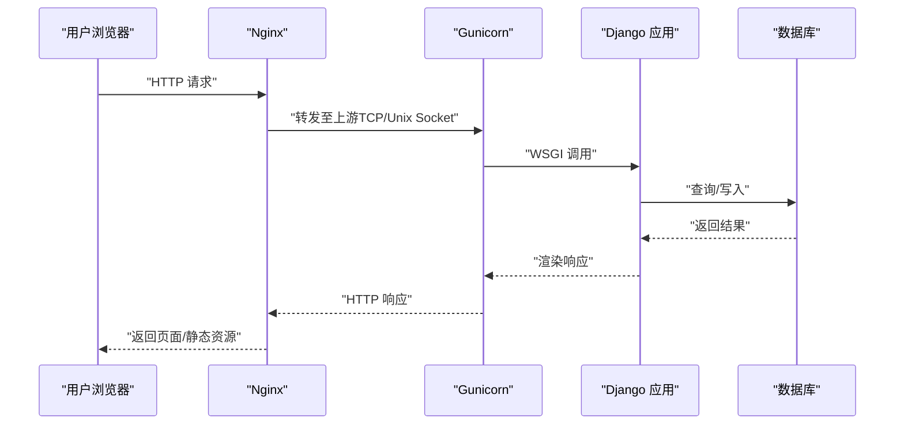
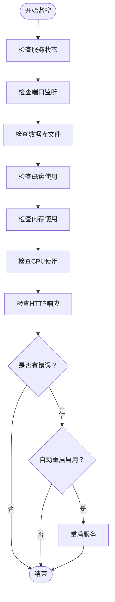

# 服务部署

<cite>
**本文引用的文件**
- [deploy.sh](file://deploy/centos7/deploy.sh)
- [material-system.service](file://deploy/centos7/material-system.service)
- [nginx.conf](file://deploy/centos7/nginx.conf)
- [deploy_ubuntu.sh](file://deploy_ubuntu.sh)
- [wsgi.py](file://material_system/wsgi.py)
- [settings.py](file://material_system/settings.py)
- [requirements.txt](file://requirements.txt)
- [manage.py](file://manage.py)
- [create_package.sh](file://deploy/centos7/create_package.sh)
- [monitor.sh](file://deploy/centos7/monitor.sh)
- [deployment_checklist.md](file://deploy/centos7/deployment_checklist.md)
- [backup_db.sh](file://scripts/backup_db.sh)
</cite>

## 目录
1. [简介](#简介)
2. [项目结构](#项目结构)
3. [核心组件](#核心组件)
4. [架构总览](#架构总览)
5. [详细组件分析](#详细组件分析)
6. [依赖关系分析](#依赖关系分析)
7. [性能考虑](#性能考虑)
8. [故障排查指南](#故障排查指南)
9. [结论](#结论)
10. [附录](#附录)

## 简介
本指南面向运维工程师与系统管理员，提供材料管理系统的完整服务部署方案。内容涵盖：
- Gunicorn WSGI 服务器的安装与配置（进程数量、绑定地址、工作进程管理）
- systemd 服务配置（服务单元文件、自动启动、重启策略）
- Nginx 反向代理配置（静态文件服务、WSGI 应用代理、健康检查）
- CentOS 与 Ubuntu 平台的部署脚本使用方法
- 防火墙配置、SSL 证书配置与安全加固
- 服务启动、停止、重启与状态检查的最佳实践

## 项目结构
该仓库采用“应用 + 部署脚本 + 配置”的组织方式：
- 应用层：Django 项目位于 material_system/，包含 WSGI、settings、urls 等
- 部署层：CentOS 7 与 Ubuntu 的部署脚本及 Nginx 配置
- 配置层：requirements.txt、.env（通过 python-dotenv 加载）等
- 辅助工具：备份脚本、监控脚本、打包脚本

图表来源
- [deploy.sh:1-153](file://deploy/centos7/deploy.sh#L1-L153)
- [material-system.service:1-26](file://deploy/centos7/material-system.service#L1-L26)
- [nginx.conf:1-87](file://deploy/centos7/nginx.conf#L1-L87)
- [deploy_ubuntu.sh:1-205](file://deploy_ubuntu.sh#L1-L205)
- [wsgi.py:1-17](file://material_system/wsgi.py#L1-L17)
- [settings.py:1-210](file://material_system/settings.py#L1-L210)
- [requirements.txt:1-16](file://requirements.txt#L1-L16)
- [manage.py:1-23](file://manage.py#L1-L23)
- [create_package.sh:1-108](file://deploy/centos7/create_package.sh#L1-L108)
- [monitor.sh:1-232](file://deploy/centos7/monitor.sh#L1-L232)
- [deployment_checklist.md:1-182](file://deploy/centos7/deployment_checklist.md#L1-L182)
- [backup_db.sh:1-57](file://scripts/backup_db.sh#L1-L57)

章节来源
- [deploy.sh:1-153](file://deploy/centos7/deploy.sh#L1-L153)
- [deploy_ubuntu.sh:1-205](file://deploy_ubuntu.sh#L1-L205)

## 核心组件
- WSGI 应用入口：Django WSGI 应用由 material_system/wsgi.py 提供，用于 Gunicorn 启动
- 生产配置：material_system/settings.py 通过环境变量加载配置，支持 SQLite/MySQL、日志轮转、国际化与时区
- 依赖管理：requirements.txt 固化了 Django、Gunicorn、PyMySQL、python-dotenv 等依赖
- 管理命令：manage.py 提供 Django 命令行入口，用于迁移、收集静态资源等

章节来源
- [wsgi.py:1-17](file://material_system/wsgi.py#L1-L17)
- [settings.py:1-210](file://material_system/settings.py#L1-L210)
- [requirements.txt:1-16](file://requirements.txt#L1-L16)
- [manage.py:1-23](file://manage.py#L1-L23)

## 架构总览
系统采用 Nginx + Gunicorn + Django 的经典三层架构：
- Nginx 作为反向代理，负责静态文件缓存、请求转发与安全头
- Gunicorn 作为 WSGI 服务器，承载 Django 应用进程
- Django 通过 settings.py 读取环境变量，连接数据库并输出模板

图表来源
- [nginx.conf:1-87](file://deploy/centos7/nginx.conf#L1-L87)
- [material-system.service:1-26](file://deploy/centos7/material-system.service#L1-L26)
- [settings.py:122-130](file://material_system/settings.py#L122-L130)

## 详细组件分析

### Gunicorn WSGI 服务器配置
- 进程数量与绑定地址
  - CentOS 7：systemd 单元文件中使用 TCP 绑定 0.0.0.0:8000，并设置 workers 数量
  - Ubuntu：systemd 单元文件使用 Unix Socket 方式绑定，减少网络开销
- 工作进程管理
  - systemd 的 Restart=always 与 RestartSec=10 实现自动重启
  - 通过 ExecReload 触发 HUP 信号实现优雅重载
- 环境变量
  - CentOS 7：设置 DJANGO_SETTINGS_MODULE、DEBUG=False
  - Ubuntu：通过虚拟环境 PATH 和 settings 指定
- 安全加固
  - PrivateTmp=true、ProtectSystem=strict、ProtectHome=true、ReadWritePaths 限定路径

章节来源
- [material-system.service:1-26](file://deploy/centos7/material-system.service#L1-L26)
- [deploy_ubuntu.sh:138-158](file://deploy_ubuntu.sh#L138-L158)

### systemd 服务配置
- 单元文件要点
  - Type=simple，User/Group 指定非特权用户
  - WorkingDirectory 指向项目根目录
  - Environment 注入运行时变量
  - ExecStart 指定 Gunicorn 启动参数
  - ExecReload 用于热重载
  - Restart=always，RestartSec=10
  - 安全增强字段（NoNewPrivileges、PrivateTmp、ProtectSystem、ProtectHome、ReadWritePaths）
- Ubuntu 特殊点
  - 使用虚拟环境 venv/bin 作为 PATH
  - 使用 Unix Socket 通信，提升性能与安全性

章节来源
- [material-system.service:1-26](file://deploy/centos7/material-system.service#L1-L26)
- [deploy_ubuntu.sh:138-158](file://deploy_ubuntu.sh#L138-L158)

### Nginx 反向代理配置
- 上游与监听
  - upstream 指向本地 Gunicorn（TCP 或 Unix Socket）
  - 监听 80，server_name 指定域名
- 静态文件与媒体文件
  - /static/ 映射至 staticfiles，开启缓存控制
  - /media/ 映射至 media，设置缓存
- WSGI 代理
  - 通过 proxy_pass 转发至上游
  - 设置 X-Real-IP、X-Forwarded-* 头，便于后端识别真实客户端
  - 超时与缓冲参数合理配置
- 健康检查
  - /health/ 返回 200 healthy，便于外部探活
- 安全头
  - X-Frame-Options、X-XSS-Protection、X-Content-Type-Options、Referrer-Policy、Content-Security-Policy
- HTTPS 示例
  - 提供注释化的 443 监听与证书配置段落，以及 80 -> 443 重定向示例

章节来源
- [nginx.conf:1-87](file://deploy/centos7/nginx.conf#L1-L87)

### CentOS 与 Ubuntu 平台部署脚本
- CentOS 7
  - 自动安装依赖（epel、python3、gcc、nginx、firewalld）
  - 创建部署用户 django，安装 Python 依赖（含 gunicorn、pysqlite3）
  - 执行 migrate、collectstatic、创建管理员
  - 配置 systemd 与 Nginx，开放防火墙端口（80、443、8000）
  - 启动服务并验证状态
- Ubuntu
  - 自动安装依赖（python3、pip、venv、git、nginx、redis）
  - 创建虚拟环境，安装 gunicorn、PyMySQL、python-dotenv
  - 生成 production_settings.py，设置安全头与日志
  - 执行 migrate、collectstatic，可交互创建管理员
  - 配置 systemd（Unix Socket）与 Nginx（Unix Socket）
  - 开放防火墙端口（ufw）

章节来源
- [deploy.sh:1-153](file://deploy/centos7/deploy.sh#L1-L153)
- [deploy_ubuntu.sh:1-205](file://deploy_ubuntu.sh#L1-L205)

### 部署包与检查清单
- 部署包
  - create_package.sh 将部署脚本、配置文件、应用代码打包，生成 INSTALL.md 与 VERSION
- 检查清单
  - deployment_checklist.md 提供部署前后检查项、常用命令、故障排查与交付清单

章节来源
- [create_package.sh:1-108](file://deploy/centos7/create_package.sh#L1-L108)
- [deployment_checklist.md:1-182](file://deploy/centos7/deployment_checklist.md#L1-L182)

### 监控与备份
- 监控脚本
  - monitor.sh 检查服务状态、端口监听、数据库文件、磁盘/内存/CPU 使用、HTTP 响应
  - 支持自动重启（通过环境变量开关）
- 备份脚本
  - backup_db.sh 对 SQLite 数据库进行复制备份并压缩，支持按保留天数清理

章节来源
- [monitor.sh:1-232](file://deploy/centos7/monitor.sh#L1-L232)
- [backup_db.sh:1-57](file://scripts/backup_db.sh#L1-L57)

## 依赖关系分析
- 应用与 WSGI
  - Django 通过 WSGI 应用入口启动，WSGI 模块由 material_system/wsgi.py 提供
- 应用与配置
  - settings.py 通过环境变量加载数据库、日志、国际化等配置
- 应用与依赖
  - requirements.txt 固化 Django、Gunicorn、PyMySQL、python-dotenv 等
- 反向代理与应用
  - Nginx 通过 upstream 将请求转发给 Gunicorn（TCP 或 Unix Socket）
- systemd 与应用
  - systemd 单元文件负责启动、重启、重载 Gunicorn，并进行安全限制

图表来源
- [requirements.txt:1-16](file://requirements.txt#L1-L16)
- [wsgi.py:1-17](file://material_system/wsgi.py#L1-L17)
- [settings.py:1-210](file://material_system/settings.py#L1-L210)
- [nginx.conf:1-87](file://deploy/centos7/nginx.conf#L1-L87)
- [material-system.service:1-26](file://deploy/centos7/material-system.service#L1-L26)

章节来源
- [requirements.txt:1-16](file://requirements.txt#L1-L16)
- [wsgi.py:1-17](file://material_system/wsgi.py#L1-L17)
- [settings.py:1-210](file://material_system/settings.py#L1-L210)
- [nginx.conf:1-87](file://deploy/centos7/nginx.conf#L1-L87)
- [material-system.service:1-26](file://deploy/centos7/material-system.service#L1-L26)

## 性能考虑
- 进程与并发
  - Gunicorn workers 数量建议根据 CPU 核心数与内存容量调整，避免过多导致上下文切换开销
  - 使用 Unix Socket 可降低网络开销，适合本地反向代理场景
- 缓存与静态资源
  - Nginx 对 /static/ 与 /media/ 设置长缓存与 immutable 控制，减少带宽与服务器压力
- 超时与缓冲
  - 合理设置 proxy_connect/send/read 超时与缓冲参数，避免慢请求拖垮整体吞吐
- 数据库
  - SQLite 在小规模场景表现良好，若并发较高可考虑 MySQL/PgSQL 并配合连接池

[本节为通用指导，不直接分析具体文件]

## 故障排查指南
- 服务无法启动
  - 检查 systemd 状态与日志：journalctl -u material-system -f
  - 检查端口占用与防火墙：firewall-cmd --list-all 或 ufw status
- 端口无法访问
  - 确认 Nginx 与 Gunicorn 是否监听目标端口
  - 检查 server_name 与域名解析
- 静态文件 404
  - 确认 collectstatic 已执行，Nginx 静态目录映射正确
- 数据库连接失败
  - 检查数据库文件存在与权限，确认数据库引擎与路径配置
- 性能问题
  - 使用 monitor.sh 检查 CPU/内存/磁盘使用，必要时调整 Gunicorn workers 数量
- 备份与恢复
  - 使用 backup_db.sh 执行备份，按需清理过期备份

章节来源
- [deployment_checklist.md:145-159](file://deploy/centos7/deployment_checklist.md#L145-L159)
- [monitor.sh:1-232](file://deploy/centos7/monitor.sh#L1-L232)
- [backup_db.sh:1-57](file://scripts/backup_db.sh#L1-L57)

## 结论
本指南基于仓库内的部署脚本与配置文件，提供了从 CentOS 7 与 Ubuntu 平台到 systemd、Nginx、Gunicorn 的完整部署路径。通过统一的环境变量、安全加固与监控备份机制，系统具备良好的可维护性与可扩展性。建议在生产环境中进一步完善 SSL 证书、日志轮转策略与自动化运维流程。

[本节为总结性内容，不直接分析具体文件]

## 附录

### 服务管理命令（最佳实践）
- CentOS 7
  - 启动/停止/重启/状态：systemctl start/stop/restart/status material-system
  - 开机自启：systemctl enable material-system
  - 查看日志：journalctl -u material-system -f
- Ubuntu
  - 启停/状态与重载：systemctl start/stop/restart/status material-system.service
  - 重载 systemd 配置：systemctl daemon-reload && systemctl restart material-system.service

章节来源
- [deploy.sh:144-152](file://deploy/centos7/deploy.sh#L144-L152)
- [deploy_ubuntu.sh:198-201](file://deploy_ubuntu.sh#L198-L201)

### 防火墙配置
- CentOS 7
  - 开放 HTTP/HTTPS 与应用端口（80、443、8000），并重载规则
- Ubuntu
  - 若启用 ufw，开放 80 与 22 端口

章节来源
- [deploy.sh:106-113](file://deploy/centos7/deploy.sh#L106-L113)
- [deploy_ubuntu.sh:185-190](file://deploy_ubuntu.sh#L185-L190)

### SSL 证书配置与安全加固
- SSL 证书
  - Nginx 配置中提供注释化的 443 监听与证书配置段落，以及 80 -> 443 重定向示例
- 安全加固
  - systemd 安全字段（NoNewPrivileges、PrivateTmp、ProtectSystem、ProtectHome、ReadWritePaths）
  - Nginx 安全头（X-Frame-Options、X-XSS-Protection、X-Content-Type-Options、Referrer-Policy、Content-Security-Policy）
  - Django 生产配置（DEBUG=False、安全 Cookie、HSTS、X-Frame-Options）

章节来源
- [nginx.conf:68-87](file://deploy/centos7/nginx.conf#L68-L87)
- [material-system.service:18-24](file://deploy/centos7/material-system.service#L18-L24)
- [settings.py:94-103](file://material_system/settings.py#L94-L103)

### Gunicorn 参数与调优建议
- 进程数量
  - 通常设置为 CPU 核心数 × 2 + 1，结合内存与业务特性微调
- 绑定方式
  - 本地反向代理优先使用 Unix Socket，减少网络开销
- 超时与 keep-alive
  - 根据业务响应时间设置 timeout 与 keep-alive，避免无效连接占用
- 优雅重载
  - 使用 ExecReload 触发 HUP，实现零停机热重载

章节来源
- [material-system.service:13-16](file://deploy/centos7/material-system.service#L13-L16)
- [deploy_ubuntu.sh:149-150](file://deploy_ubuntu.sh#L149-L150)

### Nginx 代理流程（序列图）

图表来源
- [nginx.conf:33-52](file://deploy/centos7/nginx.conf#L33-L52)
- [material-system.service:13-13](file://deploy/centos7/material-system.service#L13-L13)

### 监控流程（流程图）

图表来源
- [monitor.sh:149-173](file://deploy/centos7/monitor.sh#L149-L173)