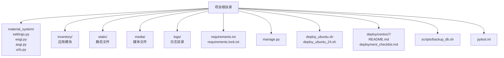
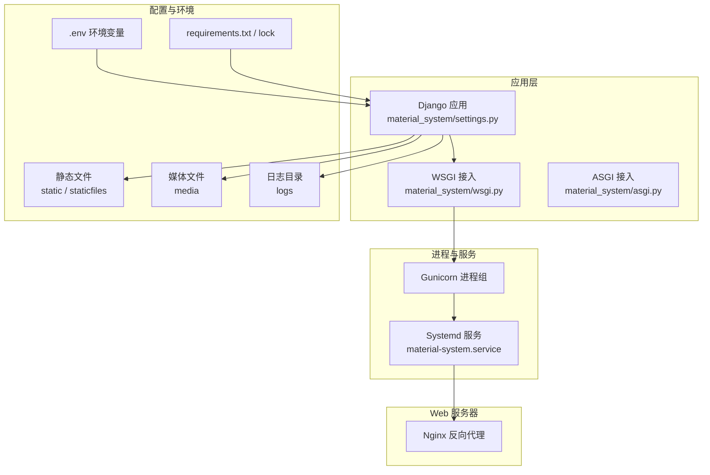
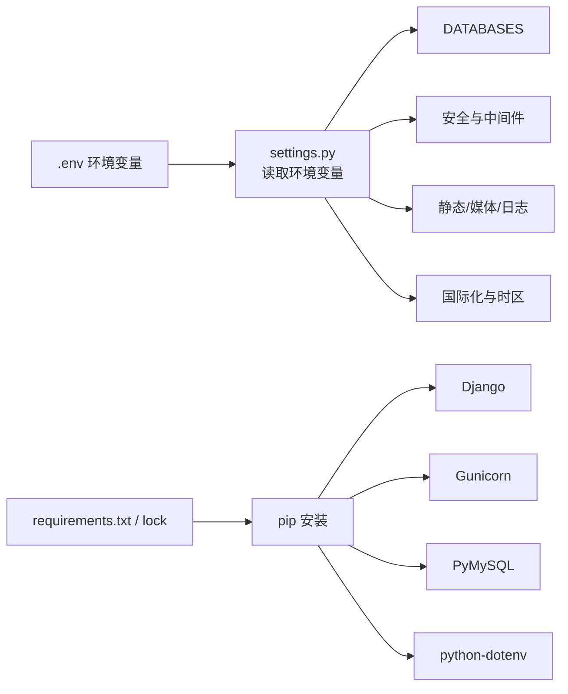

# 环境配置

<cite>
**本文引用的文件**
- [material_system/settings.py](file://material_system/settings.py)
- [requirements.txt](file://requirements.txt)
- [requirements.lock.txt](file://requirements.lock.txt)
- [manage.py](file://manage.py)
- [deploy_ubuntu.sh](file://deploy_ubuntu.sh)
- [deploy_ubuntu_24.sh](file://deploy_ubuntu_24.sh)
- [deploy/centos7/README.md](file://deploy/centos7/README.md)
- [deploy/centos7/deployment_checklist.md](file://deploy/centos7/deployment_checklist.md)
- [scripts/backup_db.sh](file://scripts/backup_db.sh)
- [pytest.ini](file://pytest.ini)
- [material_system/wsgi.py](file://material_system/wsgi.py)
- [material_system/asgi.py](file://material_system/asgi.py)
- [material_system/urls.py](file://material_system/urls.py)
</cite>

## 目录
1. [简介](#简介)
2. [项目结构](#项目结构)
3. [核心组件](#核心组件)
4. [架构总览](#架构总览)
5. [详细组件分析](#详细组件分析)
6. [依赖分析](#依赖分析)
7. [性能考虑](#性能考虑)
8. [故障排查指南](#故障排查指南)
9. [结论](#结论)
10. [附录](#附录)

## 简介
本指南面向材料管理系统的开发与生产环境配置，覆盖以下内容：
- 开发与生产环境差异、Python 版本与系统依赖、虚拟环境创建
- Django 设置项详解（DEBUG、ALLOWED_HOSTS、SECRET_KEY、静态/媒体/日志、数据库、国际化与时区）
- requirements.txt 的管理与版本锁定策略
- 环境变量与 .env 的使用
- 不同操作系统（Ubuntu、CentOS 7）的环境准备与注意事项

## 项目结构
该系统采用标准 Django 项目布局，关键配置集中在 settings.py 中，并通过环境变量进行差异化配置。部署脚本提供了 Ubuntu 与 CentOS 7 的自动化安装与服务配置。

图表来源
- [material_system/settings.py:1-210](file://material_system/settings.py#L1-L210)
- [requirements.txt:1-16](file://requirements.txt#L1-L16)
- [requirements.lock.txt:1-13](file://requirements.lock.txt#L1-L13)
- [manage.py:1-23](file://manage.py#L1-L23)
- [deploy_ubuntu.sh:1-205](file://deploy_ubuntu.sh#L1-L205)
- [deploy_ubuntu_24.sh:1-179](file://deploy_ubuntu_24.sh#L1-L179)
- [deploy/centos7/README.md:1-181](file://deploy/centos7/README.md#L1-L181)
- [deploy/centos7/deployment_checklist.md:1-182](file://deploy/centos7/deployment_checklist.md#L1-L182)
- [scripts/backup_db.sh:1-57](file://scripts/backup_db.sh#L1-L57)
- [pytest.ini:1-10](file://pytest.ini#L1-L10)

章节来源
- [material_system/settings.py:1-210](file://material_system/settings.py#L1-L210)
- [requirements.txt:1-16](file://requirements.txt#L1-L16)
- [requirements.lock.txt:1-13](file://requirements.lock.txt#L1-L13)
- [manage.py:1-23](file://manage.py#L1-L23)
- [deploy_ubuntu.sh:1-205](file://deploy_ubuntu.sh#L1-L205)
- [deploy_ubuntu_24.sh:1-179](file://deploy_ubuntu_24.sh#L1-L179)
- [deploy/centos7/README.md:1-181](file://deploy/centos7/README.md#L1-L181)
- [deploy/centos7/deployment_checklist.md:1-182](file://deploy/centos7/deployment_checklist.md#L1-L182)
- [scripts/backup_db.sh:1-57](file://scripts/backup_db.sh#L1-L57)
- [pytest.ini:1-10](file://pytest.ini#L1-L10)

## 核心组件
- Django 设置加载与环境变量注入：settings.py 在启动时加载 .env 并从环境变量读取关键配置。
- 数据库配置：默认使用 SQLite，支持通过环境变量切换至 MySQL/PgSQL。
- 静态与媒体文件：静态文件目录与收集路径、媒体文件根路径。
- 日志配置：Django 日志与应用日志的轮转策略。
- 国际化与时区：语言与时区默认值可由环境变量覆盖。
- 管理命令入口：manage.py 指定默认 settings 模块。

章节来源
- [material_system/settings.py:69-210](file://material_system/settings.py#L69-L210)
- [manage.py:7-18](file://manage.py#L7-L18)

## 架构总览
下图展示了 Django 进程、WSGI 应用、Gunicorn、Nginx 与系统服务的关系，以及环境变量与配置文件的交互。

图表来源
- [material_system/settings.py:69-210](file://material_system/settings.py#L69-L210)
- [material_system/wsgi.py:10-16](file://material_system/wsgi.py#L10-L16)
- [material_system/asgi.py:10-16](file://material_system/asgi.py#L10-L16)
- [deploy_ubuntu.sh:139-158](file://deploy_ubuntu.sh#L139-L158)
- [deploy_ubuntu_24.sh:102-121](file://deploy_ubuntu_24.sh#L102-L121)

## 详细组件分析

### 开发与生产环境配置差异
- 开发环境
  - DEBUG 默认开启，便于调试与模板渲染错误展示
  - ALLOWED_HOSTS 默认允许所有主机，便于本地联调
  - SECRET_KEY 使用默认值，仅用于开发场景
  - 静态与媒体文件路径按本地开发习惯配置
  - 日志级别 INFO，便于排错
- 生产环境
  - 通过独立的 production_settings 或 .env 控制 DEBUG=False、ALLOWED_HOSTS 限定域名/IP、安全 Cookie 与 HSTS 等
  - 收集静态文件至 staticfiles 并启用 Manifest 静态文件存储
  - 日志落盘文件处理器，配合轮转策略

章节来源
- [material_system/settings.py:69-210](file://material_system/settings.py#L69-L210)
- [deploy_ubuntu.sh:75-121](file://deploy_ubuntu.sh#L75-L121)
- [deploy_ubuntu_24.sh:74-88](file://deploy_ubuntu_24.sh#L74-L88)

### Python 版本与系统依赖
- Ubuntu 20.04/22.04
  - 系统依赖：python3、python3-pip、python3-venv、git、nginx、redis-server
  - 开发包：python3-dev、default-libmysqlclient-dev、build-essential、pkg-config
  - 运行时：gunicorn、pymysql、python-dotenv
- Ubuntu 24.04
  - 系统依赖：python3、python3-pip、python3-venv、git、nginx、redis-server
  - 开发包：python3-dev、build-essential、pkg-config、libssl-dev
  - 运行时：gunicorn、pymysql、python-dotenv
- CentOS 7
  - Python 3.8+、pip3、gcc、gcc-c++、make、sqlite-devel
  - 可选：pysqlite3 解决 SQLite 版本兼容性问题
  - Web：gunicorn、nginx

章节来源
- [deploy_ubuntu.sh:34-41](file://deploy_ubuntu.sh#L34-L41)
- [deploy_ubuntu_24.sh:34-41](file://deploy_ubuntu_24.sh#L34-L41)
- [deploy/centos7/README.md:11-20](file://deploy/centos7/README.md#L11-L20)
- [deploy/centos7/README.md:41-42](file://deploy/centos7/README.md#L41-L42)

### 虚拟环境创建与激活
- 使用 python3 -m venv 创建虚拟环境
- 激活后升级 pip，安装 gunicorn、pymysql、python-dotenv
- 若存在 requirements.txt，使用 pip install -r requirements.txt 安装依赖
- Ubuntu 24 脚本会生成并填充 .env 示例文件（含 SECRET_KEY 与 DEBUG）

章节来源
- [deploy_ubuntu.sh:60-73](file://deploy_ubuntu.sh#L60-L73)
- [deploy_ubuntu_24.sh:60-72](file://deploy_ubuntu_24.sh#L60-L72)

### Django 设置详解
- 环境变量注入
  - 通过 python-dotenv 加载 .env，从环境变量读取 SECRET_KEY、DEBUG、ALLOWED_HOSTS、DB_ENGINE、DB_NAME、LANGUAGE_CODE、TIME_ZONE
- 安全与中间件
  - CSRF、Session Cookie 安全标志位、HSTS、X-Frame-Options 等
- 数据库
  - 默认 SQLite，NAME 指向项目根目录 db.sqlite3；可通过环境变量切换为 MySQL（PyMySQL）
- 静态与媒体
  - STATIC_URL/STATIC_ROOT/STATICFILES_DIRS、MEDIA_URL/MEDIA_ROOT
- 日志
  - RotatingFileHandler，分别记录 INFO 与 ERROR 级别日志
- 国际化与时区
  - LANGUAGE_CODE、TIME_ZONE 默认 zh-hans、Asia/Shanghai，可覆盖
- 登录与重定向
  - LOGIN_URL、LOGIN_REDIRECT_URL、LOGOUT_REDIRECT_URL

章节来源
- [material_system/settings.py:69-210](file://material_system/settings.py#L69-L210)

### 静态文件与媒体文件配置
- 开发：DEBUG=True 时，自动挂载 MEDIA 静态路由
- 生产：collectstatic 收集至 staticfiles，Nginx 代理静态目录
- 媒体文件：media 目录用于上传文件，需确保目录存在且可写

章节来源
- [material_system/settings.py:141-146](file://material_system/settings.py#L141-L146)
- [material_system/urls.py:11-12](file://material_system/urls.py#L11-L12)
- [deploy_ubuntu.sh:127-128](file://deploy_ubuntu.sh#L127-L128)
- [deploy_ubuntu_24.sh:90-91](file://deploy_ubuntu_24.sh#L90-L91)

### 数据库连接配置
- 默认 SQLite：NAME 指向项目根目录 db.sqlite3
- MySQL：安装 PyMySQL 后，通过环境变量 DB_ENGINE 与 DB_NAME 指定
- SQLite 兼容性：settings.py 中对 pysqlite3 的补丁与版本检查，避免 getlimit 相关问题

章节来源
- [material_system/settings.py:122-130](file://material_system/settings.py#L122-L130)
- [material_system/settings.py:14-62](file://material_system/settings.py#L14-L62)

### 日志配置
- INFO 日志：logs/django.log，轮转大小 10MB，保留 5 份
- ERROR 日志：logs/error.log，轮转大小 10MB，保留 5 份
- 根日志器与应用日志器（inventory）分离

章节来源
- [material_system/settings.py:148-203](file://material_system/settings.py#L148-L203)

### 环境变量与 .env 使用
- 开发：.env 示例文件未随仓库提交，需手动创建；DEBUG 默认 True，ALLOWED_HOSTS 默认 *
- 生产：Ubuntu 24 脚本会生成 .env 示例并填充 SECRET_KEY 与 DEBUG=False；Ubuntu 20/22 脚本通过临时文件注入生产配置
- 常用键：SECRET_KEY、DEBUG、ALLOWED_HOSTS、DB_ENGINE、DB_NAME、LANGUAGE_CODE、TIME_ZONE

章节来源
- [material_system/settings.py:69-72](file://material_system/settings.py#L69-L72)
- [deploy_ubuntu_24.sh:78-83](file://deploy_ubuntu_24.sh#L78-L83)
- [deploy_ubuntu.sh:80-88](file://deploy_ubuntu.sh#L80-L88)

### requirements.txt 与版本锁定
- requirements.txt：项目运行所需依赖列表
- requirements.lock.txt：锁定版本清单（用于 CI/CD 或一致性部署）
- 生成策略：部署脚本在安装后执行 pip freeze > requirements.txt，保持与当前环境一致

章节来源
- [requirements.txt:1-16](file://requirements.txt#L1-16)
- [requirements.lock.txt:1-13](file://requirements.lock.txt#L1-13)
- [deploy_ubuntu.sh:72-73](file://deploy_ubuntu.sh#L72-L73)
- [deploy_ubuntu_24.sh:71-72](file://deploy_ubuntu_24.sh#L71-L72)

### 不同操作系统环境准备与注意事项
- Ubuntu
  - 20/22：default-libmysqlclient-dev 用于 MySQL 编译依赖
  - 24.04：libssl-dev 用于 OpenSSL 相关编译
  - 建议使用 systemd + gunicorn + nginx
- CentOS 7
  - Python 3.8+，gcc/g++/make，sqlite-devel
  - 可选安装 pysqlite3 解决 SQLite 版本兼容问题
  - 支持 systemd + gunicorn + nginx

章节来源
- [deploy_ubuntu.sh:34-41](file://deploy_ubuntu.sh#L34-L41)
- [deploy_ubuntu_24.sh:34-41](file://deploy_ubuntu_24.sh#L34-L41)
- [deploy/centos7/README.md:11-20](file://deploy/centos7/README.md#L11-L20)
- [deploy/centos7/README.md:41-42](file://deploy/centos7/README.md#L41-L42)

## 依赖分析
下图展示 Django 设置与外部依赖的关系，以及环境变量对配置的影响。

图表来源
- [material_system/settings.py:69-210](file://material_system/settings.py#L69-L210)
- [requirements.txt:1-16](file://requirements.txt#L1-16)
- [requirements.lock.txt:1-13](file://requirements.lock.txt#L1-13)

章节来源
- [material_system/settings.py:69-210](file://material_system/settings.py#L69-L210)
- [requirements.txt:1-16](file://requirements.txt#L1-L16)
- [requirements.lock.txt:1-13](file://requirements.lock.txt#L1-L13)

## 性能考虑
- 静态文件：生产环境启用 ManifestStaticFilesStorage，结合 Nginx 缓存头（expires）提升缓存命中率
- 日志轮转：INFO/ERROR 分离，避免单文件过大
- 数据库：SQLite 适合小规模数据；生产建议使用 MySQL/PgSQL 并合理设置连接池与超时
- 进程模型：Gunicorn 默认多进程模型，结合 systemd 的 Restart 策略提升稳定性

[本节为通用指导，不直接分析具体文件]

## 故障排查指南
- 服务与进程
  - Ubuntu：systemctl status material-system、journalctl -u material-system -f
  - CentOS：systemctl status material-system、journalctl -u material-system -f
- 端口与代理
  - 检查 Nginx 配置与端口监听，必要时 nginx -t 与 systemctl reload nginx
- 数据库
  - SQLite：确认 db.sqlite3 存在与权限；可使用 scripts/backup_db.sh 执行备份
  - MySQL：确认 PyMySQL 安装与 DB_* 环境变量
- 日志
  - logs/django.log 与 logs/error.log，INFO/ERROR 分类查看
- 单元测试
  - pytest.ini 已指定 DJANGO_SETTINGS_MODULE，可直接运行 pytest

章节来源
- [deploy_ubuntu.sh:192-204](file://deploy_ubuntu.sh#L192-L204)
- [deploy/centos7/README.md:144-153](file://deploy/centos7/README.md#L144-L153)
- [scripts/backup_db.sh:1-57](file://scripts/backup_db.sh#L1-L57)
- [pytest.ini:1-10](file://pytest.ini#L1-L10)

## 结论
- 开发与生产环境的关键差异在于安全与性能配置（DEBUG、ALLOWED_HOSTS、Cookie 安全、HSTS、静态文件收集与缓存）
- 通过 .env 与环境变量实现零代码变更的配置切换
- 依赖管理建议使用 requirements.txt 与 requirements.lock.txt 双轨策略，确保一致性
- 不同操作系统在系统依赖与包管理上略有差异，但均可通过 systemd + gunicorn + nginx 实现稳定部署

[本节为总结性内容，不直接分析具体文件]

## 附录

### 环境变量清单与默认值
- SECRET_KEY：从 .env 读取，生产环境务必覆盖
- DEBUG：从 .env 读取，默认 True（开发）
- ALLOWED_HOSTS：从 .env 读取，默认 *（开发）
- DB_ENGINE：数据库引擎，默认 sqlite3（可改为 mysql）
- DB_NAME：数据库文件或名称，默认 db.sqlite3
- LANGUAGE_CODE：语言，默认 zh-hans
- TIME_ZONE：时区，默认 Asia/Shanghai

章节来源
- [material_system/settings.py:69-72](file://material_system/settings.py#L69-L72)
- [material_system/settings.py:122-130](file://material_system/settings.py#L122-L130)
- [material_system/settings.py:136-139](file://material_system/settings.py#L136-L139)

### 部署脚本与服务配置要点
- Ubuntu 20/22：生成生产配置文件 production_settings.py，收集静态文件，配置 systemd 与 nginx
- Ubuntu 24：生成 .env 示例并填充 SECRET_KEY 与 DEBUG=False，收集静态文件，配置 systemd 与 nginx
- CentOS 7：提供 systemd 与 nginx 配置示例，支持 pysqlite3 兼容性

章节来源
- [deploy_ubuntu.sh:75-121](file://deploy_ubuntu.sh#L75-L121)
- [deploy_ubuntu_24.sh:74-99](file://deploy_ubuntu_24.sh#L74-L99)
- [deploy/centos7/README.md:78-133](file://deploy/centos7/README.md#L78-L133)