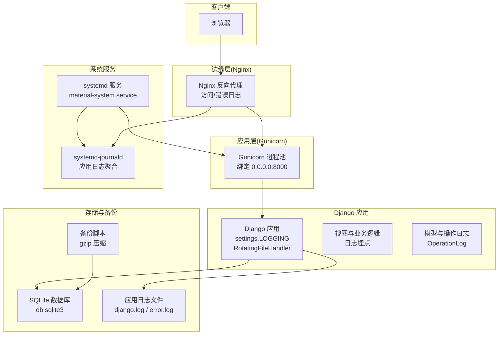
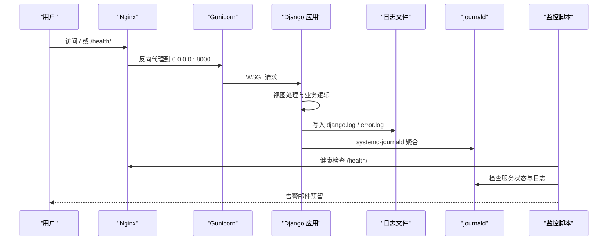
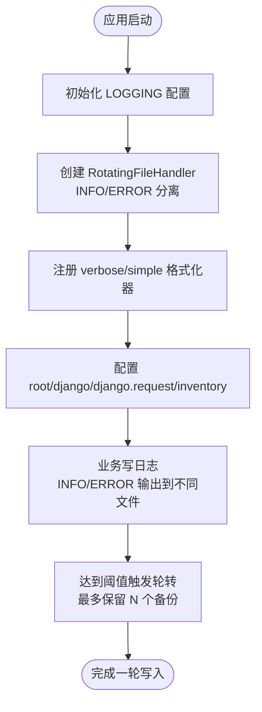
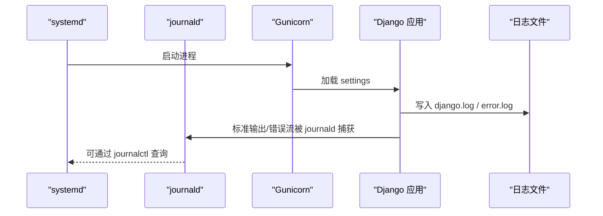
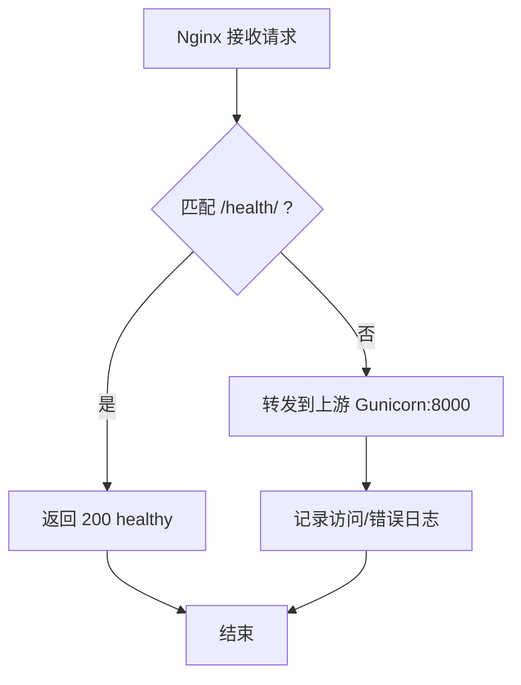
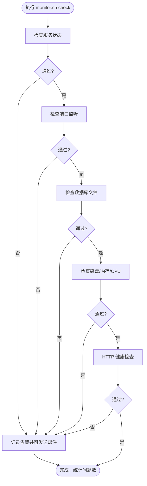
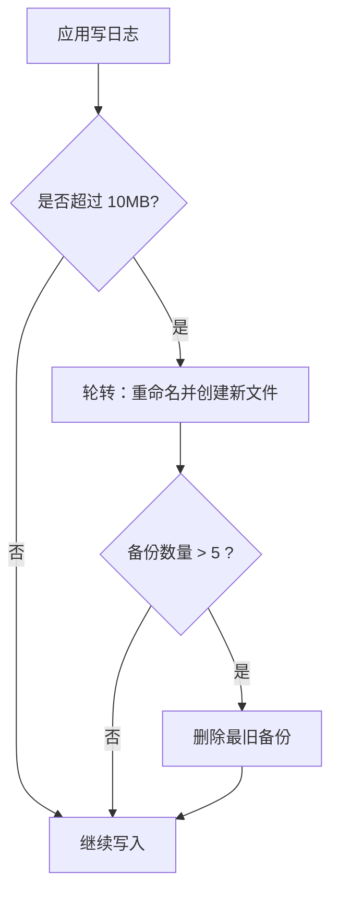
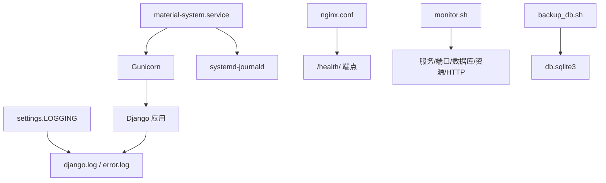

# 监控与日志

<cite>
**本文引用的文件**
- [material_system/settings.py](file://material_system/settings.py)
- [deploy/centos7/material-system.service](file://deploy/centos7/material-system.service)
- [deploy/centos7/nginx.conf](file://deploy/centos7/nginx.conf)
- [deploy/centos7/monitor.sh](file://deploy/centos7/monitor.sh)
- [deploy/centos7/deployment_checklist.md](file://deploy/centos7/deployment_checklist.md)
- [scripts/backup_db.sh](file://scripts/backup_db.sh)
- [inventory/views.py](file://inventory/views.py)
- [inventory/models.py](file://inventory/models.py)
- [manage.py](file://manage.py)
</cite>

## 目录
1. [简介](#简介)
2. [项目结构](#项目结构)
3. [核心组件](#核心组件)
4. [架构总览](#架构总览)
5. [详细组件分析](#详细组件分析)
6. [依赖分析](#依赖分析)
7. [性能考虑](#性能考虑)
8. [故障排查指南](#故障排查指南)
9. [结论](#结论)
10. [附录](#附录)

## 简介
本指南面向材料管理系统运维与开发团队，围绕“监控与日志”主题，系统阐述以下内容：
- Django 日志配置：日志级别、处理器、格式化器
- 系统日志收集与管理：systemd-journald、应用日志文件、Nginx 访问/错误日志、监控脚本日志
- 性能监控指标：响应时间、内存使用、CPU 占用、并发连接数
- 日志轮转：大小限制、保留策略、压缩归档
- 告警机制与通知：异常检测、阈值设置、邮件通知
- 故障诊断工具与调试技巧，以及常见问题的日志分析方法

## 项目结构
本项目采用 Django + Gunicorn + Nginx 的生产部署架构，日志与监控由多处配置共同构成：
- Django 应用日志：通过 settings 中的 LOGGING 配置输出到本地文件，并按大小轮转
- systemd 服务：通过 material-system.service 启动 Gunicorn，结合 journald 收集应用日志
- Nginx：反向代理与静态资源分发，独立产生访问/错误日志
- 监控脚本：monitor.sh 对服务状态、端口监听、数据库、磁盘、内存、CPU、HTTP 健康端点进行巡检与告警
- 备份脚本：backup_db.sh 实现数据库备份、压缩与过期清理

**图表来源**
- [deploy/centos7/nginx.conf](file://deploy/centos7/nginx.conf#L4)
- [deploy/centos7/material-system.service](file://deploy/centos7/material-system.service#L13)
- [material_system/settings.py:149-203](file://material_system/settings.py#L149-L203)
- [scripts/backup_db.sh:32-46](file://scripts/backup_db.sh#L32-L46)

**章节来源**
- [deploy/centos7/nginx.conf:1-87](file://deploy/centos7/nginx.conf#L1-L87)
- [deploy/centos7/material-system.service:1-26](file://deploy/centos7/material-system.service#L1-L26)
- [material_system/settings.py:65-203](file://material_system/settings.py#L65-L203)
- [scripts/backup_db.sh:1-57](file://scripts/backup_db.sh#L1-L57)

## 核心组件
- Django 日志配置（settings.LOGGING）
  - 使用 RotatingFileHandler，分别输出 INFO 级别到 django.log，ERROR 级别到 error.log
  - 根日志器与 django、django.request、inventory 应用日志器分别配置
  - 格式化器包含 verbose 与 simple 两种
- systemd 服务与 journald
  - material-system.service 以 Gunicorn 启动 Django 应用
  - systemd-journald 自动收集服务输出，便于集中查看与检索
- Nginx 日志
  - 访问日志与错误日志独立输出，便于前端请求与后端异常分离定位
- 监控脚本 monitor.sh
  - 检查服务状态、端口监听、数据库文件、磁盘、内存、CPU、HTTP 健康端点
  - 支持自动重启与告警（邮件发送预留）
- 备份脚本 backup_db.sh
  - 复制数据库文件进行备份，压缩并按保留天数清理

**章节来源**
- [material_system/settings.py:149-203](file://material_system/settings.py#L149-L203)
- [deploy/centos7/material-system.service](file://deploy/centos7/material-system.service#L13)
- [deploy/centos7/nginx.conf:54-65](file://deploy/centos7/nginx.conf#L54-L65)
- [deploy/centos7/monitor.sh:32-129](file://deploy/centos7/monitor.sh#L32-L129)
- [scripts/backup_db.sh:28-52](file://scripts/backup_db.sh#L28-L52)

## 架构总览
下图展示从客户端到应用、日志与监控的整体链路：

**图表来源**
- [deploy/centos7/nginx.conf:34-52](file://deploy/centos7/nginx.conf#L34-L52)
- [deploy/centos7/material-system.service](file://deploy/centos7/material-system.service#L13)
- [material_system/settings.py:149-203](file://material_system/settings.py#L149-L203)
- [deploy/centos7/monitor.sh:116-129](file://deploy/centos7/monitor.sh#L116-L129)

## 详细组件分析

### Django 日志配置与轮转
- 日志级别
  - 根日志器与 django 日志器：INFO
  - django.request 日志器：ERROR
  - inventory 应用日志器：INFO
- 处理器
  - RotatingFileHandler：按大小轮转，UTF-8 编码
  - django.log：最大 10MB，保留 5 个备份
  - error.log：最大 10MB，保留 5 个备份
- 格式化器
  - verbose：包含级别、时间、模块、进程、线程、消息
  - simple：包含级别、时间、消息
- 日志目录
  - 自动创建 logs 目录，位于项目根目录

**图表来源**
- [material_system/settings.py:149-203](file://material_system/settings.py#L149-L203)

**章节来源**
- [material_system/settings.py:65-67](file://material_system/settings.py#L65-L67)
- [material_system/settings.py:149-203](file://material_system/settings.py#L149-L203)

### systemd-journald 与应用日志
- systemd 服务
  - material-system.service 使用 Gunicorn 启动 WSGI 应用
  - 环境变量包含 DJANGO_SETTINGS_MODULE、DEBUG 等
- journald 聚合
  - 通过 journalctl -u material-system -f 实时查看应用日志
  - 与 Django LOGGING 配置互补，便于统一检索

**图表来源**
- [deploy/centos7/material-system.service](file://deploy/centos7/material-system.service#L13)
- [material_system/settings.py:149-203](file://material_system/settings.py#L149-L203)

**章节来源**
- [deploy/centos7/material-system.service:5-23](file://deploy/centos7/material-system.service#L5-L23)
- [deploy/centos7/deployment_checklist.md:111-111](file://deploy/centos7/deployment_checklist.md#L111-L111)

### Nginx 日志与健康检查
- 访问日志与错误日志
  - 访问日志路径与错误页配置，便于前端请求与后端异常分离定位
- 健康检查端点
  - /health/ 返回 200 healthy，供 monitor.sh 与外部探针检查
- 超时与缓冲
  - proxy_connect_timeout、proxy_send_timeout、proxy_read_timeout
  - proxy_buffering、proxy_buffer_size、proxy_buffers、proxy_busy_buffers_size

**图表来源**
- [deploy/centos7/nginx.conf:54-65](file://deploy/centos7/nginx.conf#L54-L65)
- [deploy/centos7/nginx.conf:34-52](file://deploy/centos7/nginx.conf#L34-L52)

**章节来源**
- [deploy/centos7/nginx.conf:1-87](file://deploy/centos7/nginx.conf#L1-L87)

### 监控脚本与告警机制
- 检查项
  - 服务状态、端口监听、数据库文件、磁盘空间、内存使用、CPU 使用、HTTP 健康检查
- 告警
  - send_alert 函数预留邮件发送；当前记录到本地监控日志
- 自动重启
  - 可通过环境变量 AUTO_RESTART=true 启用自动重启

**图表来源**
- [deploy/centos7/monitor.sh:32-129](file://deploy/centos7/monitor.sh#L32-L129)

**章节来源**
- [deploy/centos7/monitor.sh:1-232](file://deploy/centos7/monitor.sh#L1-L232)
- [deploy/centos7/deployment_checklist.md:134-143](file://deploy/centos7/deployment_checklist.md#L134-L143)

### 日志轮转与保留策略
- Django 应用日志
  - 单文件最大 10MB，保留 5 个备份
  - UTF-8 编码，避免中文乱码
- 备份脚本
  - 复制数据库文件进行备份，压缩为 .gz
  - 可配置保留天数（默认 30 天），到期自动清理

**图表来源**
- [material_system/settings.py:162-180](file://material_system/settings.py#L162-L180)
- [scripts/backup_db.sh:32-46](file://scripts/backup_db.sh#L32-L46)

**章节来源**
- [material_system/settings.py:162-180](file://material_system/settings.py#L162-L180)
- [scripts/backup_db.sh:32-52](file://scripts/backup_db.sh#L32-L52)

### 告警阈值与通知配置
- 阈值建议
  - 磁盘使用率：>90%
  - 内存使用率：>85%
  - CPU 使用率：>80%
  - 端口监听：8000 未监听
  - HTTP 健康检查：超时或无响应
- 通知
  - monitor.sh 预留 send_alert，当前记录到本地日志
  - 可在 send_alert 中集成邮件发送命令

**章节来源**
- [deploy/centos7/monitor.sh:71-129](file://deploy/centos7/monitor.sh#L71-L129)

### 性能监控指标
- 响应时间
  - Nginx 层面：通过 access.log 的请求耗时字段（需开启相应格式）与 /health/ 健康检查
- 内存使用
  - monitor.sh 使用 free 获取内存使用百分比
- CPU 占用
  - monitor.sh 使用 top/uptime 获取 CPU 使用率
- 并发连接数
  - Nginx upstream 连接数与 Gunicorn worker 数量（服务配置中 workers 参数）

**章节来源**
- [deploy/centos7/nginx.conf:43-51](file://deploy/centos7/nginx.conf#L43-L51)
- [deploy/centos7/material-system.service](file://deploy/centos7/material-system.service#L13)
- [deploy/centos7/monitor.sh:85-114](file://deploy/centos7/monitor.sh#L85-L114)

### 故障诊断工具与调试技巧
- 日志查看
  - 应用日志：journalctl -u material-system -f
  - Nginx 访问/错误日志：tail -f /var/log/nginx/access.log /var/log/nginx/error.log
  - 监控脚本日志：tail -f /var/log/material_system_monitor.log
- 健康检查
  - curl http://localhost:8000/health/ 验证后端可用性
- 服务管理
  - systemctl start/stop/restart material-system 与 nginx
- 数据库与备份
  - 备份：./scripts/backup_db.sh
  - 清理：按保留天数自动清理旧备份

**章节来源**
- [deploy/centos7/deployment_checklist.md:108-143](file://deploy/centos7/deployment_checklist.md#L108-L143)
- [deploy/centos7/monitor.sh:175-189](file://deploy/centos7/monitor.sh#L175-L189)
- [scripts/backup_db.sh:28-52](file://scripts/backup_db.sh#L28-L52)

## 依赖分析
- 组件耦合
  - Django LOGGING 与文件系统耦合，受 logs 目录权限影响
  - systemd 服务与 journald 强耦合，便于统一日志采集
  - Nginx 与上游 Gunicorn 强耦合，健康检查端点决定可用性
- 外部依赖
  - systemd、journald、gunicorn、nginx、curl、netstat、free、top、df 等系统工具

**图表来源**
- [material_system/settings.py:149-203](file://material_system/settings.py#L149-L203)
- [deploy/centos7/material-system.service](file://deploy/centos7/material-system.service#L13)
- [deploy/centos7/nginx.conf:54-65](file://deploy/centos7/nginx.conf#L54-L65)
- [deploy/centos7/monitor.sh:32-129](file://deploy/centos7/monitor.sh#L32-L129)
- [scripts/backup_db.sh:32-46](file://scripts/backup_db.sh#L32-L46)

**章节来源**
- [material_system/settings.py:149-203](file://material_system/settings.py#L149-L203)
- [deploy/centos7/material-system.service](file://deploy/centos7/material-system.service#L13)
- [deploy/centos7/nginx.conf:54-65](file://deploy/centos7/nginx.conf#L54-L65)
- [deploy/centos7/monitor.sh:32-129](file://deploy/centos7/monitor.sh#L32-L129)
- [scripts/backup_db.sh:32-46](file://scripts/backup_db.sh#L32-L46)

## 性能考虑
- 日志写入
  - RotatingFileHandler 顺序写入，注意磁盘 I/O；建议将 logs 目录置于高性能磁盘
- 轮转策略
  - 10MB 大小与 5 个备份适合中小规模应用；高并发场景可考虑更小轮转阈值或集中日志系统
- Nginx 与 Gunicorn
  - 合理设置 worker 数量与缓冲参数，避免内存与 CPU 峰值过高
- 健康检查
  - /health/ 端点轻量实现，避免对主业务造成压力

## 故障排查指南
- 服务无法启动
  - 检查 journalctl -u material-system -f 与 gunicorn 启动参数
  - 确认 DJANGO_SETTINGS_MODULE 与 DEBUG 环境变量
- 端口无法访问
  - 检查 netstat -tlnp | grep :8000 与防火墙规则
  - 确认 Nginx upstream 指向正确
- 数据库连接失败
  - 检查 db.sqlite3 文件存在与权限
  - 使用 sqlite3 命令验证数据库完整性
- 静态文件 404
  - 确认 collectstatic 已执行与 Nginx alias 路径正确
- 内存/CPU 占用过高
  - 使用 monitor.sh info 查看资源使用，调整 Gunicorn worker 数量与 Nginx 缓冲参数

**章节来源**
- [deploy/centos7/deployment_checklist.md:145-159](file://deploy/centos7/deployment_checklist.md#L145-L159)
- [deploy/centos7/monitor.sh:175-189](file://deploy/centos7/monitor.sh#L175-L189)
- [deploy/centos7/nginx.conf:19-31](file://deploy/centos7/nginx.conf#L19-L31)

## 结论
本指南基于现有配置，给出了材料管理系统的监控与日志管理实践方案。通过 Django LOGGING、systemd-journald、Nginx 日志与 monitor.sh 的协同，实现了从应用到系统的全链路可观测性。建议在生产环境中进一步引入集中式日志平台与告警通道，并根据业务规模调优轮转与资源阈值。

## 附录
- 常用命令
  - 启动/停止/重启服务：systemctl start/stop/restart material-system nginx
  - 查看服务状态：systemctl status material-system nginx
  - 实时查看应用日志：journalctl -u material-system -f
  - 实时查看 Nginx 日志：tail -f /var/log/nginx/access.log /var/log/nginx/error.log
  - 执行监控检查：/home/django/material_system/deploy/centos7/monitor.sh check
  - 执行备份：./scripts/backup_db.sh

**章节来源**
- [deploy/centos7/deployment_checklist.md:89-143](file://deploy/centos7/deployment_checklist.md#L89-L143)
- [deploy/centos7/monitor.sh:211-232](file://deploy/centos7/monitor.sh#L211-L232)
- [scripts/backup_db.sh:1-57](file://scripts/backup_db.sh#L1-L57)