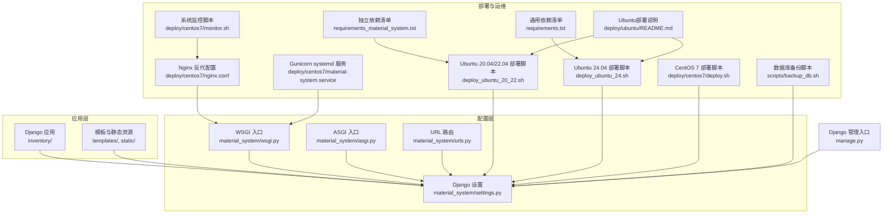
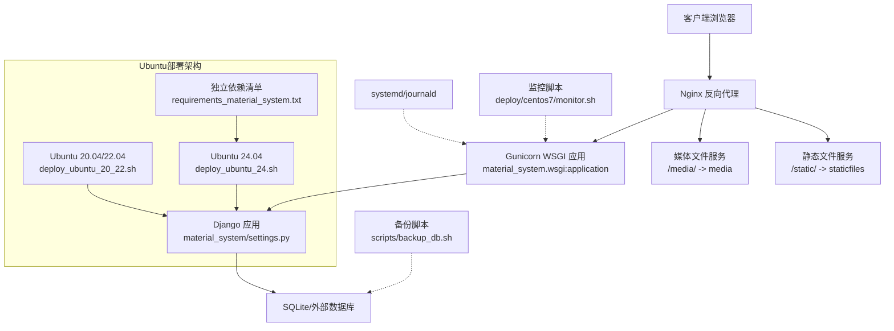
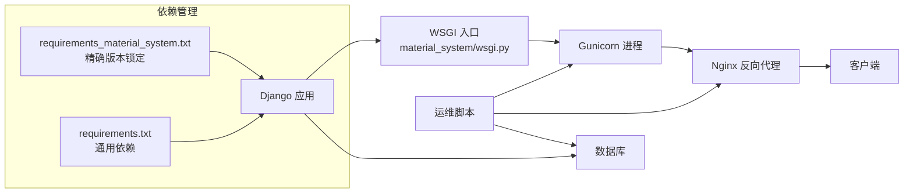

# 部署与运维

<cite>
**本文引用的文件**
- [material_system/settings.py](file://material_system/settings.py)
- [material_system/wsgi.py](file://material_system/wsgi.py)
- [material_system/asgi.py](file://material_system/asgi.py)
- [material_system/urls.py](file://material_system/urls.py)
- [manage.py](file://manage.py)
- [requirements.txt](file://requirements.txt)
- [requirements_material_system.txt](file://requirements_material_system.txt)
- [deploy/ubuntu/deploy_ubuntu_20_22.sh](file://deploy/ubuntu/deploy_ubuntu_20_22.sh)
- [deploy/ubuntu/deploy_ubuntu_24.sh](file://deploy/ubuntu/deploy_ubuntu_24.sh)
- [deploy/ubuntu/README.md](file://deploy/ubuntu/README.md)
- [deploy/centos7/deploy.sh](file://deploy/centos7/deploy.sh)
- [deploy/centos7/nginx.conf](file://deploy/centos7/nginx.conf)
- [deploy/centos7/material-system.service](file://deploy/centos7/material-system.service)
- [deploy/centos7/monitor.sh](file://deploy/centos7/monitor.sh)
- [deploy/centos7/README.md](file://deploy/centos7/README.md)
- [deploy/centos7/deployment_checklist.md](file://deploy/centos7/deployment_checklist.md)
- [scripts/backup_db.sh](file://scripts/backup_db.sh)
</cite>

## 更新摘要
**变更内容**
- 重构Ubuntu部署脚本，新增Ubuntu 20.04/22.04和Ubuntu 24.04专用部署脚本
- 新增requirements_material_system.txt独立依赖清单文件
- 改进部署流程，Ubuntu 24.04脚本支持.env文件配置和增强的日志管理
- 更新部署架构图以反映新的多版本支持策略

## 目录
1. [简介](#简介)
2. [项目结构](#项目结构)
3. [核心组件](#核心组件)
4. [架构总览](#架构总览)
5. [详细组件分析](#详细组件分析)
6. [依赖分析](#依赖分析)
7. [性能考虑](#性能考虑)
8. [故障排除指南](#故障排除指南)
9. [结论](#结论)
10. [附录](#附录)

## 简介
本指南面向材料管理系统的部署与运维，覆盖开发与生产环境配置差异、静态文件处理、数据库配置、多平台部署脚本使用、Nginx反向代理配置、Gunicorn WSGI服务器部署与进程管理、systemd服务配置、数据库备份与恢复策略、日志管理与轮转、以及性能监控与故障排除方法。内容基于仓库中现有的 Django 配置、WSGI/ASGI 入口、部署脚本与 Nginx/systemd 配置进行整理与提炼。

**更新** 新增Ubuntu多版本部署脚本支持，提供针对不同Ubuntu版本的优化部署方案。

## 项目结构
项目采用典型的 Django 应用结构，包含主工程配置、应用模块、模板与静态资源、以及多平台部署脚本与运维工具。关键目录与文件如下：
- 配置层：material_system/settings.py（Django 设置）、material_system/wsgi.py（WSGI 入口）、material_system/asgi.py（ASGI 入口）、material_system/urls.py（URL 路由）
- 运维脚本：deploy_ubuntu_20_22.sh（Ubuntu 20.04/22.04部署）、deploy_ubuntu_24.sh（Ubuntu 24.04部署）、deploy/centos7/deploy.sh（CentOS 7 部署）、scripts/backup_db.sh（数据库备份）、deploy/centos7/monitor.sh（系统监控）
- 反向代理与服务：deploy/centos7/nginx.conf（Nginx 配置）、deploy/centos7/material-system.service（systemd 服务）
- 依赖与入口：requirements.txt（通用依赖清单）、requirements_material_system.txt（独立依赖清单）、manage.py（Django 管理入口）

**图表来源**
- [material_system/settings.py:1-210](file://material_system/settings.py#L1-L210)
- [material_system/wsgi.py:1-17](file://material_system/wsgi.py#L1-L17)
- [material_system/asgi.py:1-17](file://material_system/asgi.py#L1-L17)
- [material_system/urls.py:1-13](file://material_system/urls.py#L1-L13)
- [deploy/ubuntu/deploy_ubuntu_20_22.sh:1-205](file://deploy/ubuntu/deploy_ubuntu_20_22.sh#L1-L205)
- [deploy/ubuntu/deploy_ubuntu_24.sh:1-179](file://deploy/ubuntu/deploy_ubuntu_24.sh#L1-L179)
- [deploy/centos7/deploy.sh:1-153](file://deploy/centos7/deploy.sh#L1-L153)
- [deploy/centos7/nginx.conf:1-87](file://deploy/centos7/nginx.conf#L1-L87)
- [deploy/centos7/material-system.service:1-26](file://deploy/centos7/material-system.service#L1-L26)
- [scripts/backup_db.sh:1-57](file://scripts/backup_db.sh#L1-L57)
- [deploy/centos7/monitor.sh:1-232](file://deploy/centos7/monitor.sh#L1-L232)
- [requirements_material_system.txt:1-45](file://requirements_material_system.txt#L1-L45)
- [requirements.txt:1-16](file://requirements.txt#L1-L16)
- [deploy/ubuntu/README.md:1-162](file://deploy/ubuntu/README.md#L1-L162)
- [manage.py:1-23](file://manage.py#L1-L23)

**章节来源**
- [material_system/settings.py:1-210](file://material_system/settings.py#L1-L210)
- [material_system/urls.py:1-13](file://material_system/urls.py#L1-L13)
- [deploy/ubuntu/deploy_ubuntu_20_22.sh:1-205](file://deploy/ubuntu/deploy_ubuntu_20_22.sh#L1-L205)
- [deploy/ubuntu/deploy_ubuntu_24.sh:1-179](file://deploy/ubuntu/deploy_ubuntu_24.sh#L1-L179)
- [deploy/centos7/deploy.sh:1-153](file://deploy/centos7/deploy.sh#L1-L153)
- [deploy/centos7/nginx.conf:1-87](file://deploy/centos7/nginx.conf#L1-L87)
- [deploy/centos7/material-system.service:1-26](file://deploy/centos7/material-system.service#L1-L26)
- [scripts/backup_db.sh:1-57](file://scripts/backup_db.sh#L1-L57)
- [deploy/centos7/monitor.sh:1-232](file://deploy/centos7/monitor.sh#L1-L232)
- [requirements_material_system.txt:1-45](file://requirements_material_system.txt#L1-L45)
- [requirements.txt:1-16](file://requirements.txt#L1-L16)
- [deploy/ubuntu/README.md:1-162](file://deploy/ubuntu/README.md#L1-L162)
- [manage.py:1-23](file://manage.py#L1-L23)

## 核心组件
- Django 设置与环境变量：通过环境变量控制 DEBUG、ALLOWED_HOSTS、数据库引擎与名称等，支持 SQLite 与外部数据库切换，并内置 SQLite 版本兼容性修复逻辑。
- WSGI/ASGI 入口：分别暴露 WSGI 与 ASGI 应用，供 Gunicorn/Nginx 或异步场景使用。
- 静态与媒体文件：静态文件根目录与收集目录分离，媒体文件独立目录，便于 Nginx 直接服务静态资源。
- 日志与轮转：Django 日志配置包含 INFO 与 ERROR 分类处理器，使用 RotatingFileHandler 实现按大小轮转。
- **多版本Ubuntu部署脚本**：Ubuntu 20.04/22.04脚本支持生产设置文件生成和静态文件收集；Ubuntu 24.04脚本支持.env文件配置和增强的日志管理。
- **独立依赖清单**：requirements_material_system.txt提供完整的依赖版本锁定，确保部署一致性。
- 备份与监控：提供 SQLite 数据库备份脚本与系统资源监控脚本，支持健康检查端点与告警记录。

**更新** 新增Ubuntu多版本部署脚本支持，提供针对不同Ubuntu版本的优化部署方案。

**章节来源**
- [material_system/settings.py:69-210](file://material_system/settings.py#L69-L210)
- [material_system/wsgi.py:1-17](file://material_system/wsgi.py#L1-L17)
- [material_system/asgi.py:1-17](file://material_system/asgi.py#L1-L17)
- [deploy/ubuntu/deploy_ubuntu_20_22.sh:75-137](file://deploy/ubuntu/deploy_ubuntu_20_22.sh#L75-L137)
- [deploy/ubuntu/deploy_ubuntu_24.sh:78-99](file://deploy/ubuntu/deploy_ubuntu_24.sh#L78-L99)
- [requirements_material_system.txt:1-45](file://requirements_material_system.txt#L1-L45)
- [scripts/backup_db.sh:1-57](file://scripts/backup_db.sh#L1-L57)
- [deploy/centos7/monitor.sh:1-232](file://deploy/centos7/monitor.sh#L1-L232)

## 架构总览
系统采用 Nginx 作为反向代理，将静态资源直接返回，动态请求转发至 Gunicorn 提供的 WSGI 应用。systemd 管理 Gunicorn 进程，实现自动启动、重启与日志聚合。Django settings 通过环境变量区分开发与生产配置，日志落盘并轮转，备份脚本定期归档数据库。

**更新** 新增Ubuntu多版本部署架构支持，提供针对不同Ubuntu版本的优化部署方案。

**图表来源**
- [deploy/centos7/nginx.conf:1-87](file://deploy/centos7/nginx.conf#L1-L87)
- [deploy/centos7/material-system.service:1-26](file://deploy/centos7/material-system.service#L1-L26)
- [material_system/wsgi.py:1-17](file://material_system/wsgi.py#L1-L17)
- [material_system/settings.py:122-130](file://material_system/settings.py#L122-L130)
- [scripts/backup_db.sh:1-57](file://scripts/backup_db.sh#L1-L57)
- [deploy/centos7/monitor.sh:1-232](file://deploy/centos7/monitor.sh#L1-L232)
- [deploy/ubuntu/deploy_ubuntu_20_22.sh:138-158](file://deploy/ubuntu/deploy_ubuntu_20_22.sh#L138-L158)
- [deploy/ubuntu/deploy_ubuntu_24.sh:101-121](file://deploy/ubuntu/deploy_ubuntu_24.sh#L101-L121)
- [requirements_material_system.txt:1-45](file://requirements_material_system.txt#L1-L45)

## 详细组件分析

### Django 设置与环境变量（开发 vs 生产）
- 开发环境：DEBUG 默认开启，ALLOWED_HOSTS 通配符，SQLite 本地文件数据库。
- 生产环境：通过 Ubuntu 部署脚本生成 production_settings.py，关闭 DEBUG、设置 ALLOWED_HOSTS、启用静态文件收集与 Manifest 静态文件存储、强化安全头与 HSTS 等。
- 数据库配置：支持通过环境变量切换数据库引擎与名称，生产环境可指向 MySQL 等外部数据库；同时内置 SQLite 版本兼容性修复逻辑，避免 pysqlite3 与 getlimit 相关问题。
- 静态与媒体：STATIC_ROOT 用于收集静态文件，STATICFILES_DIRS 指定开发时的静态目录；MEDIA_ROOT 用于媒体文件存储。
- 日志：INFO 与 ERROR 分类处理器，RotatingFileHandler 按 10MB 轮转，最多保留 5 个备份。

**章节来源**
- [material_system/settings.py:69-210](file://material_system/settings.py#L69-L210)
- [deploy/ubuntu/deploy_ubuntu_20_22.sh:75-137](file://deploy/ubuntu/deploy_ubuntu_20_22.sh#L75-L137)

### WSGI 与 ASGI 入口
- WSGI：通过 material_system.wsgi:application 暴露 WSGI 应用，供 Gunicorn 直接调用。
- ASGI：通过 material_system.asgi:application 暴露 ASGI 应用，适用于异步场景或 ASGI 服务器。

**章节来源**
- [material_system/wsgi.py:1-17](file://material_system/wsgi.py#L1-L17)
- [material_system/asgi.py:1-17](file://material_system/asgi.py#L1-L17)

### URL 路由与静态文件调试
- 路由：admin 管理后台与 inventory 应用路由；DEBUG 为真时，自动附加媒体文件的静态路由。
- 静态文件：生产环境需通过 collectstatic 收集到 STATIC_ROOT，并由 Nginx 提供服务。

**章节来源**
- [material_system/urls.py:1-13](file://material_system/urls.py#L1-L13)

### Ubuntu 多版本部署脚本（一键部署）
**更新** 新增Ubuntu多版本部署脚本支持，提供针对不同Ubuntu版本的优化部署方案。

#### Ubuntu 20.04/22.04部署脚本
- 系统依赖：安装 Python 3、pip、venv、git、nginx、redis-server 等。
- 虚拟环境与依赖：创建 venv，安装 gunicorn、PyMySQL、python-dotenv 与 requirements.txt 中的依赖。
- 生产设置：生成 production_settings.py，设置 DEBUG=False、ALLOWED_HOSTS、静态文件收集与 Manifest 存储、安全头与 HSTS。
- 初始化：迁移数据库、收集静态文件；可交互创建超级用户。
- systemd 服务：创建 material-system.service，使用 Unix Socket 与 Gunicorn。
- Nginx：生成 sites-available 配置并通过符号链接启用，监听 80 端口。
- 防火墙：ufw 开放 80 与 22 端口（若可用）。
- 日志与运维：提供 systemd 日志与应用日志查看命令。

#### Ubuntu 24.04部署脚本（推荐）
- 系统依赖：安装 Python 3、pip、venv、git、nginx、redis-server 等，针对Ubuntu 24.04的Python 3.12进行优化。
- 虚拟环境与依赖：创建 venv，安装 gunicorn、PyMySQL、python-dotenv 与 requirements.txt 中的依赖。
- **环境配置**：支持.env文件配置，自动生成SECRET_KEY和DEBUG设置。
- 初始化：迁移数据库、收集静态文件；可交互创建超级用户。
- systemd 服务：创建 material-system.service，使用 Unix Socket 与 Gunicorn。
- Nginx：生成 sites-available 配置并通过符号链接启用，监听 80 端口，设置静态文件缓存头。
- 防火墙：ufw 开放 80 与 22 端口（若可用）。
- 日志与运维：提供 systemd 日志与应用日志查看命令。

**章节来源**
- [deploy/ubuntu/deploy_ubuntu_20_22.sh:1-205](file://deploy/ubuntu/deploy_ubuntu_20_22.sh#L1-L205)
- [deploy/ubuntu/deploy_ubuntu_24.sh:1-179](file://deploy/ubuntu/deploy_ubuntu_24.sh#L1-L179)
- [deploy/ubuntu/README.md:1-162](file://deploy/ubuntu/README.md#L1-L162)

### CentOS 7 部署脚本（自动部署）
- 系统依赖：epel-release、python3、pip、gcc、make、sqlite-devel、nginx、firewalld。
- 用户与权限：创建 django 用户并授予免密 sudo 权限。
- 依赖安装：pip3 安装 requirements.txt 与 gunicorn、pysqlite3。
- 数据库与静态文件：迁移数据库、收集静态文件、创建媒体目录。
- systemd 服务：复制 service 文件，daemon-reload、enable。
- Nginx：复制 conf 文件，替换域名，开放 http/https 与 8000 端口。
- 启动与验证：启动 material-system 与 nginx，验证状态。
- 常用命令：服务管理、日志查看、备份与监控命令汇总。

**章节来源**
- [deploy/centos7/deploy.sh:1-153](file://deploy/centos7/deploy.sh#L1-L153)
- [deploy/centos7/README.md:1-181](file://deploy/centos7/README.md#L1-L181)
- [deploy/centos7/deployment_checklist.md:1-182](file://deploy/centos7/deployment_checklist.md#L1-L182)

### Nginx 反向代理配置
- 上游与监听：upstream 指向 127.0.0.1:8000；server 监听 80，设置安全头与 CSP。
- 静态文件：/static/ 指向 STATIC_ROOT（staticfiles），设置缓存头。
- 媒体文件：/media/ 指向 MEDIA_ROOT（media），设置缓存头。
- 动态请求：/ 转发至 upstream，设置 X-Forwarded-* 头，超时与缓冲参数合理配置。
- 健康检查：/health/ 返回 200 healthy，关闭访问日志。
- HTTPS 示例：提供注释的 HTTPS 与 HTTP->HTTPS 重定向示例（需证书）。

**章节来源**
- [deploy/centos7/nginx.conf:1-87](file://deploy/centos7/nginx.conf#L1-L87)

### Gunicorn WSGI 服务器与 systemd 服务
- Gunicorn：WSGI 应用入口为 material_system.wsgi:application，绑定 0.0.0.0:8000，设置 workers、timeout、keep-alive。
- systemd：material-system.service 使用 Type=simple，User/Group=djang，WorkingDirectory 指向项目目录，Environment 设置 DJANGO_SETTINGS_MODULE 与 DEBUG，ExecStart 指向 gunicorn，Restart=always。
- 安全与隔离：NoNewPrivileges、PrivateTmp、ProtectSystem、ProtectHome、ReadWritePaths 等限制。

**章节来源**
- [deploy/centos7/material-system.service:1-26](file://deploy/centos7/material-system.service#L1-L26)

### 数据库备份与恢复策略
- 备份脚本：scripts/backup_db.sh 支持传入保留天数，默认 30 天；备份文件命名包含时间戳，备份后压缩；清理超过保留期的旧备份；统计剩余数量与总大小。
- 备份触发：建议结合定时任务（如 cron）定期执行；生产环境建议将备份目录置于独立挂载卷。
- 恢复流程：停止服务 -> 复制备份文件到原位 -> 启动服务；注意权限与路径一致性。

**章节来源**
- [scripts/backup_db.sh:1-57](file://scripts/backup_db.sh#L1-L57)

### 日志管理与轮转
- Django 日志：INFO 与 ERROR 分类处理器，RotatingFileHandler，单文件最大 10MB，保留 5 个备份，UTF-8 编码。
- systemd/journald：systemd 管理 Gunicorn 进程日志，journalctl 可实时查看与过滤。
- Nginx 日志：access.log 与 error.log，建议配合 logrotate 进行轮转。
- 应用日志位置：logs/ 目录位于项目根目录，需确保可写权限。

**更新** Ubuntu 24.04部署脚本增强了日志管理功能，支持.env文件配置和更完善的日志轮转。

**章节来源**
- [material_system/settings.py:148-203](file://material_system/settings.py#L148-L203)
- [deploy/centos7/material-system.service:1-26](file://deploy/centos7/material-system.service#L1-L26)
- [deploy/ubuntu/deploy_ubuntu_24.sh:78-87](file://deploy/ubuntu/deploy_ubuntu_24.sh#L78-L87)

### 性能监控与健康检查
- 健康检查端点：Nginx 配置 /health/ 返回 200 healthy，可用于探活。
- 监控脚本：deploy/centos7/monitor.sh 检查服务状态、端口监听、数据库文件、磁盘、内存、CPU、HTTP 响应；支持自动重启（通过环境变量启用）。
- 常用命令：systemctl status/enable/start/restart，journalctl -u material-system -f，tail -f 日志文件。

**章节来源**
- [deploy/centos7/nginx.conf:54-59](file://deploy/centos7/nginx.conf#L54-L59)
- [deploy/centos7/monitor.sh:1-232](file://deploy/centos7/monitor.sh#L1-L232)

### 独立依赖清单管理
**更新** 新增requirements_material_system.txt独立依赖清单文件。

- **requirements_material_system.txt**：提供完整的依赖版本锁定，包含Django 6.0.3、gunicorn 25.1.0、PyMySQL 1.1.2等关键组件的精确版本。
- **requirements.txt**：作为通用依赖清单，包含Django核心依赖和基本运行时组件。
- **版本管理**：独立清单确保部署一致性，避免版本冲突；通用清单提供基础依赖支持。

**章节来源**
- [requirements_material_system.txt:1-45](file://requirements_material_system.txt#L1-L45)
- [requirements.txt:1-16](file://requirements.txt#L1-L16)

## 依赖分析
- Django 与第三方：Django、gunicorn、django-admin-interface、django-colorfield、PyMySQL、python-dotenv、openpyxl 等。
- 运行时依赖：WSGI 入口依赖 Django，Nginx 依赖 Gunicorn；systemd 依赖 Gunicorn 与 Django 设置。
- 外部集成：Nginx 作为反向代理，systemd 作为进程管理器，备份脚本与监控脚本作为运维工具。
- **依赖管理**：requirements_material_system.txt提供精确版本锁定，requirements.txt提供基础依赖支持。

**更新** 新增独立依赖清单管理策略，提供更精确的版本控制和部署一致性保障。

**图表来源**
- [material_system/wsgi.py:1-17](file://material_system/wsgi.py#L1-L17)
- [deploy/centos7/nginx.conf:1-87](file://deploy/centos7/nginx.conf#L1-L87)
- [deploy/centos7/material-system.service:1-26](file://deploy/centos7/material-system.service#L1-L26)
- [requirements_material_system.txt:1-45](file://requirements_material_system.txt#L1-L45)
- [requirements.txt:1-16](file://requirements.txt#L1-L16)

**章节来源**
- [requirements_material_system.txt:1-45](file://requirements_material_system.txt#L1-L45)
- [requirements.txt:1-16](file://requirements.txt#L1-L16)
- [material_system/wsgi.py:1-17](file://material_system/wsgi.py#L1-L17)
- [deploy/centos7/nginx.conf:1-87](file://deploy/centos7/nginx.conf#L1-L87)
- [deploy/centos7/material-system.service:1-26](file://deploy/centos7/material-system.service#L1-L26)

## 性能考虑
- 静态文件：生产环境务必 collectstatic 并由 Nginx 直接提供，减少 Python 层开销。
- Gunicorn：根据 CPU 核心数与内存配置 workers 数量；合理设置 timeout 与 keep-alive，避免长连接导致资源占用。
- Nginx：启用静态缓存头、合理 proxy_buffering 与超时参数，避免上游阻塞。
- 数据库：SQLite 适合小规模场景；生产建议使用 MySQL/PostgreSQL 并配置连接池与只读副本。
- 日志：INFO/ERROR 分类与轮转，避免日志过大影响 IO；必要时将日志落盘到独立分区。
- **Ubuntu部署优化**：Ubuntu 24.04脚本针对最新系统特性进行优化，包括Python 3.12兼容性和增强的日志管理。

**更新** 新增Ubuntu 24.04部署优化考虑，针对最新系统特性和性能提升。

## 故障排除指南
- 服务无法启动
  - 检查 systemd 状态与日志：systemctl status material-system；journalctl -u material-system -n 50 --no-pager
  - 确认 Gunicorn 可执行与端口 8000 是否被占用：netstat -tlnp | grep :8000
- 端口无法访问
  - 检查防火墙：firewalld 或 ufw 规则；开放 80 与 8000 端口
  - 验证 Nginx 配置语法与启用站点：nginx -t；systemctl reload nginx
- 静态文件 404
  - 确认 collectstatic 已执行且静态目录正确；Nginx 的 alias 路径与 STATIC_ROOT 一致
- 数据库连接失败
  - 检查数据库文件存在与权限；确认 DB_ENGINE 与 DB_NAME 环境变量
- 日志定位
  - 应用日志：tail -f logs/django.log 或 journalctl -u material-system -f
  - Nginx 日志：tail -f /var/log/nginx/access.log /var/log/nginx/error.log
- 健康检查
  - 访问 /health/ 确认服务存活；若失败，检查上游 Gunicorn 与 Django 配置
- **Ubuntu部署问题**
  - Ubuntu 24.04环境配置：检查.env文件是否存在和正确配置
  - 依赖版本冲突：使用requirements_material_system.txt确保版本一致性
  - Python 3.12兼容性：确认所有依赖都支持Python 3.12

**更新** 新增Ubuntu部署特定故障排除指南，涵盖环境配置和版本兼容性问题。

## 结论
本指南基于仓库现有配置与脚本，提供了从开发到生产的完整部署与运维路径：通过环境变量与生产设置文件区分开发与生产；使用 Nginx 提供静态资源与反向代理，Gunicorn 作为 WSGI 服务器，systemd 管理进程；结合备份与监控脚本实现数据保护与系统可观测性。**更新** 新增Ubuntu多版本部署支持，提供针对不同Ubuntu版本的优化方案，以及独立依赖清单管理策略，确保部署的一致性和可靠性。建议在生产环境中进一步完善 HTTPS、数据库高可用、日志集中化与告警通知体系。

## 附录

### 开发环境与生产环境配置差异要点
- DEBUG：开发为 True，生产为 False
- ALLOWED_HOSTS：开发可通配，生产需明确域名/IP
- 静态文件：开发使用开发目录，生产使用 collectstatic 后的静态目录
- 安全头：生产启用 CSRF/Session Cookie 安全、HSTS、CSP 等
- 数据库：生产可切换外部数据库引擎

**章节来源**
- [deploy/ubuntu/deploy_ubuntu_20_22.sh:75-137](file://deploy/ubuntu/deploy_ubuntu_20_22.sh#L75-L137)
- [material_system/settings.py:69-130](file://material_system/settings.py#L69-L130)

### 多平台部署脚本使用说明
**更新** 新增Ubuntu多版本部署脚本使用说明。

- Ubuntu 20.04/22.04
  - 以 root 运行 deploy_ubuntu_20_22.sh；自动安装依赖、创建虚拟环境、生成生产设置、收集静态文件、创建 systemd 服务与 Nginx 配置
  - 常用命令：systemctl restart material-system、journalctl -u material-system -f
- Ubuntu 24.04（推荐）
  - 以 root 运行 deploy_ubuntu_24.sh；自动安装依赖、创建虚拟环境、配置.env文件、迁移数据库、收集静态文件、创建 systemd 服务与 Nginx 配置
  - 常用命令：systemctl restart material-system、journalctl -u material-system -f
- CentOS 7
  - 以普通用户运行 deploy.sh；自动安装依赖、创建 django 用户、安装依赖、迁移数据库、收集静态文件、配置 systemd 与 Nginx
  - 常用命令：systemctl start/stop/restart/status material-system；journalctl -u material-system -f

**章节来源**
- [deploy/ubuntu/deploy_ubuntu_20_22.sh:1-205](file://deploy/ubuntu/deploy_ubuntu_20_22.sh#L1-L205)
- [deploy/ubuntu/deploy_ubuntu_24.sh:1-179](file://deploy/ubuntu/deploy_ubuntu_24.sh#L1-L179)
- [deploy/centos7/deploy.sh:1-153](file://deploy/centos7/deploy.sh#L1-L153)
- [deploy/ubuntu/README.md:17-27](file://deploy/ubuntu/README.md#L17-L27)

### Ubuntu部署脚本详细对比
**更新** 新增Ubuntu多版本部署脚本详细对比分析。

- **Ubuntu 20.04/22.04脚本特点**：
  - 生成production_settings.py文件
  - 支持生产环境配置文件
  - 标准化的部署流程
  - 兼容性更好的依赖管理

- **Ubuntu 24.04脚本特点**（推荐）：
  - 支持.env文件配置
  - 自动生成SECRET_KEY和DEBUG设置
  - 增强的日志管理功能
  - 针对Python 3.12的优化
  - 更好的静态文件缓存配置

- **选择建议**：
  - 新部署：优先选择Ubuntu 24.04脚本
  - 现有部署：保持使用Ubuntu 20.04/22.04脚本
  - 版本升级：逐步迁移到Ubuntu 24.04脚本

**章节来源**
- [deploy/ubuntu/deploy_ubuntu_20_22.sh:75-137](file://deploy/ubuntu/deploy_ubuntu_20_22.sh#L75-L137)
- [deploy/ubuntu/deploy_ubuntu_24.sh:78-99](file://deploy/ubuntu/deploy_ubuntu_24.sh#L78-L99)
- [deploy/ubuntu/README.md:7-15](file://deploy/ubuntu/README.md#L7-L15)

### Nginx 反向代理配置要点
- 静态文件：/static/ 指向 staticfiles，设置缓存头
- 媒体文件：/media/ 指向 media，设置缓存头
- 动态请求：/ 转发至 127.0.0.1:8000，设置 X-Forwarded-* 头
- 健康检查：/health/ 返回 200 healthy
- HTTPS：提供注释示例，需配置证书与启用 HTTP->HTTPS 重定向

**章节来源**
- [deploy/centos7/nginx.conf:1-87](file://deploy/centos7/nginx.conf#L1-L87)

### Gunicorn 与 systemd 部署要点
- Gunicorn 绑定 0.0.0.0:8000，workers 数量按需调整
- systemd 使用 Type=simple，User/Group=django，WorkingDirectory 指向项目根目录
- ExecStart 指向 gunicorn，设置 DJANGO_SETTINGS_MODULE 与 DEBUG
- Restart=always，NoNewPrivileges、PrivateTmp 等安全选项

**章节来源**
- [deploy/centos7/material-system.service:1-26](file://deploy/centos7/material-system.service#L1-L26)

### 数据库备份与恢复流程
- 备份：执行 scripts/backup_db.sh [保留天数]，默认保留 30 天；备份文件压缩并清理过期备份
- 恢复：停止服务 -> 复制备份到原位 -> 启动服务；注意权限与路径一致

**章节来源**
- [scripts/backup_db.sh:1-57](file://scripts/backup_db.sh#L1-L57)

### 日志管理与轮转
- Django 日志：INFO/ERROR 分类，RotatingFileHandler，10MB 单文件，保留 5 个备份
- systemd/journald：journalctl 查看与过滤
- Nginx 日志：access.log 与 error.log，建议配合 logrotate

**更新** 新增Ubuntu 24.04日志管理增强功能说明。

**章节来源**
- [material_system/settings.py:148-203](file://material_system/settings.py#L148-L203)

### 性能监控与健康检查
- 健康检查：/health/ 端点返回 200 healthy
- 监控脚本：检查服务状态、端口监听、数据库文件、磁盘/内存/CPU 使用、HTTP 响应；支持自动重启（环境变量）
- 常用命令：systemctl status/restart；journalctl -u material-system -f；tail -f 日志

**章节来源**
- [deploy/centos7/nginx.conf:54-59](file://deploy/centos7/nginx.conf#L54-L59)
- [deploy/centos7/monitor.sh:1-232](file://deploy/centos7/monitor.sh#L1-L232)

### 依赖管理最佳实践
**更新** 新增独立依赖清单管理最佳实践。

- **requirements_material_system.txt使用**：
  - 用于生产环境部署，确保精确版本锁定
  - 避免依赖版本冲突和不兼容问题
  - 便于审计和版本追踪

- **requirements.txt使用**：
  - 用于开发环境和基础依赖
  - 提供最低版本要求
  - 便于快速环境搭建

- **版本管理策略**：
  - 生产环境使用精确版本
  - 开发环境使用宽松版本范围
  - 定期更新依赖清单
  - 建立依赖审查流程

**章节来源**
- [requirements_material_system.txt:1-45](file://requirements_material_system.txt#L1-L45)
- [requirements.txt:1-16](file://requirements.txt#L1-L16)