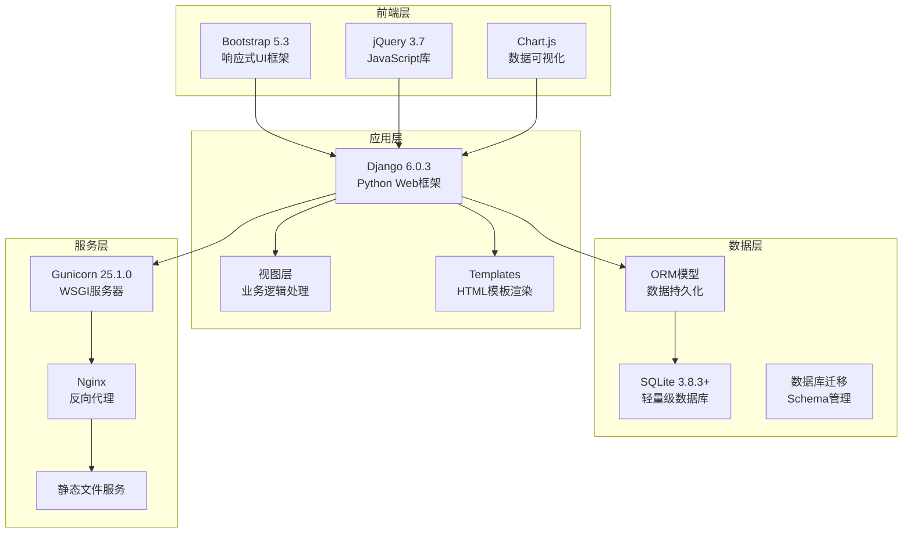
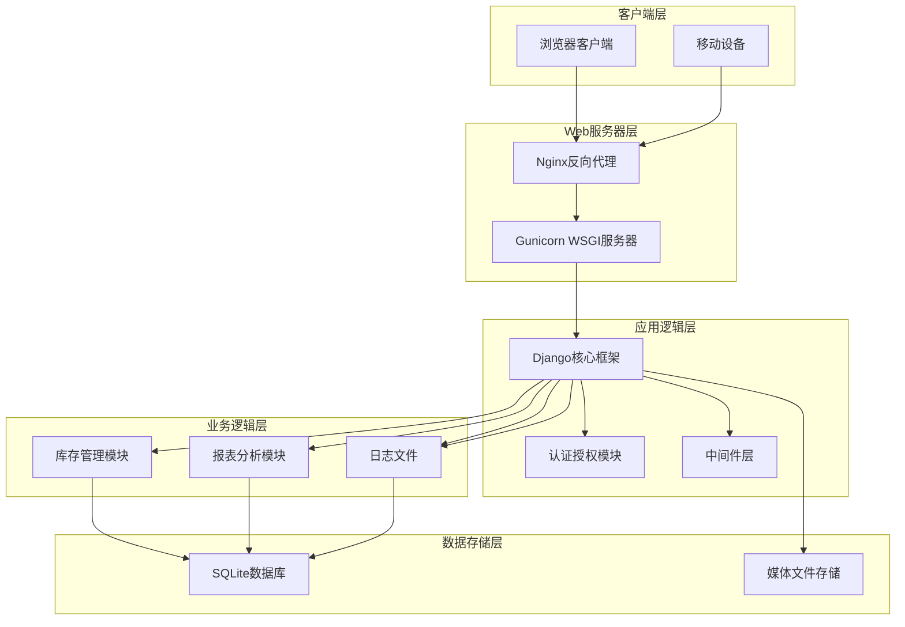
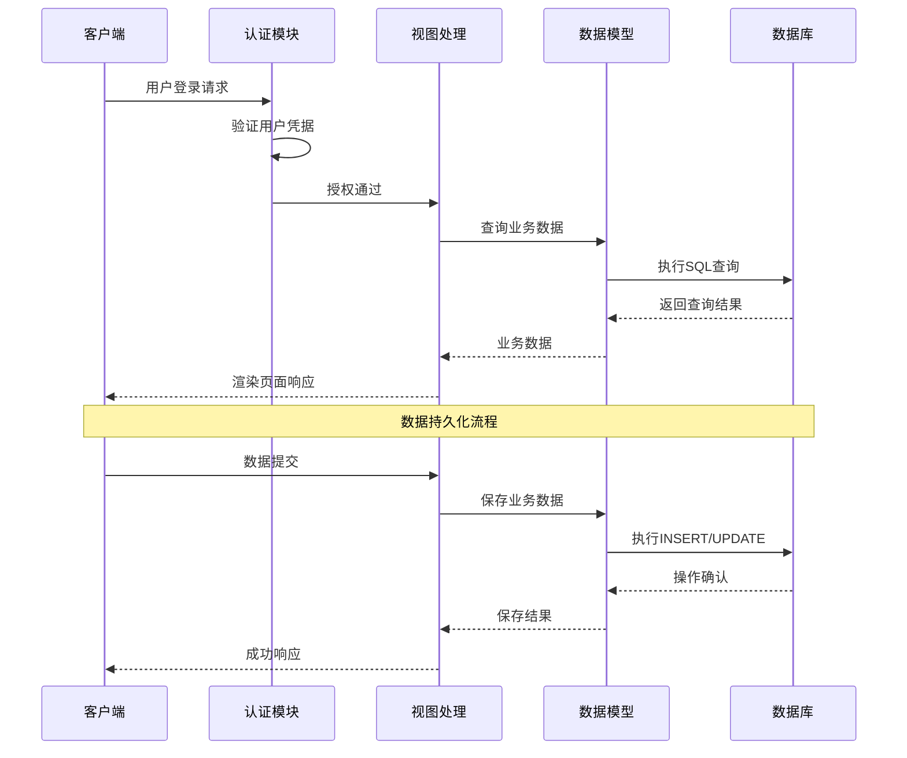
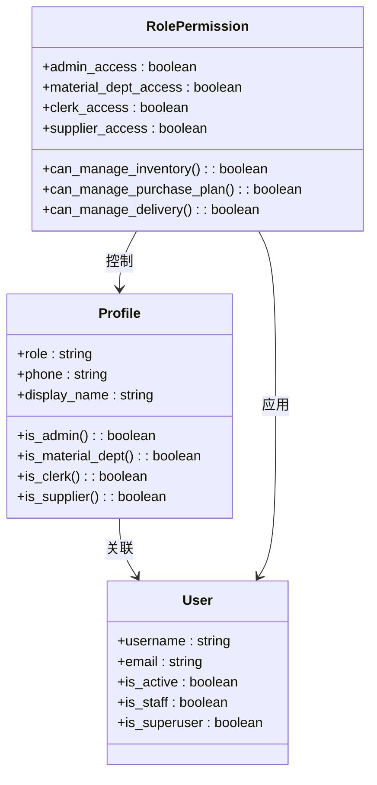
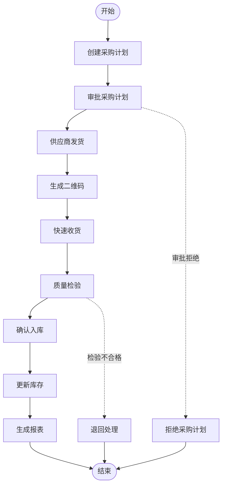
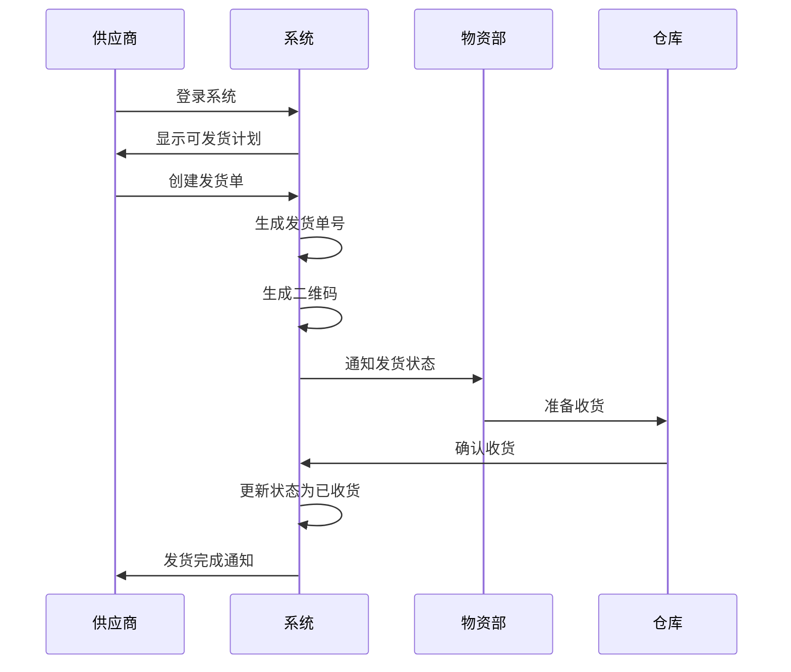
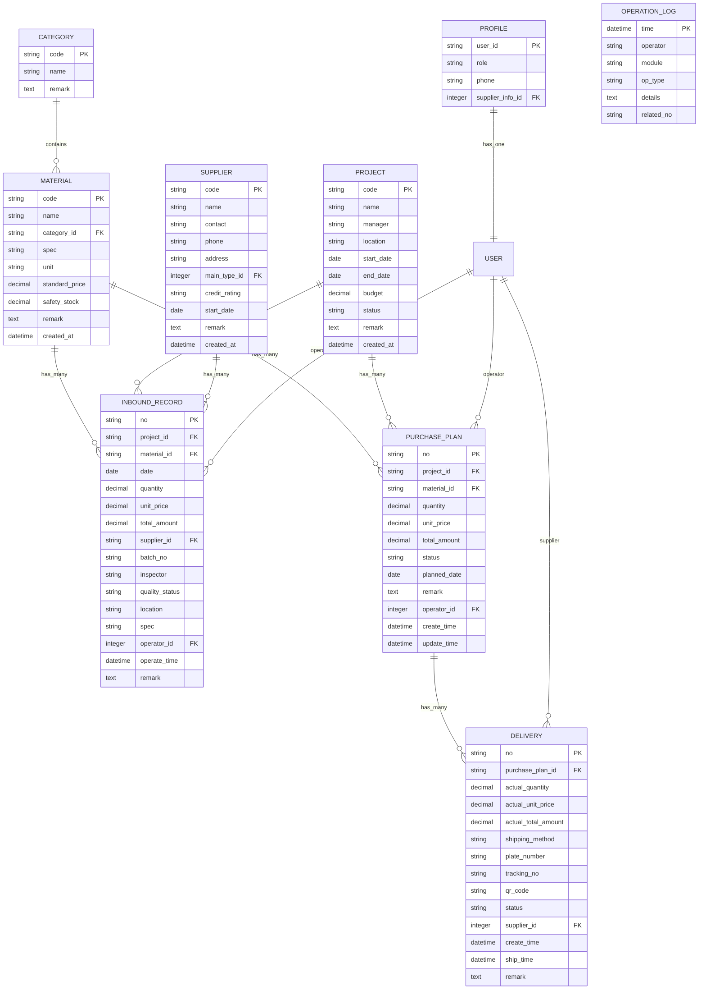
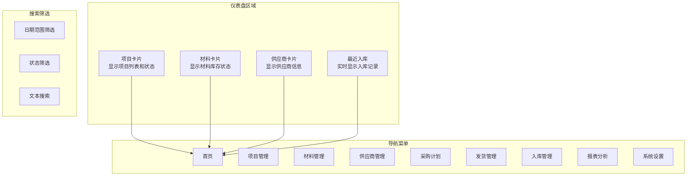
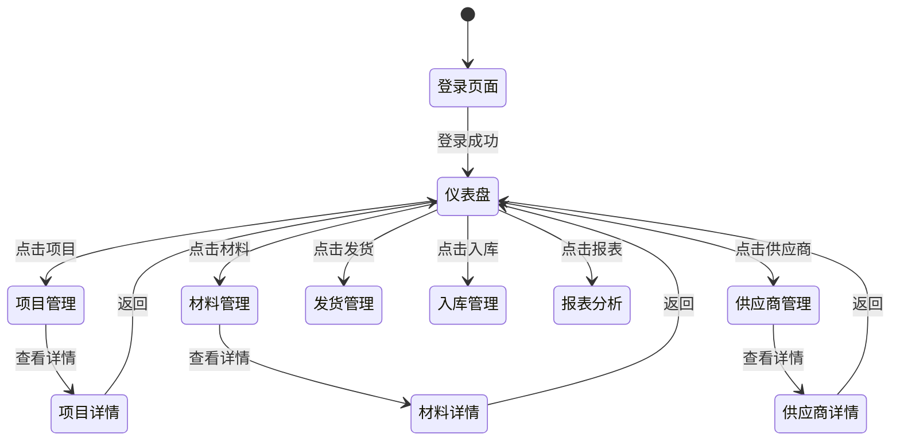
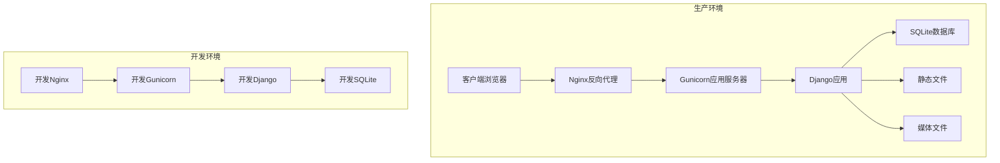

# 项目概述

<cite>
**本文档引用的文件**
- [README.md](file://README.md)
- [requirements.txt](file://requirements.txt)
- [material_system/settings.py](file://material_system/settings.py)
- [material_system/urls.py](file://material_system/urls.py)
- [inventory/models.py](file://inventory/models.py)
- [inventory/views.py](file://inventory/views.py)
- [inventory/urls.py](file://inventory/urls.py)
- [templates/inventory/dashboard.html](file://templates/inventory/dashboard.html)
- [manage.py](file://manage.py)
- [deploy/centos7/README.md](file://deploy/centos7/README.md)
- [create_admin.py](file://create_admin.py)
- [generate_test_data.py](file://generate_test_data.py)
</cite>

## 目录
1. [项目简介](#项目简介)
2. [核心目标](#核心目标)
3. [主要功能特性](#主要功能特性)
4. [技术架构概览](#技术架构概览)
5. [系统架构设计](#系统架构设计)
6. [多角色权限控制系统](#多角色权限控制系统)
7. [业务流程详解](#业务流程详解)
8. [数据模型分析](#数据模型分析)
9. [前端界面设计](#前端界面设计)
10. [部署与运维](#部署与运维)
11. [性能考虑](#性能考虑)
12. [总结](#总结)

## 项目简介

材料出入库管理系统是一个专为建筑工程项目管理而设计的综合性信息系统，旨在实现从采购计划到入库管理的全流程数字化管控。该系统采用现代Web技术栈构建，为建筑企业提供高效、准确、可追溯的材料管理解决方案。

系统支持多项目并发管理，具备完善的权限控制机制，能够满足不同角色用户的操作需求，包括管理员、物资部、材料员和供应商等角色。通过实时监控和报表分析功能，为企业决策提供数据支撑。

## 核心目标

### 1. 业务目标
- **全流程管控**：覆盖从采购计划制定到材料入库的完整业务流程
- **数据准确性**：确保材料数量、价格、质量等关键数据的精确性
- **操作便捷性**：提供直观易用的操作界面，降低学习成本
- **决策支持**：通过数据分析和报表功能辅助管理层决策

### 2. 技术目标
- **系统稳定性**：采用成熟技术栈，确保系统长期稳定运行
- **扩展性设计**：模块化架构便于功能扩展和定制开发
- **安全性保障**：完善的权限控制和数据安全保障机制
- **性能优化**：针对大数据量场景进行性能优化

## 主要功能特性

### 基础管理功能
- **材料管理**：支持材料档案的增删改查、分类管理和批量导入导出
- **项目管理**：项目信息维护、项目成本统计和状态跟踪
- **供应商管理**：供应商信息维护、信用评级管理和采购历史追踪
- **用户管理**：多用户支持、角色权限分配和操作审计

### 库存管理功能
- **入库管理**：材料入库登记、质量检验和实时库存更新
- **出库管理**：材料出库登记、领用管理和库存扣减
- **库存查询**：实时库存统计、历史追溯和安全库存预警

### 统计分析功能
- **统计报表**：项目成本分析、供应商采购统计和月度报表
- **图表分析**：入库趋势图、材料消耗分析和库存分布图
- **操作日志**：完整的操作审计日志和数据变更追踪
- **Excel导出**：支持多种格式的数据导出和报表生成

## 技术架构概览

### 核心技术栈

**图表来源**
- [requirements.txt:1-16](file://requirements.txt#L1-L16)
- [material_system/settings.py:74-87](file://material_system/settings.py#L74-L87)

### 系统特性
- **轻量级部署**：基于SQLite数据库，无需额外数据库服务器
- **响应式设计**：支持PC端和移动端访问
- **模块化架构**：清晰的MVC分层结构
- **国际化支持**：内置中文界面支持

**章节来源**
- [requirements.txt:1-16](file://requirements.txt#L1-L16)
- [material_system/settings.py:148-210](file://material_system/settings.py#L148-L210)

## 系统架构设计

### 整体架构图

**图表来源**
- [material_system/wsgi.py](file://material_system/wsgi.py)
- [material_system/asgi.py](file://material_system/asgi.py)

### 数据流设计

**图表来源**
- [inventory/views.py:114-143](file://inventory/views.py#L114-L143)
- [inventory/models.py:206-236](file://inventory/models.py#L206-L236)

## 多角色权限控制系统

### 角色定义与权限矩阵

**图表来源**
- [inventory/models.py:7-49](file://inventory/models.py#L7-L49)
- [inventory/views.py:34-53](file://inventory/views.py#L34-L53)

### 权限控制机制

系统采用基于角色的访问控制（RBAC）模型，通过装饰器和权限检查函数实现细粒度的权限控制：

| 角色 | 主要权限 | 受限操作 |
|------|----------|----------|
| 管理员 | 完全系统访问权限 | 无 |
| 物资部 | 库存管理、采购计划 | 删除入库记录 |
| 材料员 | 入库管理、基本查询 | 无 |
| 供应商 | 发货管理、查看自己订单 | 无 |

**章节来源**
- [inventory/models.py:9-18](file://inventory/models.py#L9-L18)
- [inventory/views.py:55-64](file://inventory/views.py#L55-L64)

## 业务流程详解

### 采购到入库完整流程

**图表来源**
- [inventory/views.py:462-554](file://inventory/views.py#L462-L554)
- [inventory/views.py:618-692](file://inventory/views.py#L618-L692)

### 发货管理流程

**图表来源**
- [inventory/views.py:495-554](file://inventory/views.py#L495-L554)
- [inventory/views.py:570-598](file://inventory/views.py#L570-L598)

**章节来源**
- [inventory/views.py:462-598](file://inventory/views.py#L462-L598)

## 数据模型分析

### 核心数据模型

**图表来源**
- [inventory/models.py:7-328](file://inventory/models.py#L7-L328)

### 关键业务指标计算

系统实现了多种关键业务指标的自动化计算：

| 指标类型 | 计算方法 | 应用场景 |
|----------|----------|----------|
| 实时库存 | 入库总量 - 出库总量 | 库存管理、安全库存预警 |
| 加权平均成本 | Σ(入库金额)/Σ(入库数量) | 成本核算、财务分析 |
| 项目总成本 | Σ(入库金额) | 项目成本控制 |
| 供应商采购总额 | Σ(采购金额) | 供应商评估 |
| 库存周转率 | 销售成本/平均库存 | 库存效率分析 |

**章节来源**
- [inventory/models.py:117-177](file://inventory/models.py#L117-L177)
- [inventory/models.py:206-236](file://inventory/models.py#L206-L236)

## 前端界面设计

### 仪表盘布局

系统采用Bootstrap 5.3构建响应式界面，仪表盘包含以下核心组件：

**图表来源**
- [templates/inventory/dashboard.html:12-141](file://templates/inventory/dashboard.html#L12-L141)

### 用户交互流程

**图表来源**
- [templates/inventory/dashboard.html:25-88](file://templates/inventory/dashboard.html#L25-L88)

**章节来源**
- [templates/inventory/dashboard.html:12-141](file://templates/inventory/dashboard.html#L12-L141)

## 部署与运维

### 部署架构

**图表来源**
- [deploy/centos7/README.md:67-103](file://deploy/centos7/README.md#L67-L103)

### 部署配置

系统提供了多种部署方案：

#### Ubuntu一键部署
- 支持Ubuntu 20.04/22.04/24.04版本
- 自动安装依赖和配置环境
- 提供systemd服务管理

#### CentOS 7传统部署
- 手动配置Python环境
- 使用Gunicorn + Nginx部署
- 支持systemd服务管理

#### 开发环境部署
- 使用Django自带开发服务器
- SQLite数据库本地存储
- 自动收集静态文件

**章节来源**
- [deploy/centos7/README.md:1-181](file://deploy/centos7/README.md#L1-L181)

### 备份策略

系统实现了多层次的数据备份机制：

| 备份类型 | 备份频率 | 存储位置 | 恢复方式 |
|----------|----------|----------|----------|
| 数据库备份 | 每日凌晨2点 | backups/目录 | SQLite文件复制 |
| 媒体文件备份 | 手动触发 | 备份脚本 | tar压缩包解压 |
| 日志文件备份 | 实时滚动 | logs/目录 | 文件轮转 |
| 系统配置备份 | 手动触发 | .env文件 | 环境变量恢复 |

**章节来源**
- [README.md:115-124](file://README.md#L115-L124)

## 性能考虑

### 数据库优化

系统针对SQLite数据库进行了专门的性能优化：

- **查询参数限制修复**：通过pysqlite3库解决SQLite版本兼容性问题
- **超时配置**：数据库连接超时设置为20秒
- **索引优化**：对常用查询字段建立索引
- **批量操作**：支持批量导入和导出功能

### 缓存策略

- **会话缓存**：使用Django默认的数据库会话存储
- **静态文件缓存**：Nginx静态文件缓存机制
- **模板缓存**：Django模板缓存配置

### 并发处理

- **线程安全**：Django应用的线程安全设计
- **数据库事务**：使用事务保证数据一致性
- **锁机制**：防止并发操作导致的数据冲突

## 总结

材料出入库管理系统是一个功能完备、架构清晰、易于部署的建筑工程项目管理解决方案。系统通过以下核心优势为企业提供价值：

### 技术优势
- **技术栈成熟**：Django + SQLite + Bootstrap组合，技术栈稳定可靠
- **架构设计合理**：清晰的MVC分层，模块化设计便于维护和扩展
- **性能优化到位**：针对SQLite数据库的专门优化，确保系统性能

### 业务价值
- **流程标准化**：从采购到入库的完整业务流程数字化
- **决策支持**：丰富的报表和分析功能，提供数据驱动的决策支持
- **成本控制**：实时库存监控和成本核算，有效控制项目成本

### 部署便利性
- **一键部署**：提供Ubuntu一键部署脚本，简化部署流程
- **跨平台支持**：支持Linux、Windows等多种操作系统
- **运维友好**：完善的日志记录和监控机制

该系统特别适合中小型建筑企业使用，既能够满足日常管理需求，又具备良好的扩展性，能够随着企业发展而逐步升级。